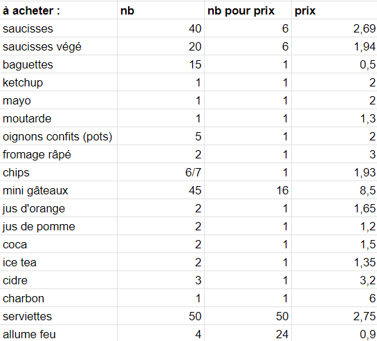
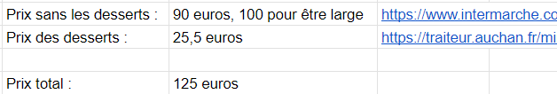

<!-- Début Résumé -->
- Ce MON est un peu à part. Il s'agit de l'organisation du repas du 06/04/2023 au cours duquel aura lieu le débrief général de l'année.
- Niveau : avancé.
- Prérequis : s'y connaître en organisation d'événements à Centrale, avoir de l'expérience associative.
<!-- fin Résumé -->

## To do :
- [X] estimer le nombre de participants
- [X] obtenir une répartition végé/carné
- [X] faire une liste de courses
- [X] estimer le budget (à la hausse)
- [] demander à Florian Magnani de débloquer le budget auprès de Centrale (plan B : cagnotte participative)
- [] demander au Bar'bu d'héberger l'événement
- [] demander si le Bar'bu peut prêter le barbecue (si non, voir le réchaud de l'UA avec poële)
- [] obtenir le permis feu auprès du PLP
- [] faire les courses
- [] trouver l'équipe pour allumer le barbecue et faire la cuisine
- [] organiser la matinée du 06/04/2023
- [] organiser le rangement

#### Nombre de participants :

Nous sommes 18 élèves (mais 2 ne viennent pas ou ne mangent pas) et 4 professeurs/responsables d'option. Cela fait 20 personnes qui seront là de toute façon. Ensuite, si les anciens des options Digitale et OMIS reviennent pour l'occasion, nous pourrions être jusqu'à 30.
Je vais donc garder 30 comme nombre de participants par la suite (les excès de nourriture pourront être donnés aux élèves ou à une association).

#### Répartition régime alimentaire :

Végétariens : 3
Non végétariens : 15
N'a pas de préférence : 1

Pour le reste, nous allons couper la poire en deux et partir sur une répartition 1/3 et 2/3.

#### Liste de course prévisionnelle et budget associé :

Voici une liste de course prévisionnelle avec les prix à l'unité lorsque cela est possible :

Voici le prix total des achats :

#### Demandes de prêt :

Voici une première liste des choses à emprunter auprès du Bar'bu, de l'UA ou d'ISF :
