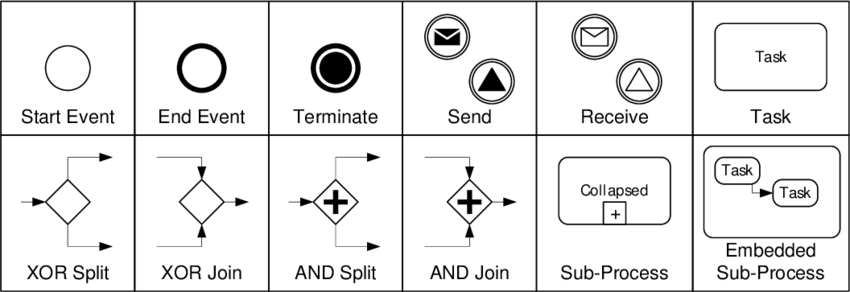
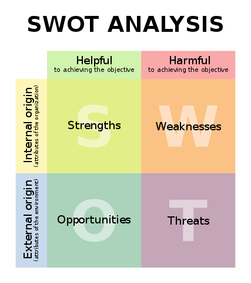

<!-- Début Résumé -->
Ici je vais mettre les informations sur mon MON 2 de temps 1 avec le sujet *diagnostic organisationnel, modélisation des processus, et conception d'un SI*.
<!-- fin résumé -->

## Management summary

To-Do


## But du projet
L'objectif du projet est de travailler sur une étude de cas de CFP dans la rôle d'un consultant en informatique et de répondre à autant de questions que possible de l'étude de cas.

Voici les questions :
1. Quelle est la finalité de la mission engagée par le dirigeant?
2. Quelles sont les attentes stratégiques de l’entreprise?
3. Réalisez une cartographie des acteurs.
4. Réalisez une cartographie des processus.
5. Réalisez un modèle de processus BPMN pour chaque processus identifié dans la cartographie.
6. Relevez les dysfonctionnements par rapport à chaque processus.
7. Établir à l’aide d’une matrice SWOT les forces, les faiblesses de l’organisation et du SI actuels ainsi que les opportunités et les risques d’un futur SI ?
8. Quels seraient les objectifs d’un futur SI et quels seraient les indicateurs associés?
9. Donner un aperçu des besoins et des priorités du futur SI.

## Déroulement du projet
### Présentation de l'étude de cas
Dans la présente étude de cas, il s'agit d'une entreprise de taille moyenne, le CFP (centre de formation professionnelle), qui souhaite revoir son SI en profondeur et qui, pour ce faire, fait appel à l'aide d'un consultant SSII. Des entretiens avec le directeur et un commercial permettent de discuter des processus actuels et de leurs problèmes, ainsi que des souhaits concernant le futur SI.

### Glossaire
**BPMN**
Business Process Model and Notation, un langage de modélisation de processus d'affaires.

**CFP**
Centre de Formation professionnelle, le nom de l'entreprise.

**DIF**
Droit individuel à la formation, un droit français qui permet aux salariés de suivre des formations professionnelles.

**SSII**
Société de services en ingénierie informatique, une entreprise qui fournit des services informatiques (p. ex. la consultation, la conception, la mise en œuvre, la maintenance, etc. des systèmes d'information) à d'autres entreprises.

**SWOT**
Strengths, Weaknesses, Opportunities, Threats, une méthode d'analyse stratégique qui permet d'identifier les forces et les faiblesses d'une organisation, ainsi que les opportunités et les menaces.

### Question 1 - Quelle est la finalité de la mission engagée par le dirigeant?
Tous les processus de l'entreprise doivent être analysés et les problèmes doivent être examinés. Ensuite, les processus doivent être améliorés en planifiant également la mise en place d'un SI. L'objectif est de mettre en place un nouveau SI avec les valeurs indicatives suivantes :
- Permettre une réponse aux demandes des clients en 48 heures.
- Permet de conclure un contrat en 5 jours en moyenne.
- Consultation facile des chiffres clés et des KPI.
- Automatisation des tâches répétitives (p.ex. signature de contrats, etc.).

Ce SI doit donc simplifier les processus et améliorer la communication entre les collaborateurs. 

### Question 2 - Quelles sont les attentes stratégiques de l’entreprise?
L'objectif stratégique à atteindre par le biais de la consultation est que CFP reste compétitif à long terme. Pour ce faire, l'entreprise doit atteindre les objectifs suivants :
- Réduire les retards dans le traitement des demandes et des contrats au moins au niveau de la concurrence.
- Augmenter la satisfaction des enseignants en résolvant les problèmes de gestion et de paiement des honoraires.
- L'aspect économique doit être optimisé en utilisant des chiffres clés et des indicateurs clés de performance pour l'analyse du chiffre d'affaires et l'observation du marché.
- L'entreprise doit devenir plus flexible et pouvoir réagir plus rapidement aux changements (p. ex. en cas de modification de la demande de cours).

### Question 3 - Réalisez une cartographie des acteurs.
J'ai dessiné l'esquisse suivante des acteurs et des relations entre eux :

### Question 4 - Réalisez une cartographie des processus.
Une cartographie des processus est une est une représentation des processus d'entreprise dans les domaines suivants qui sont aussi appelés macro-processus : ([source](https://www.advaloris.ch/nos-services/intelligence-organisationnelle/amelioration-de-performance-operationnelle-organisationnelle-dune-entreprise/modelisation-des-processus/cartographie-processus-de-lentreprise-prerequis-management-processus))
- Les **processus primaires/processus opérationnels**: Il s'agit des processus dans lesquels la valeur ajoutée de l'entreprise est réalisée, c'est-à-dire les activités quotidiennes ou les commandes des clients.
- Les **processus de pilotage**: Il s'agit des processus de planification et de gestion de l'entreprise (par ex. gestion de la stratégie et des objectifs).
- Les **processus de soutien**: Il s'agit de processus qui n'apportent pas de valeur ajoutée directe, mais qui sont d'une grande importance pour l'exécution de la prestation dans les processus primaires. 

L'identification des processus dans ces trois domaines sert à préparer la tâche suivante, à savoir la représentation des processus en BPMN. 

#### Processus primaires
- Gestion du catalogue de formation (p.ex. création, modification, suppression de cours)
- Vendre et dispenser une formation à un client (soit un cours du catalogue, soit un cours sur mesure)

#### Processus de pilotage
- Reporting et pilotage de gestion (p.ex. analyse mensuelle et trimestrielle des chiffres (KPI tels que chiffre d'affaires, bénéfice, nouveaux contacts, etc.), création du bilan annuel, etc.)

#### Processus de soutien
- Facturation client
- Paiement des prestataires
- Suivi des activités des commerciaux (pour calculer leur rémunération)
- Maintenance des fichiers clients et enseignants
- Édition des conventions de formation
- Édition des contrats de prestation

### Question 5 - Réalisations des modèles de processus BPMN
#### C'est quoi le BPMN?
BPMN est une **notation de modélisation de processus d'affaires**. Elle permet de représenter les processus d'affaires de manière graphique et standardisée. Elle est utilisée pour la modélisation, la simulation, l'analyse et l'optimisation des processus d'affaires. Pour créer des modèles BPMN, on utilise des elements de base comme les **activités**, des **gateways** et des **events**. Les activités représentent les tâches effectuées par les acteurs. Les gateways permettent de définir les conditions de passage d'une activité à l'autre. Les events représentent les événements qui peuvent se produire pendant le processus. Les éléments de base sont reliés entre eux par des flèches. Les elements de base sont les suivants:

 Éléments de base à partir desquels les diagrammes BPMN sont construits ([source de l'image](https://www.researchgate.net/figure/Basic-elements-of-BPMN-diagrams_fig2_228974950))


Je crée tous mes modèles de processus avec [yEd](https://www.yworks.com/products/yed), un logiciel gratuit pour la modélisation de graphes. La mise en page automatique, en particulier, est très utile.


#### Modèle de processus 1

Ici, on va trouver les modèles BPMN bientôt.


### Question 6 - Relevez les dysfonctionnements par rapport à chaque processus.

Je vais d'abord noter tous les problèmes qui me viennent à l'esprit et les ajouter aux processus plus tard.


Ici la liste avec tous les dysfonctionnements:

| Problème  | Solution|
| ---------------- | --------------- |
| Cataloge: mise a jour 2x par an    | pas de cataloge, seulement site web, mise a jour chaque fois qc change |
| Catalogue: diffusé par e-mail    | Newsletter avec lien vers la site web |
| Rémuneration variable pour les commerciaux    | x  |
| Pas de distribution d'information entre les commerciaux    | Base d'information centrale, interdire d'avoir ses propres bases d'information  |
| La liste des clients est un fichier Excel, chaque commercial a une copie qui est different des autres | solution centrale  |
| Chaque commercial a ses propres prestataires | Choix du fournisseur autorisé uniquement à partir d'un pool central de fournisseurs |
| La liste des prestataires est un fichier Excel, chaque commercial a une copie qui es tdifferent des autres  | solution centrale  |
| Rendu mensuel + feuille d'emargement en papier | en ligne, plus facile  |
| Manque de visibilité de l'entreprise   | site web qui est mis a jour souvent, enrichi par d'autres choses (blog, ...) |
| Pas toujours un prestataire pour une formation     | offrir une formation a une entreprise seulement si on a un prestataire  |
| Pas de processus defini pour créer une nouvelle formation   | créer un processus pour faire ca - standardisation!!! faut être plus vite |
| Réunions semestrielles  | Les réunions doivent être beaucoup plus souvent (le monde change très vite!)  |
| Le directeur signe le fiche de paie     | pas necessaire, vous devez avoir davantage confiance en vos collaborateurs|
| Prestatire est payé au debut de mois     | Payer les paiements accumulés une fois par semaine |
| Le directeur signe les factures     | Envoyer la facture par e-mail, pas de signature necessaire  |
| Le rassemble mensuellement et trimestriellement des donnée est trop complex | Dashboards pour les KPI, mis a jour automatiquement chaque jour|
| La reponse a un client n'est pas assez vite     | x |
| Les employés du CFP n'ont pas de connaissances plus avancées en informatique    | Formation pour le nouveau SI  |

### Question 7 - Création d'une matrice SWOT
#### C'est quoi, une analyse SWOT?
Une analyse SWOT est une analyse stratégique qui permet de déterminer les forces, les faiblesses, les opportunités et les menaces d'une entreprise. Elle est utilisée pour évaluer la situation d'une entreprise et pour définir une stratégie. Les forces et les faiblesses sont des **facteurs internes** à l'entreprise. Les opportunités et les menaces sont des **facteurs externes** à l'entreprise. L'analyse SWOT est donc un outil de **management stratégique**. 

#### La matrice SWOT du CFP
 

### Question 8 - Quels seraient les objectifs d’un futur SI et quels seraient les indicateurs associés?
 

### Question 9 - Donner un aperçu des besoins et des priorités du futur SI.
 

## Conclusion et réflexion
En répondant aux questions, une grande partie du projet a déjà été traitée en analysant les processus et en identifiant les problèmes. Si le projet se poursuivait, la conception du vrai SI commencerait maintenant, lequel serait ensuite mis en œuvre et testé.

L'étude de cas est très bien conçue, clairement compréhensible et pourtant suffisamment complexe pour que l'on doive réfléchir pour résoudre les tâches. J'ai pris plaisir à travailler sur cette étude de cas du point de vue d'un consultant et à apprendre les différents aspects organisationnels d'une entreprise autour de l'introduction d'un SI.

[<-- Retour](../)