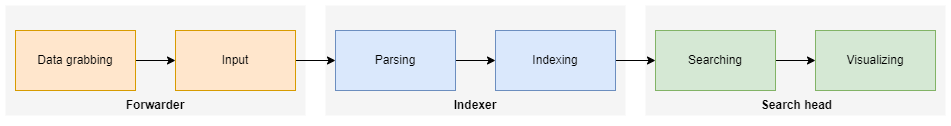

<!-- Début Résumé -->

<!-- fin résumé -->

## Introduction
Splunk est un logiciel de gestion des logs. Il permet de collecter, indexer et rechercher des logs. Il permet aussi de visualiser les logs sous forme de graphiques. Dans la domaine de la sécurité informatique, Splunk est souvent utilisé comme SIEM (Security Incident Event Management) car il permet de rechercher des patterns dans les logs et d'alerter sur des événements. Splunk est aussi utilisé dans d'autres domaines, par exemple pour business intelligence, car il permet de collecter et d'analyser des données de différents systèmes.

A partir d'ici, la langue de la formation est l'anglais parce que tous les tutoriels et la documentation sont en anglais et la langue universelle de la domaine cybersec est l'anglais également.

## Formation
The basic training "Splunk Fundamentals" should take about 10-12 hours, so the volume would be very well adapted to this MON.


When we talk about Splunk, we usually mean Splunk Enterprise, which is the commercial version of the main Splunk product, or the newer "Splunk Cloud", because Splunk is the name of the software company that creates this software. Splunk Enterprise Security is a module of Splunk Enterprise that adds SIEM (Security Incident Event Management) capabilities to Splunk Enterprise.


### What does Splunk do?
Splunk basically takes data from **any source**, parses it and adds it to an index, which later can be searched to retrieve the data.
Splunk has powerful capabilities to use the retrieved data to **visualize** it and **monitor** it. It can also be used to **alert** on certain events.
Atomic data is called **event** in Splunk, so a search returns a list of events.
Due to Splunks distributed architecture, it can be used to collect data from **multiple sources** and **multiple locations** efficently.

### Splunk Fundamentals
Splunk consists of three main components: **Search Head**, **Indexer** and **Forwarder**.

  #### Search Head
  The search head is the user interface, it is the place where you search the index(es) and visualize the data. The search query is inserted into the search bar and consists of the index to be searched, the time range and the specific search string. The search string can be a simple search string or a SPL (Splunk Query Language) query. The search string is then sent to the indexer(s) and the results are displayed in the search head. There, they can be filtered, sorted and visualized.

  #### Indexer
  The indexer takes the raw data that it gets from the forwarder(s) and indexes it. The indexer is the place where the data is converted into events and stored. During this process, it can perform operations on the data like masking sensitive information.

  #### Forwarder
  The forwarder is the component that collects the data from the sources and sends it to the indexer. At every data source, a forwarder must be installed to grab the data, e.g. on every Windows Host, a forwarder must run to forward Windows Event Logs to the indexer. An alternative to the traditional forwarder is the HTTP Event Collector (HEC), which can be used to send data to the indexer via HTTP(S).
  The data the forwarder can retrieve can be configured in the forwarder's configuration file. The sources are, among others, Windows Event Logs, Linux Syslogs, Apache Logs, data from SQL databases, AWS or other cloud logs, APIs etc.

  #### Data Pipeline
  The data flow in Splunk can be described like this:
  

### Deployment server
The deployment server is a central instance that can be used to push configuration to the forwarders. It is not necessary to use a deployment server, but it can be very useful to manage the configuration of the forwarders, especially in large environments. Normally, there is only one deployment server in the whole environment.

### Searching
A big part in the daily use of Splunk is searching. The search string is the most important part of a search. It is the query that is sent to the indexer(s) and the results are displayed in the search head. The search string can be a simple search string or a SPL (Search Processing Language) query. The search string is then sent to the indexer(s) and the results are displayed in the search head. There, they can be filtered, sorted and visualized.

#### Search Processing Language (SPL)
Search Processing Language, is the primary language used to search, analyze, and visualize data in Splunk Enterprise. SPL is a proprietary language that is used to write search queries and create reports, charts, and dashboards in Splunk Enterprise. It is a powerful and flexible language that allows users to manipulate and analyze data in a variety of ways. Some of the key features of SPL include the ability to search and filter data, perform calculations and transformations on data, and create custom visualizations. SPL also includes a variety of functions and operators that can be used to manipulate and analyze data, as well as the ability to define custom field extractions and data transformations.

Every SPL query must include at least one index to be searched. The index can be specified by name or by wildcard. If no index is specified, the default index is used which is defined in the configuration of the search head.

**Examples of SPL queries:**
```
index=* | head 10
# This query will search for all events in all indexes and return the first 10 results.
```

```
index=web* status=404 | top referrer
# This query will search for events in indexes that start with "web" and have a status field with a value of 404. It will then return the top referrers for these events.
```

```
index=web* | timechart count by status
# This query will search for events in indexes that start with "web" and create a timechart showing the count of events by status.
```

```
index=web* status=404 | geostats count by clientip
# This query will search for events in indexes that start with "web" and have a status field with a value of 404. It will then use the geostats command to calculate statistics for the count of events by client IP address and display the results on a map.
```

**Time ranges**
The search results can be filtered by time ranges. There are two types of time ranges: absolute and relative. Absolute time ranges are specified by a start and end time, e.g. ```2019-01-01 00:00:00``` to ```2019-01-01 23:59:59```. Relative time ranges are specified by a start and end time relative to the current time, e.g. ```-1d@d``` to ```@d``` (yesterday to today). Besides this notation, the time ranges can also be specified by a time range picker in the search bar.

### Integrations
Splunk can be connected with many different systems through proprietary connectors or an API to combine the power of Splunk indexing and searching with e.g. TODO software.
In the IT security context, Splunk (Splunk Enterprise Security) is used as complete SIEM (security incident event management) solution because Splunk offers built-in alert and pattern-finding capabilities.


## Sources
### Tutorials
- https://education.splunk.com/free
- https://www.splunk.com/pdfs/training/splunk-education-student-handbook.pdf
- https://www.youtube.com/watch?v=6lX4DOd1T-s
- https://youtube.com/playlist?list=PLSr58-DJdRybowRyR8gp4cbLtoQektcze
- https://www.splunk.com/en_us/training/free-courses.html

### Documentation
- https://docs.splunk.com/Documentation/Splunk/9.0.3/


