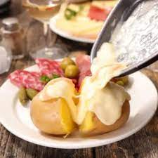
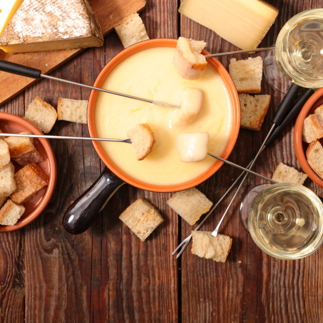

<!-- début résumé -->
HTML, CSS et JAVASCRIPT
<!-- fin résumé -->

## Description

Dans ce MON, je vais revoir les grands points du CSS et de l'HTML, ainsi que m'introduire à l'écriture du javascript

## Rappels d'HTML et découverte du Javascript.

Cette partie consiste particulièrement à revoir HTML et CSS. Comme mes connaissances ne sont pas très poussées, j'ai décidé de suivre un cours sur openclassrooms. De plus l'objectif du MON est d'apprendre également le Javascript, que je n'ai jamais vu avant cette année. 

#####  1. Apprentissage du HTML/CSS

A l'aide d'[openclassroom](https://openclassrooms.com/fr/courses/1603881-apprenez-a-creer-votre-site-web-avec-html5-et-css3), je revois et découvre de nombreuses possibilités offertes par les deux langages.

#####  2. Création de la page web

Je commence le projet en HTML et CSS en parallèle du point précédent en créant un fichier site.html. J'ai fait quelque chose de très simple mais qui m'a permis d'utiliser les connaissances acquises, de découvrir aussi plein de template en css ce qui je pense sera ma solution retenue à l'avenir. Je pense que se baser sur un css bien fourni et changer certains objets si besoin est plus efficace que faire tout son css soi-meme.

Voici le code utilisé:
~~~
<!DOCTYPE html>
<html>
    <head>
        <!-- En-tête de la page -->
        <meta charset="utf-8" />
        <title>Raclette</title>
        <link rel="stylesheet" href="style.css" />
    </head>

    <body>
        

            <h2>Bonjour et bienvenue sur mon site ! 
                On va parler des plats d'hiver aujourd'hui</h2>
          

    

        

            <h1>La fameuse et inévitable raclette</h1>
            
Source : <a href="https://fr.wikipedia.org/wiki/Raclette">Wikipedia</a>

            
La raclette (Bratchäs en suisse allemand, Bratkäse en allemand, litt. « fromage rôti ») est une recette de cuisine traditionnelle et emblématique de la cuisine suisse. Variante des fondues au fromage, elle consiste à faire fondre du raclette et à le racler au fur et à mesure qu’il fond. Elle est traditionnellement servie avec des pommes de terre en robe des champs et accompagnée de légumes au vinaigre (cornichons, oignons)

            
        

        

            <h1>La merveilleuse tartiflette</h1>
            
Source : <a href="https://fr.wikipedia.org/wiki/Tartiflette">Wikipedia</a>

            
La tartiflette (dérivé de tartifle ou tartiflâ, pomme de terre en savoyard) est une recette de cuisine à base de gratin de pommes de terre, d'oignons et de lardons, le tout gratiné au reblochon (fromage AOP des pays de Savoie).

                D'origine récente (le plat a été inventé dans les années 1980), la recette est devenue l'un des emblèmes de la cuisine française, y compris à l'étranger. La « tartiflette au reblochon ou reblochon de Savoie » obtient un Label rouge le 9 octobre 2014 : pour être certifié Label rouge, l'AOP Reblochon de Savoie doit être le seul fromage du plat et constituer au minimum 20 % de la recette1. De plus, le produit doit être gratiné au four traditionnel. 

            
        

        

            <h1>La somptueuse fondue</h1>
            
Source : <a href="https://fr.wikipedia.org/wiki/Fondue">Wikipedia</a>

            
La fondue au fromage consiste en un mélange de fromages, de vin et d'assaisonnement, bien qu'il existe de nombreuses variantes, comme l'utilisation de bière plutôt que de vin20. Traditionnellement, le caquelon est frotté avec une gousse d'ail coupée, le vin blanc est ajouté et chauffé avec de la fécule de maïs, puis le fromage râpé est ajouté et remué doucement jusqu'à ce qu'il soit fondu, bien qu'en pratique tous les ingrédients puissent être combinés et chauffés ensemble en même temps.

            >
        

    
    

    

        
Je vous propose maintenant de jouer à un petit jeu : un <a href= "snake/snake.html"> snake</a> maison!

      

        

    </body>
</html>
~~~
Voici le résultat :

##### 3. Apprentissage du Javascript

J'ai ensuite vu des [tutos sur youtube](https://www.youtube.com/watch?v=XkvrHQNmigs&t=266s) pour m'introduire au JavaScript. C'était intéressant mais juste suivre un cours était compliqué surtout après le long cours sur HTML/CSS.

##### 4. Ecriture d'un petit jeu : Snake
Assez vite j'ai donc voulu mettre la main à la pate et, pour me simplifier la vie et avoir des ressources sur internet je me suis lancé dans l'écriture d'un [Snake](snake.html) en JavaScript.

Voici le code:
~~~
<!DOCTYPE html>
<html>
<head>
  <title>Mon Snake</title>
  
</head>
<body>
<canvas width="400" height="400" id="game"></canvas>

</body>
</html>	
~~~

