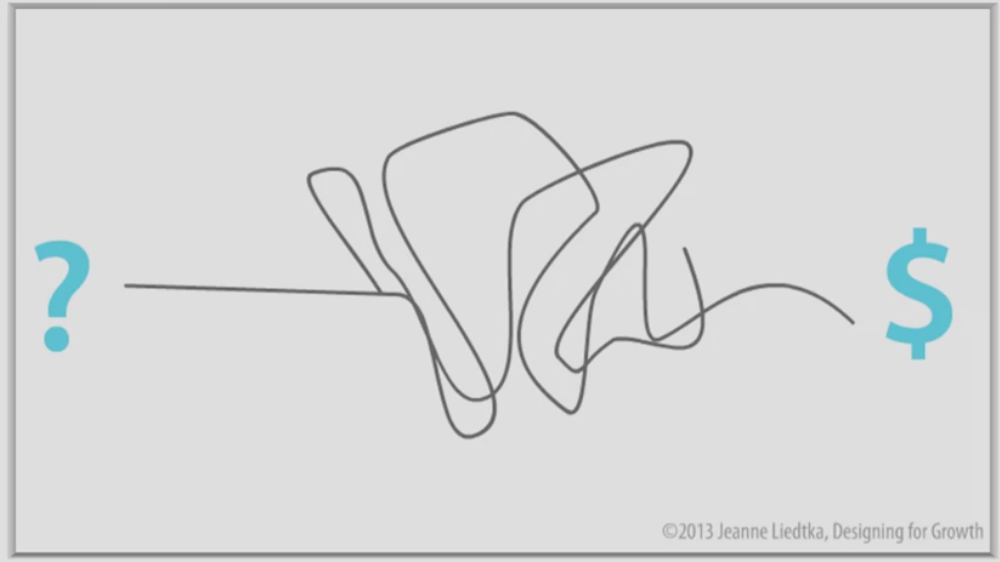

<!-- début résumé -->
Mnn second MON sur le Design Thinking
<!-- fin résumé -->

### Introduction 

Après avoir suivi des cours d'initiation au design thinking en classe, j'ai voulu approfondir mes connaissances dans ce sujet. Pour ce faire, j'ai suivi un cour nommé "Design Thinking for Innovation" réalisé par l'université de Virginie. Le cours est en anglais, mais les sous-titres sont disponibles dans plusieurs langues dont le le français. Il est gratuit mais l'évaluation et donc la certification est payante. Le cours est disponible à ce lien : [Cours Design Thining](https://fr.coursera.org/learn/uva-darden-design-thinking-innovation#syllabus).

### Qu'est-ce que le Design Thinking 

Pour expliquer ce qu'est le design thinking, je vais m'appuyer sur une image présentée dans ce MOOC. Un projet est général présenté de la manière suivante :

On part d'une idée présentée à gauche par le point d'interrogation et on arrive à un résultat qui génère un bénéfice représenté par le dollard à droite. Le processus créatif entre l'idée et le résultat est souvent flou ou à l'apparence complexe. 

Le design thinking, va s'opposer à cette idée et le désordre se transforme en une série de questions comme on peut le voir sur l'image ci-dessous : 

A travers les question suivantes , on va pouvoir mener un projet à son terme. 

- **What is ?** : On va essayer de comprendre ce qu'il se passe actuellement, comment ça fonctionne ? Il faut réalsier une immersion élargir et peut-être même à modifier complètement notre définition du problème ou de l'opportunité que nous voulons aborder.

- **What if ?** : On va commencer à générer des idées et à explorer des solutions possibles. Un brainstorming va avoir lieu et tout les idées vont être analyser en utilisant les données que nous avons recueillies, les problèmes que nous avons identifié lors de l'immersion.  

- **What wows ?** : Nous allons traiter de façon explicite chacun de nos concepts que les 2 premières questions nous ont permis de mettre en avant. Il va falloir trancher et faire des choix entre les différentes idées pour choisir les idéew qui vont répondre aux mieux à nos problématiques.

- **What works ?** : On va passer à la phase de test. On va présenter un protype à un groupe de personnes de petites tailles et attendre leurs retours. Si la solution fonctionne, on va l'améliorer avec les retours et la présenter à un plus grans panel de personnes. On continue jusqu'à aboutir à un produit fini et prêt à être commercialisé.

Le design thinking, contrairement aux autres processus, va placer l'**utilisateur** au centre. Il souligne l'importance de l'exploration profonde de la vie et des problèmes des personnes à qui nous espérons apporter des solutions. 
Ce processus ca également résenter **plusieurs possibilités** et non pas une solution unique pour laisser aux parties prenantes le choix de la solution finale. 
Enfin, le design thinking est **itératif**, il va à travers des cycles de tests sans cesse s'améliorer en prenant compte les retours des utilisateurs. 
