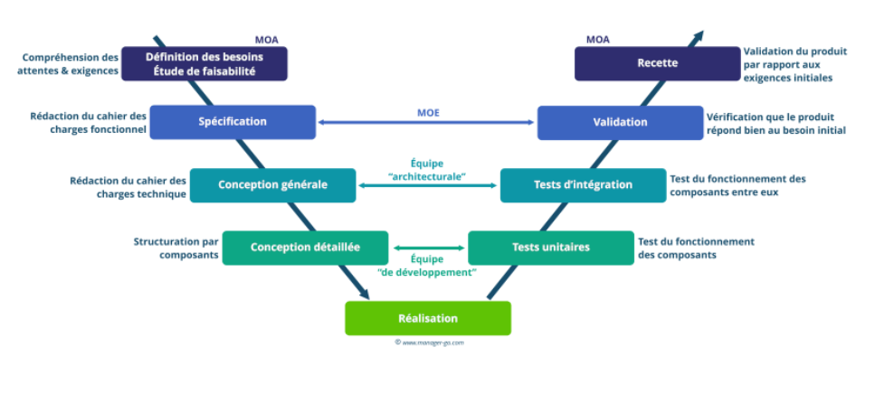

<!-- Début Résumé -->
Comparatif des typologies de gestion de projets
<!-- fin résumé -->

Pour la deuxième partie du temps 1, j'ai choisi d'étudier les différentes méthodes de management et notamment les nouvelles méthodes de management. Louise ayant déjà traité ce sujet dans la première partie du temps, je vous invite à lire en premier son MON  en guise d'introduction pour mieux comprendre ce qui suit. 

Ce MON a pour vocation de présenter un état de l'art des différentes gestions de projets possibles en les classant en 3 grandes catégories : 
- **Le project Management et ses dérivées**
- **Le Lean Management et ses dérivées**
- **L'Agile et ses dérivées**

## Introduction et définition de la gestion de projet
Tout d'abord, il convient de définir de manière simple ce qu'est la gestion de projet. L'[ipag](https://www.ipag.edu/blog/gestion-projet) le définit de la manière suivante : ***"La gestion de projet, ou le management de projet, consiste à organiser le déroulement d’un projet de A à Z, de sa phase de conception à sa phase finale. Pour ce faire, il faut définir les objectifs, les ressources humaines et matérielles nécessaires, le budget, les délais et les contraintes éventuelles."***

Il existe une multitude de méthodes de management de projet plus ou moins pertinentes selon l'entreprise et sa culture, les caractéristiques du projet, le nombre de personnes impliquées dans le projet...

## Le Project Management et ses dérivées
Dans un premier temps, nous allons étudier les méthodes les plus traditionnelles (à savoir la méthode en cascade et Waterfall) et ses dérivées. 

Les caractéristiques essentielles de ses méthodes sont : 
- un découpage précis des tâches : le chef de projet définit dès le début les différentes étapes du projet. Il vérifie que chaque étape est finie avant de passer à la suivante. 
- Le cadre et le planning sont définis en amont en accord entre le client et le chef de projet. Tout est cadré dans le cahier des charges du projet. 

En ayant tout défini dès le début du projet, il ya peu d'interactions entre le client et le chef de projet. Le client découvre le produit de sa demande à la fin lorsqu'il est complètement fini. 

Les points de vigilance à avoir dans ce type de management sont : 
- l'effet tunnel du au manque de communication entre chef de projet et client
- le manque de flexibilité car aucun retour en arrière n'est possible, il faut donc anticiper tous les risques

### La méthode Waterfall
La méthode Waterfall se nomme ainsi car elle divise un projet en 6 grandes étapes qui s'enchainent les unes aux autres et comme l'eau dans une cascade, il n'est pas possible de revenir à l'étape précédente lorsqu'elle est terminée. 

Les 6 grandes étapes de la méthode Waterfall sont les suivantes : 
- Définition des besoins
- Conception
- Mise en oeuvre
- Test
- Déploiement
- Maintenance

Dans la première étape, le client exprime ses besoins et ses objectifs. L'équipe projet recueille le maximum d'informations car les étapes d'après dépendent de cette prise d'informations. Le chef de projet établit un plan de chaque phase du projet, la liste des ressources nécessaires et des personnes qui travailleront sur chaque étape.

Dans la deuxième étape, la conception, l'équipe projet choisit le matériel qu'elle va utiliser. Elle élabore le squelette puis les organes qui projet. dans le cadre d'un développement de logiciel, c'est dans cette étape qu'elle décide du langage de programmation et de l'interface utilisateur par exemple. 
La méthode Waterfall nécessite de bien documenter chaque étape pour que l'équipe puisse toujours savoir ce qui a été fait à l'étap précédente et mesurer l'avancement du projet

Dans la troisième étape, l'équipe projet met en oeuvre et développe conformément à ce qui été exigé à l'étape 1 et structuré à l'étape 2. 

Dans la phase de test, l'équipe qui a développé le projet le transmet à une équipe de testeurs chargés de documenter tous les problèmes, bugs ou erreurs qu'ils rencontrent. 

Dans la phase de déploiement, le produit final est livré au client. 

Dans la dernière étape, la phase de maintenance, l'équipe projet peut corriger des bugs que n'auraient pas vu les tests ou mettre à jour le produit. 

*Les avantages de la méthode Waterfall*
- facile à mettre en place
- structurée
- tout est planifié donc l'estimation des ressources (monétaires, temporelles, etc) est plus simple 
- la documentation permet de revenir sur les processus et rend le projet reproductible
- suivi du projet simple avec des outils de type diagramme de Gantt

*Les inconvénients de la méthode Waterfall*
- aucune fmexibilité : en cas d'obstacle ou de retard, tout le projet est retardé
- impossibilité de revenir en arrière
- les tests interviennent à la toute fin de processus, aucune itération n'est possible
- retour vers le client uniquement lors de la livraison : possibilité de déception si ses attentes ont changé

La méthode en cascade ou Waterfall ne sont pas adaptés aux projets très complexes ou très longs.

### Méthode du cycle en V
La particularité de la méthode de cycle en V est d'avoir plusieurs étapes de test après la réalisation et la mise en oeuvre contrairement à la méthode en cascade qui n'a qu'une phase de test à la fin du processus.

source : https://www.manager-go.com/gestion-de-projet/cycle-en-v.htm

Dans cette méthode, l'équipe projet teste d'abord chaque brique fonctionnelle, ce sont les tests unitaires. Puis des tests sont effectués sur l'ensemble du produit, ce sont les tests d'intégration. Viennent ensuite les tests systèmes et la validation qui impliquent les futurs utilisateurs du produits, ils vérifient alors que la foncionnalité de la solution. Juste avant la production, l'équipe projet consulte le client pour vérifier que le produit répond bien aux exigences qu'il a exprimé au début du projet, c'est la recette 

Les avantages et les inconvénients de la méthode du cycle en V sont les mêmes que ceux de la méthode en cascade 

### PRINCE2, une variante du Waterfall
PRINCE signifie PRojects IN Controlled Environments. Cette méthode dérive de la méthode de la cascade en cela que tout est minutieusement planifié et contrôlé du début à la fin. 
 
La méthode PRINCE2 repose sur 7 principes qui sont : 
- le projet doit avoir une justification commerciale : nécessité d'avoir un besoin clair, un client défini et une évaluation des coûts détaillés
- les équipes doivent tirer des leçons à chaque étape : les équipes doivent documenter chaque étape du processus 
- les rôles et les responsabilités sont clairment définis : tout le monde doit savoir qui est responsable de quoi
- le travail est organisé par séquences 
- les comités de pilotage appliquent le "management par exception" : les membres du conseil d'administration n'ont pas le temps de gérer auu quotidien le projet donc ils délèguent le travail à un chef de projet en lui fournissant des exigences. En cas de problème entrainant un non respect des exigences, c'est une exception et c'est le comité de pilotage qui intervient 
- les équipes se focalisnet sur la qualité : les livrables sont constamment contrôlés pour vérifier qu'ils respectent les exigences
- l'approche est adaptée à chaque projet

Il existe 7 rôles dans le PRINCE2. Les 3 principaux sont le comité de pilotage, le chef de projet et l'équipe projet mais il y en a d'autres. 
Les 7 rôles sont les suivants  : 
- le client qui la personne quu paie pour le projet
- l'utilisateur qui soit sera affecté par les résultats du projet soit utilisera les livrables du projet (dans de nombreux cas, le client et l'utilisateur sont la même personne)
- le fournisseur est l'expert qui apporte les connaisssances nécessaires à la réalisation du produit
- le chef de projet est le responsable du projet, il gère l'organsation, la planification, il supervise. Il décide des personnes qui participent au projet et de leurs tâches. Il est responsable du travail réalisé et des délais.
- L'équipe projet et le responsable d'équipe ce sont eux qui réalisent les différentes tâches du projet. Les responsables d'équipe sont de intermédiaires entre le chef de projet et l'équipe projet
- l'administrateur est la personne qui organise les réunions, transmet les informations, assure le suivi de la documentation. Sur des petits projets, c'est le chef de projet qui assure ce rôle. 
- le comité de pilotage est composé du client, de l'utilisateur final et du fournisseur

#### Sources 

* [introduction project management](https://www.appvizer.fr/magazine/operations/gestion-de-projet/methode-classique-gestion-de-projet)
* [Waterfall, source 1](https://www.planzone.fr/blog/quest-ce-que-la-methodologie-waterfall)
* [Waterfall, source 2](https://asana.com/fr/resources/waterfall-project-management-methodology)
* [cycle en V](https://blog.hubspot.fr/marketing/cycle-en-v)


