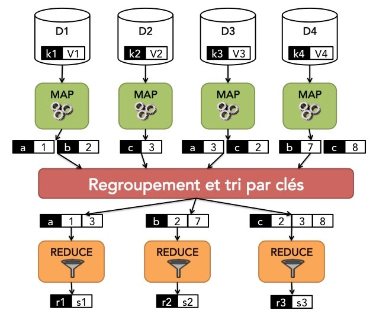

<!-- Début Résumé -->

Spark
<!-- Début Résumé -->

## Introduction

J'ai réalisé ce MON pour préparer mon stage dans lequel je vais devoir faire de l'architecture de données et notamment devoir **récolter et traiter un grand nombre d'information**. Un des prérequis du stage est de connaître le **principe de traitement de mégadonnées** et de connaître les bases de **Spark**. Il s'agit "d'un framework open source de calcul distribué". Il est utile pour traiter des mégadonnées et pour faire des analyses complexes à grande échelle.

Afin d'apprendre tout ceci, j'ai suivi le cours Openclassrooms [Réalisez des calculs distribués sur des données massives](https://openclassrooms.com/fr/courses/4297166-realisez-des-calculs-distribues-sur-des-donnees-massives).

Le cours est divisé en plusieurs parties :

- Introduction au Big Data et au calcul distribué
- Le principe de MapReduce
- Découvrir Spark

## Introduction au Big Data et au calcul distribué

Aujourd'hui, de plus en plus de données sont collectées. Elles peuvent toucher tous les secteurs (consommation, environnement, santé,...). L'enjeu actuel est de pouvoir les stocker, les filtrer et les analyser. Mais ceci posent de nombreuses questions notamment sur la manière de stocker et d'architecturer les données. Un des points clés est la mise à l'échelle, lorsque l'on multiplie par un grand facteur le nombre de données que l'on possède. En effet, il faut alors faire attention à trois facteurs clés : le **Volume**, la **Vélocité** et la **Variété** (des formats).

Une des manières de pallier à la multiplication des informations est d'effectuer du **calcul distribué**. Au lieu que différents calculs soient effectués simultanément en utilisant des ressources communes, dans le calcul distribué, les calculs sont faits dans des **nœuds indépendants**. Dans ce cadre de calculs distribués, quand on ajoute des données, on **ajoute des nœuds**.

## MapReduce

### Principe

MapReduce est une manière de résoudre un problème pour s'adapter aux contraintes du Big Data. L'objectif est de découper les données afin de pouvoir paralléliser les tâches et réunir les résultats ensuite. Deux opérations sont nécessaires pour cela : une opération **map** et une opération **reduce**.

Les différentes étapes sont les suivantes :

- **Découpage** des données en plusieurs sous-ensembles.
- Etape **Map** : l'opération map, qui dépend du problème qu'on souhaite résoudre, est appliquée à chaque sous-ensemble. Elle transforme la paire(clé, valeur) représentant le sous-ensemble en une liste de nouvelles paires (clé, valeur)
- Etape **Shuffle and Sort** : les résultats obtenus sont regroupés et triés par clé
- Etape **Reduce** : l'opération reduce, qui dépend du problème notre problème, est appliqué à chaque clé. Elle permet d'obtenir le résultat final.

Tout ceci peut être résumé par le schéma suivant :



### Exemples

#### Word count

Un des exemples basiques du MapReduce est le problème **"Word Count"**. Il permet de compter le nombre d'itération de chaque mot dans un texte. Afin de vérifier que j'avais bien compris le principe, j'ai recodé cette fonction.

On suppose que le texte a été découpé en différentes parties. La fonction Map associe à chaque mot d'une partie du texte la couple (clé, valeur), **(mot, 1)**.

```python
def compte_mot_map(ligne):
    mots = ligne.split()

    liste_paire = [(mot, 1) for mot in mots]
    
    return liste_paire
```

La fonction Shuffle permet de créer un dictionnaire de tous les mots présents et d'ajouter des 1 à chaque apparition d'un mot.

```python
def compte_mot_shuffle(liste_paire):
    dictionnaire_paire = {}
    
    for élément in liste_paire:
        clé = élément[0]
        valeur = élément[1]
        if clé in dictionnaire_paire :
            dictionnaire_paire[clé].append(valeur)
        else:
            dictionnaire_paire[clé] = [valeur]
    
    return dictionnaire_paire
```

Enfin la fonction Reduce somme tous les 1 pour un mot présent dans le dictionnaire et permet donc de connaître son nombre d'itération.

```python
def compte_mot_reduce(dictionnaire):
    result_liste=[]
    for mot in dictionnaire :
        result_list.append(compte_mot_indiv(mot, dictionnaire))
    return (result_liste)
```

En réunissant ces trois fonctions, on obtient la fonction *compte_mot* :

```python
def compte_mot(texte):
    return (compte_mot_reduce(compte_mot_shuffle(compte_mot_map(texte))))
```

#### Autres exemples

Cette méthode peut paraître simple mais elle peut également s'appliquer à d'autres problèmes beaucoup plus complexes tel que la multiplication de matrice. C'est à partir de ceci que Google a mis au point son algorithme de **Page Ranking**

### Hadoop

Pour effectuer du MapReduce dans un contexte de Big Data, il faut une **infrastructure logicielle**. Cette dernière permettra de faire tourner des fonctions de manière **massivement développée** en s'assurant qu'il n'y ait pas de problèmes liés à la localité des données, à la puissance et aux pannes.
Le framework **Hadoop** permet ceci. Celui-ci est composé d'un **système de fichiers** où ceux-ci sont distribués, répliqués et optimisés et d'une **architecture pour faire tourner MapReduce**. Vous pouvez trouver plus d'informations sur Hadoop [ici](https://hadoop.apache.org/).

Globalement l'utilisateur peut déposer des fichiers qui sont découpés sur des Datas Node. Toutes les informations sont dupliqués pour pallier aux potentielles pannes. Il peut ensuite donner le travail à effectuer au job tracker. Celui-ci communique avec le name node pour savoir où sont les données et pouvoir lancer les calculs de la manière la plus efficace possible. Tous les résultats sont sauvegardés au fur et à mesure.


Ainsi l'utilisateur a juste à déposer ses données et à écrire les fonctions Map et Reduce.

En suivant ce lien, on peut télécharger et tester une [machine virtuelle Hadoop](https://www.cloudera.com/downloads/cdp-private-cloud-trial.html).

## Spark

**Spark** permet de s'affranchir de quelques problèmes causés car Hadoop. En effet, Hadoop stocke à chaque étape les données et résultats sur le **disque** et ne les gardent pas sur la RAM. De plus, les opérations possibles sont **limitées**.

Voici le lien d'un tutoriel pour [télécharger Spark sous Windows](http://www.xavierdupre.fr/app/sparkouille/helpsphinx/lectures/spark_install.html).

Sur le cours que j'ai suivi, il y a l'exemple de la fonction CountWord lancer sur Spark. Afin de m'entraîner, j'ai décidé d'écrire la fonction de multiplication de matrice à écrire sur Spark.

## Conclusion

## Source

- [Page Wikipédia de Spark](https://fr.wikipedia.org/wiki/Apache_Spark)