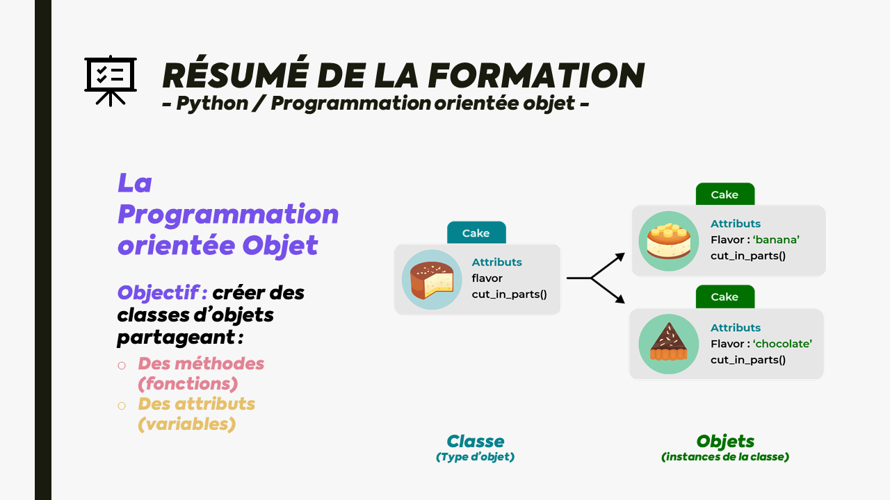

<!-- début résumé -->

MON - La programation orientée objet sur Python
<!-- fin résumé -->

## Déroulé de mon MON

Afin de réaliser ce module d'autoformation, j'ai commencé à suivre une formation de 12h (difficulté Moyenne) sur OpenClassrooms intitulée [Apprenez la programmation orientée objet avec Python](https://openclassrooms.com/fr/courses/7150616-apprenez-la-programmation-orientee-objet-avec-python). Tous les programmes créés à l'occasion de cette formation seront présents dans ce répertoire.

### Ressources

Ci-dessous les ressources principales liées à ce MON. Vous y retrouverez le lien vers la formation ainsi qu'un diaporama personnel où j'introduis et résume ce que j'ai appris grâce à cette formation.



- [Apprenez la programmation orientée objet avec Python](https://openclassrooms.com/fr/courses/7150616-apprenez-la-programmation-orientee-objet-avec-python)
- [Présentation du MON - Killian ROYANT](https://drive.google.com/file/d/1D-gTBStHbos_4YKUw6P9KrZa1sg70D9E/view?usp=sharing)



### Objectifs pédagogiques

À l’issue de ce cours, vous serez capable de :

- Écrire des méthodes et des classes avec Python.
- Utiliser le comportement hérité dans un programme Python.
- Structurer votre code dans un programme Python.

### Prérequis



Des connaissances de base en Python, que vous pouvez acquérir avec le cours suivant :

- [Apprenez les bases du langage Python](https://openclassrooms.com/fr/courses/7168871-apprenez-les-bases-du-langage-python)



### Outils nécessaires


Visual Studio Code ou Pycharm, que vous pouvez configurer avec les cours suivants :

- Mettez en place votre environnement front-end avec Visual Studio Code
- Mettez en place votre environnement Python avec PyCharm



### Table des matières

#### Partie 1 - Écrivez des méthodes et des classes avec Python

1. Tirez le maximum de ce cours
2. Comprenez la programmation orientée objet
3. Écrivez une classe Python
4. Créez et utilisez des objets Python
 Quiz : Écrire des méthodes et des classes avec Python

#### Partie 2 - Utilisez le comportement hérité dans un programme Python

1. Appliquez l’héritage dans votre code Python
2. Écrivez une sous-classe en Python
3. Surchargez les méthodes en Python
4. Utilisez les hiérarchies d’héritage et l’héritage multiple
5. Utilisez des objets dans des collections
 Quiz : Utiliser le comportement hérité dans un programme Python

#### Partie 3 - Structurez votre code dans un programme Python

1. Utilisez les modules et les classes pour découper votre code
2. Décomposez un problème de programmation orientée objet
3. Gérez les exceptions
 Quiz : Structurer votre code dans un programme Python

#### Partie 4 - Récapitulons

1. Revenez sur vos acquis

[<-- Retour](../)
