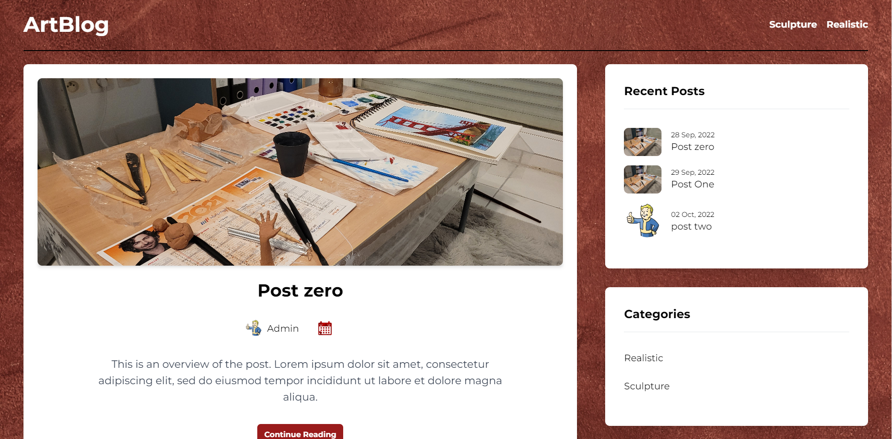

## Listes des POK : 

- [Artblog : développement](https://francoisbrucker.github.io/do-it/pok/un-site-chez-moi/TBi/Artblog/)
- [Artblog : déploiement](https://francoisbrucker.github.io/do-it/pok/un-site-chez-moi/TBi/ServeurDistant/)
- [Artblog : CI/CD](https://francoisbrucker.github.io/do-it/pok/un-site-chez-moi/TBi/CI-CD/)

## Description :

Tous mes POKs tournent autour de la création d'un blog, et ont pour but d'apprendre le développement web.

Ils suivent la feuille de route Do-It : 

- Création d'un site fullstack
- Déploiement du site
- Amélioration du site, mise en place de TDD et/ou CI/CD

La complexité est croissante, chaque POK repose sur ceux d'avant.

## Preview :

