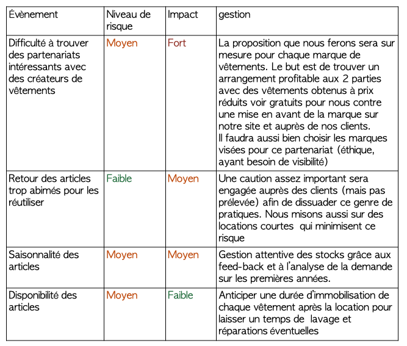

<!-- début résumé -->

Le but de ce POK est de continuer mon projet du POK 2 (BabyCameleon). Pour cela je vais m'intéresser aux enjeux économiques et logistiques du projet.

<!-- fin résumé -->

## Sommaire

1. Business Model
2. Business Plan
3. Les partenaires 
4. Stratégie Supply chain

## 1.Business Model

Un business model décrit la logique de fonctionnement du projet, comment l’entreprise va créer de la valeur.
Ici on s’asssure du bien fondé de l’entreprise et convaincre les investisseurs de la viabilité du projet.

Voir le [MON de Gabriel](https://francoisbrucker.github.io/do-it/mon/GB/Mons/Business/) sur le sujet

On utilise le business model canva :

## 2. Business Plan

Le business plan est un document qui détail l'objectif du projet et le plan financier sur les premières années. Il est en général présenté aux investisseurs afin de les convaincre d'investir dans le projet.  Il permet de:
- Comprendre rapidement de quoi il s'agit, à quel besoin répond le service proposé,
- Connaitre les personnes à l'origine du projet avec leurs motivations,
- Evaluer la valeur et le sérieux de la préparation du projet,

Le business plan contient le business model.

Pour réaliser le mien, je me suis aidé de ces sites:


https://bpifrance-creation.fr/encyclopedie/previsions-financieres-business-plan/business-plan/faire-son-business-plan

https://propulsebyca.fr/business-plan/exemple


Mon Businnes Plan est plus court qu'un Business Plan classique mais il en contient toutes les parties. Je me suis mise en mode role play pour le concevoir (même si j'ai peut-être un peu enjolivé la réalité sur certains points)

**Executive summary:**

Nos enfants grandissent vite, mais pas leurs habits. En tant que parents, on se retrouve donc à acheter des vêtements qui ne seront porté que quelque fois avant de devenir trop petits. Ce gaspillage est d'autant plus flagrant lorsqu'il s'agit d'habiller nos enfants pour des occasions spéciales telles qu'un marriage ou des vacances au ski.
BabyCameleon, c'est une boutique en ligne qui vous permet de louer des vêtements et accessoires pour enfants de 0 à 6 ans. Les pièces proposées correspondent à tout type de besoins spécifiques: vêtements de cérémonie, d'hiver, déguisements et accessoires pour les vacances. Les produits que nous proposons sont éco-responsables et soutiennent l'artisanat locale grâce à une sélection de vêtement créés en France . Notre offre à la carte vous permet de choisir quand recevoir vos articles et pour combien de temps. Notre objectif est aussi de créer une vraie communauté en impliquant les clients dans le choix des pièces disonibles à la location parexemple.

**Le porteur du projet :**

La porteuse du projet est une jeune ingénieure bientôt diplômée de Centrale Marseille. Engagée dans la lutte pour le climat, elle veut mener un projet qui lui permette d’agir à son échelle.
Elle a déjà participé à plusieurs Hackathon et connaît la démarche entrepreneuriale.
Elle possède de solides bases en développement informatique et en Web design qui l’aideront à concevoir un site adapté au projet.
Elle est aussi entourée d’un réseau d’entrepreneurs  (les Entrep’) qui l’aide à améliorer sans cesse son projet. Elle bénéficie aussi du soutien de ses professeurs et camarades prêts à l’aider à développer les compétences nécessaires à ce projet (logistique notamment).

**Présentation générale du projet :**

BabyCaméléon est une boutique en ligne qui permet aux parents de louer des vêtements et accessoires pour enfants de 0 à 6 ans qui répondent à des besoins spécifiques ou ponctuels.  
Sachant qu’un enfant grandit d’au moins 5cm par an les première années il faut sans cesse renouveler sa garde robe. De plus en plus d’offres de location de vêtements enfants voient donc le jour. BabyCaméléon se démarque par le segment de vêtements et accessoires proposés. En effet nous proposons des produits adaptés aux événements ponctuels: cérémonies, au ski, au soirées déguisées ainsi qu’aux vacances d’été et d’hiver.
La location permet aux familles d’accéder des pièces de qualité à prix réduit. Les clients économisent ainsi de l’argent sans encombrer leurs placards. Cela peut aussi être l’occasion d’essayer des pièces en conditions réelles avant de les acheter.
De plus, BabyCaméléon s’inscrit dans une démarche éthique et eco-responsable. En effet, les vêtements proposés sont principalement issus de créateurs français, favorisant les circuits courts ainsi que l’artisanat. Les matériaux utilisés sont nobles tel que le coton bio et recyclés. Dans une démarche de transparence chaque pièce sera authentifiée grâce à des vignettes (selon les matériaux utilisés, le mode de fabrication…). 
La location permet aussi d’éviter le gaspillage et de donner plusieurs vies à chaque pièces. Sachant que l’industrie textile est l’une des industries les plus polluantes au monde, chaque fois qu’un vêtements est loué, on évite une nouvelle fabrication.
BabyCaméléon sera d’abord une boutique virtuelle avec possibilités d’ouverture de boutiques physiques à long terme. Elle promet d’être pratique pour les parents qui recevrons et rendrons leurs produits depuis chez eux.
Le nettoyage et la maintenance des produits sera prise en charge par BabyCaméléon et effectuée par des professionnels.

**Partie économique du business plan :**

- *produit/service :*

Les produits loués seront les suivants :
    • vêtements de cérémonie ( costumes, robes, manteaux, chapeaux, chaussures)
    • vêtements de ski ( combinaisons, manteaux, gants, bonnets )
    • déguisements et chaussures
    • accessoires ( duvette, sac à langer, matelas/lit de voyage, baignoire nomade…)
      
- *Etude de marché :*  

Contexte: 
En France,le marché de l’habit enfants représente 5 milliards d’euros de chiffre d’affaire chaque année.

Le marché des vêtements enfants s'impose de lui-même, puisque les parents sont obligés de s'adapter à la croissance de leurs enfants et donc de renouveler plus fréquemment les vêtements. La taille du marché est fluctuante, suivant une baisse globale induite par la diminution du taux de natalité en France. C’est un marché  très concurrentiel. Le marché de l'occasion est en plein essor sur ce segment, car la perception des articles résiliés a changé dans l'opinion des clients. 
L'attention portée à la durabilité, à l'éthique et à l'environnement a révolutionné la façon dont les clients perçoivent et choisissent les marques : l'industrie de la mode a donc évolué ces dernières années pour s'adapter à la nouvelle tendance durable. 

Tendances du marché :
-  Mode Eco responsable, durable
- Qualité (des matériaux)
- Seconde Main
- Prix raisonnables

Globalement, les consommateurs ne veulent pas acheter des produits trop chers car ils savent qu'il va falloir renouveler le stock très souvent. En outre, il n'en reste pas moins qu'il existe une certaine exigence sur la qualité des produits, avec une tendance bio qui fait clairement son apparition dans les moeurs.


https://www.businesscoot.com/fr/etude/le-marche-des-vetements-pour-bebes-france


Concurrence: 

On observe que les sites proposant la location proposent aussi souvent la vente. Les pièces proposées sont simples, surement ce qui permet d’avoir des prix très bas. (environ 5€/moi la pièce).
La provenance n’est pas indiquée.

https://lemoutonalunettes.fr/concept/#louez
https://liliandjude.fr/boutique/
https://loopyo.fr/boutique-2/


Nos avantages concurrentiel : 
Segment de produits unique :  vêtements de cérémonie, ski et déguisements et accessoires de vacances
Une offre sur mesure :  le large choix de modèles (et de prix) avec des pièces plus simples et d’autres de créateurs. Choix exactes de la durée de location (avec une location à la journée et programmable dans le futur)

- *Plan d’action sur 3 ans :*
Année 1 : Recherche de partenaires financiers
	Recherche de premiers partenaires/ créateurs de vêtements et accessoirs
	Recherche d’un local
	Recherche d’un partenaire blanchisserie, couture proche du local
	création du site web (externalisé)
	Promotion par des influenceurs
	
 
Année 2 :  Ouverture de la boutique
	Développement des partenariats avec des créateurs Français
	Embauche de personnel pour gérer les commandes
	Investissement dans des pubs (Google Ads, Facebook Ads)
	Travail e référencement auprès des moteurs de recherche (SEO)

Année 3 : Etude de marché afin d’éventuellement ouvrir une boutique physique
	Etude de marché afin d’éventuellement créer nos propres vêtements
	Développement des partenariats avec des créateurs Français (selon suggestions de nos clients)

- *Stratégie marketing:* la stratégie pour attirer et fidéliser la clientèle:

• Feedback : Nous allons constamment interroger nos clients sur la qualité du service mais aussi sur les nouveauté qu’ils souhaiteraient voir dans la boutiques
• SEO : Nous allons travaillé notre stratégie de référencement afin d’avoir du trafic sur notre site
• Pricing : Nous allons offrir une large gamme de prix en fonction de la provenance mais aussi du nombre d’utilisation du produit. Cela nous permettra de toucher un large public
• Marketing Digital : utilisation des réseaux sociaux et partenariats avec des influenceuses. Publicités via googleAds et FacebookAds

- *Gestion des risques:*

**Partie financière du business plan:**

L'entreprise sera dans un premier temps gérée par moi seule. Elle sera financée de cette manière: 
10 000 € d'apport personnel de capital
30 000 € de prêt

Pour fonctionner il faudra un local et un site internet. La création du site web sera externalisée
Voici un tableau qui récapitule les différents investissements de départ ainsi que les différentes charges

Je n’ai pas inclus de dotation aux amortissements dans mes bilan. Le fait que les habits s’abiment est pris en compte dans les 500€ mensuels dédiés au rachat de nouvelles pièces.
nettoyage+réparation : environ 4€/pièce en considérant que chaque pièce est louée pour 3 jours consécutifs (en moyenne).  Cela donne environ 2000€ par mois. On a considéré que 50 pièces seraient louées chaque jour.  
envoi et retour : payés par le consommateur

- *Bilan prévisionnel :*

- *Chiffre d'affaires prévisionnel :*
Equivalent de 50 pièces/jours louées, à environ 8 euros la journée
CA mensuel de  50 x 31 x 8= 12 400 €
CA annuel prévu de 12 400 x 12= 148 800 €

- *Résultat prévisionnel :*

- *Plan de trésorerie:*

- *seuil de rentabilité :*

**Partie juridique du business plan**

Le type d'entreprise créée sera une entreprise individuelle: une EURL(entreprise unipersonnelle à responsabilité limitée) car elle est facile à créer.
De plus, le patrimoine de l'entreprise le  patrimoine personnel sont  divisés et seuls les biens utiles à l'activité professionnelle pourront être saisi par les créanciers professionnels.
Cette structure permet de limiter les responsabilité sur les apports et envisager l'entrée de nouveaux associés. En contrepartie il faut se soumettre au formalisme lié à la constitution et au fonctionnement d'une société.
