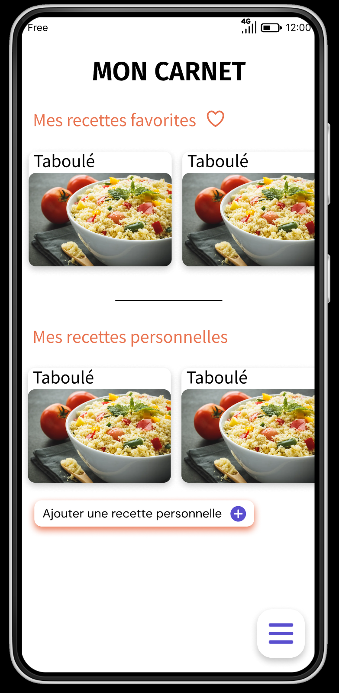
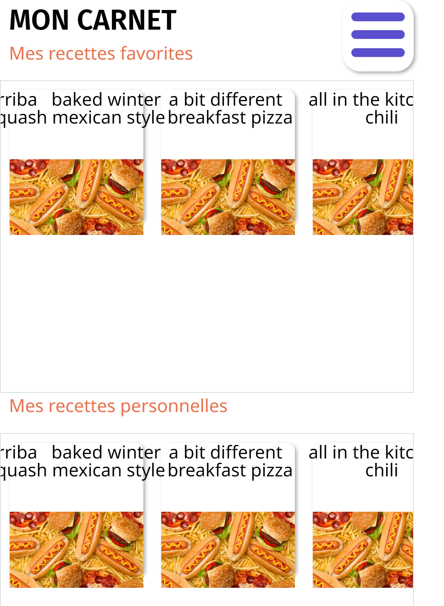

<!-- début résumé -->

Développement d'une application mobile avec Android Studio

<!-- fin résumé -->

## Objectif du POK

Ce POK fait suite à mon MON sur le développement mobile. Je vais utiliser les connaissances que j'ai acquises pour développer l'application Menu du projet Do-It en Java, avec Android Studio. Je le fais sur le temps de mon POK car nous n'auront pas le temps de le faire pendant le projet, nous allons à la place développer l'application en no-code sur Bubble.

### Maquette Figma de l'appli

### L'appli en développement sur Bubble

### L'appli en développement sur Android Studio

La maquette réalisée en projet va donc me servir ici pour appliquer ce que j'ai appris sur Android Studio et cela me permettra d'essayer deux manières de développer une application mobile en parallèle.

Lien GitHub : [AppliMenu](https://github.com/nathan-gissler/AppliMenu)