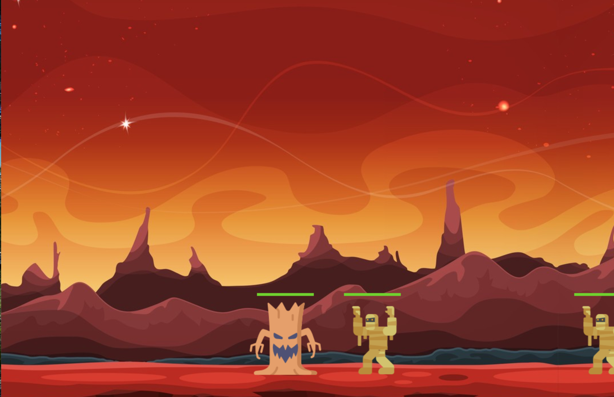

<!-- Début Résumé -->
L'objectif de mon POK est de découvrir comment créer un jeu en python en suivant un tutoriel de 10 vidéos youtube disponible sur ce lien : https://www.youtube.com/watch?v=8J8wWxbAdFg 
<!-- fin résumé -->

### Découpage en sprint 

#### Sprint 1
* Trouver un tutoriel 
* Installer pygame 
* Création de la fenêtre du jeu
* Création du personnage principal
* Déplacement du personnage 
* Configuration des projectiles 
* Ajout des ennemis 
* Configuration des barres de santé et la gestion des dégâts 

#### Résultat du premier sprint : 

### Sprint 2

* Configuration de l'écran d'accueil 
* Configuration de projectiles aériens 
* Animation des personnages
* Ajout de personnages supplémentaires 
* Ajout d'effets sonores 
* Personnalisation du jeu 

