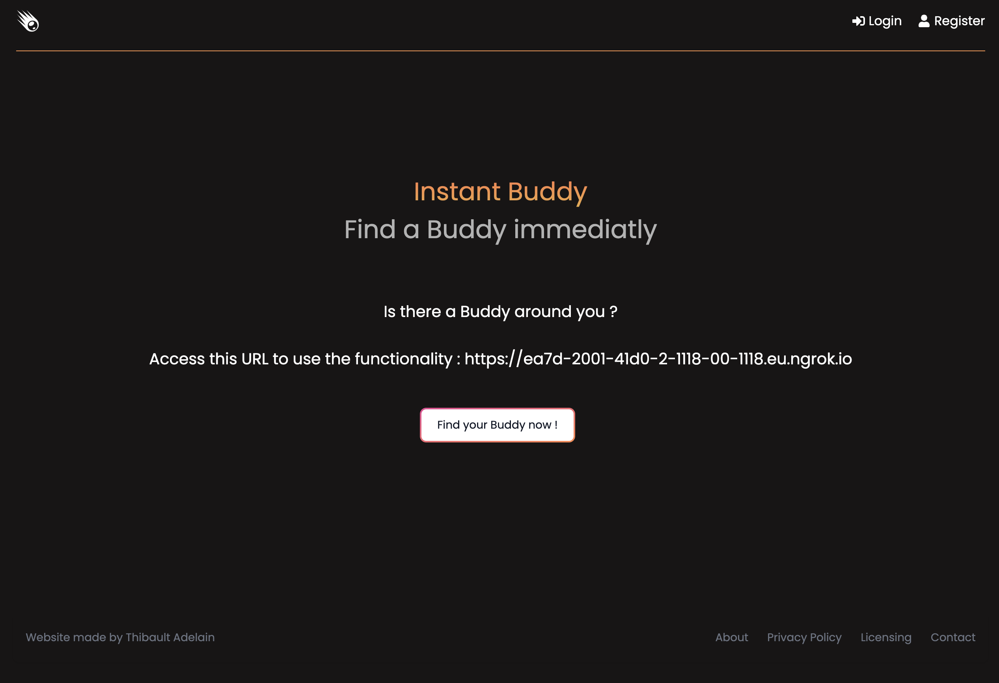

Github: <https://github.com/ThibaultAdelain/InstantBuddyNode>

Mon site : <http://node.stevia.ovh1.ec-m.fr/>

## Temps 3

### Déploiement avec Docker

#### Déroulement

Contrairement au déploiement précédent, j'ai décidé d'opter pour une solution de déploiement avec conteneur [Docker](https://docker.com/) pour apprendre à manipuler l'outil. J'ai utilisé la [documentation](https://docs.docker.com/get-started/) officielle en suivant le tuto, ainsi que le [MON de Tuncay](https://francoisbrucker.github.io/do-it/mon/TBi/MON/Docker/).

En adaptant le tuto, pour bien comprendre le fonctionnement de Docker, j'ai d'abord créer des containers séparés pour mon front et mon back. Voici un exemple de dockerfile pour mon backend :

```dockerfile
FROM node:16-alpine

WORKDIR /app

COPY ["package.json", "package-lock.json*", "./"]

RUN npm install

COPY . .

EXPOSE 5000

CMD ["npm","start" ]
```

Ensuite, j'ai essayé de lier tous les containers avec docker-compose. Voici le fichier docker-compose que j'ai utilisé :

```yml
services:
  app:
    image: ibback
    ports:
      - '5000:5000'
    depends_on:
      - "mysql"
  mysql:
    image: mysql:8.0
    volumes:
      - ib_db:/var/lib/mysql
    ports:
      - '3306:3306'
    environment:
      MYSQL_ROOT_PASSWORD: password
      MYSQL_DATABASE: INSTANT_BUDDY_DB

  front:
    image: ibfront
    ports:
      - '3000:3000'
    depends_on:
      - "app"

volumes:
  ib_db:
```

Au début, j'ai eu des problèmes lors de la connexion du front et du back, et du back avec la bdd. En fait, la raison pour laquelle la connexion ne se faisait pas est que le code de l'application responsable de lier le front / back et le back / bdd était écrite pour localhost. J'ai donc dû modifier localhost par l'adresse ip local du container en question. Par exemple pour la liaison back / bdd, dans le code de l'app, au lieu de `host: 'localhost'` :

```javascript
const sequelize = new Sequelize(
    'INSTANT_BUDDY_DB',
    'username',
    'password',
    {
        host: '172.20.0.2',
        dialect: 'mysql'
    }
)
```

Pour avoir des informations sur un container (par exemple l'adresse ip):

```bash
docker inspect <container>
```

Pour accéder à un container en cli :

```bash
docker exec -it <container> bash 
```

ou

```bash
docker exec -it <container> sh 
```

Après ces modifications, l'application a bien fonctionnée.

### Mon site sur l'ovh

Mon site : <http://node.stevia.ovh1.ec-m.fr/>

Il faut suivre le lien ngrok.io affiché sur la page d'accueil pour pouvoir utiliser la fonctionnalité principale du site. Avec la version gratuite de ngrok, vous ne pouvez pas avoir votre propre nom de domaine.

Par ce qu'une image vaut mille mots :



#### Tuto

- MON de Tuncay : <https://francoisbrucker.github.io/do-it/mon/TBi/MON/Docker/>.
- Documentation + tuto Docker : <https://docs.docker.com/get-started/>
