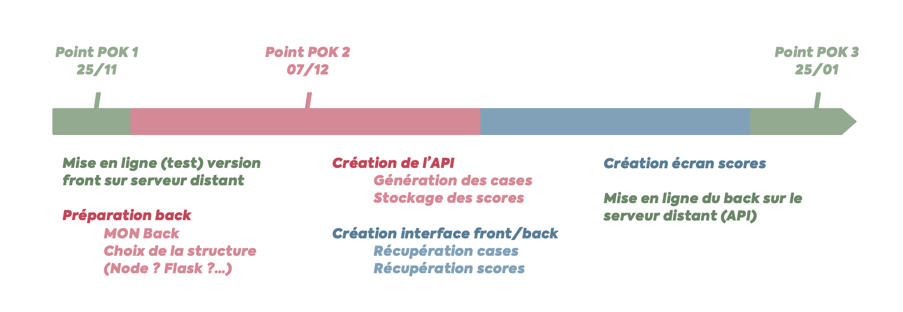

<!-- début résumé -->

**Find The Key** est un jeu que j'ai développé durant mon S7. Le but est de trouver la clé placée aléatoirement sur un plateau puis de la ramener à la base en évitant les monstres. Il est codé en HTML/CSS/JS pur. Le desing a été réalisé depuis Adobe XD.

Le temps 2 est consacré à l'**ajout d'une partie back-end** avec NodeJS et Express et au **déploiement sur un serveur distant**.

<!-- fin résumé -->



- [Le Github du POK](https://github.com/royantk/FindTheKey)
- [Le résultat (sur serveur distant)](http://cerfeuil.ovh1.ec-m.fr/)



## Introduction

**Find The Key** est un jeu que j'ai développé durant mon S7. Le but est de trouver la clé placée aléatoirement sur un plateau puis de la ramener à la base en évitant les monstres.


Durant le temps 1, j'ai eu l'occasion de résoudre les problèmes de compatibilité du site ainsi que de recréer la structure du HTML/CSS pour rendre l'application responsive. Le temps 2 sera consacré à l'**ajout d'une partie back-end** avec NodeJS et Express et au **déploiement sur un serveur distant**.

### Objectif du temps 2 - Déployer sur un serveur distant

Mes objectifs à l'occasion de la deuxième partie de ce POK sont les suivants :

- Créer une partie **back-end** (API) pour générer le contenu des cases et sauvegarder les scores des joueurs (ATTENTION : UTILISER ORM (ex : sequelize))
- Déployer le site et l'API sur un **serveur distant**

### Planning

Pour mener à bien ce projet, j'ai décidé de m'organiser en **4 étapes principales** traitant les parties **back** (en rouge), **serveur** (en vert) et adaptation du **front** (en bleu).



On peut retrouver le détail du temps prévu et passé sur chaque étape dans le tableau ci-dessous :

| **To-do**                                              | **Temps passé** | **Temps prévu** |
| ------------------------------------------------------ | --------------- | --------------- |
| Mise en ligne (test) version front sur serveur distant | 1 h             | 1 h             |
| Préparation du back                                    | 1 h             | 4 h             |
| Création de l’API                                      | 1 h             | 5 h             |
| Création interface front/back                          | 0 h             | 4 h             |
| Création écran scores                                  | 0 h             | 4 h             |
| Mise en ligne du back sur le serveur distant (API)     | 0 h             | 2 h             |
| **Total**                                              | **3 h**         | **20 h**        |

*(mis à jour le 03/12/2022)*

## Mise en ligne (test) version front sur serveur distant

Pour commencer, j'ai décidé de **mettre en ligne** la version front du jeu sur un serveur distant. J'ai donc utilisé le service [OVH](https://www.ovh.com/fr/) pour créer un serveur et y déployer le site.

### Création du serveur

Pour créer un serveur, il faut se rendre sur le site [OVH](https://www.ovh.com/fr/) et créer un compte. Une fois connecté, il faut se rendre dans la section **Cloud** puis **Serveurs**. Ensuite, il faut cliquer sur **Créer un serveur** et choisir les options suivantes :

- **Système d'exploitation** : Debian 10
- **Type de serveur** : Cloud

Une fois le serveur créé, il faut se rendre dans la section **Cloud** puis **Serveurs**. Ensuite, il faut cliquer sur le serveur créé et se rendre dans la section **Connexion**. On peut alors récupérer l'adresse du serveur ainsi que le mot de passe.

### Connexion au serveur

Pour se connecter au serveur, il faut utiliser le **protocole SSH**. J'ai utilisé le terminal de mon ordinateur pour me connecter au serveur. Pour cela, il faut utiliser la commande suivante :

```bash
ssh username@adresse_serveur
```

On peut alors entrer le mot de passe du serveur pour se connecter. Pour ne pas avoir à entrer le mot de passe à chaque fois, il est possible de créer une **clé SSH**. Pour cela, il faut utiliser la commande suivante :

```bash
ssh-keygen
```

On peut alors entrer le chemin de la clé et le mot de passe. Une fois la clé créée, il faut l'**ajouter au serveur** avec la commande suivante :

```bash
ssh-copy-id username@adresse_serveur
```

### Navigation dans le serveur

Pour vérifier que la connexion est bien établie, on peut utiliser la commande suivante pour **afficher le contenu du dossier courant** :

```bash
ls
```

Pour **se déplacer dans un dossier**, on peut utiliser la commande suivante :

```bash
cd nom_dossier
```

Au lieu de se déplacer dans un dossier, on peut aussi **créer un nouveau dossier** avec la commande suivante :

```bash
mkdir nom_dossier
```

Enfin, pour **supprimer un dossier**, on peut utiliser la commande suivante :

```bash
rm -r nom_dossier
```

### Déploiement du site

Pour **déployer** le site sur le serveur, on peut utiliser la commande suivante :

```bash
scp -r chemin_dossier username@adresse_serveur:/chemin_dossier
```

On peut alors entrer le mot de passe du serveur pour déployer le site. Pour vérifier que le site est bien déployé, on peut se rendre sur le navigateur et entrer l'adresse IP du serveur.

Pour faciliter le déploiement, on peut aussi **créer un script**. Pour cela, il faut créer un fichier **deploy.sh** avec la commande suivante :

```bash
touch deploy.sh
```

On peut ensuite ouvrir le fichier avec la commande suivante :

```bash
nano deploy.sh
```

On peut alors entrer et enregistrer le script suivant :

```bash
#!/bin/bash
scp -r chemin_dossier username@adresse_serveur:/chemin_dossier
```

On pourra ensuite **exécuter le script** avec la commande suivante :

```bash
./deploy.sh
```

## Préparation du back

Pour préparer le back, j'ai décidé de **créer un projet Node.js** avec la commande suivante :

```bash
npm init
```

On peut alors entrer les informations demandées. Une fois le projet créé, on peut **installer les dépendances** avec la commande suivante :

```bash
npm install express
```

On peut ensuite **créer un fichier** pour le back avec la commande suivante :

```bash
touch index.js
```

On peut ensuite ouvrir le fichier avec la commande suivante :

```bash
nano index.js
```

On peut alors entrer et enregistrer le code suivant :

```javascript
const express = require('express');
const app = express();
const port = 3000;

app.get('/', (req, res) => {
  res.send('Hello World!');
});

app.listen(port, () => {
  console.log(`Example app listening at http://localhost:${port}`);
});
```

On peut ensuite **lancer le serveur** avec la commande suivante :

```bash
node index.js
```

On peut alors se rendre sur le navigateur et entrer l'adresse suivante :

```bash
http://localhost:3000
```

On peut alors voir le message **Hello World!**.

## Mise en ligne (test) version back sur serveur distant

Source : [Hostinger](https://www.hostinger.fr/tutoriels/comment-installer-node-js-sur-ubuntu)

### Installation de Node.js

Tout d'abord, il faut se connecter au serveur avec la commande suivante :

```bash
ssh username@adresse_serveur
```

On peut alors entrer le mot de passe du serveur pour se connecter. Pour déployer le back sur le serveur distant, on doit ensuite installer **Node.js** et **npm** sur le serveur. Pour cela, on peut utiliser la commande suivante :

```bash
sudo apt install nodejs npm
```

On peut ensuite **créer un dossier** pour le back avec la commande suivante :

```bash
mkdir back
```

On peut ensuite **déployer le back** sur le serveur avec la commande suivante :

```bash
scp -r chemin_dossier username@adresse_serveur:/chemin_dossier
```

On peut ensuite **se connecter au serveur** avec la commande suivante :

```bash
ssh username@adresse_serveur
```

On peut alors entrer le mot de passe du serveur. Une fois connecté, on peut **se déplacer dans le dossier** du back avec la commande suivante :

```bash
cd back
```

On peut ensuite **installer les dépendances** avec la commande suivante :

```bash
npm install
```

On peut ensuite **lancer le serveur** avec la commande suivante :

```bash
node index.js
```

On peut alors se rendre sur le navigateur et entrer l'adresse suivante :

```bash
http://adresse_serveur:3000
```

On peut alors voir le message **Hello World!**.

[<-- Retour](../)
