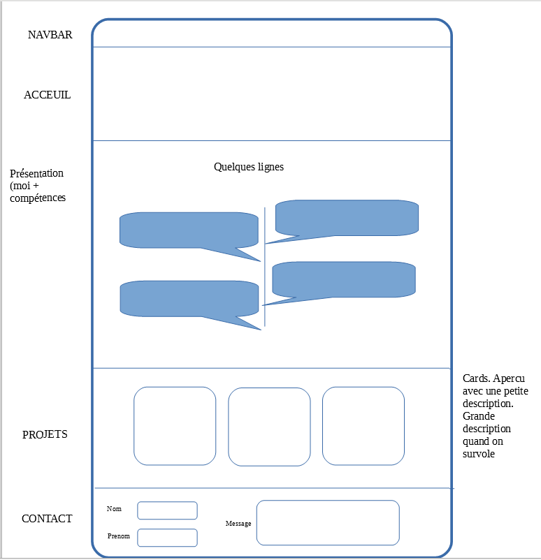

<head>
  <link rel="stylesheet" href="../../un-site-chez-moi/AV/assets/style.css">
</head>

<!-- Début Résumé -->
MONs d'Antoine Varnerot

<!-- fin Résumé -->

## Temps 1

<strong>Mon site chez moi</strong>

L'objectif de ce POK est de créer un portfolio.

Lien vers le repo Github : https://github.com/AntwanV/POKcv

Voici le wireframe : 

<figure>
  
  <figcaption>Wireframe du portfolio</figcaption>
</figure>

J'ai ensuite choisi de réaliser mon site avec Angular car j'avais fait mon premier MON sur cette technologie. Je l'ai complété avec SASS qui est un framework CSS mais que j'ai clairement pas utilisé à son plein potentiel. C'était plus pour essayer une techno.

Dans le projet j'ai aussi eu besoin de quelques librairies :
- bootstrap
- ngx-vertical : timeline verticale (https://github.com/aleckendall/ngx-timeline-vertical)
- locomotive-scroll : smooth scroll (https://github.com/locomotivemtl/locomotive-scroll)
- ...

Toutes ces librairies sont disponibles dans le fichier package.json

TODO :
- ~~Trouver une idée de site~~
- ~~Choix des technologies~~ 
- ~~Créer l’arborescence du site~~
- ~~Faire un schéma du positionnement des éléments d’une page pour chaque page (wireframe)~~
- ~~Créer repo Github pour le projet~~
- Développer le front-end :
    1. Création des éléments HTML
    2. Fonctionnalités (JS)
    3. Intégration du style CSS
- Rédiger les contenus

## Temps 2

## Temps 3
