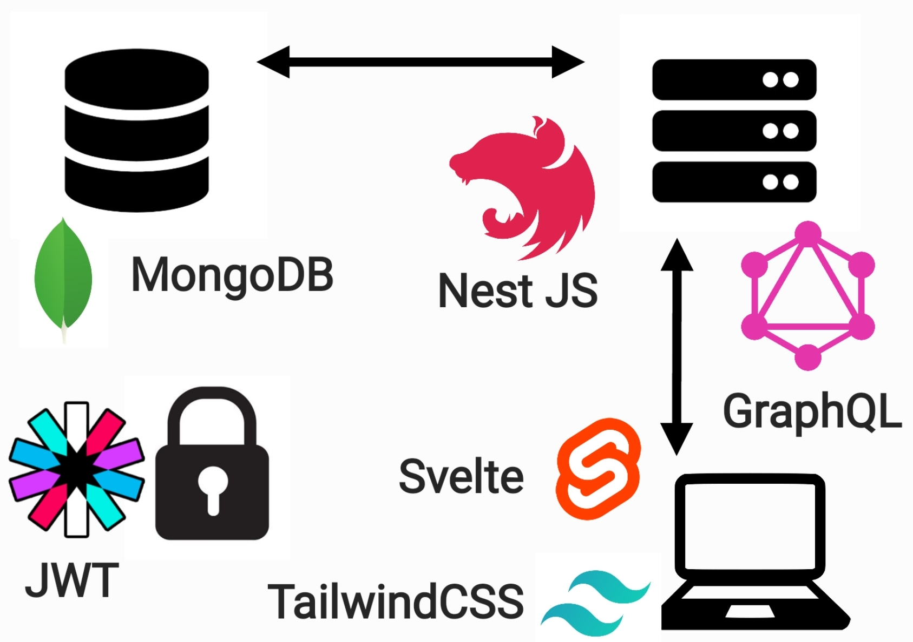

<!-- début résumé -->
Jeu de mots croisés (Svelte, NestJS, PostgreSQL)
<!-- fin résumé -->


**Liens GitHub**
- Front-end : [https://github.com/nbert71/mots-croises-front](https://github.com/nbert71/mots-croises-front)
- Back-end : [https://github.com/nbert71/mots-croises-back](https://github.com/nbert71/mots-croises-back)
- Microservice: [https://github.com/Jean-Baptiste-DP/mots-croises-generateur](https://github.com/Jean-Baptiste-DP/mots-croises-generateur)


 

# Temps 1

## Idée de ce POK

L'idée de ce POK est de créer une site contenant une partie frontend, une partie backend qui va communiquer avec le frontend via une API. On ajoutera également une base de données afin de pouvoir stocker les informations.

Dans ce POK nous allons recrée un jeu de ticket à gratter : le jeu de mots croisés. Voici une photo du ticket en question :

 


**Règles du jeu**
Nous disposons de 14 cases **?** et d’une grille de mots. Derrière chaque case se trouve une lettre qui apparaît dans la grille. A chaque lettre révélée il faut gratter les occurrences de cette lettre dans la grille. Une fois toutes les cases **?** grattées, on remporte de l’argent suivant le nombre de mots entièrement reconstitués.


## Technologies utilisées

-  **Front-end** : Svelte + TailwindCSS
- **Back-end** : NestJS
- **API** : REST
- **Moyen d'authentification** : JWT (*JSON Web Token*)
- **Base de données** : PostgreSQL

## Schéma d'entités

  

On a une relation OneToMany entre User et Game ==> un user peut avoir plusieurs parties alors qu'une partie ne peu avoir qu'un seul player.

## Fonctionnalités

Par la suite, le back-end fera appelle à un service externe qui à l'aide d'un algorithme s'occupera de générer la grille de mots croisés à partir d'une liste de mots.

Gestion des utilisateurs, avec connexion et gestion de solde.

## Objectifs points POK

<!-- ### Ce qu'on avait prévu la dernière séance
### Ce qu'on a fait depuis
### Ce qu'on prévoit pour la prochaine séance  -->

### Ce qu'on a prévu pour le 1er point POK

- *Découvrir* les framework pour le front : Svelte et TailwindCSS
  - [Tuto Svelte](https://svelte.dev/tutorial/basics)
  - [Tuto TailwindCSS](https://tailwindcss.com/docs/installation)
  - TailwindCSS avec Svelte : [lien 1](https://blog.logrocket.com/how-to-use-tailwind-css-with-svelte/), [lien 2](https://tailwindcss.com/docs/guides/sveltekit)
- Créer une *ébauche* de front en static
  - Créer une page avec des *éléments simples* 
  - Créer une page avec différents *components*
  - Commencer à structurer la page du projet
    - Component *grille*
    - Component *navbar*
    - Component *info utilisateurs*

### Ce qu'on a fait

- Découverte de Svelte et implémentation de TailwindCSS
- Création des différents composants + interaction (bind des variables, props)
- Style avec TailwindCSS + animations
- Création des différents pages (jeu, login, register)
- Début des tutoriels NestJS + génération du backend et docker compose.
- Réflexion sur le schéma d'entités (On va utiliser MySQL plutot que MongoDB)

### Ce qu'on a prévu pour le second point POK

- Découverte plus approfondie de NestJS
- Création des entités (User et Game)
- Création des routes associées si on fait une API REST ou bien création + paramétrage du endpoint si on utilise GraphQL
- Connexion du front avec le backend + modifications pour bon fonctionnement + ajout de la connexion et de la sécurité à l'aide des JWT

*Si on a le temps : essayer de faire un algo qui génère une grille à partir d'une liste de mots obtenue via une API externe*

### Ce qu'on a fait à la fin du temps 1

- Création du backend (DB + PHPMyAdmin) le tout fonctionnant avec Docker.
- Création des entités (User et Game)
- Connexion du backend avec la base de données
- Hashage des mots de passe en base de données
- Sécurisation de l'API via JWT (Guard)
- Connexion entre le front et le back avec stockage du token de connexion dans le localStorage
- Ajout de la mécanique de jeu dans le backend

### Ce qu'il reste à faire pour le temps 2

- Amélioration du code
- Finitions
- Création de l'algo de génération de grille avec appel à une API externe
- Amélioration de l'environnement Docker
- Création de fixtures ?
- Rédaction de tests unitaires ?
- Début de pipeline ?

# Temps 2

## Choses à faire durant ce temps 2

- Finir la connexion entre le front et le back
- Améliorer le projet : 
  - Création de parties
  - Listes des parties jouées
  - Pages de statistiques sur les parties jouées ?
  - Finitions de styles
  - Génération de grilles + choix des lettres améliorés (voyelles) pour pas gagner trop d'argent quand même
  - Connecter la page de register au back plus redirection qui s'en suit
  - Solde dans la navbar
  - Responsive à checker partout
  - Recharge de solde
- Mettre en prod le projet + régler tous les problèmes possibles
- Passer en PostgreSQL pour matcher avec ce qu'il y a sur le OVH ?

## 1er Sprint

- Fixer les quelques erreurs pour un jeu fonctionnel mais pas "complet" (le minimum syndical).
  - Problème de connexion (accès et limitation des pages, refresh sur la page d'accueil pour la connexion effective)
- Déployer le front, le back et la BDD.

## Ce qui a été fait au 1er sprint

- Correction du login et register
- Protection des routes
- Lister les parties
- Passage à PostgreSQL
- Mise en production du projet dans l'état actuel sur le serveur OVH : (front dans `/www/`, back dans `/node/`) et connexion avec la base de données en PGSQL disponibles sur le serveur OVH. L'application est disponible sur [http://balasamite.ovh1.ec-m.fr](http://balsamite.ovh1.ec-m.fr)
- Fix de bugs

## 2e sprint

- Connexion de la partie entre le front et le back
- Améliorer le style et la responsivité
- Algorithme de génération de grilles
- Solde dans la navbar
- Autres améliorations
- Redéployer l'ensemble du projet avec les modifications effectuées

## Ce qui a été fait au 2ème sprint

- Amélioration du style et de la responsivité (à poffiner encore un peu)
- Algorithme de génération de grilles sour la forme d'un microservice appelé par le backend
- Solde dans la navbar en lien avec le solde en DB
- Recharge du compte
- Logout
- Redéploiement du projet

## Ce qu'il reste à faire pour le temps 3

- Amélioration du jeu (style, mécanique ...)
- Optimisation de l'algo de génération de grilles
- Écriture de tests ?
- Optimisation du déploiement (scripts ou pipeline)

# Temps 3