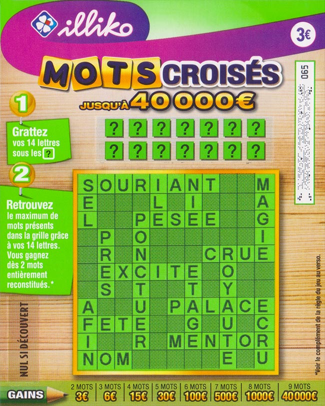

<!-- début résumé -->
Mon site chez moi (POK-Temps 1)
<!-- fin résumé -->

## Idée de ce POK

L'idée de ce POK est de créer une site contenant une partie frontend, une partie backend qui va communiquer avec le frontend via une API. On ajoutera également une base de données afin de pouvoir stocker les informations.

Dans ce POK nous allons recrée un jeu de ticket à gratter : le jeu de mots croisés. Voici une photo du ticket en question :

 


**Règles du jeu**
Nous disposons de 14 cases **?** et d’une grille de mots. Derrière chaque case se trouve une lettre qui apparaît dans la grille. A chaque lettre révélée il faut gratter les occurrences de cette lettre dans la grille. Une fois toutes les cases **?** grattées, on remporte de l’argent suivant le nombre de mots entièrement reconstitués.


## Technologies utilisées

-  **Front-end :** Svelte

