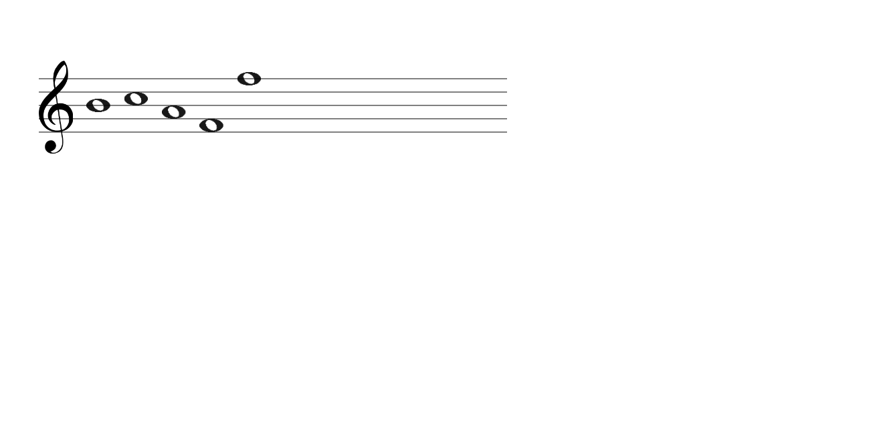
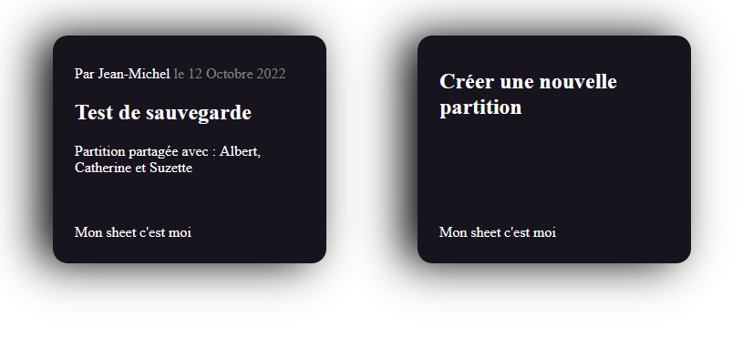

<!-- début résumé -->

Mon sheet c'est moi (POK-Temps 1)

<!-- fin résumé -->

## 1. Idée initiale

Notre idée initiale est de créer un site web qui permettrait d'écrire de la musique sur une partition intéractive, et de collaborer à plusieurs sur une même partition. L'utilisateur pourrait créer sa partition, la modifier, et la partager à d'autres utilisateurs qui pourraient la modifier à leur tour (en temps réel ou non, cela dépend de la difficulté de l'implémentation et du temps que nous aurons pour le faire).

## 2. Première version de partition interactive

Nous avons utilisé un canvas HTML pour créer une première version de la partition, qui est composée pour le moment d'une portée de 5 lignes et d'une clé de sol.

Il est possible d'ajouter des notes en cliquant sur la portée, grâce à un EventListener lié au canvas qui détecte les clics. Les notes ont pour le moment toutes la même durée (ce sont des rondes) mais peuvent être placées à différentes hauteurs. Elles se placent les unes à la suite des autres et ne peuvent pas encore être supprimées.

## 3. To-do list pour la suite

- ### Code de la partition en Javascript
  #### A l'aide de javascript et dans un canvas HTML, améliorer le code de la portée de telle sorte que :
    - On affiche au départ les barres de mesure (délimitations rythmiques) et les silences (symboles représentant l'absence de note) tant que les rondes ne sont pas placées
    - On puisse placer des notes (pour l'instant des rondes) où l'on veut en cliquant sur la partition, et qu'elles prennent la place des silences au lieu de s'ajouter en fin de partition
    - Quand on passe le curseur sur un emplacement vacant, une note grisée s'affiche
    - On puisse supprimer les notes en appuyant sur un bouton qui change le mode (ajouter une note/supprimer une note) 

- ### Lecture audio de la partition
  #### Liste des fonctionnalités à mettre en place :
    - Un bouton pour lancer la lecture
    - Un bouton pour changer le tempo de lecture (optionnel)

- ### Arborescence du site
  #### Créer une arborescence du site :
    - L'accueil avec description du fonctionnement du site, puis le choix entre créer une nouvelle partition ou en ouvrir une existante
    - Le choix de la partition où l'on peut retrouver les partitions sauvegardées ou en créer une nouvelle 
    - La page qui affiche la partition correspondante (et éventuellement une bulle d'aide visible d'une certaine manière), ainsi que les différents boutons qui permettent l'édition de la partition

- ### Sauvegarde des partitions
  #### Trouver un moyen de sauvegarder la partition modifiée :
    - Stocker les informations dans un fichier d'un format spécifique (json a priori)
    - Pouvoir nommer et renommer le fichier depuis le site

## 4. Avancées de la partition

### Ajouts à la partition

Nous avons ajouté de nouveaux symboles à la partition, et il est désormais possible de changer de mode d'édition avec les touches `a` (add note) et `d` (delete note). En mode suppression, il suffit de cliquer sur une note pour la supprimer et les notes restantes se repositionnent correctement.

Il reste à modifier la manière de saisir les notes pour que celles-ci puissent se placer à la place des symboles de silence et non pas en fin de partition.

### Difficultés rencontrées

Nous pensions afficher une note grisée au survol de la partition pour indiquer la possibilité de placer une note à cet endroit. Cependant le fait de faire suivre la trajectoire de la souris à la note grisée implique d'effacer et de redessiner le canvas à chaque mouvement de la souris et cela crée un lag trop important.

Il sera peut-être possible par la suite de réduire le nombre d'actualisations du canvas en limitant les positions possibles de la note grisée à des emplacements précis mais nous avons laissé cet fonctionnalité de côté pour le moment.

## 5. La gestion du stockage des données

### Les données importantes à conserver 

Il y a deux types de données que nous voulons pouvoir conserver.
#### En premier lieu, les informations sur l'utilisateur :
  - Le pseudo
  - Le mot de passe (crypté si possible)
  - Les partitions dont il est l'auteur
  - Les partitions qui lui sont partagées

#### En deuxième lieu, les informations sur les partitions :
  - Les notes dans leur ordre
  - L'auteur de la partition
  - Les pseudos des personnes avec qui elle est partagée

### Comment les conserver

Toute la difficulté est là. A une page web est associé une base de données nommée LocalStorage qui résiste au rafraichissement de la page, et même à une fermeture du navigateur. Il peut contenir jusqu'à 5Mb, et est adapté à notre situation car facile à traiter en JavaScript. 

Le problème est que cette base de données ne traverse pas les pages. Quand on change de page HTML, on perd ces données.

Lorsque le serveur sera en ligne, nous pourrons utiliser les requëtes API pour récupérer les données nécessaires.

En attendant de pouvoir faire des requêtes API sur un serveur, on va mettre les pages en ordre et faire initialiser le LocalStorage à chaque nouvelle page par le LocalStorage de la page précédente pour tester les fonctionnalités. On va considérer donc tout le temps les mêmes conditions.

## 6. Présentation du site et parcours des données

Tout d'abord, la première page est le login : ici, on va récupérer l'identifiant de l'utilisateur et son mot de passe, et vérifier qu'il correspond à la base de données.

  

Si les identifiants ne sont pas corrects, un message d'alerte s'affiche. S'ils sont corrects, on passe à la page suivante en conservant le nom de l'utilisateur et son Id. Cet Id nous permettra de savoir à quelles partitions l'utilisateur à accès.

Ensuite on arrive sur la page d'accueil du site

On peut ici choisir si l'on veut créer une nouvelle partition ou accéder aux anciennes.

Dans le deuxième cas, on est dirigé vers les partitions sauvegardées et qui sont accessibles à l'utilisateur connecté. Les partitions contiennent dans la sauvegarde l'Id des personnes qui y ont accès, et en particulier l'auteur. On peut aussi dans cette page chosir de finalement créer une nouvelle partition.

Si l'utilisateur a choisi sur la page précédente ou sur celle-ci, il se retrouve face à une partition vierge. Sinon il arrive directement sur la partition sauvegardée au préalable.

