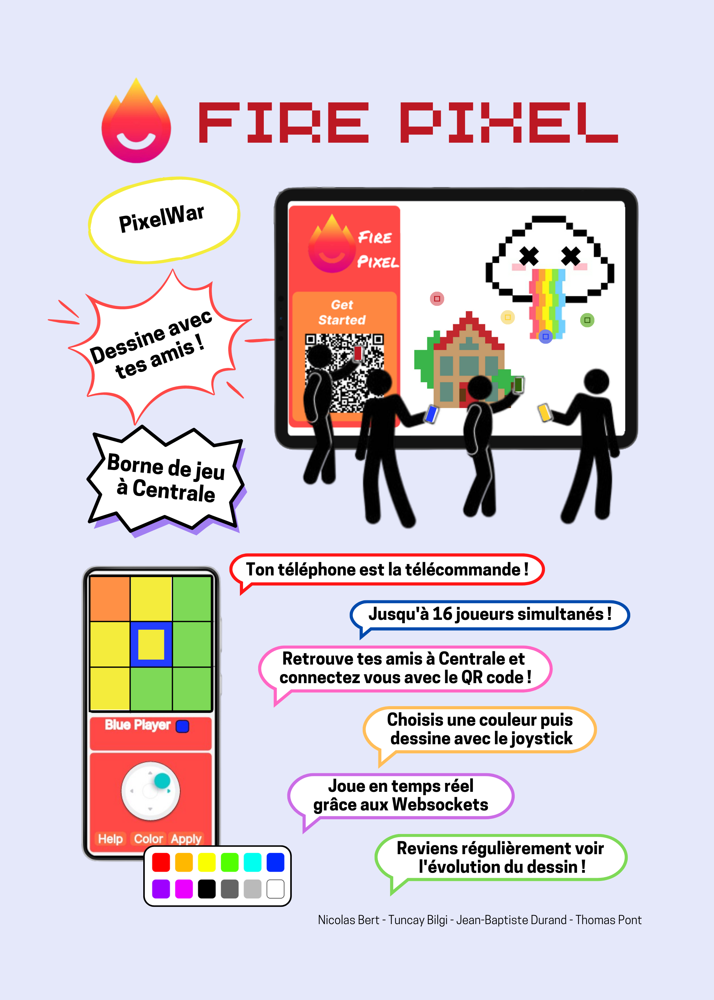
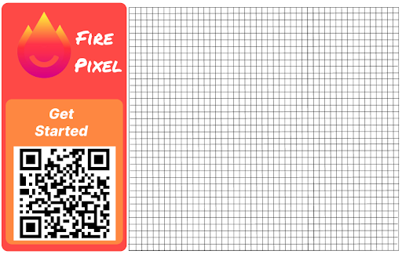
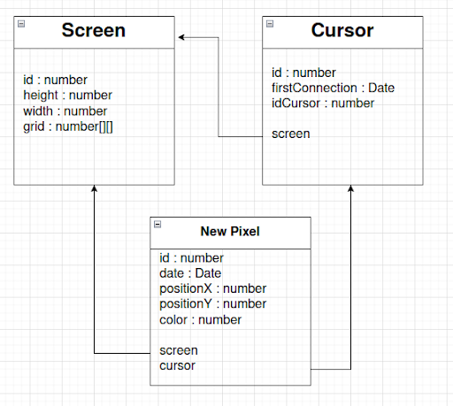
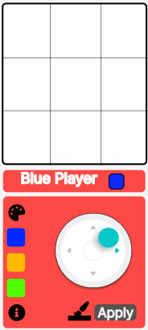
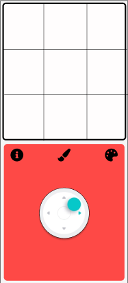

Le projet a pour but de recréer la [pixel war](https://www.reddit.com/r/place/?cx=1461&cy=200&px=199&ts=1649112460185) de reddit.

## Le Principe

Un tableau de $n \times m$ pixels est partagé entre plusieurs utilisateurs sur un écran. Les utilisateurs peuvent modifier les couleurs des cases parmi 16 couleurs disponibles. Le but est que plusieurs utilisateurs se coordonnent pour dessiner une image, ou remplacer celles des autres.

## En Pratique

Le projet sera déployé sur un écran qui pourra être posé n'importe où dans Centrale. Celui-ci pourra par exemple être dans un lieu de pause comme à coté des distributeurs de café ou dans un lieu de passage.

Les centraliens pourront s'approcher de l'écran et scanner un QRcode pour accéder à l'application. Sur leur téléphone, ils peuvent choisir un pixel et une couleur, et appliquer la modification (qui sera alors affichée en temps réel sur l'écran principal) à l'aide d'un joystick.
Il existe deux possibilités de modification. Un mode pixel par pixel et un mode continu qui permet de tracer des lignes d'une couleur.

16 utilisateurs peuvent interagir simultanément. Afin de savoir où l'on est sur l'écran, chaque utilisateur est représenté par une couleur et son pixel actuel est marqué par cette couleur.

## Stack technologique

L'application nécessite un Front, un Back et une base de données.
Pour la réaliser on utilise le stack suivant :

- Front-end : React.js avec Tailwind
- Back-end : Express.js
- Technologie de communication : WebSocket
- Base de données : MongoDB ?
- Carte RaspberryPi + écran de télé%

## Avancée du projet

Actuellement, différentes étapes ont été réalisées :

- Maquette des écrans sur Figma
- Premier prototype fonctionnel (écran des téléphones, de la télé et interaction entre les deux)
- Déploiement sur l'OVH

Différentes fonctionnalités sont encore à coder comme la prévisualisation d'une zone de l'écran et le compte administrateur. Par ailleurs, des tests utilisateurs vont être réalisés de manière à vérifier que l'interface est compréhensible et simple d'utilisation.

## Poster

## Rapport du projet

### Introduction

Dans le cadre du parcours Do_It, nous avons été amenés à réaliser un projet sur le thème de l’autonomie numérique.

Nous avons repris un projet réalisé les années précédentes : [CampusFire](https://github.com/campusfire/campusfire). Il s’agit d’un écran pouvant être placé dans un lieu de passage à Centrale et sur lequel les étudiants peuvent interagir directement depuis leurs téléphones. Le but est **d’utiliser les smartphones** comme moyen de **rassembler les élèves**, plutôt que de l’utiliser pour interagir à distance.

Pour commencer, nous nous sommes documentés sur les anciennes instances du projet pour apprendre de leurs enseignements. La lecture des différents rapports nous a permis de saisir les enjeux de ce projet et l’état d’avancement. Il s’agissait notamment de **rendre cet écran attractif** en poussant les utilisateurs à venir le **voir et le revoir**. Plusieurs possibilités avaient alors été soulevées : **écran de jeux** (jeux collaboratifs tels que cadavre exquis ou jeu avec classement), **mur de Post-Its** (chacun peut alors laisser une note visible de tous) ou encore un **service utile** pour tous les Centraliens (comme une borne pour réserver une salle). Il était également soulevé le fait que cette borne doit être **simple d’utilisation** de manière à ce que tout le monde puisse comprendre le fonctionnement et rapidement et s’en servir.

Par la suite, les différents groupes ayant travaillé dessus ont commencé à réaliser une borne sur laquelle on peut, à l’aide de son téléphone, mettre des photos ou du texte. Un premier prototype a été déployé et testé lors des campagnes associatives 2021.

Le concept nous plaisait et nous nous en sommes inspirés pour notre idée : **créer un écran sur lequel les Centraliens pourront dessiner depuis leurs téléphones collaborativement**. Celui-ci permettra de créer un espace de rencontre pour les Centraliens et les faire collaborer autour d’un jeu ou d’un projet artistique.

Dans ce rapport nous présenterons dans un premier temps le concept de notre projet de manière plus poussée, avant de détailler la première version que nous avons réalisée. Ensuite, nous décrirons les tests utilisateurs effectués et les modifications apportées.

### I. L'idée du projet

Comme décrite en introduction, l’idée du projet est de créer un écran de dessin collaboratif. Dans un premier temps, il a fallu établir ce que nous souhaitions faire en établissant une liste de besoins et d’exigences.

L’objectif est que le projet puisse être **déployé sur une télévision de Centrale**. Celle-ci pourrait être n'importe où sur le campus mais idéalement dans un **lieu de pause** comme à côté des **distributeurs de café** ou dans un lieu de passage comme en bas des plots. Les Centraliens pourront s'approcher de l'écran et scanner un QRcode pour accéder à un site web mobile-first. Les utilisateurs peuvent **se servir de leur téléphone comme d’une télécommande**, grâce à laquelle ils peuvent dessiner sur l’écran. Cette télécommande propose plusieurs moyens d'interagir : un **affichage en temps réel**, un **joystick** et différents **modes de dessin**.

Il existe deux possibilités de modification. Un mode **pixel par pixel** et un **mode continu** qui permet de tracer des lignes d'une couleur. **16 couleurs** sont disponibles permettant une grande liberté de création.

**16 utilisateurs peuvent interagir simultanément**, ceci afin d’avoir un fort aspect collaboratif, tout en gardant une bonne visibilité de l’écran. Afin de savoir où l'on se situe sur celui-ci, chaque utilisateur est représenté par une couleur visible sur son téléphone. Le curseur le représentant sur l’écran est de cette même couleur. Sur son téléphone, l’utilisateur pourra voir les pixels environnants afin d’avoir une plus grande précision sur ce qu’il fait.

Pour pouvoir interagir facilement sur l’écran, **l’interface mobile doit être simple d’utilisation**. L’utilisateur peut donc facilement se servir des différentes fonctionnalités (couleurs, deux modes, …). De plus, un onglet “Aide” est disponible pour pouvoir expliquer rapidement aux joueurs comment FirePixel fonctionne.

Le projet est développé en **méthode agile**. Les fonctionnalités sont priorisées puis elles sont implémentées dans des **sprints d’une durée de 2 ou 3 semaines** selon l’agenda. Une réunion le mardi permet de faire part de l’avancement du sprint, de discuter de l’architecture du projet, de mettre à jour le backlog et enfin de prendre du recul sur les échéances à  moyen terme.

Une version fonctionnelle de l’application avec toutes les nouvelles features est déployée tous les 3 sprints. Suite à cette release, des phases de tests sont menées et les retours de ces tests alimentent la suite du développement.

### II. Première phase

Pour débuter ce projet, nous avons choisi de réaliser une **première version** de ce que nous souhaitions faire. Nous avions pour objectif de terminer cette version pour la soutenance de mi-projet, qui a eu lieu en janvier 2023. Cette partie du travail a été découpée en trois  temps : le maquettage, la réalisation du schéma d’entités et le développement.

#### 1. Maquette

Pour que notre projet puisse être utilisé, un des premiers grands enjeux est que **l’interface utilisateur soit simple et intuitive**. En effet, si celle-ci est trop complexe, les joueurs ne chercheront pas à comprendre et partiront sans même tester notre application.
Nous avons donc réalisé une première maquette de la Web App sur Figma.

Cette maquette est simple et épurée.

Cependant, sur ce modèle, l’identité visuelle est faible et certaines fonctionnalités ne sont pas accessibles (comme l’onglet aide, ou la possibilité de dessiner de deux manières différentes).

Suite à ces conclusions, nous avons donc réalisé la maquette suivante :

Cette interface reprend la couleur du logo de FirePixel afin de garder une certaine cohérence. Par ailleurs, elle dispose de boutons permettant d’utiliser toutes les fonctionnalités que nous souhaitions implémenter.

Ainsi, le bouton *Help* permet d’afficher un texte explicatif. Le bouton *Color* affiche la palette de couleur ainsi que la possibilité de passer en mode continu ou pixel par pixel. Enfin, le bouton *Apply* permet d’appliquer la couleur choisie sur le pixel où notre curseur se trouve.

Il est également important que la télévision où sera affiché FirePixel ait un visuel simple et esthétique, qui incite les personnes qui passent à scanner le QR Code.

#### 2. Schéma d'entité

Après avoir mis en place le visuel de l’application, nous avons créé le schéma d’entités de la base de données qui sera mise en place sur le serveur back.

Nous avons construit 3 entités : l’écran, les curseurs et les pixels selon le schéma ci-dessous :

#### 3. Développement

Dans un second temps, nous avons développé notre projet, en construisant le front selon les maquettes que nous avions réalisées et le back selon le schéma d’entité décrit.

##### a. Front

Le développement frontend s’est réalisé à l’aide de deux frameworks :

- **React** a été choisi car 2 membres du groupe avaient déjà de l’expérience avec ce framework.
- **Tailwind CSS** a été crucial pour guider l'esthétisme de la page. Ce framework est fait pour être pris en main rapidement, ce qui nous a aidé à  facilement en place le style de la page.

La philosophie a aussi été d’utiliser le moins de dépendances possibles pour ne pas importer des briques fonctionnelles sur lesquelles nous n’avons pas le contrôle et qui risquent de devenir obsolètes. Ainsi, le maximum est réalisé à la main, quitte à parfois réinventer la roue.

Les deux grandes difficultés rencontrées sont :

- L’UX/UI
- L'interaction à travers le joystick

L’UX/UI a été un problème tant **l’application est singulière**. Elle n’a pas vocation à afficher du contenu comme une application classique. Au contraire, elle affiche le moins de contenu possible sur le téléphone pour **forcer les joueurs à lever la tête** et à collaborer verbalement. Cela mène à la recherche de compromis. Faut-il créer une application **type télécommande** avec pleins de boutons à proximité mais sans souci d’esthétisme, ou, au contraire faut-il **compartimenter l’application pour laisser l’utilisateur respirer** ?
Nous avons choisi la deuxième approche.

Ensuite, le **joystick** a été un problème. **Il a reçu plusieurs révisions**. Nous avons utilisé un composant tiers, sans dépendance, qui contient le minimum de code possible. Il a fallu gérer le comportement du joystick et son interaction avec l’application de A à Z, ce qui nous a mené à créer différentes fonctions plus ou moins algorithmiques.

Par exemple, le premier joystick permettait seulement d’atteindre 8 directions, alors que le joystick actuel est beaucoup plus fin. Pour réaliser ces itérations, nous avons tirées des enseignements du **lean engineering**. A chaque **itération**, on relevait un **problème majeur**. Puis, on essayait de régler ce problème à l’itération suivante jusqu'à finir sur un joystick plaisant à utiliser.

##### b. Back

Afin de pouvoir communiquer entre le front et le back, nous avons choisi d’utiliser la **technologie de Websockets**. Cela permet de conserver une **interaction en quasi temps instantané**. Mais, une des premières difficultés a été de bien comprendre cette technologie. Nous avons donc mis en place une petite application web pour comprendre comment il est possible de l’intégrer dans un projet.

Une fois cette application faite, nous avions toutes les connaissances pour mettre en place la partie back-end du projet. Le **premier objectif** étant d’avoir quelque chose de **fonctionnel**, nous nous sommes limités aux fonctionnalités les plus importantes : **transmettre l’information** des téléphones à l’écran, sans nous soucier de la sauvegarde des données (ce qui sera une difficulté en plus lors de l’amélioration vers la deuxième version). Nous nous sommes donc entièrement passés de base de données. Les données nécessaires à faire fonctionner le projet - les adresses websockets, et positions des curseurs - étaient stockées dans la RAM. Nous n’avons pas spécialement besoin d’avoir une persistance de ces données donc l’utilisation de la RAM est suffisante.
Il n’y a pas eu spécialement de difficultés liées au Back de notre projet jusque là.

Enfin, nous avons déployé le travail réalisé sur le serveur OVH mis à notre disposition.

### III. Tests utilisateurs

Suite à ce premier temps, et après le déploiement de la première version de FirePixel, nous avons débuté des **tests utilisateurs**. Ceux-ci avaient pour objectif de voir comment les **personnes réagissaient face à notre projet** : voir s'ils comprenaient le fonctionnement et s’ils réussissaient à interagir avec l’écran via leurs téléphones. Enfin, nous leur demandions un **court retour d’expérience** afin d’en dégager d’éventuelles améliorations à apporter au projet. Nous écoutions également les remarques et suggestions qui pouvaient être exprimées au cours du test.

Les premiers tests utilisateurs de Fire Pixel ont été réalisés lors de la **journée poster**. Ces tests ont été **biaisés** par le fait que nous présentions en parallèle le projet et que nous avons pu aider et guider les joueurs en parallèle de leur découverte de l’écran. Cependant, cette journée nous a aussi permis de **prendre conscience de beaucoup d'aspects autour de FirePixel** grâce aux retours qui nous ont été faits.

Ainsi les principaux retours ont été les suivants :

- **L’interface n’est pas optimisée** et n’est pas forcément simple d’utilisation : les utilisateurs ne comprennent pas où cliquer pour changer de mode (pixel par pixel ou continu) et ont du mal à saisir la différence entre la couleur avec laquelle ils dessinent et la couleur du curseur qui les symbolise sur l’écran;
- Dans le **mode continu**, le **nombre de directions possibles est trop limité**. En effet, nous avions ici choisi de limiter à quatre le nombre d’axes possibles (horizontal, vertical et diagonales);
- La **vitesse de dessin** dans le mode continu est trop faible : il est long de traverser l’écran;
- Le **mode pixel par pixel** est difficile d’utilisation car long et peu pratique car les mouvements du curseurs sont pas très précis.

Malgré tout, cette première phase de tests a été un succès pour nous. En effet, il s'agissait de la première fois qu’on faisait tester notre projet et les **retours ont été dans l’ensemble très positifs**. Par ailleurs, une autre source de satisfaction a été le fait que l’écran **fonctionne malgré les nombreux utilisateurs connectés** (jusqu’à une dizaine) et qu’il n’y a pas ou très peu eu de temps de latence.

Une deuxième phase de tests utilisateurs a alors été effectuée. Nous avons choisi des **Centraliens** car c’est principalement eux qui seront amenés à se servir de notre projet. Puis, nous les avons mis face à un écran de FirePixel **seul ou par petit groupe** afin d’effectuer notre test utilisateur.

Les principaux points que nous avons relevé sont les suivants :

- Le **menu Help** est très peu utilisé. Sur une dizaine de personnes, seul deux l’ont ouvert et une l’a lu entièrement;
- Les **deux modes de jeu sont difficiles à trouver** notamment le mode continu qui nécessite souvent une explication;
- Les **curseurs sont difficiles à repérer** quand beaucoup de personnes sont connectées simultanément. En effet, des gros aplats de couleurs se forment et il est alors difficile de repérer un petit curseur de couleur ou il est alors difficile de différencier sa couleur de celle des autres;
- Certaines personnes ont proposé de mettre en place des **modes alternatifs** pour rendre le jeu plus dynamique : objets cachés qui font que si l’on colorie une case un effet se déclenche (comme curseur qui grossit, zone qui devient d’une couleur, …) ou alors guerre de territoire avec pourcentage de l’écran rempli par les différentes couleurs.

Parmi toutes les idées émises, nous avons choisi de nous concentrer principalement sur la **refonte du visuel** de l’interface. En effet, celle-ci nous paraît primordiale. Il est trop difficile de bien jouer si l’interface n’est pas comprise.

La possibilité d’ajouter des modes de jeu nous paraît intéressante afin d’ajouter du dynamisme dans le jeu. Cependant, la durée du projet étant limitée, nous n’en avons pas fait une priorité.

### IV. Seconde version

Suite aux retours des tests utilisateurs, nous sommes repartis dans un cycle de conception/développement. Parmi les retours faits, beaucoup soulignaient l’interface parfois peu claire. Nous avons donc dans un premier temps cherché à faire une refonte de l’interface. Puis, nous avons développé les modifications apportées.

#### 1. Maquette

Ainsi, nous avons **retravaillé la maquette de la Web App** afin qu’elle soit plus propice aux interactions pour les utilisateurs. Tout ceci a été fait en parallèle des **cours d'UI** qui, nous ont présenté les différents concepts pour réaliser une bonne maquette d'application sur Figma.

La première étape a été de refaire les boutons pour les remplacer par des symboles plus simples pour la compréhension et plus esthétiques. Plusieurs propositions ont alors été faites, dont celles ci-dessous :

  

    
  

  

    
  

  

    
  

Sur les maquettes, les trois couleurs correspondent aux trois dernières couleurs utilisées. La palette permet d’accéder à un plus large choix de couleurs et le pinceau aux deux modes possibles (dessin continu ou pixel par pixel).

Finalement, nous avons réfléchi à d’autres possibilités. Le rouge, en couleur de fond, est trop voyant pour l'œil et ne permet pas de mettre en valeur les couleurs. Ensuite, le symbole du pinceau peut porter à confusion. Enfin, il est ici nécessaire de cliquer sur la palette puis sur la couleur qu’on souhaite choisir. Cela demande deux interactions.

Nous avons donc réalisé une nouvelle maquette corrigeant tout ceci :

La couleur grise de fond permet de corriger l’attirance de l'œil vers le rouge.

Par ailleurs, la palette est désormais accessible directement via une barre scrollable.

La couleur symbolisant le joueur est visible en plein centre de l’écran. Il est alors plus difficile de faire la confusion entre cette couleur et celle choisie pour dessiner.

La manière de choisir le **mode de dessin** est la plus **simple** possible. Il suffit d’orienter le bouton vers celui de notre choix.

Enfin, la grille de taille 5x5 permet au joueur de voir plus précisément les cases autour desquelles il se situe et, il peut **dessiner directement dessus** grâce au mode Pixel.

#### 2. Développement

Suite à ce travail, nous avons donc implémenté la maquette choisie. Une modification y a été apportée. Le mode pixel par pixel n’est plus disponible mais est faisable uniquement sur l’écran du haut du téléphone. Il est alors possible de cliquer directement sur un pixel dans l’aperçu en haut du téléphone pour le colorier. Le bouton du bas permet de se déplacer en coloriant ou sans colorier.

##### a. Front

Dans cette dernière itération nous avons dû implémenter les nouvelles fonctionnalités décrites précédemment. 

Nous avons implémenté la grille à l'aide d'un canvas afin de représenter les pixels aux alentours de notre curseur. Les pixels sont récupérés via websocket. Cette grille a aussi pour but de pouvoir dessiner directement et plus précisément autour de son curseur. Un appui long permet également de se déplacer de case en case.

Par ailleurs, nous avons également modifié l'esthétique générale de l'application et ainsi intégré la nouvelle maquette fraîchement créée. Cette refonte du design a été l'occasion de factoriser notre code et l'organiser de manière plus structurée. Grâce à cela, nous avons **réduit le nombre de clicks nécessaires** à chaque action, tout en gardant l'interface épurée.

La page screen a également été modifiée afin de mettre en place un canvas dit "responsive" qui va prendre toute la place disponible et s'adapter aux changements de taille d'écrans. On peut ainsi profiter d'une surface de dessin maximale sur l'entièreté de l'écran.

Enfin, afin de rendre plus claire l'utilisation nous avons aussi changé l'emplacement des couleurs. Désormais, au centre du joystick se trouve la couleur du joueur. La couleur de son curseur sur l'écran, et l'encadré coloré sur la grille correspond à la couleur avec laquelle vous êtes entrain de dessiner.

Nous avons aussi ajouter un bouton sur la page de téléphone visant à faire grossir le curseur sur la page de screen afin que l'utilisateur puisse le repérer si jamais il l'a perdu de vue.

##### b. Back

La partie Back du projet, à la fin du premier déploiement, **utilisait seulement un stockage en RAM**, sans sauvegarde de l’écran dessiné. Ceci implique que si on recharge la page front, l’écran est entièrement effacé. Ce qui n’est pas optimal car l’objectif est de pouvoir garder une trace de ces dessins.

La première étape a donc été de complètement restructurer le Back pour **intégrer une base de données**. Cette restructuration s’est décomposée en création des entités, création des services sur ces entités et liaison avec une base de données en PostgreSQL.

Ainsi nous avons créé **3 entités : Grid, Cursor et NewPixels**. Chaque modification de la part d’un joueur est enregistrée dans la base de données. Pour bouger un curseur, il faut trouver le curseur associé au joueur, modifier cette entité et sauvegarder les modifications. Ce qui fait un **grand nombre d’interactions avec la base de données** et ralentit énormément le mouvement du joueur.

Il a fallu faire un compromis sur ce que nous souhaitions stocker en base de données et ce qui ne nécessitait pas forcément d'avoir une trace dans la mémoire.
Premièrement, nous avons décidé que le stockage de chaque nouveau pixel, n'apportait rien au projet, donc nous avons supprimé ces accès en mémoire. Mais le serveur restait encore trop lent. 

Parmi les 2 entités qui reste, on a les curseurs, dont la réelle persistence des données n'est pas nécessaire mais qui a besoin que la donnée soit gardée au moins pendant toute l'utilisation d'un joueur.

Et il y a l'écran dont on veut absolument garder en mémoire une trace.

Sachant que la mémoire RAM est beaucoup plus rapide d'un stockage en mémoire dure, nous avons pensé à une **alternative qui utiliserais la RAM et la base de donnée** pour optimiser le temps de réponse et garder une trace de l'écran.

Pour les curseurs, nous avons simplement transféré toute la donnée du curseur dans la RAM. Pour l'écran, nous avons construit un composant de stockage RAM relié à la base de donnée. Ce composant met à jour la base de donnée de manière régulière (toute les 10 minutes). Le temps passé à stocker l'écran ne dépend plus du nombre d'utilisateur ni de la fréquence d'écriture sur l'écran.

Grace à cette réorganisation de la partie back du projet, nous avons pu largement augmenté les performances serveur. Nous avons **divisé par 28 le temps qu'il faut au serveur pour répondre** tout en gardant une persistence de l'écran.

## Lien

Notre code est disponible aux liens suivants :
[Front](https://github.com/Jean-Baptiste-DP/FirePixel-front)
[Back](https://github.com/Jean-Baptiste-DP/FirePixel-back)

Enfin, l'écran de FirePixel est disponible [ici](http://melisse.ovh1.ec-m.fr/#/screen).
