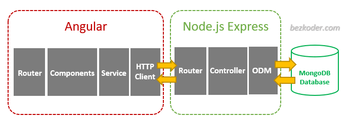
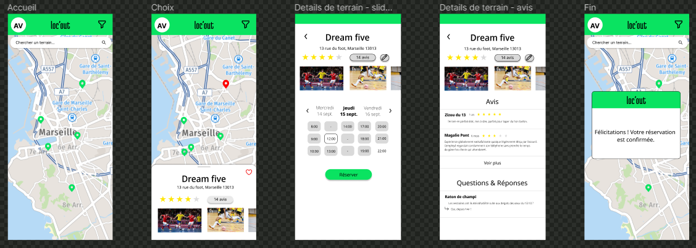
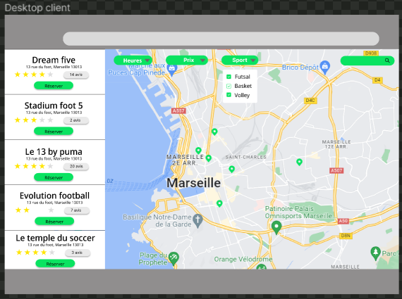
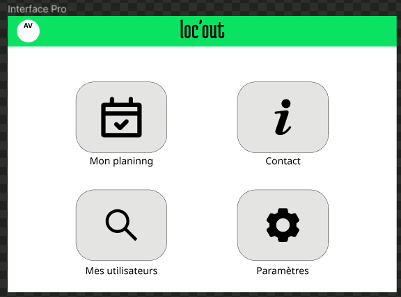
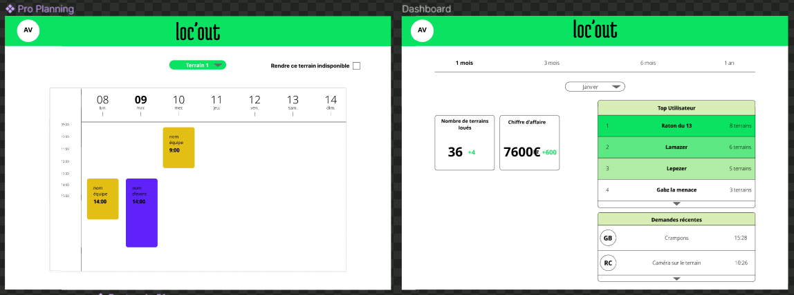

<head>
  <link rel="stylesheet" href="./assets/style.css">
</head>

Étant des pratiquants de football indoor, les membres du groupe ont constaté qu'il est difficile de trouver un terrain de sport de nos jours pour de nombreuses raisons. En effet, avec un nombre d'offres élevées et des sites web souvent rudimentaires, la recherche d'un créneau s'apparente à une série d'appels pas toujours fructueuse pouvant en décourager plus d'un. Peu de sites de salle indoor proposent une réservation en ligne et la plupart d’entre eux privilégient la réservation en ligne ou sur place, avec une gestion d’agenda sur Excel ou encore même sur papier pour certains.
Pour toutes ces raisons, nous avons voulu développer une solution de gestion d’agenda et de réservation en ligne, de manière à centraliser tous les créneaux de location disponibles à Marseille et à faciliter la tâche aux gérants des salles au niveau organisation des locations terrains, statistiques, et aussi à leur faire gagner en visibilité.

## Notre solution
Notre choix s’est d’abord porté sur la création d’une partie dédiée aux entreprises dans une version web avec une gestion d’emplois du temps et une partie orientée mobile destinée aux clients souhaitant réserver des créneaux pour des terrains de futsal. Cependant cette solution nécessite beaucoup plus de technologies (dont Flutter pour l’application mobile) et pourrait être envisageable dans le futur, mais pour le moment une simple application web responsive incluant ces deux parties suffit.
Notre site doit donc se composer en deux parties :

1.	Une partie client
A la création d’un compte client, l’utilisateur est redirigé vers l’accueil qui lui correspond, c’est-à-dire la page de recherche de créneaux de futsal à réserver. Une carte géographique interactive répertorie les différents propriétaires de terrains et propose les créneaux disponibles. Un filtre permet de trier ces propriétaires selon plusieurs critères (date, plage horaire, fourchette de prix notamment).
Le client peut consulter les pages d’information de chaque salle, et réserver en ligne le créneau qui lui convient.
2.	Une partie entreprise
Si un compte entreprise est créé, l’utilisateur doit avoir accès à une toute autre interface. Un menu à plusieurs choix est disponible et il est possible d’aller sur l’onglet désiré. Des outils sont proposés  comme une gestion de calendrier, des statistiques liés aux réservations, aux différents clients et au chiffre d’affaire.

## Stack technique

Pour notre application web, nous utilisons les technologies suivantes :
-	Angular, framework basé sur HTML, CSS et TypeScript, qui va nous permettre de créer la partie front-end de notre application web.
-	NodeJS et Express, en Javascript, nous permettent de fonder toute la partie back-end et l’API qui vont aussi être reliés à la base de données.
-	MongoDB, solution en ligne de création et gestion de bases de données, qui communique avec notre API
L’architecture est simple et s’organise comme suit :
 
Nous nous servons aussi de plusieurs librairies/packages qui nous permettent de rajouter certaines fonctionnalités nécessaires au bon développement du projet. Parmi celles-ci on trouve :
-	Material pour Angular, créé par google, est un ensemble, d’outils et composants de design déjà préconçus afin d’avoir un site internet propre, beau, et aux normes modernes en terme d’UI.
-	Bootstrap, pour la mise en page des éléments de notre site internet, fournit aussi des outils pour l’UI.
-	L’extension Google Maps d’Angular, nous a permis d’utiliser une carte Google Maps interactive et d’y placer nos répères de salles de sports indoor
-	Ngx-Charts a servi pour les graphiques et la partie statistique du tableau de bord.

## Poster

<figure>
  
  <figcaption>Poster de présentation du projet</figcaption>
</figure>

## Maquette 
### Solution mobile
Les cours de UI/UX design dispensés cette année dans le cadre du parcours do-it nous ont permis de penser nos différents designs à travers différentes maquettes sur le site Figma. 
Nous avons commencé par penser l'application mobile que l'on souhaitait et nous en avons désigné les différentes pages : 
<figure>

</figure>
Nous avons désigné ces pages en accord avec le brief graphique effectué en amont, les valeurs que nous voulions reflétés sont : facilité, visibilité et temps optimisé. Nous voulions que cette application soit intuitive et corresponde à ce que les gens ont l'habitude d'utiliser. 
De plus, le vert principal utilisé reflète, à notre sens, une couleur énergique.

Nous avons ensuite défini que cette application mobile n'était pas suffisante pour les particuliers et que nous souhaitions aussi avoir un site web donnant plus de visibilité à notre solution. De plus, nous devions aussi développer une solution de gestion pour les professionnels adoptant notre solution. Nous nous sommes donc attachés à désigner nos solutions "desktop".

### Solution Desktop pour les particuliers 
De manière assez simple, nous avons choisi d'adapter simplement notre interface mobile sur un format desktop. Nous n'avons donc pas produit beaucoup d'interface : 

### Solution Desktop pour les professionnels
Notre approche consistait, toujours en accord avec nos valeurs, à rendre notre solution la plus simple possible. Dans cette optique, nous avons choisi une page d'accueil épurée donnant accès aux différents services de notre solution qui sont : la gestion du planning, un formulaire de contact, un dashboard contenant les principales statistiques (voir plus bas) et un onglet paramètres.

Nos différentes interfaces sont bien sur en accord avec notre charte graphique et les couleurs apparaissant notamment dans le planning ont été testé sur adobe color afin de vérifier que celles-ci soient bien complémentaires. Vous pouvez voir ci-dessous nos différents visuels : 

## Business Model

<figure>

<figcaption>Business Model du projet Loc'out</figcaption>
</figure>

## Développement du site 
### Front-end 

### Back-end