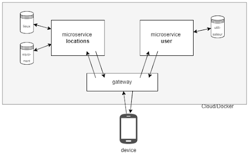
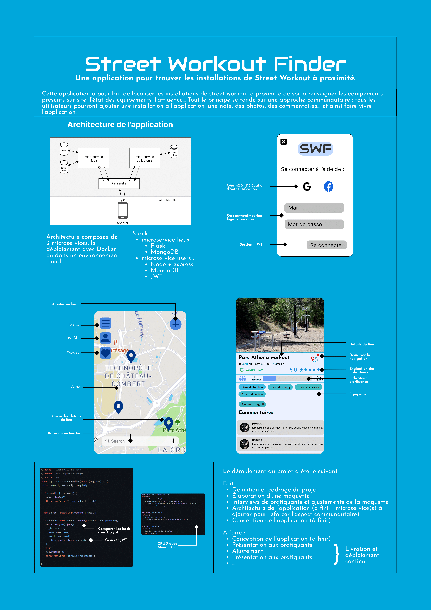
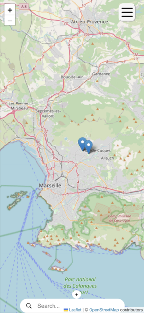
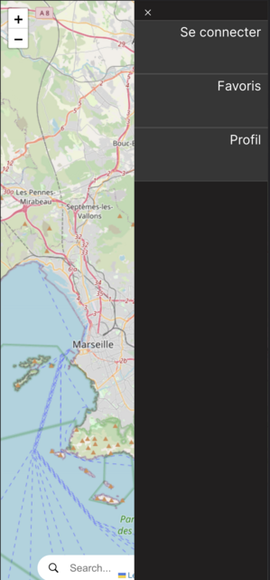
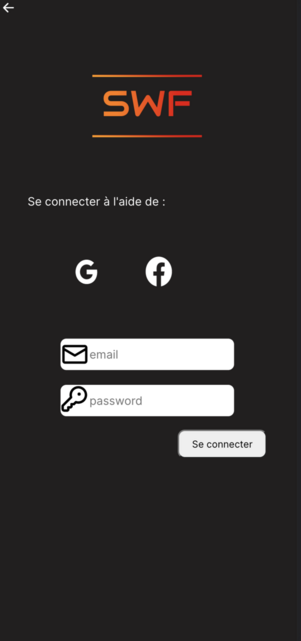
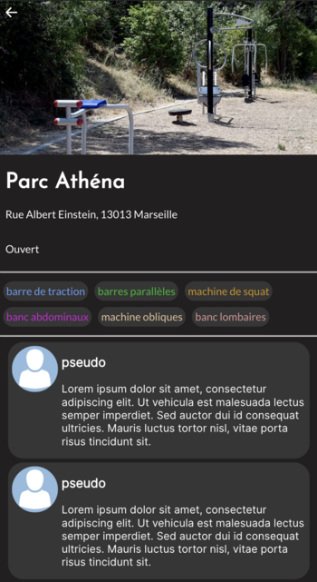

Le projet pour trouver des installations sportives en plein air près de chez vous !

## Le projet

Ce projet consiste a développer une application de géolocalisation d'installations sportives en extérieur dans la ville de Marseille. L'objectif de cette application est de permettre aux utilisateurs de localiser facilement les installations de street workout à proximité de chez eux, de connaître les équipements présents sur chaque site, leur état, leur fréquentation, etc. Nous avons adopté une méthode de Design Thinking pour concevoir une application en essayant de répondre aux besoins des utilisateurs de manière optimale. L'approche communautaire de l'application permettait à tous les utilisateurs de contribuer en ajoutant des installations à l'application, en laissant des notes, des photos et des commentaires, créant ainsi une base de données dynamique et vivante.

Ce projet vise à s'inscrire dans le thème de l'autonomie numérique. En effet, cette application permet aux utilisateurs de trouver et d'utiliser des équipements sportifs gratuits et accessibles à tous, sans avoir besoin d'adhérer à une salle de sport ou de payer des frais d'abonnement. De plus, l'application finale permettra également de partager des conseils et des astuces pour l'utilisation des équipements sportifs, ce qui peut aider les utilisateurs à s'approprier les installations et à les utiliser de manière efficace dans une démarche d'autonomie. Enfin, la communauté d'utilisateurs de l'application est au cœur du processus de création de contenu et de partage d'informations, favorisant ainsi la participation citoyenne et l'autonomie vis-à-vis des grandes plateformes du numérique.

On présentera ici les différentes étapes du projet, de la conception à la réalisation, en décrivant les méthodologies utilisées, les challenges rencontrés et les résultats obtenus

## Architecture de l'application

Le stack technologique de l'application web Street Workout Finder est conçue pour offrir aux utilisateurs une expérience dynamique, évolutive et performante. Le stack comprend une combinaison de technologies populaires qui conviennent aux exigences du projet, même si le principal objectif derrière le choix de ce stack a été de se former au développement web à travers des technologies innovantes.

Le front-end de l'application est construit à l'aide de React, une bibliothèque JavaScript pour la construction d'interfaces utilisateur. Le front-end fera également office d'une passerelle API. Elle est utilisée pour gérer la communication entre les différents microservices de l'application. Elle sert de point d'entrée pour l'application côté client et achemine les demandes vers le microservice approprié.

Le microservice "Lieux" est construit à l'aide de Flask, un framework Python web léger, et de MongoDB, une base de données NoSQL. Flask est un framework léger et facile à utiliser et est bien adapté aux applications de taille petite et moyenne. MongoDB est un choix populaire pour le stockage de grandes quantités de données et est bien adapté aux données non structurées.

Le microservice "Utilisateurs" est construit à l'aide de Node.js, d'Express.js, et de MongoDB. Node.js est un choix populaire pour construire des applications évolutives et performantes, et Express.js est un cadre web largement utilisé pour Node.js. MongoDB est également utilisé pour stocker les données du microservice Utilisateurs.

Finalement, les microservices et la passerelle API sont conçus pour être encapsulés dans des conteneurs Docker, dans un objectif futur de déploiement. Docker permet une certaine flexibilité dans les options de déploiement et la possibilité de lancer les microservices et la passerelle sur n'importe quelle plateforme, quelle que soit l'infrastructure sous-jacente. Il est ainsi facile de faire évoluer et de gérer l'application au fur et à mesure de sa croissance. L'utilisation de conteneurs Docker garantit également la cohérence entre les différents environnements, ce qui rend souvent le processus de déploiement plus facile.

## Poster

## Déroulé

### Phase de réflexion, Design Thinking

**19/09/2022 - 05/12/2022**
Dans la phase de réflexion, nous nous sommes concentrés sur les étapes suivantes :

- Recherche des besoins utilisateurs (avec des entretiens)
- Recherche de l'état de l'art
- Création du design dans Figma
- Création de l'architecture de l'application (on a décidé d'utiliser une architecture en microservices)

### Sprint 1

**06/12/2022 - 03/01/2023**
Dans le premier sprint, nous avons réalisé les étapes suivantes :
[x] Création du repo GitHub : <https://github.com/JeffreyEdisah/Street-Workout-Finder>
[x] Création microservice utilisateur et authentification
[x] Début du développement du microservice lieux

Nous avons crée un projet sur GitHub.

### Sprint 2

**03/01/2023 - 07/02/2023**
Dans le deuxième sprint, nous avons réalisé les étapes suivantes :
[x] Finir le microservice lieux
[x] Déploiement du microservice lieux sur AWS Lambda

### Sprint 3

**07/02/2023 - 28/02/2023**
Dans le troisième sprint, nous avons réalisé les étapes suivantes :
[x] Début du travail sur le front en React
[x] Création de la carte avec Leaflet
[x] Ajout des pages Login et Register
[x] Ajout de la page de description d'un lieu

### Sprint 4

**28/02/2023 - 21/03/2023**
Dans le quatrième sprint, nous avons réalisé les étapes suivantes :
[x] Refactoring du microservice lieux
[x] Ajout du menu à la carte
[x] Liaison du front avec les différents microservices
[x] Ajout d'une gateway entre le microservice lieux et le microservice utilisateurs

### Sprint 5

**28/02/2023 - 21/03/2023**
Dans le quatrième sprint, nous avons réalisé les étapes suivantes :
[x] Divers ajustements CSS
[x] Création d'un docker compose avec 3 services : le front, le microservice lieux et le microservice utilisateurs.

## Application

Page d'accueil           |  Menu
:-------------------------:|:-------------------------:
   |   

**Page de connexion**            |  **Parc Athéna**
  |   

## Futures fonctionnalités

Bien que nous soyons fiers de ce que nous avons accompli avec l'application web, il y a certaines fonctionnalités que nous aurions aimé pouvoir ajouter si le temps et les ressources nous avaient permis. Ces améliorations pourraient inclure :

- Recherche par équipement présents sur le lieu : Nous pourrions intégrer une fonctionnalité de recherche qui permettrait aux utilisateurs de trouver des lieux en fonction des équipements qu'ils offrent..

- Aspect communauté avec ajout de commentaires : Il serait intéressant d'ajouter une section commentaires à l'application pour permettre aux utilisateurs de partager leur expérience, poser des questions et interagir entre eux.

- Ajout d'équipements sur les lieux avec des tags : Nous pourrions permettre aux utilisateurs de suggérer de nouveaux équipements pour les lieux et de les taguer, afin que les autres utilisateurs puissent les trouver plus facilement.

- Mise en place d'utilisateurs clés pour vérifier la véracité des ajouts : Pour assurer la qualité des informations de notre application, nous pourrions mettre en place un système de vérification pour les ajouts suggérés par les utilisateurs. Ces utilisateurs clés pourraient être responsables de valider ou de rejeter les ajouts proposés.

- Déploiement sur le cloud : Il serait bénéfique de déployer notre application sur le cloud, car cela permettrait d'assurer une disponibilité en ligne 24/7 et une meilleure performance pour les utilisateurs.

- Remplacement des images "placeholder" par des images correspondant au lieu : Nous pourrions remplacer les images par défaut par des images réelles des différents lieux, pour une expérience utilisateur plus personnalisée et plus engageante.

- Ajout d'un bouton itinéraire : Il serait utile d'ajouter un bouton itinéraire pour que les utilisateurs puissent trouver facilement leur chemin vers les différents lieux répertoriés sur notre application.
  
En somme, nous sommes conscients qu'il y a encore des améliorations à apporter à notre application, et les intégrer à l'avenir afin permettrait de garantir la satisfaction de nos utilisateurs.

## Difficultés rencontrées et points à améliorer

La toute première difficulté que nous avons rencontrée est technique. En effet nous sommes tous en apprentissage actuellement, et le code que nous avons produit a été produit en même temps que nous apprenions les différents langages, librairies, ou même concepts.
Cette apprentissage a d'ailleurs souvent été la cause de retards dans nos sprints.

La deuxième difficulté rencontrée est elle en terme de cadrage du projet, mais est également liée à la première. Il est compliqué de jauger la difficulté d'une tâche à accomplir quand on a pas une connaissance claire des moyens à notre disposition pour accomplir ladite tâche.
Cette difficulté s'est néanmoins peu à peu atténuée à mesure que nous prenions de plus en plus en compétences et en assurance.

La troisième difficulté découle également des 2 autres mais pas seulement, et est liée à l'organisation du temps de travail autour du projet. Avec l'apprentissage continu et le mauvais cadrage, certaines fonctionnalités ont pris du temps à être développées pour au final être abandonnées parce que nous sommes finalement partis sur des solutions différentes, notamment pour le déploiement.
De plus, avec le départ de Kasimir et l'arrivée de Thomas, nous avons du rééquilibrer les charges de travail, informer Thomas sur le fonctionnement de notre code et le rendre opérationnel, ce qui aurait pu mieux être fait.

Ces difficultés peuvent être mitigées avec des ajouts au processus de travail, par exemple la mise en place d'une documentation écrite claire et lisible au fur et à mesure de l'écriture du code, une réduction du temps de réflexion avant de commencer le travail effectif sur le projet, car la réflexion est continue.

En somme, le projet a permis de mettre en évidence l'importance de la gestion de projet et de l'organisation dans le développement d'une application de ce type. Il y a plusieurs mesures que nous aurions pu prendre pour pallier au niveau des difficultés rencontrées, et dont nous comprenons mieux l'importance dans le monde professionnel, même si les échelles sont différentes.

## Bilan

Le développement d'une application web est un projet qui peut être très enrichissant d'un point de vue professionnel et personnel. Dans ce projet, nous avons eu l'opportunité de travailler sur différentes technologies et outils, ce qui nous a permis d'acquérir une expérience précieuse en développement web. Nous avons également développé des compétences en gestion de projet, en résolution de problèmes et en communication. Au-delà de ces compétences techniques, le projet a également permis aux membres de l'équipe de développer leur créativité et leur capacité à collaborer avec des personnes ayant des compétences différentes.

Dans l'ensemble, le projet a permis à tous, à notre échelle personnelle de progresser en développement web. Que ce soit dans la façon de structurer une application ou dans la prise en main de nouveau outils et framework nécessaires à la progression du projet. Nous avons tous éprouvé et amélioré nos capacités.
