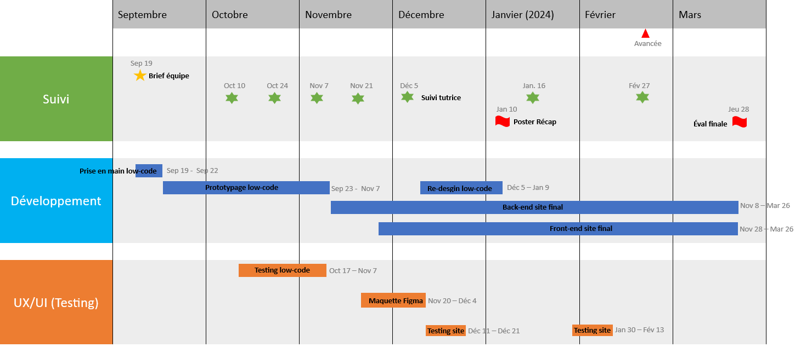
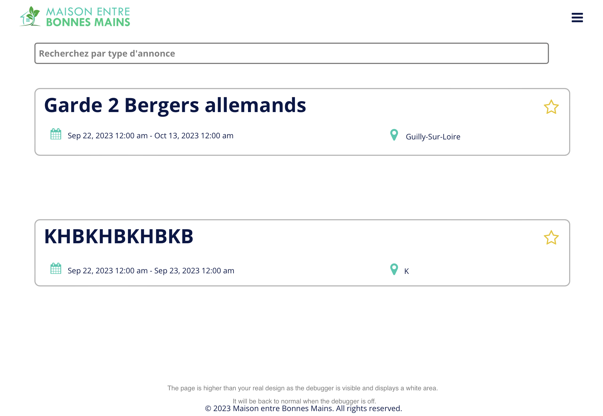

Création d'un site de mise en relation des élèves centraliens pour déposer et répondre à des annonces.

Dernière mise à jour : 20/02/2024

## Description du projet
### Contexte

L'année dernière, alors qu'il s'apprêtait à partir en vacances, William  n'a trouvé personne qui pouvait s'occuper de son jardin en son absence (pas chez ses voisins, pas même chez ses amis).
**Résultat :** tout son potager est mort en son absence.

Nous souhaitions dans un premier temps créer une plateforme de mise en relation de particuliers pour la garde d'animaux et la gestion de jardins pendant une absence.

### Recadrage

Après réflexion et discussion avec Adèle, notre tutrice, nous avons décidé de recadrer le projet.

Nous nous concentrons sur un **public centralien uniquement**, ce qui nous permet de développer un projet plus **précis** et **répondant à une demande que nous connaissons tous.**

Nous nous basons ainsi sur un public clairement identifié et les personae seront correctement définis.

### Présentation du projet retenu

Nous souhaitons créer une **plateforme d'entraide entre centraliens**, du type Leboncoin, permettant à tout étudiant de déposer une annonce pour tout type de service.
Il peut s'agir d'un besoin :
- ponctuel de courte durée (prêt d'outils, déménagement, vends bureau) ;
- ponctuel de plus longue durée (entretien d'un potager pendant les vacances) ; 
- ou encore d'un besoin récurrent (prêt de matériel de sport)

Chaque centralien qui le souhaite dépose son/ses annonce(s) incluant description et informations pratiques : localisation, date, besoin... 

Les autres utilisateurs peuvent alors scruter les différentes annonces, rechercher celles proches de chez eux via un accès à la carte des colocs.

Après acceptation d'une annonce, le demandeur est invité à contacter l'accepteur sur Messenger.

## Et ça existe déjà ?

Oui, mais non... 
Les plateformes existantes (Allovoisins, Yoojo, etc...) ne proposent **que de la mise en relation entre particuliers et artisans ou dépanneurs, etc...** Les sercives restent tout à fait factuels or nous souhaitons **proposer un site Internet de confiance dédié uniquement aux centraliens favorisant l'échange et les interactions sociales.** La vie des centraliens s'en verra grandement améliorée.

Il existe également un groupe Facebook "Centrale bière au Bar'bu" qui permet de demander des services de la sorte mais la **page est inadaptée aux besoins :** les annonces se perdent dans le fil d'actu, les informations pratiques sont peu visibles, beaucoup de centraliens sont manquants, la page est peu gérée...

## Objectifs du projet

### Rendu final

Nous comptons rendre, d'une part : **un Site Low-Code / No-Code**. Il sera construit à partir de :
- Airtable : un outil permettant de gérer les bases de données, dans notre cas pour gérer les annonces, les utilisateurs et les favoris,
- Bubble : un outil de no-code permettant de créer une maquette fonctionnelle de notre site Web.

Ce site Low-Code / No-Code doit être fonctionnel et esthétique. Il doit permettre de naviguer sur les différentes pages :
- dépôt d'annonce
- sélection d'annonce
- chatbot
- ajout de favoris
- création du profil utilisateur...

**Le but étant d'exploiter au maximum les possibilités fournies par l'usage du Low-Code / No-Code de sorte à proposer en peu de temps un prototype avancé du futur site web.**

D'autre part : **un Site "dur"**. Ce site sera construit "à la main" avec :
- une partie front-end, fonctionnelle pour déposer une annonce, visualiser des annonces, échanger entre utilisateurs
- une partie back-end pour gérer les fichiers et données utilisateurs.

Le site "dur" sera une version partielle du site Low-Code / No-Code : seules les principales fonctionnalités seront présentes.
L'objectif étant cette fois-ci le développement de compétences en DevWeb.

### Compétences sollicitées
**Design de l'Interface (UI)**
Construction d'un site esthétiquement qualitatif, prise en main de l'outil Figma, travail de créativité.

**Expérience Utilisateur (UX)**
Construction d'un site intuitif, facile à prendre en main.

**Low-Code**
Prise en main de fonctionnalités Low-Code / No-Code grâce aux outils Airtable et Bubble afin de créer un prototype fidèle à la version finale souhaitée
Découverte des différentes fonctionnalités/interfaces visibles sur un site internet.

**Devweb Front-End**
Apprentissage HTML, CSS, JS
Utilisation de l'application Bootstrap pour implémenter des fonctionnalités sophistiquées
Utilisation des outils de dévloppement pour comparer les scripts d'autres sites et s'en inspirer pour développer notre site

**Devweb Back-End**
Utilisation de Python/ Javascript / node au service des bases de données

**Gestion de projet**
Division et répartition des tâches dans la création d'un site
Utilisation de l'outil Notion afin de suivre l'avancée du projet

## TimeLine Projet

La TimeLine est vouée à évoluer et sera actualisée au cours du projet.

## Fonctionnalités

### Connexion et inscription

La prise en main de notre site se doit d'être facile et rapide.
L'étude **Experience 2030** (menée par Futurum Research et SAS) montre qu'un internaute décide en quelques secondes de quitter un site Internet si celui-ci n'est pas ergonomique.

Nous avons décidé de bâtir une interface utilisateur claire avec un nombre limité de boutons. Les boutons classiques *Se connecter* et *S'inscrire* sont les seuls mis en valeurs sur la page d'accueil.

Ces deux boutons renvoient vers une page d'identification fonctionnelle, qui gère les questions d'authentification et met à jour la base de données des identifiants/mots de passe. À titre d'exemple pour la maquette en low code, seuls le nom, l'adresse mail et le mot de passe suffisent à s'inscrire. *Il est possible que ces exigences évoluent dans le futur.*

#### Menu déroulant

Nous avons implémenté un menu déroulant sur la droite de l'écran qui permet à l'utilisateur de naviguer aisément vers les pages **importantes** de notre parcours utilisateur :

- Mon Profil
- Mes Annonces
- Mes favoris
- Carte des annonces
- Déconnexion

**Voici l'utilité de chacune de ces pages :**
|                                    | Mon Profil   | Mes Annonces       | Favoris            | Carte des Annonces |
|:----------------------------------:|:------------:|:------------------:|:------------------:|:------------------:|
| **Résumé**                         | Personnalisation et actualisation du profil | Liste des annonces déposées | Liste des annonces ajoutées aux favoris. | Carte interactive répertoriant les annonces et leur localisation |
| **Informations que l'on y trouve** |  Nom, Prénom, Age non modifiables.       | Visibilité des annonces, utilisateurs intéressés. Possibilité de modifier les annonces. | Si le déposant modifie une annonce ajoutée aux favoris par un autre utilisateur, ce dernier sera alerté  | Annonces affiliées à une zone géographique et non une adresse précise pour préserver la sécurité des utilisateurs  |

#### Déconnexion

Quand un utilisateur se déconnecte, il est redirigé vers la page d'accueil du site.

#### Dépôt d'une annonce

L'annonceur remplit un formulaire simple mais précis, présentant plusieurs fonctionnalités destinées faciliter son expérience :
- la sélection d'une date se fait avec un calendrier interactif
- le dépôt d'un fichier photo permettant d'ajouter des informations : "une image vaut 1000 mots", la photographie d'un potager sera probablement plus parlante qu'un paragraphe visant à le décrire...

Pour éviter toute erreur de missclick, une confirmation sera demandée après clic du bouton *Déposer mon annonce*.

#### Recherche des annonces

Inspirée des sites d'annonces, la page de recherche n'affiche que les éléments primordiaux de chaque annonce, elle se veut d'être impactante et lisible.
La sélection d'une annonce se fait d'abord sur sa mission (titre de l'annonce) puis, si celle-ci semble intéressante, sur les critères de dates et de localisation.

Lorsqu'un utilisateur est intéressé par une annonce, il peut la consulter pour avoir plus de détails et la mettre dans ses favoris. Il peut ensuite confirmer qu'il est disponible pour débuter la conversation avec l'annonceur.

#### Fonctionnalités à développer

- Le système de chat entre particuliers une fois que l'annonce a été acceptée.
- La carte des annonces qui permet à l'utilisateur d'afficher une carte de ses environs avec les annonces à disposition.
- Le système de notation des autres utilisateurs et des services rendus. Afin de garantir une transparence et de garder des bonnes mains bienveillantes, ce système permet d'alerter les autres utilisateurs et de les mettre en garde avec une mauvaise note si une bonne main ou un annonceur n'ont pas respecté leurs engagements.
- La page de confirmation lors du dépôt d'une annonce
- La barre de recherche fonctionnelle
- Le système de favoris qui communique avec la base de données
- Un espace de retour de la part des utilisateurs pour les développeurs

## Développement du site web

### Low-code

### Design : Maquette Figma
Les premières fonctionnalités en low-code développées, nous profitons du cours de User Interface proposé par Valery Ly pour définir notre charte graphique.

### Front-end

### Back-end

## Sécurité de l'utilisateur

Une problématique centrale réside dans la confidentialité des données, et de la sécurité des annonceurs (biens dégradés, cambriolages, etc...). De la même manière qu'Airbnb, seule la personne ayant accepté une annonce peut consulter l'adresse exacte de l'annonceur, sinon elle est localisée par une zone relativement large.
Le centrage du projet sur les élèves centraliens permet de limiter les effets listés ci-dessus, car il existe une relation de confiance non-négligeable entre les centraliens.

## Business Plan

Etant donné le public centralien, le site internet ne sera pas à but lucratif (même si y aura la possibilité pour les associations de faire de la pub moyennant finance). Les serveurs seront ceux de l'école, ainsi tout l'argent ira directement dans nos poches après un partage inéquitable.

## Front end

A l'heure actuelle (28/11/2023), nous avons créé en local l'ensemble des pages du site en HTML. Nous avons décidé de créer un fichier .css pour le header, qui sera identique pour l'ensemble des pages du site. Cela permet de centraliser l'information, et si nous souhaitons modifier l'apparence du header, cela peut être fait directement dans ce fichier et s'actualiser sur toutes les pages.
Nous avons aussi défini des classes et des styles pour les fonctionnalités suivantes :

- les boutons de connexion et de déconnexion
- le menu déroulant
- les grid qui recueillent l'ensemble des annonces
- les titres, les sous-titres, le corps de texte
