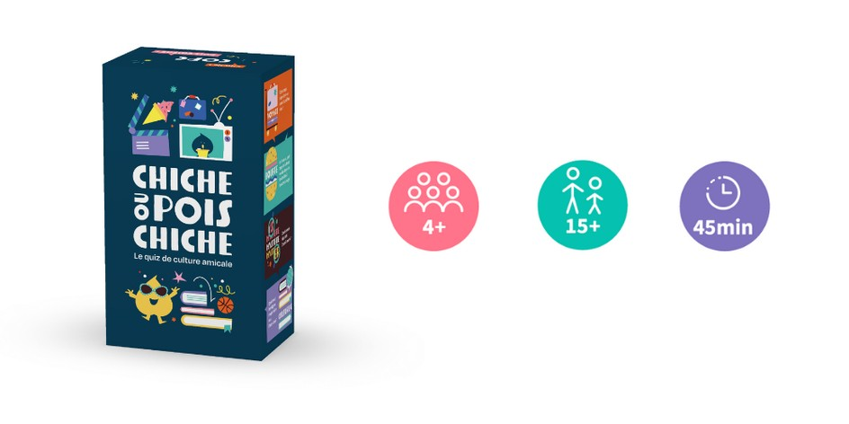

### Sommaire

- [Contexte et objectifs du projet](#contexte)
- [Comparaison avec le jeu papier](#papier)
- ["Tech stack" ou stack technique](#stacktechnique)
- [Organisation](#organisation)
- [Résultats et livrables](#resultat)
- [Apprentissage et retour d'expérience](#apprentissage)
- [Capitalisation et suite à donner](#capitalisation)

<h2 id=contexte> Contexte et objectifs du projet</h2>

<h2 id=papier> Comparaison avec le jeu papier</h2>

<h2 id=stacktechnique> "Tech stack" ou stack technique</h2>

<h2 id=organisation> Organisation</h2>

<h2 id=resultat> Résultats et livrables</h2>

<h2 id=apprentissage> Apprentissage et retour d'expérience</h2>

<h2 id=capitalisation> Capitalisation et suite à donner</h2>

## Introduction

Ce projet a pour but de créer une version mobile du jeu de cartes “Chiche ou Pois Chiche”. Après plusieurs parties, on retombe rapidement sur les mêmes questions et le jeu devient vite obsolète pour un joueur une fois qu’il a rencontré toutes les questions et connaît toutes les réponses. Notre idée serait donc de créer une version mobile du jeu pour pouvoir alimenter la base de données et ainsi offrir aux fervents joueurs de “Chiche ou pois Chiche”, de pouvoir y jouer indéfiniment. De plus, une application mobile serait un moyen d'accroître la visibilité du jeu.

Le but du jeu est de gagner le plus de points en posant les bonnes questions à son ou ses partenaire de jeu. On forme plusieurs équipes de 2 minimum. Pour chaque question le joueur lit l'indice à son partenaire puis lui demande "Chiche ou Pois Chiche ?". Il répond "Chiche" s'il pense pouvoir répondre à la question sans proposition de réponse ou "Pois Chiche" s'il souhaite les 4 propositions. Si la réponse donnée est correcte l'équipe récupère une "Carte Chiche" (3 points) ou une "Carte Pois Chiche" (1 point) selon l'annonce faite précédemment.
Le jeu possède 8 catégories de questions pour permettre à tout le monde d’avoir des points forts et des faiblesses. ("Sport", "Culture G", "Petits écrans", "Grand écran", "Voyage", “Musique", "Bouffe")

## Fonctionnalités

Voici une première liste de fonctionnalités que nous voulons implémenter sur l'application:

- La gestion d'un compte utilisateur
- Lancer un dé pour déterminer le type de tour
- Pouvoir rejoindre un salon avec les autres participants (mode en ligne? bluetooth?)
- Tirer aléatoirement une question
- Comptage de points
- Afficher la réponse à une question sur demande de l'utilisateur

## Planification du projet

Nous avons réalisé une feuille de route pour notre projet, qui consiste en quelques étapes que nous devrons réaliser au fur et à mesure de notre avancement:

- Faire des maquettes de l'apparence graphique générale du jeu (sur Canva ou autres)
  - Quelle charte graphique pour l'application?
  - Quelle expérience utilisateur?
- Réfléchir sur les fonctionnalités de l’application
  - Quelles règles établir? Ajout de règles?
- Elaboration d’un premier prototype sur Figma
  - Apprentissage et prise en main de l'outil
- Première version en no code sur Bubble.io
  - Création d'une première base de donnée de questions sur Bubble (ou autre) avec les questions du jeu
  - Création de l'interface utilisateur
- Recueil d’un grand nombre de questions et de réponses
- Test et retours d’expérience auprès de plusieurs utilisateurs
- Améliorations sur le jeu suite aux remarques soulevées
- Possible migration (NiceGui sur Python)?
