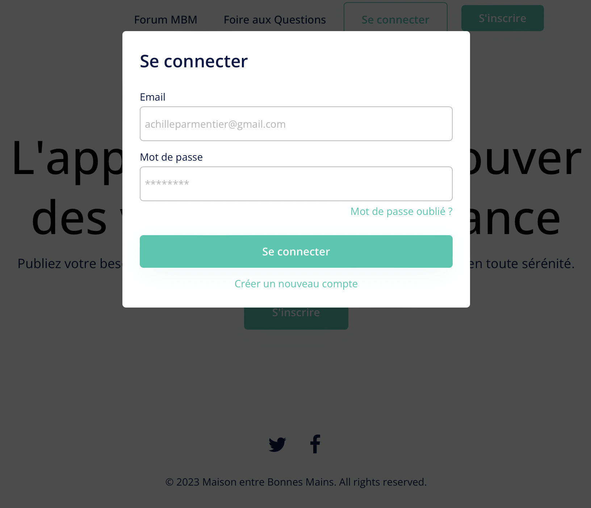
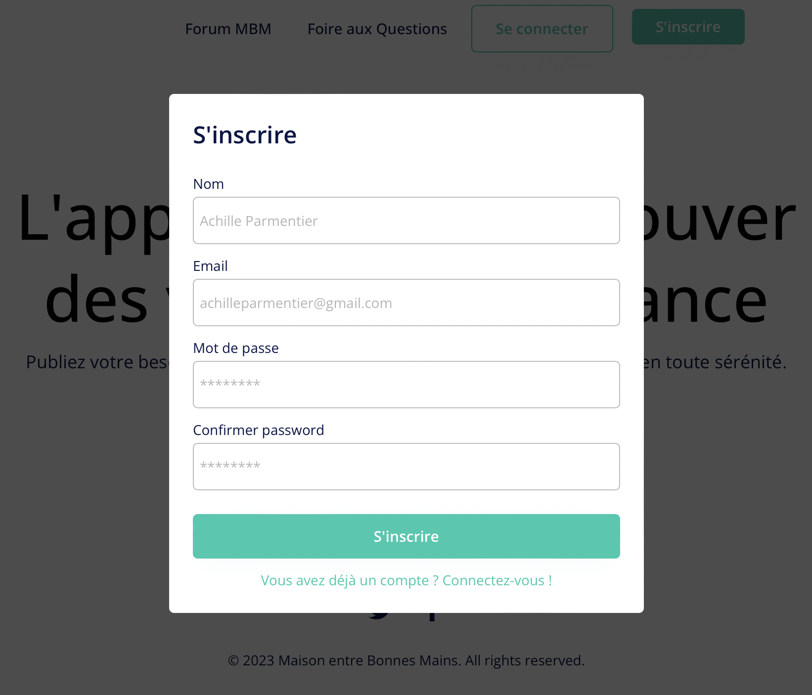
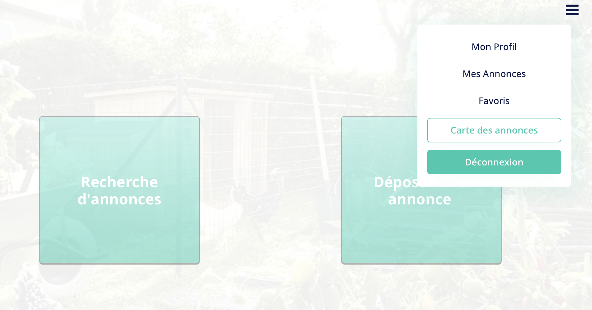
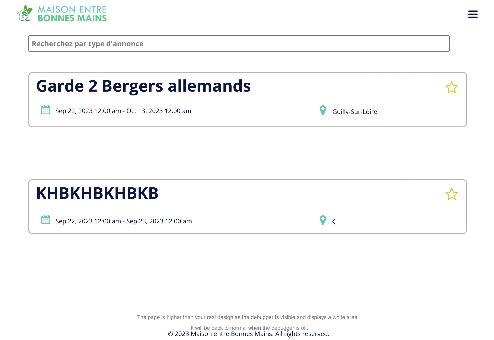

## Introduction et contexte

L'année dernière, alors qu'il s'apprêtait à partir en vacances, William  n'a trouvé personne qui pourrait s'occuper de son jardin en son absence (pas chez ses voisins, pas même chez ses amis).
**Résultat :** tout son potager est mort en son absence. 

Nous souhaitons créer une plateforme de mise en relation de particuliers pour la garde d'animaux et la gestion de jardins pendant une absence.

## Présentation

Une plateforme type Leboncoin permettant à un particulier de déposer son annonce (besoin récurrent, type tous les jeudis ; ou alors seulement pendant une semaine d'absence) avec une description, la compensation (pas forcément financière) et des infos pratiques. Les autres utilisateurs peuvent rechercher les annonces proches de chez eux, et après acceptation d'une annonce, discuter avec le propriétaire.

## Et ça existe déjà ?
Alors oui, mais non. Les applications existantes (Allovoisins, Yoojo, etc...) ne proposent que de la mise en relation entre particuliers et artisans ou dépanneurs, etc... Nous souhaitons proposer une application qui tisse réellement du lien, avec une forte inclusion sociale et non basée sur une rémunération systématique. Cette application n'est donc pas qu'une marketplace, mais bien plus que ça.

## Principaux jalons / rendu final
**Principaux jalons**
- Expérience utilisateur (UX/UI)
- 1ère maquette en low-code
- Passage au devweb (front-end) pour créer "le design / les fonctionnalités" du site
- Ajout de back-end pour stocker les fichiers, gérer les données utilisateurs...
- Quid d'une petite application en parallèle ? Trop ambitieux ?

**Rendu final**
- Site internet
- Partie front-end, fonctionnelle pour déposer une annonce, visualiser des annonces, échanger entre utilisateurs
- Partie back-end pour gérer les fichiers et données utilisateurs
- Quid d'une petite application en parallèle ? Trop ambitieux ?

## Fonctionnalités 

#### Connexion et inscription

Lorsque le nouvel utilisateur arrive sur notre site Internet, il doit comprendre rapidement son fonctionnement. L'étude Experience 2030 (menée par Futurum Research et SAS) montre qu'un internaute décide en quelques secondes de quitter un site Internet si celui-ci n'est pas ergonomique. Nous avons décidé de bâtir une interface utilisateur claire avec un nombre limité de boutons. Les boutons classiques *Se connecter* et *S'inscrire* sont les seuls mis en valeurs sur la page d'accueil. 

Ces deux boutons renvoient vers une page d'identification fonctionnelle, qui gère les questions d'authentification et qui met à jour la base de données des identifiants/mots de passe. A titre d'exemple pour la maquette en low code, nous requérons qu'une adresse mail et un mot de passe. Il est possible que ces exigences évoluent dans le futur.

#### Menu déroulant
Nous avons implémenté un menu déroulant sur la droite de l'écran qui permet à l'utilisateur, sur n'importe quelle page, d'avoir accès aux pages suivantes jugées **importantes** dans notre parcours utilisateur :
- Mon Profil
- Mes Annonces
- Favoris
- Carte des annonces
- Déconnexion

#### Mon Profil
La page Mon Profil permet à l'utilisateur de personnaliser son compte en ajoutant ou modifiant des informations à son propos. Certaines informations telles que le Prénom, le Nom et l'âge ne seront pas modifiables. C'est aussi sur cette page que l'utilisateur souhaitant déposer une annonce sera redirigé (voir ci-après) pour renseigner son adresse exacte.

#### Mes Annonces
L'utilisateur retrouve facilement les annonces qu'il a déposé, avec la visibilité de celles-ci ainsi que les personnes intéressées. L'utilisateur pourra aussi modifier son annonce, ce qui alertera les bonnes mains intéressées par cette dernière et qui l'avait en favoris.

#### Favoris
Le système de favoris lors de la recherche d'annonces (voir ci-après) permet de stocker en un seul endroit toutes les annonces qui correspondent aux critères de recherche de l'utilisateur. Celui-ci peut ainsi quitter l'application pour vérifier ses disponibilités ou réfléchir, avant de se reconnecter et de retrouver rapidement ses annonces d'intérêt.

#### Carte des annonces
La carte des annonces qui permet à l'utilisateur d'afficher une carte de ses environs avec les annonces à disposition. Celle-ci sera sûrement déployée grâce une API de Google Maps. Les annonces seront affiliées à une zone géographique et non à une adresse précise afin de préserver la sécurité des annonceurs.

#### Déconnexion
Quand un utilisateur se déconnecte, il est alors redirigé vers la page d'accueil, qui lui permet de se reconnecter si besoin.

#### Dépôt d'une annonce
L'annonceur remplit un formulaire simple mais précis, avec plusieurs fonctionnalités destinées à lui faciliter la vie :
- la sélection d'une date se fait avec un calendrier interactif
- le dépôt d'un fichier photo permettant de rajouter des informations qu'il ne pourrait pas décrire facilement, telle que l'étendue du potager...
Cette page est destinée à être simple, afin que le dépôt d'une annonce ne soit pas synonyme pour l'utilisateur. 
Une fois le bouton *Déposer mon annonce* cliqué, une page de confirmation s'affichera pour éviter de publier des annonces avec des erreurs.

#### Recherche des annonces
La page de recherche affiche peu d'informations pour chaque annonce. Nous pensons que la sélection d'une annonce se fait d'abord sur les critères de dates et de lieu, c'est pourquoi ils sont visibles directement. Cela permet une recherche fluide et épurée. Dès qu'un utilisateur est intéressé par une annonce, il peut la consulter pour avoir plus de détails et la mettre dans ses favoris. Il peut ensuite confirmer qu'il est disponible pour débuter la conversation avec l'annonceur.

#### Fonctionnalités à développer

- Le système de chat entre particuliers une fois que l'annonce a été acceptée.
- La carte des annonces qui permet à l'utilisateur d'afficher une carte de ses environs avec les annonces à disposition. 
- Le système de notation des autres utilisateurs et des services rendus. Afin de garantir une transparence et de garder des bonnes mains bienveillantes, ce système permet d'alerter les autres utilisateurs et de les mettre en garde avec une mauvaise note si une bonne main ou un annonceur n'ont pas respecté leurs engagements.
- La page de confirmation lors du dépôt d'une annonce
- La barre de recherche fonctionnelle
- Le système de favoris qui communique avec la base de données

## Sécurité de l'utilisateur
Une problématique centrale réside dans la confidentialité des données, et de la sécurité des annonceurs (biens dégradés, cambriolages, etc...). De la même manière qu'Airbnb, seule la personne ayant accepté une annonce peut consulter l'adresse exacte de l'annonceur, sinon elle est localisée par une zone relativement large. 
Le système de notation permet aussi de sélectionner des personnes de confiance. Les notes anormalement basses feront l'objet d'une enquête de notre part pour éviter tout abus d'une part ou de l'autre.

## Business Plan
En cours de réflexion...