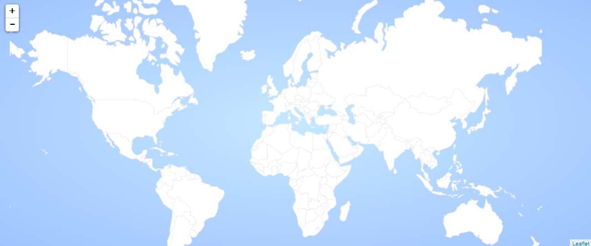

## Introduction - définition du projet

Le but du projet est de réaliser une carte interactive afin de regrouper les différentes mobilités des élèves de l'école Centrale Méditerranée.

## Design du site web

### Déposer sa mobilité

L'étudiant remplit un formulaire :

- Des questions fermées : le but est d'obtenir des réponses dans un format précis : date, pays... le format doit permettre l'utilisation de requête SQL.
- Des questions ouvertes pour le descriptif qui seront des textes sans importance pour la base de donnée, ou des images mais utiles pour les utilisateurs.

#### Plusieurs méthodes possibles

###### Un formulaire sur une page annexe

L'objectif est de créer une page dédié au dépôt de mobilité sur le site : l'étudiant rempli un formulaire sur le site  
et le soumet à l'administration, si le dossier est valide, il est alors visible sur le site.

Cette méthode requiert :

- une page de dépôt hébergé sur le site
- Une page administrateur pour valider les mobilités qui seront déposé.

###### Un formulaire Moodle  

Cette méthode requiert :

- Un formulaire Moodle précis donnant des réponses sous un format exploitable.
- une validation de l'administration
- une implémentation manuelle de l'administration dans la base de donnée.

### Site publique/réservé à Centrale

Il semble être nécessaire d'implémenter un système de connection au site afin de protéger les données des utilisateurs.

#### Différents utilisateurs

**Un identifiant d'accès consultation unique pour tout le monde**  
L'idée est que tout le monde accède au site via un mot de passe unique pouvant changer tous les ans, défini par l'administration.
*méthode la plus simple, mais nécessite une modération*

**Un identifiant individuel**  
L'idée est de venir utiliser les identifiants Moodle (le système d'authentification CAS) pour se connecter au site, le site ferait une requête vers le serveur pour demander si la personne a accès ou non aux données : *cette méthode requiert des compétences élevés en sécurité*
*cette méthode limite les dépôts de dossier par étudiant*

**Un compte administrateur**  
L'idée est que ce compte puisse gérer les différentes mobilités.

- Un mot de passe sécurisé
- Un accès limité à l'administration
- La capacité à valider/refuser/supprimer une mobilité de la base de donnée
*Cela permet d'avoir une modération du site, mais demande un travail supplémentaire à l'administration*

### Création de la map monde

utilisation d'un ficher geojson afin d'avoir les vecteurs définissant les frontières des pays.  
récupérer le ficher [Geojson](https://geojson-maps.ash.ms/), penser à sélectionner les différentes régions du monde souhaité.  
L'idée est de générer une map cliquable afin de sélectionner la région qui nous intéresse pour accéder au mobilité des années précédentes.

### Système de filtre

Il est nécessaire de pouvoir filtrer les mobilités pour qu'elle nous corresponde.

*Un apprenti ne pourra pas effectuer de SMA donc ne voudra pas voir ce genre de mobilité*  
*Quelqu'un avec un trop faible GPA ne voudra pas s'intéresser au SMA nécessitant d'avoir 4/4*

Pour rendre possible le fonctionnement en filtre il est nécessaire que la base de donnée soit dans un format précis avec des réponses fermer.
*on ne veut pas que Japon/japon/JAPON soit trois pays différents*

**Les différentes catégories à implémenter**

- Nom
- Prénom
- Contact élève (mail)
- Bio rapide de l'élève
- Année de mobilité
  - 2023
  - 2024
- Durée
  - 2 mois (réservé aux apprenti)
  - 6 mois
- Type de mobilité :  
  - SMA
  - Apprenti - Bénévole
  - Apprenti - envoyer via son entreprise
  - SSE
  - Césure - Bénévole
  - Césure - entreprise
- Description rapide
- Contact mission
- Budget :
  - 0-500 €
  - 500-1000 €
  - 1000-2000€
  - 2000-3000€
  - 3000-4000€
  - 4000+ €
- Bouton pour déposer le rapport de mobilité (vidéo/pdf)
- Bouton pour envoyer la mobilité pour validation

| Column 1 | Column 2 |
| -------- | -------- |
| Nom    | *Sacha*   |
| Prénom    |  *Ketchum*   |
| e-mail élève    | *Sacha.Ketchum@pokémon*    |
| Bio de l'élève    | *Un jour je serai le meilleur dresseur*    |
| Année de mobilité    | *2023*    |
| Durée    | *6 mois*    |
| Type de mobilité    | *SMA/SSE/Césure*    |
| Pays    | *Espagne*    |
| Ville    | *Barcelone*    |
| Description rapide de la mobilité    | *Un SMA pour apprendre l'électronique de pikachu*    |
| Contact mission    | *Pierre*    |
| Budget   | *500-1000€*   |

## Ressources utilisées

### Questionnaire pour recueillir l'avis des Centraliens sur l'intérêts de l'application
Les intérêts

- Quels sont les informations que vous aimeriez connaître sur les mobilités précédentes ?
- Est-ce que vous souhaitez être contacté ?
- Acceptez vous que vos informations soient visible ?
- Possibilité d'anonymiser la mobilité ? Ne pas l'afficher du tout ?

### Questionnaire pour recueillir l'avis de l'administration Centralienne

Les intérêts

- Le but est de s'assurer de l'intérêt pour l'administration.
- Concevoir quelque chose de facile d'utilisation.
- Avec des questions pour les étudiants qui correspondent aux attentes de l'administration.
- Un moyen facile de collecter les données : un bouton sur le site ? un e-mail automatique ?
- Établir les attendus d'un point de vue sécurités de la donnée :  
serveur de Centrale ? système de login ?
- Est-ce que l'admin peut poster des offres ? De SMA ? Des écoles partenaires ? Les offres de SSE ?
- Pré-remplir les écoles partenaires ? (cela peut poser des problèmes si une école n'est  
pas déjà dans la liste)
- Est-ce que l'admin veut donner des informations sur certaines écoles ? GPA minimum/  
Nombre de Centralien pris par an/Nombre de Centralien pris l'année précédentes ?

### La réalisation d'une maquette CANVA

Les intérêts

- Réfléchir aux différentes fonctionnalités pour rendre l'application viable
- Établir les différents boutons à implémenter
- Établir l'esthétisme du site
- Modéliser les différentes interfaces : utilisateur/élève  
déposant sa mobilité/administrateur de l'école

Avant de venir développer le site Web nous avons décider de le dessiner sur Canva afin de prendre le temps tous ensemble de décider du design, mais surtout de s'assurer de la faciliter d'accès et d'être sûr de créer un parcours utilisateur efficace.

### La réalisation d'un MVP (minimum viable project)

Les intérêts

- tester la faisabilité d'un projet rapidement.
- Avoir une première application à éprouver pour trouver les limites du projet  
et cadrer proprement les outils à développer.

Les phases pour faire le MVP (minimum viable product)

1. Étude des fonctionnalités et des solutions à disposition, aller demander à l'administration  
les fonctionnalités qui les intéresse.
2. Développement en équipe d'une maquette en utilisant un outil de no-code (Bubble/Rettol/Sendinblue )
3. Tests des parcours utilisateurs (résolution et dev bug).
4. Préparation du pitch et de la démonstration.

Bien que le MVP propose un certain nombre d'avantage afin d'obtenir une maquette qu'il est possible d'éprouver. Nous avons décider de ne pas mettre en œuvre cette solution puisqu'elle nous prendrait trop de temps. On choisit donc de passer plus de temps à réfléchir à la structure du site et après d'attaquer directement le développement propre du site web.

### La réalisation du site web final

Les intérêts

- Avoir un site web propre et se débarrasser des contraintes liées au no-code.
- Avoir les données en interne sur les serveurs de l'école pour ne pas transférer les datas.

## Contact des parties impliquées dans le projet

### Gestionnaire des SMA et double diplôme : Olivier Boiron

Le 5 octobre 2023, nous sommes allés rencontrer Monsieur Olivier Boiron pour lui présenter notre projet et le questionner sur le fonctionnement actuel.

### Gestionnaire des SSE

Nous n'avons pas encore réaliser d'entrevu avec le responsable.

### Gestionnaire des mobilité recherche

Nous n'avons pas encore réaliser d'entrevu avec le responsable.

### Contact des étudiants

Afin d'obtenir une vision plus large sur notre projet nous avons voulu contacter les 1A et 2A pour savoir si le projet les intéressait, s'il serait prêt à y accorder un peu de temps.

**Contact des élèves cherchant une mobilité**

Les 1A sont les acteurs principaux ciblés par notre site internet, en effet, les données collectés, les informations misent en avant sont destiné majoritairement aux 1A.

**Contact des élèves retournant de mobilité**

Les 3A sont tout aussi important, ils vont devoir en fonction de la solution qu'on met en œuvre partager leur expérience sur leur mobilité et alimenter le site internet.

## Premières répartitions des tâches 
| Taches | Affectée à | Statut |
| ------- | ---------- | ------ |
| Recueillir le besoin des étudiants | Tous le monde | A faire |
| Construire une US | | A faire |
| Benchmarker les étudiants des autres écoles sur leur recherche de mobilité | A faire |
| Préparer un Git-Hub   | Lucie | A faire |
| Choisir nos extensions    | Lucie | A faire |
| Hébergement du site      | | A faire |
| Etudier la connexion CAS     | | A faire |
| Faire les maquettes de toutes les pages    | Paul & Kawtar| A faire |
| Tables de données   | Mathis & Agathe | A faire |
| Préparer l'entretien avec les RI   | Tout le monde | A faire |
| Faire un Google Form pour les centraliens    | Mathis & Agathe | A faire |
| Choisir entre API Google ou GeoPanda | | A faire |
