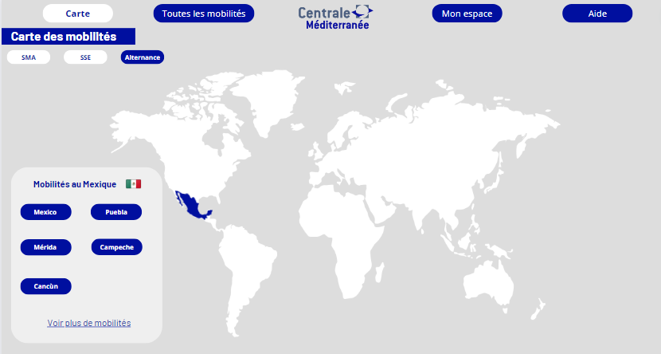

## Introduction - définition du projet

L'objectif est de pouvoir centraliser les informations sur les mobilités afin que les étudiants puissent les filtrer à leur guise et obtenir les contacts nécessaires.

## Design du site web

### Déposer sa mobilité

**L'étudiant remplit un formulaire**

```
Des questions fermées : le but est d'obtenir des réponses dans un format précis : date, pays... le format doit permettre l'utilisation de requête SQL.
Des questions ouvertes pour le descriptif qui seront des textes sans importance pour la base de donnée, ou des images mais utiles pour les utilisateurs.

Intérêts :
- Une donnée collecté de manière unique.
- Facile à reconduire dans le temps.
- Un format de donnée tout de suite adapté.

Difficultés :
- Nécessite un engagement supplémentaire des élèves avec un nouveau formulaire à remplir.
- Difficulté à inciter les gens à répondre.
```

**Collecte de données via l'administration**

```
Venir récupérer les données de l'administration, venant de leur différentes plateformes : My Mobility Online, CFA,...  
Les implémenter dans la base de données du site

Intérêts : 
- faire gagner du temps aux étudiants en évitant de donnée plusieurs fois les mêmes informations.

Difficultés :  
- Réussir à collecter les datas des différentes plateforme pour les adapter au site
- Problème en cas de mise à jour des données d'un site externe, nécessite une mise à jour de l'API qui transforme la data pour la rentrer dans la base de donnée.
- Nécessite un lien permanent avec l'admin pour mettre à jour ces données.
- Comment savoir si l'élève accepte que ses datas soient partager ? remplir quand même le formulaire ? L'admin souhaite les retours d'expérience.
```

#### Plusieurs méthodes possibles

###### Un formulaire sur une page annexe

L'objectif est de créer une page dédié au dépôt de mobilité sur le site : l'étudiant rempli un formulaire sur le site  
et le soumet à l'administration, si le dossier est valide, il est alors visible sur le site.

Cette méthode requiert :

- une page de dépôt hébergé sur le site
- Une page administrateur pour valider les mobilités qui seront déposé.

###### Un formulaire Moodle

Cette méthode requiert :

- Un formulaire Moodle précis donnant des réponses sous un format exploitable.
- une validation de l'administration
- une implémentation manuelle de l'administration dans la base de donnée.

### Site publique/réservé à Centrale

Il semble être nécessaire d'implémenter un système de connection au site afin de protéger les données des utilisateurs.

#### Différents utilisateurs

**Un identifiant d'accès consultation unique pour tout le monde**  
L'idée est que tout le monde accède au site via un mot de passe unique pouvant changer tous les ans, défini par l'administration.
*méthode la plus simple, mais nécessite une modération*

**Un identifiant individuel**  
L'idée est de venir utiliser les identifiants Moodle (le système d'authentification CAS) pour se connecter au site, le site ferait une requête vers le serveur pour demander si la personne a accès ou non aux données : *cette méthode requiert des compétences élevés en sécurité*
*cette méthode limite les dépôts de dossier par étudiant*

**Un compte pour l'administration**  
L'idée est que ce compte puisse gérer les différentes mobilités.

- Un mot de passe sécurisé
- Un accès limité à l'administration
- La capacité à valider/refuser/supprimer une mobilité de la base de donnée
*Cela permet d'avoir une modération du site, mais demande un travail supplémentaire à l'administration*

### Création de la map monde

utilisation d'un ficher geojson afin d'avoir les vecteurs définissant les frontières des pays.  
récupérer le ficher [Geojson](https://geojson-maps.ash.ms/), penser à sélectionner les différentes régions du monde souhaité.  
L'idée est de générer une map cliquable afin de sélectionner la région qui nous intéresse pour accéder au mobilité des années précédentes.


### Système de filtre

Il est nécessaire de pouvoir filtrer les mobilités pour qu'elle nous corresponde.

*Un apprenti ne pourra pas effectuer de SMA donc ne voudra pas voir ce genre de mobilité*  
*Quelqu'un avec un trop faible GPA ne voudra pas s'intéresser au SMA nécessitant d'avoir 4/4*

Pour rendre possible le fonctionnement en filtre il est nécessaire que la base de donnée soit dans un format précis avec des réponses fermer.
*on ne veut pas que Japon/japon/JAPON soit trois pays différents*

**Les différentes catégories à implémenter**

| Column 1 | Column 2 |
| -------- | -------- |
| Nom    | *Sacha*   |
| Prénom    |  *Ketchum*   |
| e-mail élève    | *Sacha.Ketchum@pokémon*    |
| Bio de l'élève    | *Un jour je serai le meilleur dresseur*    |
| Année de mobilité    | *2023*    |
| Durée    | *6 mois*    |
| Type de mobilité    | *SMA/SSE/Césure*    |
| Pays    | *Espagne*    |
| Ville    | *Barcelone*    |
| Description rapide de la mobilité    | *Un SMA pour apprendre l'électronique de pikachu*    |
| Contact mission    | *Pierre*    |
| Budget   | *500-1000€*   |

## Moyen technique mis en oeuvre

### La réalisation d'une maquette CANVA

Les intérêts

- Réfléchir aux différentes fonctionnalités pour rendre l'application viable
- Établir les différents boutons à implémenter
- Établir l'esthétisme du site
- Modéliser les différentes interfaces : utilisateur/élève  
déposant sa mobilité/administrateur de l'école

Avant de venir développer le site Web nous avons décider de le dessiner sur Canva afin de prendre le temps tous ensemble de décider du design, mais surtout de s'assurer de la faciliter d'accès et d'être sûr de créer un parcours utilisateur efficace.

Voici une première maquette Canva pour représenter les mobilités des élèves.




### La réalisation d'un MVP (minimum viable project)

Les intérêts

- tester la faisabilité d'un projet rapidement.
- Avoir une première application à éprouver pour trouver les limites du projet  
et cadrer proprement les outils à développer.

Les phases pour faire le MVP (minimum viable product)

1. Étude des fonctionnalités et des solutions à disposition, aller demander à l'administration  
les fonctionnalités qui les intéresse.
2. Développement en équipe d'une maquette en utilisant un outil de no-code (Bubble/Rettol/Sendinblue ) ou de design (Figma)
3. Tests des parcours utilisateurs (résolution et dev bug).
4. Préparation du pitch et de la démonstration.

Bien que le MVP propose un certain nombre d'avantage afin d'obtenir une maquette qu'il est possible d'éprouver. Nous avons décider de ne pas mettre en œuvre cette solution puisqu'elle nous prendrait trop de temps. On choisit donc de passer plus de temps à réfléchir à la structure du site et après d'attaquer directement le développement propre du site web.

Notre MVP sera réalisé sous Figma, c'est un logiciel de design qui permet de tester les fonctionnalités et de mettre en page le site web pour visualiser les parcours utilisateurs, définir les aspects graphiques ainsi que de s'assurer que l'utilisation est intuitive.

Actuellement la maquette Figma présente le parcours utilisateur d'un étudiant pour voir les mobilités et aussi pour déposer la sienne.


Maquette Figma.

<video width="1280" height="720" controls>
  <source src="presentation_figma.mp4" type="video/mp4">
</video>

Vidéo de présentation de la maquette Figma.

### La réalisation du site web final

Les intérêts

- Avoir un site web propre et se débarrasser des contraintes liées au no-code.
- Avoir les données en interne sur les serveurs de l'école pour ne pas transférer les datas.

### L'authentification CAS

L'intérêt de l'authentification CAS est de définir les accès au site pour s'assurer que seul des personnes de l'écoles et sous certaines conditions auraient accès aux données partagés.

### L'hébergement du site

L'objectif est d'héberger le site web sur les serveurs de l'écoles pour rester souverain de la data.

## Contact des parties impliquées dans le projet

### Contact auprès de l'administration

- Quelles sont les données que vous pouvez extraire de MyMobilityOnline ou autre site ?
- Quelles sont les tâches les plus pénibles que vous êtes amenés à effectuer en tant que RI ? Quel travail effectuez vous avec ces datas ?
- Comment imaginez-vous l’utilisation du site par les personnes des RI ? 
- Quelles sont les données dont vous avez besoin ?
- Comment travaillez-vous ?
- Quelles fonctionnalités vous intéressent ?
- Quelles sont les missions des RI lorsqu’un élève veut partir ? ou revient ?
- Quels sont les outils dont vous disposez ? Excel ou autre base de données ?
- Quel serait l'intérêt pour l'administration.
- Concevoir quelque chose de facile d'utilisation.
- Un moyen facile de collecter les données : un bouton sur le site ? un e-mail automatique ?
- Établir les attendus d'un point de vue sécurités de la donnée :  
serveur de Centrale ? système de login ?
- Est-ce que l'admin peut poster des offres ? De SMA ? Des écoles partenaires ? Les offres de SSE ?
- Pré-remplir les écoles partenaires ? (cela peut poser des problèmes si une école n'est  
pas déjà dans la liste)
- Est-ce que l'admin veut donner des informations sur certaines écoles ? GPA minimum ?
- Nombre de Centralien pris par an/Nombre de Centralien pris l'année précédentes ?

**Gestionnaire des SMA et double diplôme : Olivier Boiron**

Le 5 octobre 2023, nous sommes allés rencontrer Monsieur Olivier Boiron pour lui présenter notre projet et le questionner sur le fonctionnement actuel. Voici les idées qui en ressortent.

- Sur mobility online on retrouve l'actualité des conventions, partage d’information entre les RI et les élèves, validation des mobilités : il y a la possibilités de faire des requêtes PHP pour obtenir des informations de la Base de donnée, il y a 3 étudiants embauchés pour travailler les requêtes, toutes les datas ne sont pas extractable, par exemple les cours sont dans la convention qui est au format pdf donc pas accessible facilement.
- Moodle sert avant tout d’outils d’informations pour les élèves mais n’est pas forcément à jour. Le plus fiable est le système de mail.
- Les RI aimeraient pouvoir avoir un retour des étudiants pour évaluer ce qui a marché ou non lors de leur mobilité : savoir ce qui c'est bien passé ou non, si des cours sont intéressant, si la vie dans ce pays est agréable ou chère.
- Le point critique : les étudiants ne contactent pas les référents pays ou scientifique, ainsi lors des commissions les dossiers ne sont pas logique ce qui ne les favorisent pas : par exemple quelqu'un qui ne maîtrise pas une langue alors que les cours ne sont pas en anglais.
- Ce qu’il nous faut : la liste des référents mise à jour, le contact des étudiants travaillant avec mobility online
- Les RI ne gèrent que les SMA et Double Diplôme
- Pour Boiron il faut : identifier les responsables des zones (référent géographique et référent scientifique) et faciliter la prise de contact pour s’assurer de la pertinence de son dossier de mobilité (c’est le référent qui valide les choix des cours)
- Obligatoire : avoir une FAQ et demander des retours d’expériences

**Gestionnaire des SSE & TFE : Muriel Roche**

Nous n'avons pas encore réalisé d'entrevu avec le responsable.

**Gestionnaire des Alernants entreprise : Guillaume Graton**

Nous n'avons pas encore réalisé d'entrevu avec le responsable.

**Gestionnaire des mobilité recherche : Daniel Mazzoni**

Nous n'avons pas encore réalisé d'entrevu avec le responsable.

### Contact des étudiants

Afin d'obtenir une vision plus large sur notre projet nous avons voulu contacter les 1A et 2A pour savoir si le projet les intéressait, s'il serait prêt à y accorder un peu de temps.

Nous avons donc établit une trame de question afin d'entamer la discussion avec les élèves :

- Quelles informations te semblent indispensables pour choisir ta mobilité ?
- Si on te dit qu'un site regroupant toutes les mobilités a été créé : qu'est-ce que tu imagines ?
- As-tu envie de décider de l'anonymat ou non de ton retour d'expérience ?
- Combien de temps serais-tu prêt à consacrer pour remplir un formulaire de retour de mobilité ? Le ferais-tu si ça n'était pas obligatoire ? Qu'est-ce qui pourrait te motiver à le faire ?
- Une FAQ regroupant les questions récurrentes des étudiants serait-il intéressant ? Irais-tu sur le site pour avoir réponse à ta question ou enverrais-tu quand même un mail "pour être sûr"?
- Quelles données as-tu besoin d'avoir pour gérer les possibles bugs ? A quel degré de liberté ? (Lecture seule, modification sous certaines conditions , modifications totales , suppression …)
- Aimerais-tu avoir les contacts des anciens élèves ayant effectué une mobilité qui t'intéresse ?
- Aimerais-tu avoir accès aux sites des écoles pour les SMA ? 
- As-tu des suggestions de fonctionnalités ? 
- A quel point le fait de devoir prendre l’avion pour y aller a- t-il fermé des destinations ?

**Contact des élèves cherchant une mobilité**

Les 1A sont les acteurs principaux ciblés par notre site internet, en effet, les données collectés, les informations misent en avant sont destiné majoritairement aux 1A.

**Contact des élèves retournant de mobilité**

Les 3A sont tout aussi important, ils vont devoir en fonction de la solution qu'on met en œuvre partager leur expérience sur leur mobilité et alimenter le site internet.

## Premières répartitions des tâches 
| Taches | Affectée à | Statut |
| ------- | ---------- | ------ |
| Recueillir le besoin des étudiants | Tous le monde | A faire |
| Construire une US | | A faire |
| Benchmarker les étudiants des autres écoles sur leur recherche de mobilité | A faire |
| Préparer un Git-Hub   | Lucie | A faire |
| Choisir nos extensions    | Lucie | A faire |
| Hébergement du site      | | A faire |
| Etudier la connexion CAS     | | A faire |
| Faire les maquettes de toutes les pages    | Paul & Kawtar| A faire |
| Tables de données   | Mathis & Agathe | A faire |
| Préparer l'entretien avec les RI   | Tout le monde | A faire |
| Faire un Google Form pour les centraliens    | Mathis & Agathe | A faire |
| Choisir entre API Google ou GeoPanda | | A faire |
