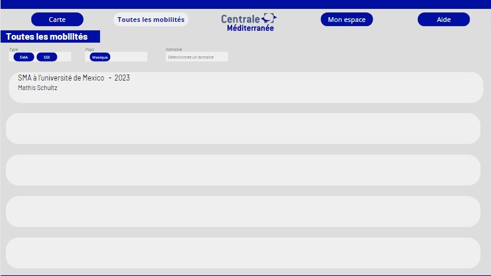
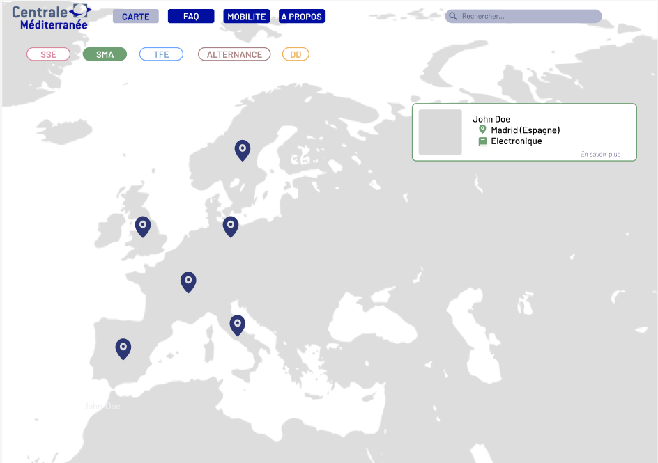

## Introduction - définition du projet

Pour notre projet Do_It, nous avons voulu créer une plateforme permettant d'héberger l'ensemble des mobilités des Centraliens, afin d'aiguiller les prochains élèves à trouver leur destination.

### L'équipe du projet

Notre équipe pour mener à bien ce projet est la suivante :

- Lucie Le Boursicaud
- Agathe Rabachou
- Kawtar Bahri
- Paul Le Bihan
- Mathis Schultz

### Les missions

Voici les différentes étapes mises en œuvre afin de mener à bien notre projet :

- Étude du besoin
- Cahier des charges
- Développement
- Retour d'expérience
- Explication du code
- Présentation

## Étude du besoin

La première étape afin de réaliser notre site web a été de faire une étude afin de définir nos objectifs, rencontrer les parties prenantes pour comprendre les besoins et les opportunités.

### Rencontre avec les Élèves

Afin d'obtenir une vision plus large sur notre projet nous avons voulu contacter les 1As, 2As et 3As pour savoir si le projet les intéressait, s'ils seraient prêt à y accorder un peu de temps.

**Contact des élèves cherchant une mobilité**
Les 1A sont les acteurs principaux ciblés par notre site internet, en effet, les données collectées, les informations misent en avant sont destinées majoritairement aux 1A. Nous avons donc voulu savoir quelles étaient les questions qu'ils se posent. Nous sommes donc allés directement à leur rencontre dans les couloirs de l'école pour les questionner sur notre idée de projet. Nous avons pu grâce à leur regard extérieur lister les informations et fonctionalités primordiales à intégrer.

**Contact des élèves retournant de mobilité**
Les 2A et 3A sont tout aussi important, ils vont devoir en fonction de la solution qu'on met en œuvre partager leur expérience sur leur mobilité et alimenter le site internet. L'enjeux pour nous et de savoir dans quel mesure on peut les impliquer sans qu'ils ne doivent remplir trop d'informations pour ne pas qu'ils abandonnent la démarche de partage.

**Exemple de question pour mener des interviews**
Nous avons donc établit une trame de question afin d'entamer la discussion avec les élèves :

- Quelles informations te semblent indispensables pour choisir ta mobilité ?
- Si on te dit qu'un site regroupant toutes les mobilités a été créé : qu'est-ce que tu imagines ?
- As-tu envie de décider de l'anonymat ou non de ton retour d'expérience ?
- Combien de temps serais-tu prêt à consacrer pour remplir un formulaire de retour de mobilité ? Le ferais-tu si ça n'était pas obligatoire ? Qu'est-ce qui pourrait te motiver à le faire ?
- Une FAQ regroupant les questions récurrentes des étudiants serait-il intéressant ? Irais-tu sur le site pour avoir réponse à ta question ou enverrais-tu quand même un mail "pour être sûr"?
- Quelles données as-tu besoin d'avoir pour gérer les possibles bugs ? A quel degré de liberté ? (Lecture seule, modification sous certaines conditions , modifications totales , suppression …)
- Aimerais-tu avoir les contacts des anciens élèves ayant effectué une mobilité qui t'intéresse ?
- Aimerais-tu avoir accès aux sites des écoles pour les SMA ? 
- As-tu des suggestions de fonctionnalités ? 
- A quel point le fait de devoir prendre l’avion pour y aller a- t-il fermé des destinations ?

### Rencontre avec l'administration

L'administration est au cœur de notre projet avec un double rôle :

- Gérer les mobilités : étudier les demandes de mobilités, accorder ou non le droit aux élèves de les réaliser.
- Collecter l'information : l'administration, au travers de plusieurs service rassemble l'ensemble des informations de mobilités des élèves.

Ainsi, nous avons contacté les différentes parties afin de comprendre quel pourrait-être leur rôle dans notre projet, dans quel mesure il pourrait les intéresser et comment pourraient-ils nous aider.

Voici quelques questions que nous avons pu leur poser :

- Quelles sont les données que vous pouvez extraire de MyMobilityOnline ou autre site ?
- Quelles sont les tâches les plus pénibles que vous êtes amenés à effectuer en tant que RI ? Quel travail effectuez vous avec ces datas ?
- Comment imaginez-vous l’utilisation du site par les personnes des RI ? 
- Quelles sont les données dont vous avez besoin ?
- Comment travaillez-vous ?
- Quelles fonctionnalités vous intéressent ?
- Quelles sont les missions des RI lorsqu’un élève veut partir ? ou revient ?
- Quels sont les outils dont vous disposez ? Excel ou autre base de données ?
- Quel serait l'intérêt pour l'administration.
- Concevoir quelque chose de facile d'utilisation.
- Un moyen facile de collecter les données : un bouton sur le site ? un e-mail automatique ?
- Établir les attendus d'un point de vue sécurités de la donnée :  
serveur de Centrale ? système de login ?
- Est-ce que l'admin peut poster des offres ? De SMA ? Des écoles partenaires ? Les offres de SSE ?
- Pré-remplir les écoles partenaires ? (cela peut poser des problèmes si une école n'est  
pas déjà dans la liste)
- Est-ce que l'admin veut donner des informations sur certaines écoles ? GPA minimum ?
- Nombre de Centralien pris par an/Nombre de Centralien pris l'année précédentes ?

Voici le retour des différentes parties :

**Gestionnaire des SMA et double diplôme : Olivier Boiron**
Le 5 octobre 2023, nous sommes allés rencontrer Monsieur Olivier Boiron pour lui présenter notre projet et le questionner sur le fonctionnement actuel. Voici les idées qui en ressortent.

- Sur mobility online on retrouve l'actualité des conventions, partage d’information entre les RI et les élèves, validation des mobilités : il y a la possibilités de faire des requêtes PHP pour obtenir des informations de la Base de donnée, il y a 3 étudiants embauchés pour travailler les requêtes, toutes les datas ne sont pas extractable, par exemple les cours sont dans la convention qui est au format pdf donc pas accessible facilement.
- Moodle sert avant tout d’outils d’informations pour les élèves mais n’est pas forcément à jour. Le plus fiable est le système de mail.
- Les RI aimeraient pouvoir avoir un retour des étudiants pour évaluer ce qui a marché ou non lors de leur mobilité : savoir ce qui c'est bien passé ou non, si des cours sont intéressant, si la vie dans ce pays est agréable ou chère.
- Le point critique : les étudiants ne contactent pas les référents pays ou scientifique, ainsi lors des commissions les dossiers ne sont pas logique ce qui ne les favorisent pas : par exemple quelqu'un qui ne maîtrise pas une langue alors que les cours ne sont pas en anglais.
- Ce qu’il nous faut : la liste des référents mise à jour, le contact des étudiants travaillant avec mobility online
- Les RI ne gèrent que les SMA et Double Diplôme
- Pour Boiron il faut : identifier les responsables des zones (référent géographique et référent scientifique) et faciliter la prise de contact pour s’assurer de la pertinence de son dossier de mobilité (c’est le référent qui valide les choix des cours)
- Obligatoire : avoir une FAQ et demander des retours d’expériences

**Gestionnaire des SSE & TFE : Muriel Roche**  
Les SSE et TFE sont gérés comme des stages, donc via le site des stages, les informations liées à ces mobilités ne sont pas rassemblé et ne peuvent être partager. De plus, ne souhaitant pas modifier ses méthodes, il est nécessaire que cette plateforme ne rajoute pas de travail, et que les informations sur la plateforme soient exactes et à jour. Donc il est nécessaire que le site renvoie vers le moodle.
**Gestionnaire des Alternants entreprise : Guillaume Graton**  
Les mobilités des alternants sont gérés indépendamment d'autre service, notamment via le CFA, qui collecte les données à part et qui ne partage qu'un mail avec le BIP.
**Gestionnaire des mobilité recherche : Daniel Mazzoni**  
Aucune information notable a été partagé.
**Vincent Merval**  
Nous avons rencontré Monsieur Merval en vue d'échanger à propos des enjeux RGPD associés au projet. Ce qui est ressorti de cette réunion est qu'il n'est pas possible d'engager l'image de l'école sur un projet étudiant. En terme de sécurité si le projet est réalisé, il faut que les données soient protégées. La connexion CAS est une bonne idée et il sera nécessaire de faire une revue de code avec les services informatiques de l'école. De plus, il a insisté sur la nécessité d'avoir une pérennité dans le projet pour autoriser son déploiement.

### Conclusion des rencontres

Tout d'abord, les élèves comme l'administration ont reconnu le potentiel et les intérêts de ce projet pour les centraliens. Cependant des contraintes sont apparu et ont aiguillé le projet :

- Ne pourra pas être déployé officiellement
- L'administration ne communiquera pas de données
- Il faut, si le projet est poursuivi, quelqu'un pour le maintenir
- Toutes les informations partagées doivent être exacte et à jour.
- Les élèves veulent un lieu unique d'accès à l'information
- Les datas doivent être protégé, donc le code doit être robuste et mis à jour régulièrement.

### Construction de la base de données

À la suite des différents échanges avec les élèves et l'administration nous avons donc pu relever les points les plus important aux yeux des utilisateurs afin de rendre le service pertinent à l'utilisation. Nous avons tout d'abord mis à l'épreuve ces différentes données au près des utilisateurs pour étudier leur exhaustivité et pertinence. De ces recherches, nous avons sélectionné un ensemble de catégories que nous souhaitons récolter et exposer sur le site :

- Nom
- Prénom
- Mail
- Téléphone
- Réseaux sociaux
- GPA S6
- Type de mobilité (SMA,SSE..)
- Pays
- Ville
- Durée
- Date de début
- Langue requise et niveau
- Retour d'expérience général
- Retour sur la vie dans le pays et la ville
- Coût de la vie
- Tips
- Autorisation de publication de la donnée

Questions spécifiques aux SMA et DD

- Référent géographique
- Référent scientifique
- Université
- Domaine des cours
- Liste des cours
- Retour d'expérience scolaire

Questions spécifiques aux SSE, Alternant et TFE

- Nom de l'entreprise ou organisme
- Domaine d'activité
- Retour d'expérience professionnel

Ces données sont à la discrétion de l'élève, il choisit ou non de les partager. L'élève pourra donc remplir ces données sur le site via le formulaire dédié. Et sa mobilité sera donc accessible sur la page d'accueil via un ensemble de filtre.

## Design du site web

Nous avons utilisé nos études antérieures ainsi que nos cours de design pour structurer notre projet et élaborer un cahier des charges afin de le mener à terme.

### Persona, à qui s'adresse notre projet ?

**Premier persona : l'élève de première année**

Cet élève a besoin pour compléter son diplôme d'effectuer une mobilité internationale. Notre objectif va donc être de le guider en lui exposant les différentes possibilités en fonction de son parcours, de son budget et des expériences antérieures.

**Second persona : l'élève qui rentre de mobilité**

Cet élève n'a pas directement besoin de notre site. En effet c'est nous qui avons besoin de lui. Mais nous comptons beaucoup sur la participation grâce à un effet de remerciement envers le service qu'il aurait pu en tirer les années précédentes.

**Troisième persona : l'administration**

L'administration a émis le souhait d'avoir des retours sur les mobilités, sur l'aspect expérience et sur les cours qui sont proposés notamment en SMA.

### Cahier des charges

Ce paragraphe décris l'ensemble des objectifs à atteindre afin de considérer le projet comme abouti.

Fonctionnalités :

- Une visualisation des mobilités via une map
    ○ Affichage d'une carte du monde
    ○ Possibilité de se déplacer dessus, de zoomer
    ○ Localisation de la ville des mobilités avec un pin
    ○ Pouvoir afficher les informations pour chaque mobilité
- Une page pour remplir les détails de sa mobilité
    ○ Questions claires
    ○ Exhaustives
    ○ Rapide à répondre et intuitif
- Une page FAQ
    ○ Questions récurentes
    ○ Liens vers les informations de moodle
- Une base de donnée
    ○ Système de filtre
    ○ Exhaustivité
    ○ Confidentialité
- Connexion CAS
- Hébergement
  
Critères de validation :

- Facilité d'utilisation
- Design épuré
- Chartre graphique appuyé sur celle de Centrale

### Planification

Voici le GANT des tâches à réaliser afin de compléter notre projet, réparti en sprint tout au long de l'année. L'enjeu a donc été d'évaluer la durée de chaque tâche ainsi que des moyens techniques à mettre en œuvre afin d'atteindre nos objectifs.

### Maquettes

Cette section regroupe donc les premiers designs et maquettes misent en œuvre afin d'obtenir une expérience utilisateur optimale et pouvoir passer au développement en ayant une visualisation claire du projet. Ces différents modèles ont été conçu au travers des cours d'UX et d'UI via Canva et figma.

**Première maquette - Canva**

L'intérêt de cette maquette est de mettre à plat les idées et les contraintes de charte graphique. De choisir la disposition d'ensemble du site.

**Minimum Viable Project - Figma**

Au travers des différents outils que propose Figma nous avons voulu construire la structure et les fonctionnalités du site web. De plus, cette maquette nous a permis de réaliser les différents testes pour vérifier que notre interface est intuitive.

Figma nous permet d'obtenir un rendu très proche de la solution finale avec rapidité et précision.

Voici par exemple le parcours utilisateur d'un élève :

<video width="1280" height="720" controls>
  <source src="presentation_figma.mp4" type="video/mp4">
</video>

**Deuxième maquette - Canva**

Suite à cette première maquette, on l'avait révisé pendant le cours d'UI. Cela nous a donc mené à ce design général sur lequel on s'appuiera lors du développement : 

## Développement

Une fois que nous avons assez d'éléments pour guider notre projet nous avons commencé le développement du site en local. 
Pour ce faire nous avons créer un GitHub dédié afin de pouvoir tous travailler sur le même projet.

<strong>Comment fonctionne le site ? </strong>

Supposons qu'un utilisateur possède un compte et décide de se connecter au site. Il va d'abord s'identifier sur la page d'authentification à l'aide de son nom d'utilisateur et son mot de passse. Une fois connecté il arrive sur la page <strong>Carte des mobilités</strong> dans laquelle il peut naviguer sur la carte, filtrer et se renseigner sur chaque mobilité. Il peut ensuite ce rendre sur l'onglet <strong>FAQ</strong> pour obtenir des réponses aux questions qu'il peut se poser lors de sa recherche de mobilité. 
Si l'édudiant veut partager son expérience de mobilité il se rend sur l'onglet <strong>Mon espace</strong>. Il peut alors remplir le formulaire dédié à l'aide de ses informations. Une fois soumis sa mobilité apparaitra à condition qu'il est bien accepté le partage de celle-ci. 
Si il se rend de nouveau sur <strong>Mon espace</strong> il aura accès à ses informations et pourra les modifier. Il peut aussi décider à tout moment de ne plus partager sa mobilité.

### Point technique : les pins de la carte

Le site a été codé en JavaScript à l'aide de Node.JS, Express, Sequeelize et de nombreuses autres bibliotèques. Nous avons utilisés aussi BootStrap pour faciliter le CSS.

Pour réaliser notre site le point assez important résidait dans la carte interactive, sans celle-ci le site perd un gros atout. Pour ce faire nous avons utilisé <strong>Leaflet </strong>, une bibliothèque JavaScript spécialisées dans les cartes interactives.

Dans notre BDD il y a 3 tables : 
- Users
- Mobilites
- Locations

Chaque mobilité est rattaché à un user et un user ne peut avoir qu'une mobilité. 
La table Locations permet d'avoir notre propre BDD des localisation des villes que l'on souhaite affichés sur la map.
Lorsqu'un utilisateur ajoute sa mobilité, si la ville n'existe pas dans la table alors on l'ajoute en récupérant sa localisation à l'aide d'une API d'OpenStreetMap.
Et pour les mobilités à afficher on va chercher la localisation des villes via cette table là.
De cette façon on utilise que les données nécessaires et rien de superflus, d'autant plus que les gros fichiers CSV que nous avions utilisés au départ n'était jamais traduit que en Français mais dans la langue du pays.

## Postérité du projet

Ce projet a été salué par de nombreux élèves qui sont intéressés par son aboutissement. Cette section a donc pour objectif de donner les clés pour reprendre le projet et le faire avancer.

Voici tout d'abord les défis à relever pour aller plus loin :

- Réaliser la connexion CAS.
- Héberger le site indépendamment de Centrale

Ces différentes étapes n'ont pas été mise en œuvre due à des restrictions administratives pour publier le site publiquement sur les serveurs de centrale pour des raisons de sécurité des données et de maintient du code dans le temps. Cependant, il est possible de publier le site pour des durées d'un an reconductible à condition d'effectuer les mises à jours de sécurités annuelles.
Pour réaliser la connexion CAS, la première étape est de se renseigner auprès de monsieur Brucker afin d'avoir un script pour implémenter la connexion CAS. 

### Héritage du code

Voici une présentation des outils mis en œuvre afin de réaliser le site. Plus de détail sont accessible directement dans le code.
Voici le Github pour accéder au code :
[Github du code](https://github.com/KawtarBahri/Projet-3A.git)
De plus, pour réaliser ce projet nous avons choisit les outils suivants :

- JavaScript
- HTML
- CSS Bootstrap
- Sqlite
- Sequelize
- [Figma](https://www.figma.com/file/ThyCFPc8uPskYkBhsdn5pb/Projet-3A?type=design&node-id=0%3A1&mode=design&t=uWpVRZaWnSmndIUo-1)
- [Canva](https://www.canva.com/design/DAFvptH5m2c/gqgP8YRc3GiXS5b69VPgcg/edit?utm_content=DAFvptH5m2c&utm_campaign=designshare&utm_medium=link2&utm_source=sharebutton)
- [Formulaire provisoire](https://docs.google.com/forms/d/e/1FAIpQLSeIoCivfvWPjLD-TudeHL9b3HjVbGLAArKJkqyT0_V0_DV8-A/viewform?usp=sf_link)
  