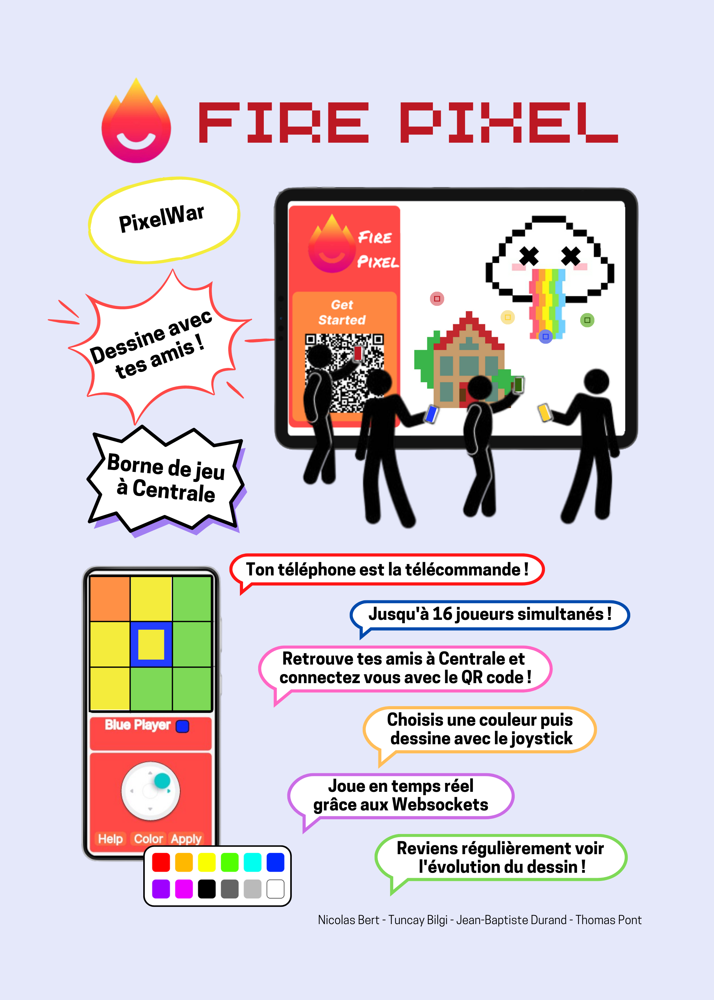

<!-- début résumé -->
La pixel war centralienne organisé autour d'un écran comme interface d'entrée .
<!-- fin résumé -->

# [FirePixel]()

Le projet a pour but de recréer la [pixel war](https://www.reddit.com/r/place/?cx=1461&cy=200&px=199&ts=1649112460185) de reddit.

## Le Principe

Un tableau de $n \times m$ pixels est partagé entre plusieurs utilisateurs sur un écran. Les utilisateurs peuvent modifier les couleurs des cases parmi 16 couleurs disponibles. Le but est que plusieurs utilisateurs se coordonnent pour dessiner une image, ou remplacer celles des autres.

Il n'y a pas de modération automatique, mais les administrateurs se réservent le droit de supprimer des sections d'images jugées inappropriées.

## En Pratique

Le projet sera déployé sur un écran qui pourra être posé n'importe où dans centrale. Celui pourra par exemple être dans un lieu de pause comme à coté des distributeurs de café ou dans un lieu de passage.

Les centraliens pourront s'approcher de l'écran et scanner un QRcode pour accéder à l'application. Sur leur téléphone, ils peuvent choisir un pixel et une couleur, et appliquer la modification (qui sera alors affichée en temps réel sur l'écran principal) à l'aide d'un joystick.
Il existe deux possibilités de modification. Un mode pixel par pixel et un mode continu qui permet de tracer des lignes d'une couleur.

16 utilisateurs peuvent interagir simultanément. Afin de savoir où l'on est sur l'écran, chaque utilisateur est représenté par une couleur et son pixel actuel est marqué par cette couleur.

Un compte administrateur permet de sélectionner des zones à effacer pour modérer l'usage de l'application.

## Stack technologique

L'application nécessite un Front, un Back et une base de données.
Pour la réaliser on utilise le stack suivant :

- Front-end : React.js avec Tailwind
- Back-end : Express.js
- Technologie de communication : WebSocket
- Base de données : MongoDB ?
- Carte RaspberryPi + écran de télé%

## Avancée du projet

Actuellement, différentes étapes ont été réalisées :

- Maquette des écrans sur Figma
- Premier prototype fonctionnel (écran des téléphones, de la télé et interaction entre les deux)
- Déploiement sur l'OVH

Différentes fonctionnalités sont encore à coder comme la prévisualisation d'une zone de l'écran et le compte administrateur. Par ailleurs, des tests utilisateurs vont être réalisés de manière à vérifier que l'interface est compréhensible et simple d'utilisation.

## Poster

