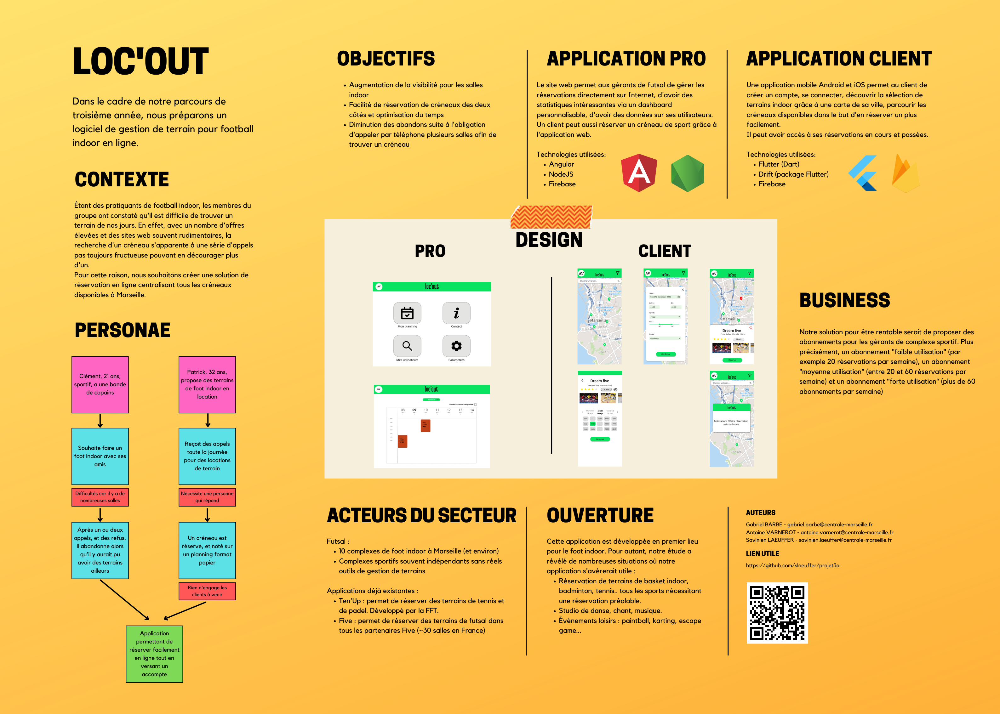

<!-- début résumé -->
Application de réservation et de gestion de terrains de foot indoor
<!-- fin résumé -->
<head>
  <link rel="stylesheet" href="./assets/style.css">
</head>

## Contexte
Étant des pratiquants de football indoor, les membres du groupe ont constaté qu'il est difficile de trouver un terrain de nos jours. En effet, avec un nombre d'offres élevées et des sites web souvent rudimentaires, la recherche d'un créneau s'apparente à une série d'appels pas toujours fructueuse pouvant en décourager plus d'un.
Pour cette raison, nous souhaitons créer une solution de réservation en ligne centralisant tous les créneaux disponibles à Marseille.

## Notre solution

1. Un site web permettant aux gérants de futsal de gérer leurs réservations directement sur Internet, d'avoir des statistiques intéressantes via un dashboard personnalisable, d'avoir des données sur ses utilisateurs.

2. Une application mobile Android et iOS qui permet aux clients de créer un compte, se connecter, découvrir la sélection de terrains indoor grâce à une carte, de parcourir les créneaux disponibles dans le but d'en réserver plus facilement. Ils peuvente avoir accès à leurs réservations en cours et passées. Un client peut aussi réserver un créneau de sport grâce à l'application web.

## Stack technique

Pour l'application web, on utilisera :
- Angular
- NodeJs
- Firebase

Pour l'application mobile, on utilisera :
- Flutter
- Drift
- Firebase

## Poster

<figure>
  
  <figcaption>Poster de présentation du projet</figcaption>
</figure>

