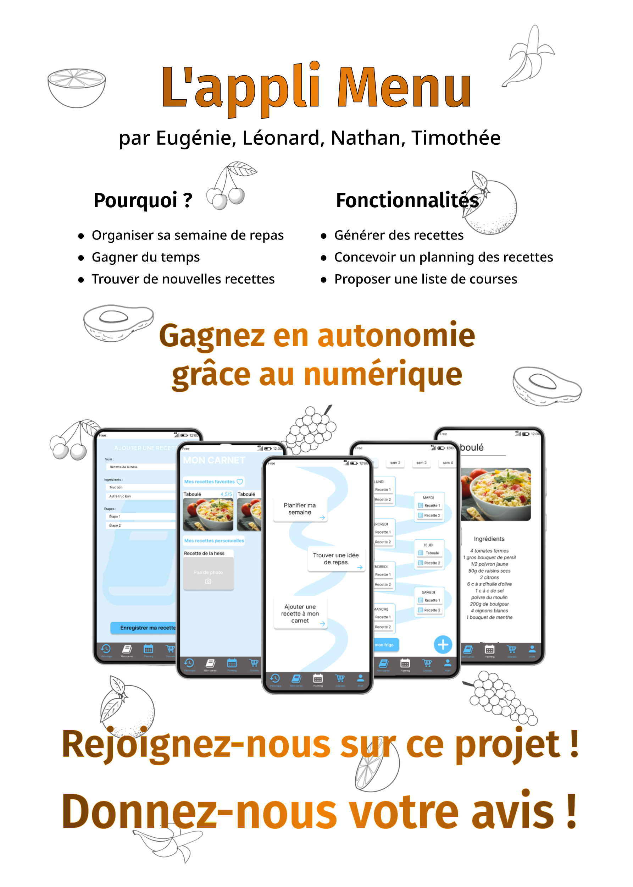

<!-- début résumé -->
Notre projet est de créer une appli pour les étudiants qui ont du mal à trouver des idées de repas et ceux qui veulent planifier leurs courses.
<!-- fin résumé -->

## Notre idée :

Nous sommes partis du constat que nous mangeons souvent les mêmes plats et que nous passons beaucoup de temps devant notre frigo à décider quoi préparer à manger avant de se rabattre sur des pâtes. Nous souhaitons apporter une solution numérique à ce problème en permettant aux étudiants comme nous de manger varier et bon. La solution que nous avons imaginée va prendre la forme d'une application mobile (collaborative, on l'espère) qui génère facilement des menus pour la semaine adaptés à tous et les listes de courses associées.

Voici un pitch que nous avons préparé en cours de Collective Intelligence : https://applimenu.carrd.co/.

## Nos grandes étapes :

Les cours que nous avons au cours de l'année nous permettent de comprendre comment conduire un projet, comment s'assurer de sa pertinence, etc. C'est comme ça que nous avons décidé de notre plan de route.
Nous avons commencé par interviewer notre public cible, les étudiants, d'octobre à novembre, pour formaliser les besoins autour de notre thématique. Nous sommes en période de maquettage depuis fin novembre.
Pour la suite, lorsque nous aurons une maquette viable, nous la ferons tester auprès des étudiants que nous avons interviewé en début d'année et nous la ferons évoluer grâce à leurs critiques. Nous pourrons ensuite créer l'application grâce à Bubble et travailler sur notre base de données pour les recettes.

## Définition des besoins :

Minimum pour que ça marche : 
- Pouvoir afficher une recette
- Générer des recettes
- Afficher un planning des recettes
- Modifier le nombre de personnes
- Générer une liste de course en fonction des recettes
------------------------------------------------------------------------------------------------------------------------
Fonctionnalités qui apporte de l’intérêt à notre appli : 
- Pouvoir prendre en compte la liste des ingrédients déjà possédés
- Mettre des filtres (coût, difficulté, calories, temps, régime alimentaire)
- Créer un profil utilisateur
- Ajouter ses propres recettes
- Ajouter favori
- Recettes collaboratives
- Générer une recette à partir d’un ingrédient
- Liste de courses triée par rayons
–------------------------------------------------------------------------------------------------------------------------
Bonus pur : 
- S’adapter aux saisons
- Mettre une vidéo des recettes
- Mettre image ingrédients
- Ajouter une recette depuis internet

## Notre poster :

