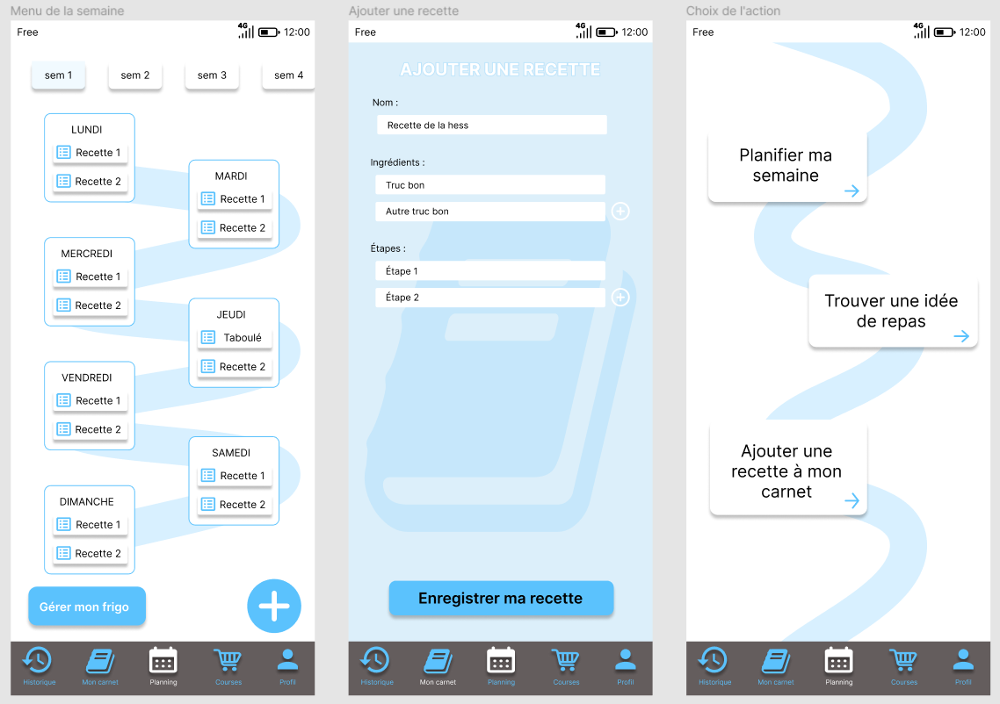
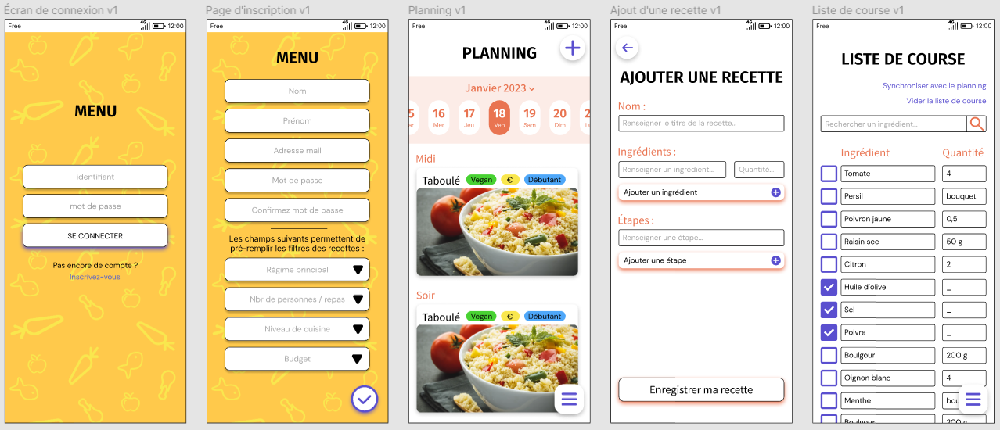

<!-- début résumé -->
Notre projet est de créer une appli pour les étudiants qui ont du mal à trouver des idées de repas et ceux qui veulent planifier leurs courses.
<!-- fin résumé -->

## Notre idée :

Nous sommes partis du constat que nous mangeons souvent les mêmes plats et que nous passons beaucoup de temps devant notre frigo à décider quoi préparer à manger avant de se rabattre sur des pâtes. Nous souhaitons apporter une solution numérique à ce problème en permettant aux étudiants comme nous de manger varier et bon. La solution que nous avons imaginée va prendre la forme d'une application mobile (collaborative, on l'espère) qui génère facilement des menus pour la semaine adaptés à tous et les listes de courses associées.

Voici un pitch que nous avons préparé en cours de Collective Intelligence : https://applimenu.carrd.co/.

## Nos grandes étapes :

Les cours que nous avons au cours de l'année nous ont permis de comprendre comment conduire un projet, comment s'assurer de sa pertinence, etc. C'est comme ça que nous avons décidé de notre plan de route.
Nous avons commencé par interviewer notre public cible, les étudiants, d'octobre à novembre, pour formaliser les besoins autour de notre thématique. Nous avons eu une longue période de maquettage de fin novembre jusqu'à mars. Ensuite, lorsque nous avons eu une maquette viable, nous l'avons faite tester auprès des étudiants que nous avions interviewés en début d'année et nous l'avons faite évoluer grâce à leurs critiques. Nous avons pu ensuite créer l'application grâce à Bubble et travailler sur notre base de données pour les recettes.

## Définition des besoins :

Minimum pour que ça marche : 
- Pouvoir afficher une recette
- Générer des recettes
- Afficher un planning des recettes
- Modifier le nombre de personnes
- Générer une liste de course en fonction des recettes
------------------------------------------------------------------------------------------------------------------------
Fonctionnalités qui apporte de l’intérêt à notre appli : 
- Pouvoir prendre en compte la liste des ingrédients déjà possédés
- Mettre des filtres (coût, difficulté, calories, temps, régime alimentaire)
- Créer un profil utilisateur
- Ajouter ses propres recettes
- Ajouter favori
- Recettes collaboratives
- Générer une recette à partir d’un ingrédient
- Liste de courses triée par rayons
-------------------------------------------------------------------------------------------------------------------------
Bonus pur : 
- S’adapter aux saisons
- Mettre une vidéo des recettes
- Mettre image ingrédients
- Ajouter une recette depuis internet

## Notre poster :

## Maquettes :

#### Expérience Utilisateur (UX) :

Nous avons eu un cours sur l'UX qui nous a appris à prendre en compte les différents parcours utilisateurs dans la création de l'application. Nous avons aussi pris en main Figma, un site web qui permet de créer des maquettes interactives. C'est pendant ce cours que nous avons créé la première maquette.

#### Première maquette :

#### Retours des étudiants (partie 1) : 

Les premiers retours que nous avons obtenus à propos de cette maquette sont venus de nos camarades de Do-IT. D'une façon générale, l'application n'était pas très belle, pas particulièrement intuitive et certaines fonctionnalités semblaient manquer ou, au contraire, étaient de trop.
Notre bilan sur cette première maquette... Eh bien c'était la première ! Comme nous étions dans l'optique d'apprendre de nos erreurs et de repartir pour un autre sprint, cela ne nous a pas découragés, au contraire. 

#### UI Design (Interface Utilisateur) :

Nous avons eu un cours de Design qui nous a vraiment aidé à améliorer notre application et à créer notre brief graphique. Nous avons choisi en connaissance de cause des couleurs, des polices d'écriture et des valeurs à transmettre. Nous avons même créé un Visual Board pour nous aider à trouver une direction pour notre design.

Tout d'abord, nos valeurs sont le fait maison, la convivialité, la créativité et l'inspiration. 

Après une séance de recherches, nous avons construit notre Visual Board, une sorte de brainstorming visuel :

L'élément ci-dessus est ce qui nous a permis de choisir nos couleurs principales pour l'application. De plus, nous avons fait en sorte que ces couleurs reflètent bien nos valeurs. Vous pouvez remarquer que nous avons écrit en noir puis en blanc des textes sur les couleurs, c'était pour vérifier si c'était lisible quelle que soit la couleur du texte. En l'occurance, nous avons déterminé que nous n'allions pas écrire en blanc sur du mimosa.

Enfin, il a fallu décider des polices d'écriture pour nos titres, sous-titres et textes. Après des recherches, nous avons choisi ces polices pour une première sélection.

En pratique, nous avons gardé la Firan Sans pour les titres, la Noto Sans pour les sous-titres et la DM Sans pour les textes.

L'utilisation des "layout grids" est quelque chose qui nous a beaucoup servi. En effet, cela permet d'aligner les éléments entre eux et de créer une harmonie visuelle. Il n'est pas nécessaire de l'appliquer parfaitement pour tous les éléments mais son utilisation générale permet de bien structurer la page. En voici l'exemple :

#### Deuxième maquette :

Pour la deuxième maquette, nous avons travaillé un peu différemment. Nous avons commencé par créer des pages qui ressemblaient à cela :

Puis, nous leur avons appliqué le design défini en UI pour donner cela :

Une nouveauté a été la manière d'accéder aux autres pages de l'application. Au départ, nous avions mis un bandeau en bas de l'écran, mais nous nous sommes tournés vers un menu dépliant sur la gauche. Comme ceci :

#### Retours des étudiants (partie 2) :

Cette fois-ci, nous avons eu des retours beaucoup plus précis. Voici les principales remarques :
- L'application est vraiment intuitive et on en fait le tour rapidement.
- L'emplacement du bouton menu était étrange (les étudiants voulaient l'avoir en haut de l'écran).
- La grille de sélection des repas dans la page de "création du planning de la semaine" n'est pas très claire.
- Il faudrait qu'il y ait un bouton de retour sur toutes les pages.
- Pour vider la liste de course, il faut qu'il y ait une double validation (comme lorsqu'on refuse des cookies sur un site web).
- Il n'y a pas de vraie page d'accueil. Ils l'ont fait remarquer mais disaient que ça ne posait pas de problème.

#### Troisième maquette : 

## L'application sur Bubble :

#### Méthodologie et MVP :

cours sur bubble

#### Base de données :
#### Workflow : 