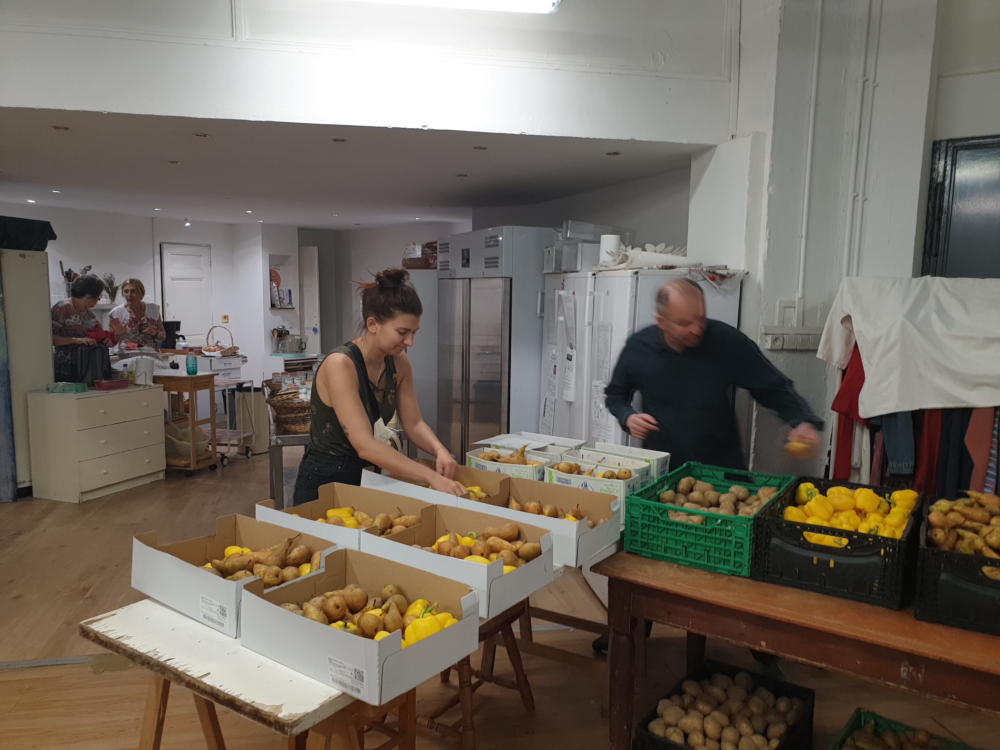
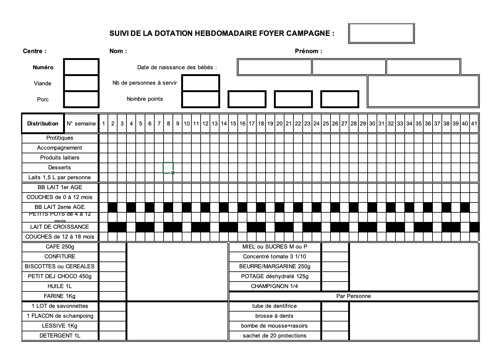
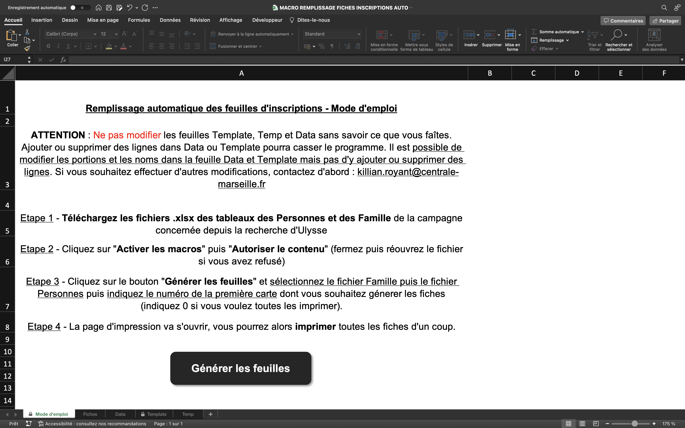
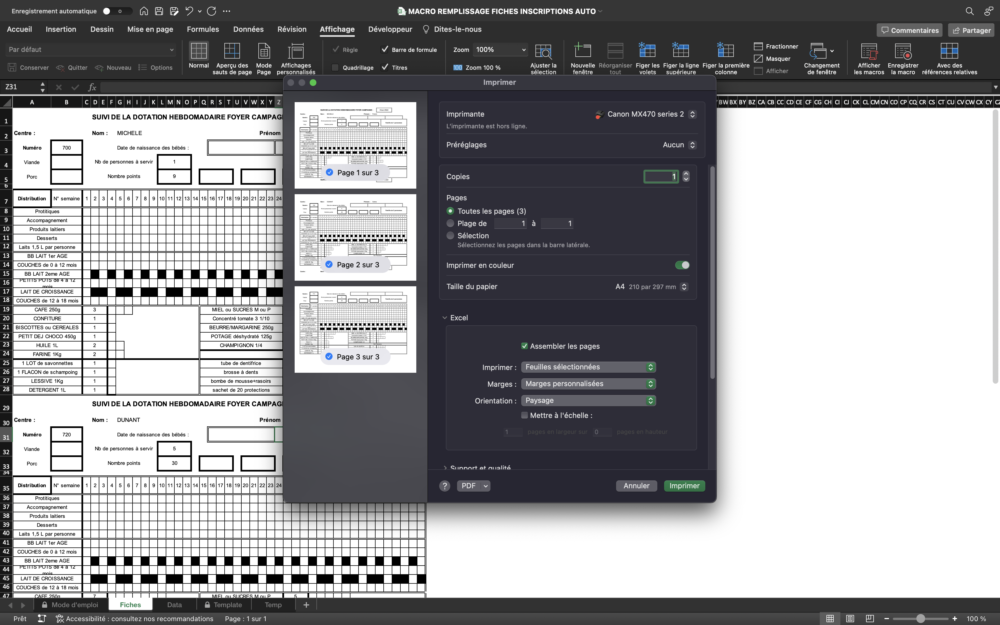

<!-- début résumé -->
Ce projet est réalisé en collaboration avec le centre des **Restos du Cœur** des 4° et 5° arrondissements de Marseille (rue Granoux). Laetitia Piet encadre ce projet. Notre **objectif** est d’**optimiser et de simplifier certaines tâches des bénévoles du centre**. Sujet: autonomie numérique.
<!-- fin résumé -->

## Sommaire
1. Contexte
2. Objectifs
3. Notre démarche
4. Nos solutions
5. Conclusion et améliorations


## 1.Contexte

Sarah a passé plusieurs mois comme bénévole dans un centre des Restos du Coeur. Elle s'est rendu compte de plusieurs problèmes dans leur manière de fonctionner. Le but de ce projet est de leur donner des outils numériques pour simplifier leur quotidien et leur faire gagner du temps. 

Le centre des Restos du Coeur avec lequel nous travaillons est le centre des 4ème et 5ème arrondissements de Marseille et se situe au 21 rue Granoux. La responsable de ce centre est Annie Lecompte et il y a 56 bénévoles (dont une quinzaine de permanents) dans le centre. Le centre fonctionne de la manière suivante:
- Le mercredi matin, des camions arrivent de l’association départementale chargés de nourriture (5 à 7 camions selon les semaines). Des bénévoles sont là pour décharger les camions, compter les denrées alimentaires et les ranger dans le local. Cela leur prend la matinée. L’après-midi, les derniers arrangements sont faits et parfois, lorsque des bénévoles sont disponibles, des vêtements sont distribués aux personnes qui en ont besoin. 
- Les jeudis et vendredis, les denrées alimentaires sont distribuées aux bénéficiaires 

L’année est découpée en 2 grandes périodes : la campagne d’hiver qui s’étend de novembre à mars et qui accueille plus de personnes dans le besoin et la campagne d’été qui s’étend de mars à novembre. Avant la pandémie, le centre accueillait environ 550 familles l’hiver et 300 l’été. Cette année, la campagne d’été a permis à 560 familles de recevoir de l’aide. Les inscriptions pour la campagne d’hiver sont en cours mais les critères d’admission ont été modifiés au vu de l’augmentation du prix des énergies et des inflations ce qui devrait encore augmenter le nombre de bénéficiaires pour cet hiver. 

## 2.Objectifs

Les Restos du cœur sont une organisation qui tourne grâce à des bénévoles. Par conséquent, les processus sont très approximatifs et l’informel est au cœur de son fonctionnement.
Avec l’aide de la responsable du centre, nous avons sélectionné 3 problèmes sur lesquels nous souhaitons agir:
- Seule la responsable Annie sait comment faire la répartition des denrées alimentaires
- A chaque nouvelle campagne (2 fois par an), les bénéficiaires doivent s’inscrire et remplir de longs formulaires qui sont repris de zéro 
- Il n’existe pas de moyen pour savoir à l’avance quels bénévoles seront présents pendant les jours d’actions 

Les enjeux principaux de ce projet sont:
- Fournir des solutions simples d’utilisation qui correspondent aux profils des bénévoles
- Fournir des solutions pérennes qui serviront dans la durée et qui ne pourront pas se “casser”
- Intégrer nos solutions avec de l'enthousiasme chez les bénévoles


## Notre démarche

Afin de nous adapter au mieux à notre public cible et fournir des solutions sur mesure, nous avons adopté une démarche inspirée du Service Design. Pour **mieux comprendre les bénévoles et leur environnement**, nous avons donc participé à leurs tâches quotidiennes lors de différentes **immersions**. Nous avons passé beaucoup de temps auprès d'eux afin de réellement comprendre leur besoins mais aussi pour promouvoir nos solutions et favoriser leur acceptation.



Nos différentes rencontres avec les bénévoles:

- Immersion lors des distributions
- Immersion lors des inscriptions
- Immersion lors de la réception des denrées alimentaires
- Interviews de 3 bénévoles
- Mise en place sur 3 semaines consécutives avec démonstrations aux bénévoles


La phase de mise en place a aussi été très importante. Nous avons formé et accompagné la responsable sur les outils pendant 3 semaines. Ces rencontres nous ont permis d'écouter les critiques des bénévoles et de modifier nos solutions en conséquences.


## 4.Nos solutions

Nous avons proposé  **3 solutions** en accord avec les 3 problèmes identifiés précedemment.

### **Solution 1 : Les inscriptions**

Avant chaque période de distribution (deux fois par an), une phase d’inscription des bénéficiaires a lieu. Il fallait remplir manuellement une fiche d’inscription pour chaque famille bénéficiaire ce qui rendait le processus long et fastidieux.



Néanmoins, toutes les informations necessaires au remplissage de ces fiches étaient déjà renseignées sur le logiciel interne des restos du cœur. Nous avons ainsi réfléchis à une solution permettant d’automatiser le remplissage des fiches d’inscription aux campagnes des bénéficiaires.

Pour cela, nous avons travaillé via Excel et une macro codée en VBA. La macro utilise un fichier Excel contenant une feuille de template à remplir, une feuille de mode d'emploi avec un bouton pour lancer la macro, et une feuille Data qui définit les portions à distribuer en fonction du nombre de personnes. La macro demande à l'utilisateur de sélectionner les fichiers Excel des familles et des personnes, et permet de générer automatiquement les fiches d'inscription pour chaque famille bénéficiaire.



Voici le code de la macro développée :



```vb
Sub GenererFeuilles()

    Dim wbFamilles As Workbook, wbPersonnes As Workbook
    Dim numCarteMin As Long
    Dim wsTemplate As Worksheet, wsTemplateTemp As Worksheet, wsFiches As Worksheet, wsData As Worksheet
    Dim i As Integer, famille As Range

    Dim familleFile As Variant, personnesFile As Variant
    Dim fd As FileDialog

    Set fd = Application.FileDialog(msoFileDialogFilePicker)
    fd.Title = "Sélectionner le fichier Excel des familles"
    fd.Filters.Clear
    fd.Filters.Add "Fichiers Excel", "*.xlsx"
    fd.AllowMultiSelect = False
    If fd.Show = True Then
        familleFile = fd.SelectedItems(1)
    Else
        MsgBox "La sélection de fichier a été annulée. Veuillez sélectionner un fichier Excel à traiter."
        Exit Sub
    End If

        Set fd = Application.FileDialog(msoFileDialogFilePicker)
    fd.Title = "Sélectionner le fichier Excel des personnes"
    fd.Filters.Clear
    fd.Filters.Add "Fichiers Excel", "*.xlsx"
    fd.AllowMultiSelect = False
    If fd.Show = True Then
        personnesFile = fd.SelectedItems(1)
    Else
        MsgBox "La sélection de fichier a été annulée. Veuillez sélectionner un fichier Excel à traiter."
        Exit Sub
    End If

    ' Vérification de la sélection des fichiers Excel
    If familleFile = False Or personnesFile = False Then
        MsgBox "Veuillez sélectionner les fichiers Excel à traiter."
        Exit Sub
    End If

    Set wbFamilles = Workbooks.Open(familleFile)
    Set wbPersonnes = Workbooks.Open(personnesFile)

    ' Vérification des fichiers Excel
    If wbPersonnes.Sheets(1).Range("Q1").Value <> "Contact" Or wbFamilles.Sheets(1).Range("U1").Value <> "Derniere Activite" Then
        MsgBox "Veuillez vérifier les fichiers Excel sélectionnés."
        Exit Sub
    End If

    'numCarteMin = 0
    numInput = InputBox("Indiquer le numéro de la premire carte à traiter"))
    Do While Not IsNumeric(numInput)
        numInput = InputBox("Entrez un nombre valide. Indiquer le numéro de la premire carte à traiter : "))
        If numInput = "" Then
            Exit Sub
        End If
    Loop
    numCarteMin = numInput
    Set wsTemplate = ThisWorkbook.Sheets("Template")
    Set wsTemplateTemp = ThisWorkbook.Sheets("Temp")
    Set wsFiches = ThisWorkbook.Sheets("Fiches")
    Set wsData = ThisWorkbook.Sheets("Data")

    ' Suppression du contenu des feuilles TemplateTemp et Fiches
    wsTemplateTemp.Rows("1:" & wsTemplateTemp.Rows.Count).Delete Shift:=xlUp
    wsFiches.Rows("1:" & wsFiches.Rows.Count).Delete Shift:=xlUp
    
    wsTemplate.Rows("30:30").Copy
    wsFiches.Rows("1:1").PasteSpecial Paste:=xlPasteColumnWidths, Operation:=xlNone, _
        SkipBlanks:=False, Transpose:=False

    i = 0
    For Each famille In wbFamilles.Sheets(1).Range("A2", wbFamilles.Sheets(1).Range("A" & wbFamilles.Sheets(1).Rows.Count).End(xlUp))
        If famille.Offset(0, 12).Value >= numCarteMin Then
            
            ' Copie du template
            wsTemplate.Rows("1:28").Copy
            ThisWorkbook.Activate
            Sheets("Temp").Select
            Rows("1:1").Select
            Selection.Insert Shift:=xlDown
            Selection.PasteSpecial Paste:=xlPasteColumnWidths, Operation:=xlNone, _
                SkipBlanks:=False, Transpose:=False

            If famille.Offset(0, 8).Value + famille.Offset(0, 9).Value + famille.Offset(0, 10).Value > 0 Then
                BoucleBabies famille, wbPersonnes, wsTemplateTemp
            End If

            CopieInfos famille, wsTemplateTemp
            AjoutPortions famille.Offset(0, 7).Value, wsTemplateTemp, wsData

            ' Coupe du template rempli
            wsTemplateTemp.Rows("1:28").Cut

            ' Collage à la suite des autres feuilles
            wsFiches.Rows(i * 28 + 1 & ":" & i * 28 + 1).Insert Shift:=xlDown
            i = i + 1
        End If
    Next famille

    wbFamilles.Close SaveChanges:=False
    wbPersonnes.Close SaveChanges:=False

    ' Ouvrir la fentre d'impression pour imprimer les pages généréess
    wsFiches.Activate
    Application.Dialogs(xlDialogPrint).Show
End Sub

Sub BoucleBabies(famille As Range, wbPersonnes As Workbook, wsTemplateTemp As Worksheet)

    Dim nbBabies As Integer
    Dim person As Range

    nbBabies = 0
    For Each person In wbPersonnes.Sheets(1).Range("A2", wbPersonnes.Sheets(1).Range("A" & wbPersonnes.Sheets(1).Rows.Count).End(xlUp))
        If person.Offset(0, 1).Value = famille.Offset(0, 1).Value And person.Offset(0, 9).Value <= 18 Then
            If nbBabies = 0 Then
                wsTemplateTemp.Range("R3").Value = person.Offset(0, 11).Value
            ElseIf nbBabies = 1 Then
                wsTemplateTemp.Range("Z3").Value = person.Offset(0, 11).Value
            ElseIf nbBabies = 2 Then
                wsTemplateTemp.Range("AH3").Value = person.Offset(0, 11).Value
            End If
            nbBabies = nbBabies + 1
            If nbBabies > 2 Then
                Exit For
            End If
        End If
    Next person

End Sub

Sub CopieInfos(famille As Range, wsTemplateTemp As Worksheet)

    wsTemplateTemp.Range("AD1").Value = famille.Value ' Campagne
    wsTemplateTemp.Range("G2").Value = famille.Offset(0, 4).Value ' Nom
    wsTemplateTemp.Range("AB2").Value = famille.Offset(0, 5).Value ' Prénom
    wsTemplateTemp.Range("B3").Value = famille.Offset(0, 12).Value ' Numéro de carte
    wsTemplateTemp.Range("L4").Value = famille.Offset(0, 7).Value ' Nb de personnes à servir
    wsTemplateTemp.Range("L5").Value = WorksheetFunction.Max(9, famille.Offset(0, 7).Value * 6) ' Nombre de points
    wsTemplateTemp.Range("AF4").Value = "Famille de " & famille.Offset(0, 7).Value & " personnes" ' 'Famille de {nb de personnes} personnes'

End Sub

Sub AjoutPortions(nbPersonnes As Long, wsTemplateTemp As Worksheet, wsData As Worksheet)

    Dim product As Range
    Dim nbPortions As Long
    Dim startCell As Range
    Dim i As Long
    
    If nbPersonnes > 6 Then nbPersonnes = 6

    For Each product In wsData.Range("A2", wsData.Range("A" & wsData.Rows.Count).End(xlUp))
        nbPortions = product.Offset(0, nbPersonnes).Value
        Set startCell = wsTemplateTemp.Range(product.Offset(0, 7).Value)
        startCell.Value = nbPortions
        For i = 1 To nbPortions
            startCell.Offset(0, i).Borders.LineStyle = xlContinuous
        Next i
    Next product

End Sub
```
    



La macro importe les fichiers Excel des familles et des personnes, recherche les bénéficiaires, récupère les informations relatives aux dates de naissance des bébés, remplit les fiches d'inscription, ajoute les données relatives aux nombre de portions, copie le template et ouvre la page d'impression pour imprimer les fiches générées.



Cela permet aux bénévoles de gagner du temps et de réduire le risque d'erreurs lors du remplissage des fiches d'inscription. Cette solution a donc permis de résoudre efficacement le problème d'inscription pour les Restos du Cœur.

**Avantages**

Les bénévoles n'ont plus besoin de remplir manuellement les fiches d'inscription pour chaque famille bénéficiaire, ce qui leur fait gagner un temps considérable. De plus, l'automatisation de ce processus permet de réduire le risque d'erreurs lors du remplissage des fiches d'inscription.

**Difficultés rencontrées**

Comme on peut le voir dans le code fourni, la solution pour numériser la phase d'inscription a nécessité une expertise technique assez avancée en VBA (Visual Basic for Applications), ainsi que la création d'un fichier Excel contenant une feuille de template à remplir, une feuille de mode d'emploi avec un bouton pour lancer la macro, et une feuille Data qui définit les portions à distribuer en fonction du nombre de personnes.

La création de cette macro a donc été assez complexe et demande une connaissance approfondie du langage VBA. De plus, cette solution n'est pas compatible avec les ordinateurs Mac, car la macro utilise des fonctionnalités spécifiques à Excel pour Windows.

Malgré ces difficultés, la solution mise en place a permis de résoudre efficacement le problème d'inscription et a apporté un gain de temps considérable aux bénévoles, ainsi qu'une réduction du risque d'erreurs lors du remplissage des fiches d'inscription.

Reserve: Durant notre projet une mise à jour d'Ulysse (logicieldont on extrait les données) a changé la forme des données à récupérer. Notre solution ne fonctionnait alors plus et a du être modifiée. Dans le futur, une telle mise à jour pourrait rendre notre solution obsolète.

### Solution 2 : Le calendrier des bénévoles

Au sein de l'association, il était difficile de suivre la présence des bénévoles lors des jours de distribution, faute de planning. C'est alors que nous avons proposé une solution pratique et simple : Framadate. Il s'agit d'un calendrier en ligne, facile à créer et à compléter par tous les bénévoles, quel que soit leur âge. 

**Avantages**

* **Gratuit et open source** : Framadate est un logiciel libre et gratuit.
* **Facilité d'utilisation** : L'interface de Framadate est simple et intuitive.
* **Accessibilité** : Framadate est accessible depuis n'importe quel navigateur web, sans qu'il soit nécessaire de télécharger ou d'installer un logiciel supplémentaire.
* **Inscription non obligatoire** : Les utilisateurs peuvent créer et participer à des sondages sans avoir besoin de s'inscrire ou de créer un compte utilisateur.
* **Flexibilité** : Il est possible de modifier ses réponses à tout instant
* On peut indiquer les **disponibilités d'autres bénévoles** : ceux qui ne disposent pas de smartphone par exemple.
* Vision sur le long terme : possibilité de générer un fichier mensuellement.

**Difficultés rencontrées**

* Beaucoup d'application de planning sont disponibles et aucune n'est parfaite, nous avons donc du faire des choix
* Certains bénévoles ont des appareils trop vieux pour pouvoir ouvrir framadate, 
* Le planning doit être créé et envoyé chaque mois par la Responsable du centre. Nous craignons qu'elle ne continue pas à l'utiliser. 


### Solution 3 : Solution de distribution

Pour aider la responsable de centre à faire sa distribution, nous avions besoin d’un outil simple d'utilisation et quasi incassable.

Voici le résultat:

(mettre imgs)


C’est un classeur Excel composés de 5 feuilles :
* Une feuille pour mettre à jour le nombre de bénéficiaires à servir, en fonction des familles présentes la semaine passées
* Une feuille permettant de mettre à jour le stock 
* Deux feuilles de calculs, donnant chacune un répartition différente
* Une feuille permettant de générer les fiches qui sont imprimées chaque semaine et qui guident les bénévoles pour la distribution. Cette feuille fonctionne avec une macro


Les 2 méthodes de calculs:

La première fait une répartition strictement équitable par personne (on divise le nombre d’unité par personne et on donne le même nombre d’aliments pour chaque personne, on a alors beaucoup de restes). La seconde méthode minimise les stocks restants en  donnant plus de denrées aux familles les plus nombreuses.

Nous avons testé d'autres méthodes qui n'étaient pas concluantes.

**Avantages:**

* Document qui suit les étapes logiques d’une semaine de travail au resto du coeur, simplifié au maximum
* L’utilisateur n’a besoin de rentrer que des informations dans les  feuilles “data_bénéficiares” et “data_stock”. Tout le reste se remplit automatiquement évitant les répétitions. 
* Les cellules contenant les calculs sont uniquement présentes dans les feuilles de répartition et sont verrouillées. 


**Difficultés rencontrées**
* Le choix d’une méthode de calcul s’est avéré difficile. Aucune des méthodes que nous avons testées n’est parfaite. 
* Aussi, il faut conserver un regard critique sur ces calculs car notre Excel ne prend pas en compte les spécificités individuelles de chaque produit. La responsable est libre de modifier les chiffres de la répartition et nous avons constaté qu’elle le fait quasiment systématiquement. On peut penser qu’un bénévole nouveau venu ne pourrait pas effectuer une distribution efficace rien qu’avec notre outil. 
De plus, en voyant l'utilisation faite par la responsable de centre, on pe se poser des questions sur sa réel utilitée... 
Si les chiffres sont bidouillés, la répartition n'en sera pas plus fiable. Elle permettra juste de lui faire gagner du temps.
* La prise en main peut paraître compliquée car remplir la liste du stock prend du temps. Pour fluidifier cela nous avons effectué 3 répartitions avec la responsable, en l’accompagnant sur l’outil


## 5.Conclusion et améliorations

Nous avons tous pris beaucoup de plaisir à réaliser ce projet qui a du sens. Nous sommes plutôt content du résultat et espérons que nos outils seront utilisés à long terme. Malheureusement on ne peut pas grantir que ces derniers seront utilisés de la bonne manière, notament la solution de répartition. En effet, la responsable qui a 6 ans d'expérience favorise son instinct plutôt que les calculs mathématiques... 
Pour notre part, le contrat est rempli et nous sommes conscients des limites de notre projet.
Si le projet avait duré 6 mois de plus, nous nous serions concentré sur l'adoption de nos solutions et leur bonne utilisation. Pour cela, il aurait fallu rappeler à la responsable de centre de recréer un calendrier chaque mois et l'accompagner sur les calcluls de répartition afin que les bonnes pratiques deviennent des habitudes.
Nous aurions aussi pu ranger le local et le réorganiser à la manière du Lean.
La solution inscription aurait aussi pu être retravaillée (elle nécessite encore des amléiorations).


