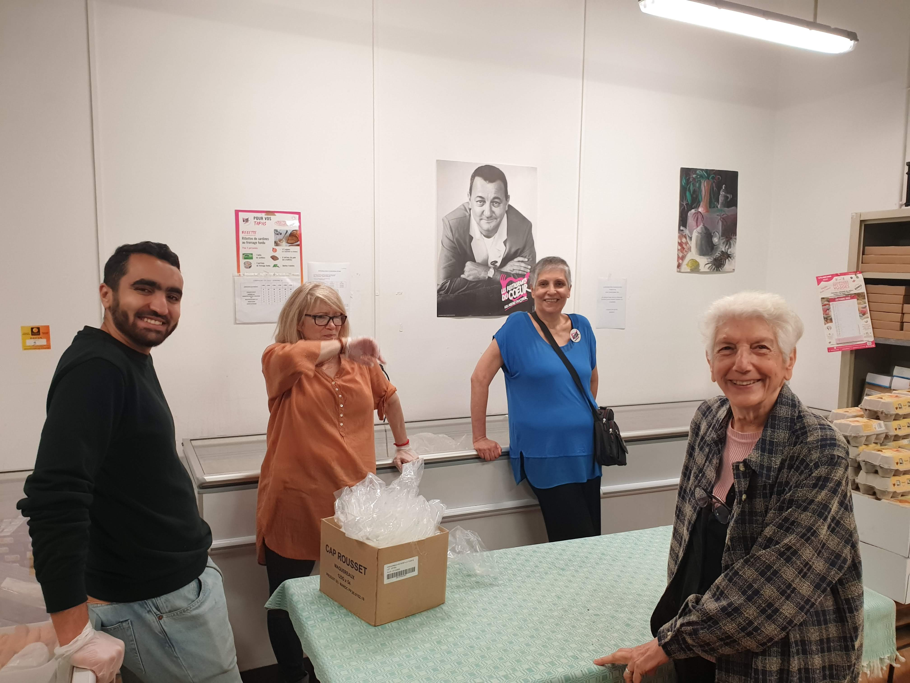
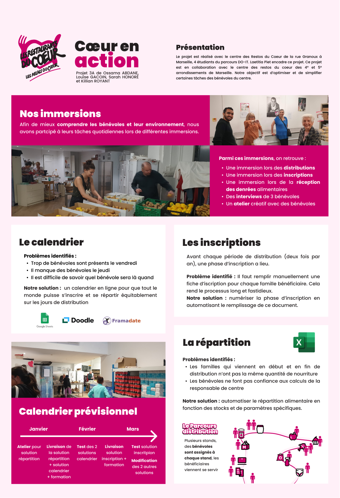

<!-- début résumé -->
## Présentation

Le projet est réalisé avec le centre des **Restos du Cœur** de la rue Granoux à Marseille, **4 étudiants** du parcours DO-IT. Laetitia Piet encadre ce projet. Ce projet est en collaboration avec le centre des restos du cœur des 4° et 5° arrondissements de Marseille. Notre **objectif** est d’**optimiser et de simplifier certaines tâches des bénévoles du centre**.
<!-- fin résumé -->

## Nos immersions

Afin de **mieux comprendre les bénévoles et leur environnement**, nous avons participé à leurs tâches quotidiennes lors de différentes **immersions**.

Parmi ces immersions, on retrouve :

- Une immersion lors des distributions
- Une immersion lors des inscriptions
- Une immersion lors de la réception des denrées alimentaires
- Des interviews de 3 bénévoles
- Un atelier créatif avec des bénévoles

## Nos solutions

Nous avons identifié **3 problèmes** et avons proposé des solutions pour chacun d’entre eux.

### Problème 1 : Les inscriptions

Avant chaque période de distribution (deux fois par an), une phase d’inscription des bénéficiaires a lieu.

**Problème identifié :** Il faut remplir manuellement une fiche d’inscription pour chaque famille bénéficiaire. Cela rend le processus long et fastidieux.

**Notre solution :** numériser la phase d’inscription en automatisant le remplissage de ce document.

### Problème 2 : Le calendrier des bénévoles

Chaque semaine, des bénévoles sont présents pour **distribuer les denrées alimentaires** aux familles bénéficiaires. Actuellement, ces bénévoles viennent **sans prévenir** quand ils sont disponibles.

**Problèmes identifiés :**

- Il est difficile de savoir quel bénévole sera présent les jours de distribution.
- Trop de bénévoles sont présents le vendredi
- Il manque des bénévoles le jeudi

**Notre solution :** créer un calendrier des bénévoles pour faciliter la gestion des bénévoles.

### Problème 3 : La répartition des denrées alimentaires

Après chaque livraison de denrées alimentaires, il faut **répartir les denrées entre les différentes familles**. Actuellement, la responsable de centre fait les calculs **à la main**.

**Problèmes identifiés :**

- Les familles qui viennent en début et en fin de distribution n’ont pas la même quantité de nourriture
- Les bénévoles ne font pas confiance aux calculs de la responsable de centre

**Notre solution :** automatiser le répartition alimentaire en fonction des stocks et de paramètres spécifiques.

## Notre poster

Afin de présenter notre projet, nous avons réalisé un poster.

## Nos résultats

Nous avons donc essayé de développer et mettre en place nos différentes solutions. On va détailler ci-dessous la démarche et les résultats obtenu. 

### Problème 1 : Les inscriptions

Avant chaque période de distribution (deux fois par an), une phase d’inscription des bénéficiaires a lieu. Il fallait remplir manuellement une fiche d’inscription pour chaque famille bénéficiaire ce qui rendait le processus long et fastidieux. 
Les données de chaque famille étaient présente dans un logiciel "Ulysse" propre aux restos du coeur.......... **Killian à toi de rédiger !!!**

### Problème 2 : Le calendrier des bénévoles

Au sein de l'association, il était difficile de suivre la présence des bénévoles lors des jours de distribution, faute de planning. C'est alors que nous avons proposé une solution pratique et simple : Framadate. Il s'agit d'un calendrier en ligne, facile à créer et à compléter par tous les bénévoles, quel que soit leur âge. Cette application offre de nombreux avantages :

* **Gratuit et open source** : Framadate est un logiciel libre et gratuit.
* **Facilité d'utilisation** : L'interface de Framadate est simple et intuitive.
* **Accessibilité** : Framadate est accessible depuis n'importe quel navigateur web, sans qu'il soit nécessaire de télécharger ou d'installer un logiciel supplémentaire.
* **Inscription non obligatoire** : Les utilisateurs peuvent créer et participer à des sondages sans avoir besoin de s'inscrire ou de créer un compte utilisateur.
* **Flexibilité** : Il est possible de modifier ses réponses à tout instant
* On peut indiquer les **disponibilités d'autres bénévoles** : ceux qui ne disposent pas de smartphone par exemple.
* Vision sur le long terme : possibilité de générer un fichier mensuellement.

Problèmes rencontrés :
* Beaucoup d'application de planning disponible
* Réticence des bénévoles vis à vis la technologie 
* 

### Problème 3 : Solution de distribution

Pour aider la responsable de centre à faire sa distribution, nous avions besoin d’un outil simple d'utilisation et quasi incassable.

Voici le résultat:

(mettre imgs)

C’est un classeur Excel composés de 5 feuilles :
* Une feuille pour mettre à jour le nombre de bénéficiaires à servir, en fonction des familles présentes la semaine passées
* Une feuille permettant de mettre à jour le stock 
* Deux feuilles de calculs, donnant chacune un répartition différente
* Une feuille permettant de générer les fiches qui sont imprimées chaque semaine et qui guident les bénévoles pour la distribution. Cette feuille fonctionne avec une macro

Les 2 méthodes de calculs:

La première fait une répartition strictement équitable par personne (on divise le nombre d’unité par personne et on donne le même nombre d’aliments pour chaque personne, on a alors beaucoup de restes). La seconde méthode minimise les stocks restants en  donnant plus de denrées aux familles les plus nombreuses.

Avantages:
* Document qui suit les étapes logiques d’une semaine de travail au resto du coeur, simplifié au maximum
* L’utilisateur n’a besoin de rentrer que des informations dans les  feuilles “data_bénéficiares” et “data_stock”. Tout le reste se remplit automatiquement évitant les répétitions. 
* Les cellules contenant les calculs sont uniquement présentes dans les feuilles de répartition et sont verrouillées. 

Problèmes rencontrés:
* Le choix d’une méthode de calcul s’est avéré difficile. Aucune des méthodes que nous avons testées n’est parfaite. 
* Aussi, il faut conserver un regard critique sur ces calculs car notre Excel ne prend pas en compte les spécificités individuelles de chaque produit. La responsable est libre de modifier les chiffres de la répartition et nous avons constaté qu’elle le fait quasiment systématiquement. On peut penser qu’un bénévole nouveau venu ne pourrait pas effectuer une distribution efficace rien qu’avec notre outil. (Notre outil fonctionne bien pour les bénévoles expérimentés mais reste discutable pour les autres)
* La prise en main peut paraître compliquée car remplir la liste du stock prend du temps. Pour fluidifier cela nous avons effectué 3 répartitions avec la responsable, en l’accompagnant sur l’outil

