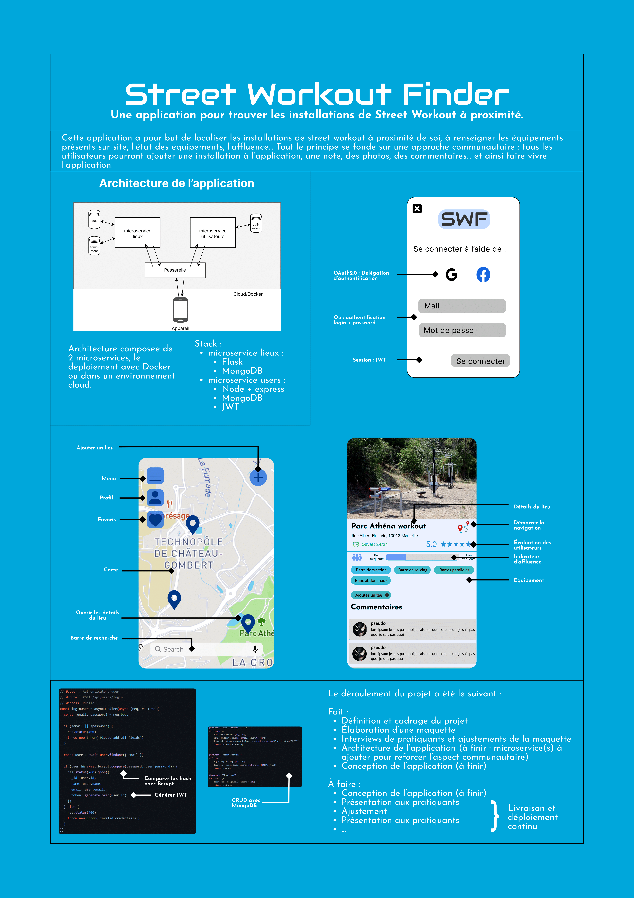

<!-- début résumé -->
Le projet pour trouver des installations sportives en plein air près de chez vous !
<!-- fin résumé -->

## Objectif
L'objectif du projet est le développement d'une application de géolocalisation d'installations sportives en extérieur (barres de tractions, barres parallèles, etc..) dans la ville de Marseille. La conception de l'application se fait dans une démarche Design Thinking.

## Déroulé 

### Phase de réflection, Design Thinking
**19/09/2022 - 05/12/2022**
Dans la phase de réflexion, nous nous sommes concentrés sur les étapes suivantes :
- Recherche des besoins utilisateurs (avec des entretiens)
- Recherche de l'état de l'art
- Création du design dans Figma
- Création de l'architecture de l'application (on a décidé d'utiliser une architecture en microservices)

### Sprint 1
**06/12/2022 - 03/01/2023**

Dans le premier sprint, nous avons réalisé les étapes suivantes :
[x] Création du repo GitHub : https://github.com/JeffreyEdisah/Street-Workout-Finder
[x] Création microservice utilisateur et authentification
[x] Début du développement du microservice lieux

Nous avons crée un projet sur GitHub: 

### Sprint 2
**03/01/2023 - 07/02/2023**

Dans le deuxième sprint, nous avons réalisé les étapes suivantes :
[x] Finir le microservice lieux
[x] Déploiement du microservice lieux sur AWS Lambda

### Sprint 3
**07/02/2023 - 28/02/2023**

Dans le troisième sprint, nous avons réalisé les étapes suivantes :
[x] Début du travail sur le front en React
[x] Création de la carte avec Leaflet
[x] Ajout des pages Login et Register
[x] Ajout de la page de description d'un lieu

### Sprint 4
**28/02/2023 - 21/03/2023**

Dans le quatrième sprint, nous avons réalisé les étapes suivantes :
[x] Refactoring du microservice lieux
[x] Ajout du menu à la carte
[x] Liaison du front avec les différents microservices
[x] Ajout d'une gateway entre le microservice lieu et le microservice utilisateurs

### Sprint 5
**28/02/2023 - 21/03/2023**

Dans le quatrième sprint, nous avons réalisé les étapes suivantes :
[x] Divers ajustements CSS
[x] Création d'un docker compose avec 3 services : le front, le microservice lieu et le microservice utilisateurs

## Poster

