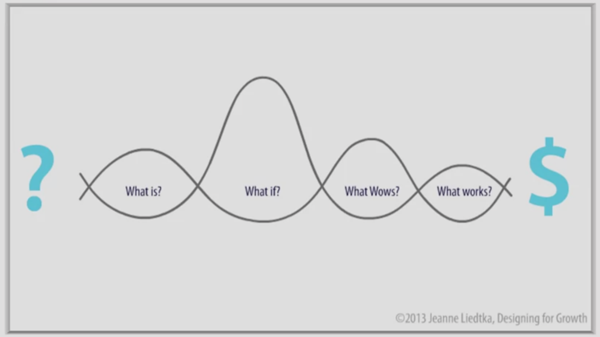
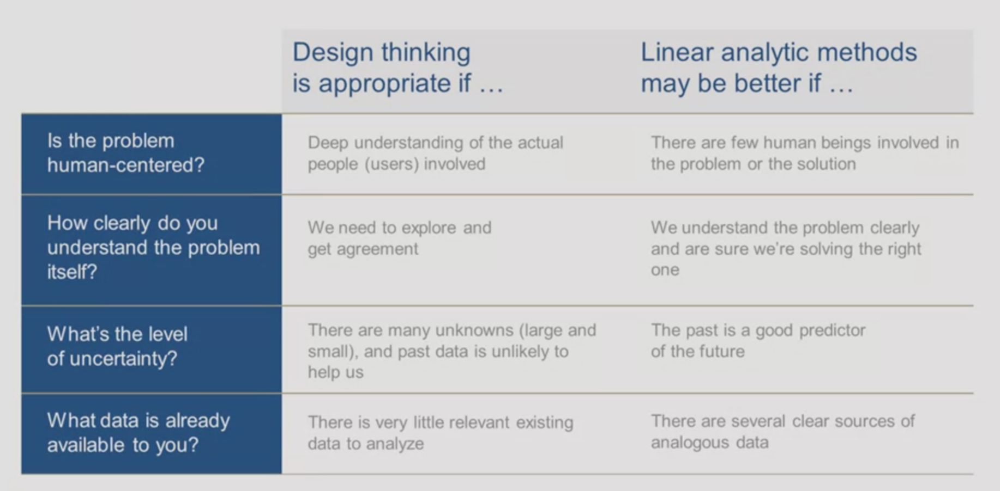

<!-- début résumé -->
Mon second MON sur le Design Thinking
<!-- fin résumé -->

### Introduction 

Après avoir suivi des cours d'initiation au design thinking en classe, j'ai voulu approfondir mes connaissances dans ce sujet. Pour ce faire, j'ai suivi un cour nommé "Design Thinking for Innovation" réalisé par l'université de Virginie. Le cours est en anglais, mais les sous-titres sont disponibles dans plusieurs langues dont le le français. Il est gratuit mais l'évaluation et donc la certification est payante. Le cours est disponible à ce lien : [Cours Design Thining](https://fr.coursera.org/learn/uva-darden-design-thinking-innovation#syllabus).

### Qu'est-ce que le Design Thinking ?

Pour expliquer ce qu'est le design thinking, je vais m'appuyer sur une image présentée dans ce MOOC. Un projet est général présenté de la manière suivante :

On part d'une idée présentée à gauche par le point d'interrogation et on arrive à un résultat qui génère un bénéfice représenté par le dollard à droite. Le processus créatif entre l'idée et le résultat est souvent flou ou à l'apparence complexe. 

Le design thinking, va s'opposer à cette idée et le désordre se transforme en une série de questions comme on peut le voir sur l'image ci-dessous : 

A travers les question suivantes , on va pouvoir mener un projet à son terme. 

- **What is ?** : On va essayer de comprendre ce qu'il se passe actuellement, comment ça fonctionne ? Il faut réalsier une immersion, élargir et peut-être même modifier complètement notre définition du problème ou de l'opportunité que nous voulons explorer.

- **What if ?** : On va commencer à générer des idées et à explorer des solutions possibles. Un brainstorming va avoir lieu et toutes les idées vont être analyser en utilisant les données que nous avons recueillies et les problèmes que nous avons identifiés lors de l'immersion.  

- **What wows ?** : Nous allons traiter de façon explicite chacun de nos concepts que les 2 premières questions nous ont permis de mettre en avant. Il va falloir trancher et faire des choix entre les différentes idées pour choisir les idées qui vont répondre aux mieux à nos problématiques.

- **What works ?** : On va passer à la phase de test. On va présenter un protype à un petit groupe de personnes et attendre leurs retours. Si la solution fonctionne, on va l'améliorer avec les retours et la présenter à un plus grans panel de personnes. On continue jusqu'à aboutir à un produit fini et prêt à être commercialisé.

Le design thinking, contrairement aux autres processus, va placer l'**utilisateur** au centre. Il souligne l'importance de l'exploration profonde de la vie et des problèmes des personnes à qui nous espérons apporter des solutions. 
Ce processus va également résenter **plusieurs possibilités** et non pas une solution unique pour laisser aux parties prenantes le choix de la solution finale. 
Enfin, le design thinking est **itératif**, il va à travers des cycles de tests sans cesse s'améliorer en prenant compte les retours des utilisateurs. 

### Dans quels cas utiliser le design thinking ?

Ce processus ne peut pas être utilisé pour répondre à tout les types de problématiques, on peut voir ci-dessous un tableau qui résume les cas où il est intéressant de l'utiliser. Il faut donc se poser ces questions avant d'utiliser la méthode de Design Thinking. 

### Préparer son esprit à l'innovation

Comme nous avons pu le remarquer lors de nos expériences en entreprise, il est souvent compliqué d'innover dans une organisation. Il existe plus raisons pour expliquer cela :
- La plupart des groupes aiment les **grandes idées**, limitant le nombre d'initiatives en cours pour pouvoir avoir un meilleure contrôle sur l'orientation de l'entreprise.
- La plupart des organisations sont également obsédées par l'**analyse**. Elles aiment la stabilité et le contrôle. Elles dépendent donc de la collecte, de l'analyse et de l'utilisation rigoureuses des données.

Les opportunités d'innovation attendent que nous les trouvions , mais souvent, nous ne pouvons tout simplement pas les voir. Comme les découvertes scientifiques, trouver des opportunités exige un esprit préparé. Il faut donc mener un travail sur soi pour pouvoir être prêt au maximum.

Pour repérer un esprti bien préparé, on se base sur 3 critères :
- **L'état d'esprit**, la perspective d'une personne sur le monde et sa vision de la vie.Nos choix reflètent inévitablement notre état d'esprit. Pour certains d'entre nous, les nouvelles opportunités sont une occasion d'apprendre, pour d'autres, elles sont un risque d'échec.
- **Le répertoire** ou l'expérience. Plus les gens travaillent dans une variété de postes et d'entreprises au cours de leur carrière, plus ils peuvent rapidement et habilement apprendre à s'adapter à différentes situation. Un large répertoire peut être un important facteur d'innovation.
- **L'empathie envers le client**. Chaque entreprise croit qu'elle se soucie de ses clients mais en réalité non. L'empathie envers les clients implique de s'intéresser de près aux détails de leur vie, en tant que personnes, et non en tant que catégories de consommateurs.

### Étude de cas The MeYouHealth

A travers un exemple concret, nous allons appliquer la méthode du Design Thinking.
Chris est un entrepreneur qui a eu idée d'essayer de repondre à la problématique suivante :
**Pourrait-on utiliser les réseaux sociaux pour aider les gens à adopter des modes de vie plus sains ?**
Pour ce faire, il a fait appel à Essential Design, une société de conseil en innovation basée à Boston. La question posée est large, on va donc se servir des connaissances acquise précedemment pour y répondre. 

#### What is ?
Les clients potentiels pour un tel service étaient très diversifiées. Ils étaient âgés de 20 à 70 ans, et avaient un mélange de situations familiales, de niveaux de motivation et de connaissances technologiques. L'entreprise a commencé par choisir trois douzaines de candidats représentant diverses démographies et leur ont donné plusieurs questionnaires à remplir avant leur entretien.
Le but était de comprendre leur emploi du temps quotidien pendant une semaine. Demander à chaque personne de noter des expériences spécifiques qui ont affecté son bien-être. Et cela peut aller de sauter le petit déjeuner à parler avec un conjoint des questions financières.
Ils ont également fait passer divers ateliers pour mieux comprendre leurs besoins leur vision de l'avenir, leurs priorités...
Tout ces tests et entretiens ont permis de mettre en évidence 7 personae. Chaque personnae avait besoin de sa propre approche pour améliorer le bien-être, et donc, de ses propres critères de conception pour trouver la meilleure approche pour les atteindre.

#### What if ?

En 18 mois, l'équipe MeYou Health a créé et lancé une douzaine de projets différents : Sites Web, applications mobiles, applications pour Facebook et Twitter.

MeYou Health a engagé des concepteurs de jeux talentueux et des ingénieurs, qui ont commencé à développer de petites applications, afin d'avoir un maximum de produits viables prêts à être lancés le plus rapidement possible.

Les créateurs ont beaucoup réfléchi sur le thème important qui a émergé des interviews autour de l'idée de petits changements incrémentiels , conduisant à des changements beaucoup plus importants.
En s'éloignant des grands objectifs accablants et en se concentrant sur des objectifs plus petits et facilement atteints, cela a permis à l'équipe MeYou Health de construire rapidement des prototypes simples et à développer de nombreuses plateformes différentes.

Un  produit qu'ils ont créé était le Daily Challenge. Aider les gens à améliorer leur bien-être en leur envoyant un message tous les jours, avec un petit pas qu'ils pourraient faire pour améliorer leur santé.
Il a également encouragé les personnes à partager leur défi et à partager leurs progrès avec leur famille et leurs amis.

#### What Wows and What Works ?

L'équipe MeYouHealth a confirmé son hypothèse selon laquelle l'interaction sociale en ligne pourrait avoir un effet positif sur les individus. À ce jour, l'application phare de la société, le Daily Challenge, a inscrit des centaines de milliers de membres qui ont complété des millions de petites actions d'amélioration de la santé.

La plupart des sites Web sont satisfaits d'un engagement de 20 à 30 % à 30 jours. Après 1 an, 34% des utilisateurs utilisaient encore le produit, moyenne plus élevé que la moyenne pour les autres sites de bien-être. L'idée de communauté a également était validée, en effet, les personnes formaient des groupes de défi et de soutien dans les différents réseaux sociaux. 

MeYouHealth a également travaillé avec des chercheurs pour la réalisation d'une expérience impliquant plus de 1 500 adultes. La principale mesure du succès était l'amélioration du bien-être et les résultats ont été très bons pour l'entreprise. 

L'entreprise a donc identifié un prduit qui offre au client une vraie  valeur ajoutée et que le client désire utiliser.

### Conclusion 

A travers ce cours, j'ai pu apprendre de nouvelles connaissances sur le Design Thinking. Il y avait énormément d'exemples qui permettaient de mieux comprendre les notions théoriques avec des intervenants variés. Néanmoins, à certains moments, il était difficile de suivre l'idée générale et on se retrouvait rapidement perdu.  