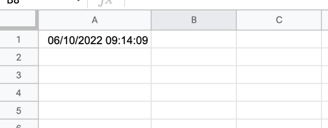
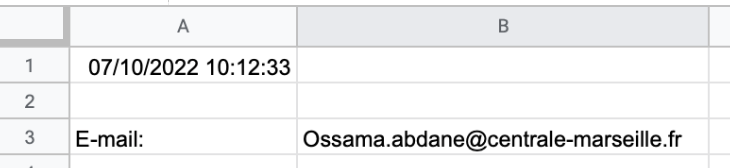
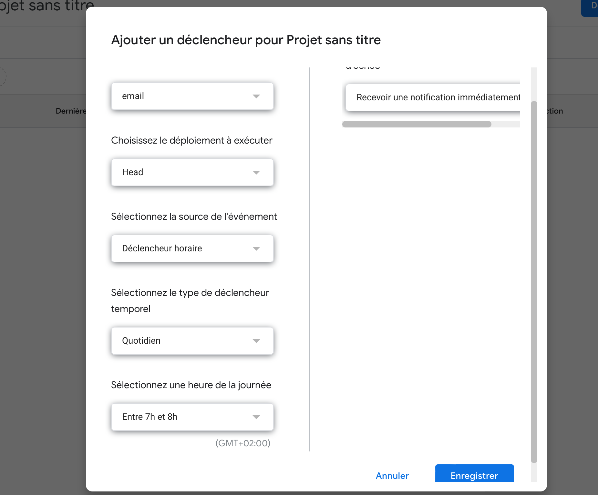

<!-- début résumé -->
L'objectif de mon MON est l'apprentissage de nouvelles fonctionnalités pour permettre d'automatiser, par exemple, certaines tâches sur des fichiers de type tableaur grâce à l'App Script Google.
<!-- fin résumé -->

### Introduction

Google Apps Script est un langage de programmation propre à Google. Il permet de réaliser des scripts à l'intérieur de certains services de Google. Ainsi il est possible de modifier le comportement du logiciel tableur (Google sheet) pour automatiser des tâches par exemple.

Pour accéder à l'App Script, il suffit de se rendre sur un document sur un Google Drive, cliquer dans la barre de menu sur "extensions" puis sur "Apps Script". Nous sommes maintenant prêt à commencer à utiliser ses fonctionnalités.


N'oubliez pas d'enregistrer votre script après chaque modification


### Les Triggers

Pour mon MON, j'ai décidé de me focaliser sur les triggers, en français déclencheurs, j'ai trouvé leur utilisation pouvait beaucoup m'apporter dans le futur.
Les triggers permettent d'exécuter une fonction automatiquement à la suite d'un événement. Il peut s'agir de l'ouverture du fichier, la modification d'une case, après un certain délai... Je vais présenter les différents types de triggers et leur utilisation ci-dessous.

#### Les triggers simples

Fonction | Utilisation |
 ------------ | :-----------: |
onOpen()       | S'exécute lorsqu'un utilisateur ouvre un document qu'il est autorisé à modifier |
onInstall()       |  S'exécute lorsqu'un utilisateur installe un module complémentaire Editor  |
onEdit()  | S'exécute lorsqu'un utilisateur modifie une valeur dans une feuille de calcul    |
onSelectionChange()   | S'exécute lorsqu'un utilisateur modifie la cellule sélectionnée  |

##### Quelques exemples

* onOpen() :

        function onOpen(){
          SpreadsheetApp.getActive().getRange('A1').setValue(new Date());
        }
  
Ce programme va permettre d'afficher la date et l'heure sur la Cellule A1 à chaque fois que le fichier est ouvert comme le montre l'image ci-dessous :

* onSelectionChange() :

          function onSelectionChange(e){
            console.log(e.range.getA1Notation());
          }

Ce programme va s’exécuter à chaque fois que l'on va changer de cellule et dans la liste d'exécution afficher toutes les cellules par lesquelles nous sommes passés.

* onEdit() :

Certainement la fonction la plus intéressante, pour cet exemple, un programme plus poussé qui permet la verification de la validité de l'e-mail saisi.

          function onEdit(data){
          
            if(data.range.getSheet().getName() =='Feuille 1' &&  data.range.getA1Notation() == 'B3'){
          
              let isValid = emailValidation(data.range.getValue());
          
                if(isValid){
                  data.range.setBackground('white');
                }else{
                  data.range.setBackground('red');
                }
            }
          }
          
          function emailValidation(email){
          
            let mailformat = /^\w+([\.-]?\w+)*@\w+([\.-]?\w+)*(\.\w{2,3})+$/;
          
            if(email.match(mailformat)){
            return true;
            }else{
              return false;
            }
          }

Ce permet donc à chaque qu'une personne saisi son e-mail dans la cellule B3, de vérifier si il s'agit d'un e-mail conforme. Si c'est le cas, la case reste blanche mais si la syntaxe n'est pas bonne, la case se colore en rouge.
Lorsque l'e-mail est bien noté :

Lorsque qu'il y a une erreur (il manque le ".fr") :

Ce type de vérification peu être étendu par exemple à la vérification du format du numéro de téléphone, la syntaxe de la date de naissance... Peut-être pour un prochain MON, créer tout un formulaire contrôlé avec un programme.


Une idée pour un prochain MON, créer tout un formulaire vérifié par un programme.


#### Les triggers temporels

Les triggers temporels permettent l'exécution d'une fonction dans un certain délai. On peut par exemple exécuter cette fonction toutes les minutes, toutes les jours ou encore tout les matins. On peut utiliser ce type de trigger pour implémenter une case tout les jours ou encore recevoir un mail tous les matins nous rappellent de faire un compte rendu tout les matins à notre patron.

Pour programmer un trigger temporel, après avoir créer une fonction, il faut aller dans l'Apps script, cliquer sur l'horloge à gauche comme sur l'image ci-dessous :

Il faut ensuite cliquer sur "ajouter un déclencheur" en bas à droite et le menu suivant s'affiche :

Pour programmer le déclencheur, il faut dans le menu :

* Sélectionner la fonction que l'on souhaiter exécuter
* Dans source événement choisir "Déclencheur horaire"
* Choisir le délai (quotidien, hebdomadaire...)
* L'heure d'exécution
* Cliquer sur enregistrer

Notre déclencheur temporel est prêt !

##### Exemple d'application

On va créer une fonction qui va nous envoyer un mail tout les matins pour me rappeler d'aller signer la feuille de présence :

        function Rappelsignature() {
          
          MailApp.sendEmail("ossama84130@gmail.com","Rappel émargement","Aller à l'acceuil et signer le feuille d'émargement");
        }

Après avoir créer la fonction, on va créer le déclencheur temporel et le paramétrer :

Tout est prêt, je vais donc recevoir tous les jours un mail de ce type pour ne pas oublier de signer la feuille à l’accueil :


Une autre idée de MON, à partir d'un tableau avec des dates d'anniversaire, créer un trigger temporel qui prévient par mail des anniversaires.


### Ressources utilisées

* Le site de Google : https://developers.google.com/apps-script/guides/triggers
* La Playlist tuto de Tuto de rien : https://youtube.com/playlist?list=PLozmtcO5OqdqZZ6sP6faU18jIdyCiiYvS
* Le site Spreadsheet Dev : https://spreadsheet.dev/triggers-in-google-sheets
* Le livre Automate the Boring Stuff with Python (pas beaucoup exploité): https://automatetheboringstuff.com
