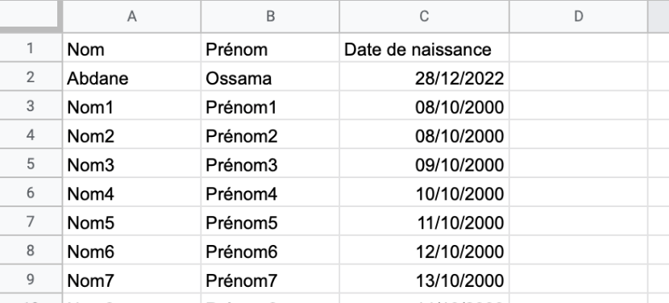
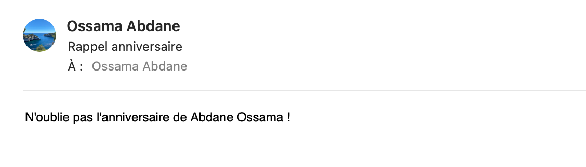

<!-- début résumé -->
Après un premier MON qui m'a permis de découvrir les principales fonctionnalités de Google AppScript, j'ai décidé d'approfondir mes connaissances dans ce domaine et plus précisément créer un outil qui permette de prévenir automatiquement par mail de la date d'anniversaire d'une personne.
<!-- fin résumé -->

### Présentation de la fonction utilisée

Le fonction `Date()` permet de transformer une donnée en date sous le format voulu par Google Appscript.
L'utilisation des extensions suivantes permet d'obtenir des informations voulus à partir de la date sélectionnée :

|Fonction |Utilisation | Résultat |
|:----|:----|:----|
| aujourdhui = new Date() | Attribue la date du jour | Tue Dec 27 2022 19:41:46 GMT+0100 (Central European Standard Time) |
|.getFullYear() | Permet d'extraire l'année | 2022 |
|.getMonth()+1 |Permet d'extraire le mois | 12 |
|.getDate() |Permet d'extraire le jour | 27 |
|.getDay() |Permet d'extraire le jour de la semaine (1 étant lundi) | 2 |
|.getHours() |Permet d'extraire l'heure | 19 |
|.getMinutes() |Permet d'extraire les minutes| 41 |


### Création d'un tableau d'anniversaire 

Il faut d'abord commencer par créer un Google sheet avec une liste de personnes et leur date de naissance comme le tableau suivant :



### Codage de la fonction

```java

function sendBirthdayEmail() {
  // Récupère le tableau 
  var sheet = SpreadsheetApp.getActiveSheet();
  
  // Récupère la dernière ligne du tableau
  var derniereligne = sheet.getLastRow();
  
  // Récupère la date d'aujourd'hui
  var ajourdhui = new Date();
  
  // Boucle pour chaque ligne du tableau 
  for (var i = 2; i <= derniereligne; i++) {
    // Récupère la date d'anniversaire de la troisième colonne de la ligne
    var anniversaire = sheet.getRange(i, 3).getValue();
    
    // Vérification si la date d'anniversaire est la même que la date du jour
    if (anniversaire.getDate() == ajourdhui.getDate() && anniversaire.getMonth() == ajourdhui.getMonth()) {
      // Récupère le nom et prénom de la personne
      var nom = sheet.getRange(i, 1).getValue();
      var prenom = sheet.getRange(i, 2).getValue();
      
      // Envoie un email avec comme objet " Rappel anniversaire " et comme contenu "N'oublie pas l'anniversaire de [Nom] !"
      MailApp.sendEmail("ossama84130@gmail.com", "Rappel anniversaire", "N'oublie pas l'anniversaire de " + nom +" " + prenom + " !");
    }
  }
}

```


### Activation d'un déclencheur quotidien

Il va ensuite falloir mettre en place un déclencheur qui va tout les jours exécuter la fonction et donc vérifier dans le tableau si un anniversaire a lieu aujourd'hui. 


### Mail de Rappel

Si une date d'anniversaire correspond à la date du jour, un mail est envoyé à l'email indiqué. 



### Autre fonction utile

Une fonction qui permet de vérifier si le tableau a été rempli par toutes les personnes. Elle va donc vérifier comme par exemple sur le tableau suivant si les personnes ont indiqué leur présence dans la quatrième colonne :  


La fonction à rentrer :

```java

function Verifremplissage() {
  // Récupère le tableau 
  var sheet = SpreadsheetApp.getActiveSheet();
  
  // Récupère la dernière ligne du tableau
  var derniereligne = sheet.getLastRow();
  
  // Boucle sur chaque ligne
  for (var i = 1; i <= derniereligne; i++) {
    // Récupère la valeur de la quatrième colonne
    var value = sheet.getRange(i, 4).getValue();
    
    // Si la case est vide
    if (value == "") {
      // Récupère l'adresse email de la troisième colonne
      var email = sheet.getRange(i, 3).getValue();
      
      // Envoie un email à l'adresse email
      MailApp.sendEmail(email, "Attention", "Vous n'avez toujours pas rempli le tableau. Merci de le faire le plus rapidement possible");
    }
  }
}

```

Le mail envoyé aux personnes n'ayant pas rempli le tableau :


### Ressources utilisées

* Le site Numerilog : https://thierryvanoffe.com
* Le site de Google : https://developers.google.com/apps-script/guides/triggers
* La Playlist tuto de Tuto de rien : https://youtube.com/playlist?list=PLozmtcO5OqdqZZ6sP6faU18jIdyCiiYvS