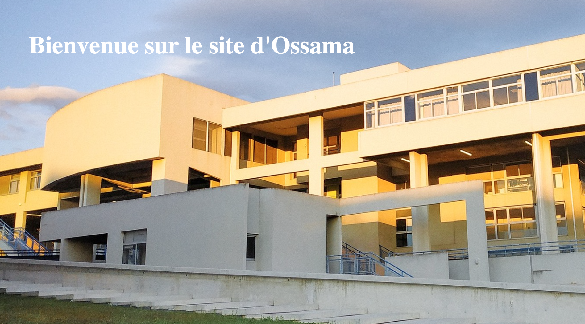
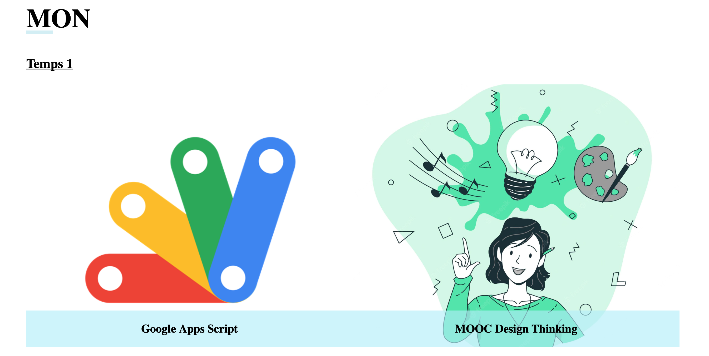
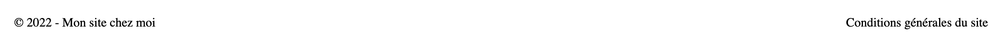

<!-- début résumé -->
Mon pok qui crée un site web chez moi.
<!-- fin résumé -->

### Introduction 
N'ayant aucune notion de création de site internet, j'ai voulu utlisé le temps accordé à ce premier POK pour découvrir et acquérir de nouvelles compétences informatiques. 

### Les premiers pas
Au départ, il a fallu trouvé les ressources nécessaires pour débuter en language htmlet CSS. Après différents tutoriels trouvés sur internet, j'en ai trouvé un très complet et intéressent. 
Il explique pas à pas comment créer un site internet en étant débutant. Il prend le temps de vraiment expliquer toutes les tâches, le fontionnement de chaque ligne et comment l'adapter à ce qu'on souhaite faire.  

### Création du site

#### Réglages généraux 
 
Quelques réglages qu'il suffit de mettre au départ sur le code CSS :

- Enlever les marges automatique pour que ça soit plus esthétique lorsque l'on place une image en fond par exemple.

            body{
                margin: 0 auto;
            }

- Modifier le scroll pour qu'il soit plus fluide. 

              html {
                  scroll-behavior: smooth ;
              }

#### En-tête de page 

On va passer à la création de l'en-tête du site, il s'agit dune bande tout en haut du site où l'on va placer 3 boutons cliquable.
Création du bandeau avec du html :

          <header>
                       
                      <nav class="nav">
                      <li><a href="index.html">Acceuil</a></li>
                      <li> <a href="#MON">MON</a></li>
                      <li> <a href="#POK">POK</a></li>
                      </nav>

                  </header>

Après l'avour créer, on va utiliser du CSS pour modifier ses carctéristiques, on va par exemple indiquer le taille du logo ou la couleur du fond.

            header {
                display: flex;
                align-items: center;
                background-color: #b6f5faa5;
            }
            header img {
                width: 180px;
            } 

On va égalment le CSS pour disposer les futurs boutons cliquable de la manière dont on souhaite :

            nav.nav {
                font-weight: bold;
                width: 300px;
                display: flex;
                list-style: none ;
                justify-content: space-between;
                margin-left: 60px;

            }
            nav.nav li a {
                color: white;
                text-decoration: none ; 

A la fin, en compilant toutes nos lignes de comandes, on obtient le résultat suivant :

#### La landing page 

La landing page est la première chose qu'une personne verra en arrivant sur le site, il faut y retrouver le titre ou le slogan que l'on souhate y placer. 

            

                      <h1 class="big-title">Bienvenue sur le site d'Ossama </h1>
                  

                  
Comme précedemment, on va utiliser le CSS pour mettre en place ce que l'on souhaite. On va chosir notre image de fond, sa taille, le type d'affichage, la taille du titre...

                  section.top-page { 
                      background: url(../Photo_ecole.jpeg);
                      background-size: cover;
                      height: 80vh;
                  }

                  /* Titre principal */
                  .big-title {
                      color: white;
                      font-size: 40px;
                      padding: 20px 50px;
                  }

En utilisant les paramètres précedents, on obtient :

#### Structuration de la partie POK et MON

On va passer à la partie la plus importante, les différents parties ou j'ai décidé d'y presenter les MON et POK que j'ai choisi. 

    <section class="MON" id="MON">
        <h2 class="section-title">
             MON
        </h2>
        <h3 class="sous-titre">
            Temps 1 
        </h3>
        

            <a class="mon-box mon1">
                

                    

                        Google Apps Script
                    

                

            </a>
            <a class="mon-box mon2">
                

                    

                        MOOC Design Thinking
                    

                

            </a>
        

On va maintenant régler la disposition des différents éléments créés grâce au CSS. 
Modification de la taille du titre, de sa disposition et de la bande qui va contenir le titre : 

        .section-title {
            font-size: 50px;
            position: relative;
        }

        .section-title::before {
            content: "";
            position: absolute;
            background-color: #d4eef4;
            width: 50px ;
            height: 7px;
            bottom: 0;
        }
        
- Choix de la taille des cases pour la dsiposition et du type d'affichage du fond :

        .mons {
            min-height: 500px ;
            display: flex;
            flex-wrap: wrap ;
        }

        .mon-box{
            position: relative;
            background-size: cover ;
            background-position: center;
            min-width: 350px ;
            height: 500px ;
            flex: 1 ; 
        }

- Choix des images des MON :

        .mon1 {
            background-image:url( ../App-script.png)
        }

        .mon2 {
            background-image:url( ../Design.webp) 
        }

Le résulat obtenu :

#### Bas de page 

Comme tous les sites, il faut créer un bas de page où l'on va mettre les conditions générales d'utilisation et les droits de diffusion. Sur le code je n'ai pas mis de lien pour les conditions mais il suffit d'en insérer un entre les guillemets. 

          <footer>
                  
&copy; 2022 - Mon site chez moi 

                  <a href="" class="cgv">Conditions générales du site </a>
              </footer>

On va également, chosir la manière de dispoistion et d'affichage avec le CSS.  

             footer {
                  display: flex;
                  justify-content: space-between;
                  align-items: center;
                  margin: 20px 100px;
              }

              footer a.cgv{
                  text-decoration: none;
                  color: black ;
              }

Le résulat obtenu :

#### Résultat final 

Le résultat final est disponible sur le lien suivant : [Github](https://github.com/ossamaabdane/Mon-site-chez-moi). On compilant le code en local, cela permet d'avoir un aperçu du site. 

### Ressources utilisées
Le lien vers mon code : [Github](https://github.com/ossamaabdane/Mon-site-chez-moi)
Tutoriel Youtube : https://www.youtube.com/watch?v=6hCGTJCo_Uo&t=2213s