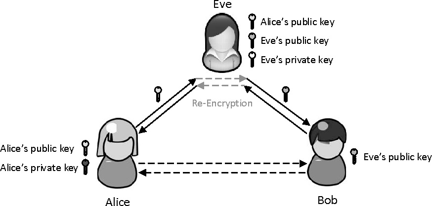
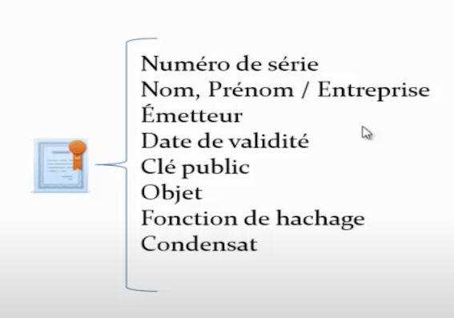

<!-- début résumé -->
- Hachage et chiffrement
<!-- fin résumé -->

## Hachage et chiffrement

Il faut distinguer le hachage et le chiffrement. Le hachage a pour but de chiffrer une donnée, et le résultat du hachage, le hash, ne doit en aucun cas permettre de retrouver la donnée initiale. Au contraire, le chiffrement permet de chiffrer une donnée à l'aide d'une clé de chiffrement, et à l'aide d'une clé de déchiffrement, la donnée initiale peut être retrouvée.

Dans ce premier MON, j'essaierai d'expliquer :

- d'une part à quoi sert le hachage, et quels sont les différentes méthodes et agréments à utiliser pour avoir un hachage fiable,
- d'autre part comment est utilisé en permanence le chiffrement sur internet.

### Hachage

Le hachage sert à protéger les données qui circulent sur internet. Dans ce chapitre, on parlera seulement du hachage des données utilisateur se trouvant sur un serveur, en particulier des mots de passe.

**Pourquoi c'est si important, de hacher les mots de passe des utilisateurs ?**

Le stockage en clair est à prohiber pour stocker les mots de passe utilisateur (même si on découvre très régulièrement des sites stockant les mots de passe en clair). En effet, si quelqu'un arrive à avoir accès à votre base de données, il pourra directement accéder à tous les comptes enregistrés.

Pour éviter cela, on enregistre les mots de passe hachés en base de données. Cela se fait grâce à une fonction de hachage. Une telle fonction doit:

1. $f(a) \neq f(b) \implies a \neq b$. Un hash différent implique que l'on a rentré un mauvais mot de passe.
2. $f(a) = f(b) \implies a = b$. On veut qu'un même hash implique nécessairement que le mot de passe fourni soit le bon. Cette condition d'injectivité n'est pas possible en pratique car le hash produit à une longueur fini, tandis qu'il existe une infinité de mots de passe possibles. Lorsque deux mots de passe donnent un même hash, on parle de collision. On essaie au maximum de limiter les collisions pour notre fonction de hachage.
3. On veut que notre fonction de hachage soit complexe et pas trop rapide. En effet, une fonction trop rapide pourrait faciliter les attaques par force brute. Cette dernière condition n'est pas tojours respectée.

Il existe de nombreuses fonctions de hachage de la plus simple à la plus élaborée. Avec l'amélioration de la puissance de calcul et des méthodes d'attaque, des algorithmes de hachage sont régulièrement dépréciés par la communauté ; c'est ainsi qu'on préfèrera d'autres algorithmes que le MD5 ou les SHA-1 pour stocker des données sur le long terme.

Les algorithmes considérés comme fiable (même si aucun n'est infaillible) aujourd'hui sont par exemple les [SHA-2](https://fr.wikipedia.org/wiki/SHA-2) (SHA-256 ou SHA-512, élaborés par la NSA), ou des algorithmes comme [bcrypt](https://fr.wikipedia.org/wiki/Bcrypt) ou scrypt. Cependant, quelques experts ne conseillent pas les SHA-2 pour les stockages des données sur le long terme, car ces algorithmes sont très rapides, et donc faciliteraient des attaques par force brute (plus le hachage est rapide, plus on peut tester de mots de passe). À l'inverse, un algorithme comme bcrypt est considéré comme lent (on peut choisir le temps de traitement du hash), ce qui limite le nombre de mots de passe essayé par seconde. Il est cependant assez rapide pour ne pas être gênant pour l'utilisateur. C'est donc un des algorithmes privilégié par la communauté.

**Concrètement, comment ça se présente en base de données ?**

En base de donnée, pour chaque utilisateur on va trouver quelque chose comme ça dans la partie mot de passe:

`pbkdf2:sha256:80000$salt$hash`

Par exemple, pour le hachage de `abc` avec SHA-256, sans salt: 

`pbkdf2:sha256:80000$$ba7816bf8f01cfea414140de5dae2223b00361a396177a9cb410ff61f20015ad`

**Mais c'est quoi, le salt ?**

Avant de voir ce que c'est, on va d'abord regarder comment un *hacker* pourrait, ayant la base de données, essayer de retrouver un mot de passe d'utilisateur. Une attaque est toujours un compromis entre puissance de calcul et mémoire. On va lister ici 4 types d'attaques (il en existe sûrement d'autres, découvertes ou à découvrir) : 

- Attaque par [*brute force*](https://fr.wikipedia.org/wiki/Attaque_par_force_brute). Le pirate va tester successivement des mots de passe, choisis de façon plus ou moins aléatoire. Cette attaque ne demande pas ou peu d'espace mémoire, mais énormément de puissance de calcul pour tester un maximum de combinaisons.
  - Attaque par dictionnaire. C'est un type d'attaque par brute force. On va tester ici des mots présents dans le dictionnaire choisi (anglais, français, [*leet speak*](https://fr.wikipedia.org/wiki/Leet_speak)...).
- Attaque par tableau. On va avoir dans le tableau un ensemble de couple (clé, valeur), la clé correspondant au mot de passe et la valeur correspondant à son hachage dans l'algorithme demandé. Si il existe une correspondance entre un hachage présent dans la base de données et un présent dans le tableau, on le trouvera quasi instantanément. Le problème de cette méthode est qu'elle requiert une quantité colossale de mémoire.
- Attaque par [*rainbow tables*][1]. C'est un compromis temps-mémoire. Le but est le même qu'une attaque par tableau, sauf que plus de valeurs pourront être indirectement stockées.

Les problèmes qui ont mené à l'utilisation du salt sont les suivants :

- Les gens ont tendance à utiliser des mots qui existent pour leurs mots de passe,
- Les gens ont tendance à réutiliser les mêmes mots de passe.

Donc, sachant cela, une attaque par tableau devient très efficace. 

D'abord, si vous remarquez que 2 personnes (ou plus), ont le même hash, alors votre domaine de recherche se restreint (il y a de forte chance que ce soit un mot du dictionnaire). 
Aussi, on peut trouver sur internet beaucoup mots de passe qui ont fuités. En téléchargeant ces tables de mots de passe, il se pourrait bien qu'un utilisateur est utilisé le même mot de passe et que l'on puisse donc trouver une concordance.

**Mais donc, c'est quoi le salt ?**

Le salt est une chaîne de caractères aléatoire que l'on va venir concaténer à chaque mot de passe utilisateur. Au moment d'enregistrer le mot de passe en base de données, on peut faire (il existe d'autre manière de grêfer le salt) :

$hash(mot de passe + salt)$

En base de données, on a quelque chose comme ça : 

`pbkdf2:sha256:80000$salt$hash`

On a donc l'algorithme de hash (SHA-256), le salt **en clair** et le hash du $(mot de passe + salt)$.

Ainsi, il sera inutile comparer les hash de la base de données aux hash déjà existant dans les tableaux, sachant qu'un salt aléatoire est généré pour chaque utilisateur. Lors d'un *login*, le server va grêfer le salt (qu'il peut lire car il est en clair sur sa bdd) à notre mot de passe et hacher le tout. Il pourra ensuite comparer à la base de données, et accorder l'accès ou non.

Le salt limite donc fortement les attaques par tableaux.

**Après le salt, le pepper !**

Pour limiter les attaques par force brute, on peut réaliser plusieurs choses. Déjà, plus un mot de passe sera long, aléatoire, avec des majuscules, minuscules, chiffres, caractères spéciaux... plus il sera difficile à trouver (cf [temps pour craquer un mot de passe en 2022](https://www.iphon.fr/post/combien-temps-pour-craquer-identifiants-mots-de-passe)). Pour ralonger artificiellement la longeur d'un mot de passe, on peut décider de faire ça : 

$hash(mot de passe + salt + pepper)$

Où le pepper est une chaîne de caractères unique pour tous les utilisateurs. On veillera à garder très précieusement le pepper (donc pas dans la base de données...) et à ne le communiquer à personne.

Dès lors, si votre pepper est assez long et qu'il n'est pas compromis, il deviendra très difficile d'attaquer les mots de passe par force brute.

### Chiffrement et connexion https

Les connexions sécurisées https sont utilisées en permanence sur internet. N'importe quel moteur de recherche récent vous enverra une notification plus ou moins alarmiste lorsque vous vous connectez sur un site non sécurisé (ou pire, avec un certificat auto-signé...).

Mais, vous êtes-vous déjà demandé comment s'établissent les connexions sécurisées https ? Pourquoi ose-t-on envoyer nos données, parfois intimes ou bancaires, sur internet seulement en sachant vaguement qu'un petit cadenas en haut à gauche de la barre de recherche nous protège ?

Voyons d'abord séparément les briques pour construire une connexion sécurisée, avant d'expliquer comment tout cela s'agence.

**Cryptographie symétrique**

La cryptographie symétrique en image (par [libreCours](https://librecours.net/module/culture/intro-chiffrement/chiffrement-sym.xhtml)).

La [Cryptographie symétrique](https://fr.wikipedia.org/wiki/Cryptographie_sym%C3%A9trique) est connu depuis longtemps (Antiquité). Elle consiste simplement à chiffrer et déchiffrer un message avec une même clé. Le chiffrement symétrique est très rapide tout en permettant une sécurité plus que raisonnable. Par exemple, pour [AES](https://fr.wikipedia.org/wiki/Advanced_Encryption_Standard), l'algorithme le plus utilisé, la clé est stockée sur 128 bits (donc $2^{128}$ clés possibles). Il peut être considéré comme *sûr* tant qu'il n'y a pas de meilleure attaque que par force brute.

La cryptographie symétrique est la méthode utilisée pour transférer les données **une fois la connexion établie**. Mais, avant de commencer la communication sécurisée, il faut partager la clé de chiffrement. Et, si vous transmettez cette clé *en clair*, elle peut être interceptée par tous les intermédiaires de la communication, malveillant ou non, et ils pourront tous déchiffrer ce que vous communiquez avec votre interlocuteur.

Le but est donc d'arriver à faire parvenir la clé de chiffrement au serveur sans que les intermédiaires puissent y avoir accès.

**Cryptographie asymétrique**

La [cryptographie asymétrique](https://fr.wikipedia.org/wiki/Cryptographie_asym%C3%A9trique) repose sur **deux clés** pour **chaque** interlocuteur. Le client et le serveur auront donc chacun **une clé publique** (elle peut être partagée a tous) et **une clé privée** (à garder précieusement, seulement pour soi).

Le fonctionnement de la cryptographie asymétrique est le suivant : la clé publique déchiffre ce que la clé privée chiffre, et réciproquement. On utilise cette cryptographie à deux fins :

- Vérifier l'auteur du message. En effet, comme vous êtes le seul à posséder votre clé privée, il vous suffit de chiffrer un message avec celle-ci. Tous ceux qui déchiffreront ce message avec votre clé publique pourront le lire, et vous serez le seul qui a pu l'écrire lisiblement. On utilise une [*checksum*](https://fr.wikipedia.org/wiki/Somme_de_contr%C3%B4le) (somme de contrôle) pour vérifier que le message n'a pas été modifié après l'envoi.
- Transmettre un message de façon sécurisée.

La procédure pour transmettre une clé de chiffrement **symétrique** à l'aide du chiffrement **asymétrique** est le suivant : 

1. Vous envoyez une requête au serveur lui demandant sa clé publique. Vous lui transmettez également votre clé publique.
2. Le serveur vous répond avec sa clé publique (dans un certificat, nous verrons ensuite pourquoi).
3. Après la réponse du serveur, vous envoyez la clé de chiffrement symétrique que vous voulez utiliser. Avant l'envoi, il faut que vous la chiffrer successivement :
   1. Avec votre clé privée : elle permettra de vous authentifier,
   2. Avec la clé publique du serveur : elle permettra à ce que seul le serveur puisse déchiffrer le message à l'aide de sa clé privée.

La cryptographie asymétrique en image (par Jp.simon.manz sur [wikipedia](https://fr.wikipedia.org/wiki/Cryptographie_asym%C3%A9trique)). Le condensat est simplement une manière de vérifier que le message n'a pas été modifié après l'envoi (c'est le résultat de la [*checksum*](https://fr.wikipedia.org/wiki/Somme_de_contr%C3%B4le)). En pratique, vous n'avez pas besoin de transmettre votre clé publique au serveur, car vous authentifier n'est pas nécessaire pour lui. Pour la communication, il suffit que vous lui transmettez votre clé de chiffrement symétrique chiffrée avec sa clé publique. Vous pourrez ensuite discuter de façon sécurisée.

Aujourd'hui, on utilise principalement le [chiffrement RSA](https://fr.wikipedia.org/wiki/Chiffrement_RSA) comme algorithme de cryptographie asymétrique. Les clés utilisées font de 1024 à 2048 bits (beaucoup plus que les 128 bits de [AES](https://fr.wikipedia.org/wiki/Advanced_Encryption_Standard)). Les communications restent rapide car on se contente seulement de transmettre la clé de chiffrement symétrique. On ne sécurise pas seulement les connexions https avec RSA, mais aussi les terminaux de paiement par exemple. Nous devons donc nous assurer de la sûreté de cette algorithme. Le temps pour *craquer* la clé privée du chiffrement RSA croit exponentiellement avec la longueur de la clé. En 2020, le plus long message *craqué* faisait 829 bits. Les clés utilisées aujourd'hui sont encore considérées comme *sûres*, ce qui pourrait être remis en question avec les [ordinateurs quantiques](https://fr.wikipedia.org/wiki/Calculateur_quantique), qui ont des [algorithmes de factorisation](https://fr.wikipedia.org/wiki/Algorithme_de_Shor) beaucoup plus efficaces que les ordinateurs classiques (mais pas d'inquiétude, d'autres ont pensé à des méthodes de [cryptographie quantique](https://fr.wikipedia.org/wiki/Cryptographie_quantique)...).

Enfin bref, avec ce procédé, vous pouvez enfin commencer à communiquer (et plus rapidement qu'avec la cryptographie asymétrique) ! A moins que... ce ne soit pas au serveur que vous parlez ?

***Man in the middle***

 Lors de la première connexion entre vous et le serveur, qu'est-ce qui empêcherait un *hacker* de se placer entre vous deux, d'intercepter votre requête contenant votre clé publique, de remplacer cette clé publique par la sienne, et de transmettre cette donnée au serveur ? Ensuite, lors de la réponse du serveur, il pourrait vous transmettre non pas la clé publique du serveur, mais la sienne. Ainsi, lorsque vous transmettrait la clé de chiffrement symétrique, que vous avez chiffrée avec la clé publique du *hacker* en pensant que c'était celle du serveur, il interceptera le message, le déchiffrera, et le transmettra finalement au serveur. Ainsi, il pourra déchiffrer et modifier toutes les communications entre vous et le serveur car il a intercepté la clé de chiffrement symétrique. Pourtant, de votre point de vue ou de celui du serveur, vous ne vous rendez compte de rien et vous avez l'impression de communiquer sans intermédiaire.

 En supposant que le serveur est Alice, le *hacker* est Êve et que vous êtes Bob :

Man in the middle (image par [Liu Tao](http://tao93.top/2020/03/31/Secure%20communication%20basics/)).

C'est ce que l'on appelle une attaque *man in the middle*. Le *hacker* peut se placer entre vous et votre *router*, ou plus rarement sur le réseau internet. Ces attaques sont très fréquentes sur les réseaux non sécurisées, là où vous ne connaissez pas les autres appareils connectés au réseau.

Pour éviter ce type d'attaque, on utilise des certificats pour établir une connexion https.

**Certificats**

Voici ce que contient un [certificat](https://fr.wikipedia.org/wiki/Certificat_%C3%A9lectronique) :

Cerficat en image (par [Yann Bidon](https://www.youtube.com/watch?v=FSq-FXx5dxU&t=1s&ab_channel=YannBidon)).

Un certificat permet d'assurer l'identité d'une entité. Il contient entre autres choses la clé publique, et un condensat (qui est le résultat des données du certificat passée dans la fonction de hachage (*checksum*)) pour vérifier qu'il n'a pas été modifié.

Pour se faire délivrer un certificat (et donc ouvrir son site en https, entre autres), il faut le demander à une [autorité de certification](https://fr.wikipedia.org/wiki/Autorit%C3%A9_de_certification), qui vous délivrera une clé publique, moyennant finance. Les autorités de certifications sont nombreuses ; en fait, une autorité de certification est certifiée par une autre autorité de certification, qui est certifiée par une autre... et ainsi de suite. Jusqu'à arriver à une autorité de certification *racine*, comme la gendarmerie, le ministère de la Justice ou Google. Ces autorités sont considérées comme des tiers de confiance.

Bref, pour avoir un certificat, l'autorité de certification vérifie votre identité, et vous attribue un certificat avec une clé publique si les données sont valides. Ce certificat n'est pas modifiable (sinon la *checksum* ne correspond pas au condensat) et les moteurs de recherche ont dans leur base de données des autorités de certification valides, ce qui met en garde contre les certificats auto-signés (il est possible et tout a fait légal d'auto-signer un certificat, mais un moteur de recherche récent vous mettra des *warnings* vous disant que vous êtes en danger... Ce n'est pas forcément vrai, c'est seulement que le serveur s'auto-certifie, à vous de voir ce que ça vaut...). Donc, si vous accéder à un site https avec un certificat valide, vous pouvez normalement être sûr de communiquer directement avec le serveur.

Quand vous êtes connecté à un site en https, vous pouvez vérifier le certificat utilisé. Il vous suffit de cliquer sur le cadenas > la connexion est sécurisée > certificat valide (ou quelque chose comme ça). Vous pourrez alors retrouver toutes les informations du certificat.

Donc, reprenons la procédure lorsque que vous voulez établir une connexion sécurisée avec un serveur. Le but est d'échanger une clé de chiffrement symétrique sans pouvoir être espionné par un tiers :

1. Vous envoyez une requête au serveur lui demandant sa clé publique.
2. Le serveur vous répond avec sa clé publique dans un certificat valide. Vous pourrez alors être sûr que vous avez en votre possession la clé publique du serveur, ce qui évite les attaques *man in the middle*.
3. Vous envoyez la clé de chiffrement symétrique que vous voulez utiliser. Avant l'envoi, il faut que vous la chiffrer :
   1. Avec la clé publique du serveur : elle permettra à ce que seul le serveur puisse déchiffrer le message à l'aide de sa clé privée.

Vous pourrez ensuite communiquer avec le serveur en étant assuré que personne ne peut espionner vos messages ou transmettre des informations en votre nom, tant qu'il ne trouve pas la clé de chiffrement.

Voilà, vous avez établi une **vraie** connexion https. Bravo !

### Sources

1. Stocker correctement ses mots de passe : <https://patouche.github.io/2015/03/21/stocker-des-mots-de-passe/>
2. Un guide sur comment marche les *rainbow tables* : <https://www.ionos.fr/digitalguide/serveur/securite/rainbow-tables/>
3. Comprendre un peu comment marche une connexion SSL/TCP, c'est-à-dire une connexion https : <https://www.youtube.com/playlist?list=PLYsJ-3MUn_eeYwSgJ3Z_hfrIzGqYOGAaj>

[1]: <https://www.ionos.fr/digitalguide/serveur/securite/rainbow-tables/>