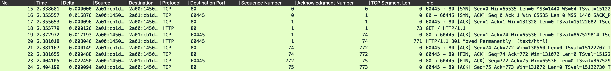
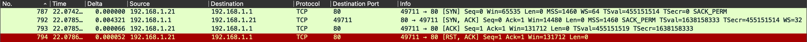
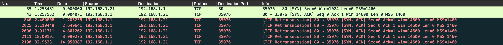

<!-- début résumé -->
- Wireshark : analyse de paquets
- Niveau : débutant à intermédiaire

<!-- fin résumé -->

## Analyse de paquets avec Wireshark

[Wireshark](https://www.wireshark.org/) est un logiciel libre et gratuit qui permet d'analyser le trafic réseau en capturant et en examinant les paquets de données qui circulent sur un réseau. Il est largement utilisé par les professionnels de la sécurité informatique, les administrateurs réseaux... pour diagnostiquer les problèmes de réseau et détecter les éventuelles attaques.

L'analyse de paquets avec Wireshark permet de comprendre le fonctionnement d'un réseau en examinant le contenu de chaque paquet de données qui y circule. Wireshark peut capturer et afficher différents types de paquets tels que les paquets TCP, UDP, ICMP, DNS... En fait, quasiment tous le trafic réseau transitant par la machine. En examinant les en-têtes de chaque paquet, il est possible de comprendre comment les données sont acheminées à travers le réseau, quelle est l'origine et la destination de chaque paquet, quels sont les ports utilisés, et quelle est la nature des données transmises... Les possibilités sont grandes et ce MON n'en donnera qu'un avant-goût.

Wireshark permet, entre autres, de :

- Capturer et filtrer les paquets en fonction de différents critères tels que l'adresse IP, le port, le protocole, etc.
- Afficher des statistiques sur le trafic réseau (par exemple, le nombre de paquets envoyés et reçus, le débit de données, etc.)
- Examiner le contenu des paquets, y compris les données brutes et les données applicatives (par exemple, les requêtes HTTP, les requêtes DNS, etc.)
- Détecter les attaques réseau telles que les attaques de déni de service, les attaques de spoofing, les scans réseaux...
- etc

Il peut être intéressant pour un expert en cybersécurité, administration réseau, développement de savoir utiliser ce logiciel.

- Il pourra avoir une vision plus claire des données qui transitent sur le réseau et comprendre les protocoles en profondeur pour en tirer d'éventuels exploits.
- Les hacker sont de plus en plus créatifs pour contourner les IDS et une analyse au niveau des paquets est parfois nécessaire pour détecter les attaques.
- Le logiciel peut permettre de comprendre d'où vient la latence pour se connecter à une application (pas assez de débit, retransmission de paquets car problème applicatif...). Énormément de problèmes de latence sont réglés en redescendant au niveau des paquets.
- etc

**[Le logiciel est téléchargeable ici](https://www.wireshark.org/download.html).**

## Modèle OSI

Le modèle OSI (Open Systems Interconnection) est un modèle de référence en informatique qui définit les normes de communication entre les différents systèmes informatiques. Ce modèle a été développé par l'ISO (International Organization for Standardization) dans les années 1980 afin de standardiser les communications entre les ordinateurs de différents fabricants et de différentes plateformes.

Le modèle OSI est constitué de sept couches, chacune représentant une étape spécifique dans le processus de communication entre les systèmes. Ces couches sont :

- Couche physique : cette couche représente le support physique de la communication.
  - ex de protocole : Fibre optique, câble, ondes radio...
- Couche liaison de données : cette couche est responsable de la gestion de la transmission de données entre les équipements connectés.
  - ex : ethernet, wifi...
- Couche réseau : cette couche est responsable de la transmission de données entre les réseaux différents, en utilisant des protocoles de routage.
  - ex : IP, ICMP, ARP...
- Couche transport : cette couche est responsable de la gestion de la transmission de données de bout en bout.
  - ex : TCP, UDP, QUIC...
- Couche session : cette couche permet l'établissement, la gestion, la fermeture de sessions, le chiffrement entre les applications des différents systèmes.
  - ex : SOCKS, (TLS, SSL) ?
- Couche présentation : cette couche est responsable de la présentation des données aux applications, en gérant les formats de données, le chiffrement et la compression.
  - ex : (TLS, SSL) ?
- Couche application : cette couche représente les applications elles-mêmes et leur interface avec les autres couches du modèle OSI.
  - ex : HTTP, SMTP, FTP, DNS, SSH...

Le modèle OSI permet de standardiser la communication entre les différents systèmes informatiques en séparant les différentes étapes de la communication en couches distinctes. Cela facilite la conception de nouveaux protocoles de communication, la résolution des problèmes et la compatibilité entre les différents systèmes. Le modèle OSI est largement utilisé dans l'industrie des réseaux informatiques pour comprendre et dépanner les problèmes de communication entre les différents équipements et applications.

 par [cisco.goffinet.org](https://cisco.goffinet.org/ccna/fondamentaux/modeles-tcp-ip-osi/).

## PING PONG

#### Définition

Lorsque vous envoyez un ping à un serveur, vous utilisez le protocole ICMP pour tester la connectivité réseau entre votre système et le serveur. Le ping envoie un message ICMP ECHO_REQUEST à l'adresse IP du serveur que vous voulez tester. Le serveur recevra alors ce message et répondra avec un message ICMP ECHO_REPLY. Voici comment cela se déroule en détail :

- Envoi du PING (ICMP ECHO_REQUEST) : Lorsque vous envoyez un ping à un serveur, votre système envoie un message ICMP ECHO_REQUEST à l'adresse IP du serveur. Ce message contient un champ d'identification et un champ de numéro de séquence, ainsi qu'un champ de données qui peut être utilisé pour transporter des informations supplémentaires.

- Réception du PING et envoi du PONG (ICMP ECHO_REPLY).

- Réception du PONG : votre système utilise le champ d'identification et le champ de numéro de séquence pour identifier la réponse correspondante à la demande d'envoi de ping et calcule le temps écoulé entre l'envoi et la réception de la réponse. Cela permet à votre système de mesurer le temps de latence entre votre système et le serveur.

Si le serveur ne répond pas au message ICMP ECHO_REQUEST, la machine n'est pas atteignable / n'a pas répondu. Le ping est utilisé pour diagnostiquer les problèmes de réseau et tester la connectivité entre les systèmes.

#### Dans Wireshark

On lance la capture de paquets. Avec la commande `ping google.com` :

Pour trouver les paquets en question, on peut utiliser des filtres. Je vous renvoie à [cette vidéo](https://www.youtube.com/watch?v=aEss3CG49iI&ab_channel=DavidBombal) pour avoir plus de détails. Par exemple, on peut filtrer avec :

`ip.addr == 192.168.1.21 && icmp`

Ensuite, on peut prendre un paquet et faire [clique droit > conversation filter > ethernet] pour avoir son contexte.

On a :

- Une requête + réponse DNS pour résoudre l'IP de google.com
- ping request et ping response.

On peut examiner les paquets en détail et s'intéresser au champs présents dans un paquet ICMP (source ip, destination ip, [ttl](https://fr.wikipedia.org/wiki/Time_to_Live)...)

Assez simple, jusque-là. On peut aussi recommencer une capture et préciser la payload (nombre d'octets) à envoyer par [trame](https://fr.wikipedia.org/wiki/Trame_(informatique)) :

`ping -s 1500 google.com`

puis :

`ping -s 1500 -D google.com`

Et là, problème. Vous pouvez essayer de comprendre dans Wireshark et allez voir [cette ressource](https://www.youtube.com/watch?v=J-gnDC6B5eE&t=3312s&ab_channel=DavidBombal) pour en savoir plus.

## TCP

#### Définition

TCP (Transmission Control Protocol) est un protocole de transport fiable et orienté connexion utilisé pour la transmission de données sur les réseaux informatiques. Il est l'une des deux options principales de la couche transport du modèle OSI (l'autre étant UDP). TCP fournit une communication bidirectionnelle, de bout en bout et fiable, c'est-à-dire qu'il garantit la livraison des données sans erreur.

Pour cela, TCP utilise une méthode appelé le three-way handshake. Le 3-way handshake est un mécanisme de synchronisation à trois étapes utilisé par TCP pour établir une connexion fiable et orientée connexion entre deux systèmes. Voici les étapes du 3-way handshake :

- SYN : Le système émetteur envoie un segment SYN (Synchronize) au système destinataire pour indiquer qu'il souhaite établir une connexion TCP. Ce segment contient un numéro de séquence initial choisi par l'émetteur. Dans wireshark, un numéro noté *relative sequence number* est ramené à 0 pour nous faciliter le comptage, mais il s'agit en fait d'un très grand nombre aléatoire pour identifier de manière unique la connection TCP en cours (dans wireshark, il s'appelle *sequence number (raw)*).

- SYN-ACK : Le système destinataire répond avec un segment SYN-ACK (Synchronize-Acknowledgment) pour indiquer qu'il est prêt à établir la connexion. Ce segment contient entre autres : Dans le SYN, un nouveau numéro de séquence. Dans le ACK, le numéro de séquence initial choisi par l'émetteur initial + 1.

- ACK : Le système émetteur répond avec un segment ACK pour confirmer la réception du segment SYN du destinataire. Ce segment contient également le numéro de séquence du SYN du destinataire + 1, qui indique que la connexion a été établie avec succès.

Une fois que le 3-way handshake est terminé, les deux systèmes peuvent commencer à échanger des données de manière fiable et ordonnée. Les segments de données envoyés par TCP contiennent un numéro de séquence qui permet à celui qui réceptionne les données de les réassembler dans le bon ordre.

#### Dans Wireshark

[Ressource](https://www.youtube.com/watch?v=rmFX1V49K8U&list=PLW8bTPfXNGdCR0RjCBwHM0EzfVKQfpn1m&ab_channel=DavidBombal).

On lance la capture de paquets. Avec la commande `curl google.com` :

Pour avoir la capture en question, on peut appliquer le filtre `http`. Ensuite, [clique droit > follow TCP stream] sur le paquet.

*Note* : pour ajouter des colonnes : dans le cadre en bas à gauche, clique droit sur la donnée et apply as a column

Les trois premiers paquets correspondent à l'établissement de la connexion : SYN, SYN-ACK, ACK. Je vous invite à étudier ces paquets.

 En fait, le *acknowledgment number* est incrémenté de 1 + taille du paquet reçu à chaque réception 

## Analyse scan Nmap

#### Scan Full TCP connect

**Exo :** faites un scan [nmap](https://nmap.org/) full TCP connect sur une machine de votre réseau. Comment détecter que c'est un scan Nmap ?

 
 `nmap -sT 192.168.1.1`
 En regardant paquet par paquet, c'est difficile à remarquer... Chaque paquet TCP est normal et comporte toutes les options classiques d'un paquet TCP. Le comportement global est cependant étrange (SYN, SYN-ACK, ACK, RST-ACK), on établit une connection pour la fermer brutalement ensuite (flag RESET : "Le bit de réinitialisation a été prévu pour des situations comme celle où un ordinateur A « plante » ou est éteint alors qu'une connexion TCP était en cours avec un ordinateur B." [wikipedia](https://fr.wikipedia.org/wiki/Attaque_TCP_reset)). On aurait pu aussi préciser le port pour éviter de tout scanner et d'éveiller les soupçons. Finalement, on comprend facilement qu'un scan comme ça est facile à détecter par les IDS.
 
 

#### SYN ("stealth") scan

**Exo :** faites un SYN scan [nmap](https://nmap.org/) sur une machine de votre réseau. Comment détecter que c'est un scan Nmap ?


 `sudo nmap -sS 192.168.1.1`
 Si on a réussi à établir une connexion, on a ceci dans wireshark :
 
 On voit que le client envoie un SYN, le server revoie un SYN-ACK pour établir une connexion TCP, et ensuite... plus de réponse. Le serveur retransmet alors son SYN-ACK, en supposant qu'il n'a pas été reçu, et recommence toutes les `~ 2 * delta`.
 Le SYN scan envoie un paquet SYN et attend un SYN-ACK en retour, mais ne renvoie pas de ACK au serveur. Il est donc normal d'avoir ce genre de stream. Mais du point de vue du serveur, c'est difficile à détecter, car tout se passe comme si le paquet réponse s'était perdu en chemin (d'où la retransmission).
 Cependant, en regardant attentivement, on voit que le premier SYN envoyé par le client n'est pas identique à ceux de tout à l'heure. Et oui, regardez dans les options TCP... que 4 octets. C'est très étrange, normalement un paquet TCP SYN a au moins une vingtaine d'octets d'options. Finalement, On voit qu'un *stealth scan* n'est pas si *stealth* que ça...
 

## Sources

- David Bombal and Chris Greer using Wireshark : <https://www.youtube.com/watch?v=rmFX1V49K8U&list=PLhfrWIlLOoKO8522T1OAhR5Bb2mD6Qy_l&ab_channel=DavidBombal>
