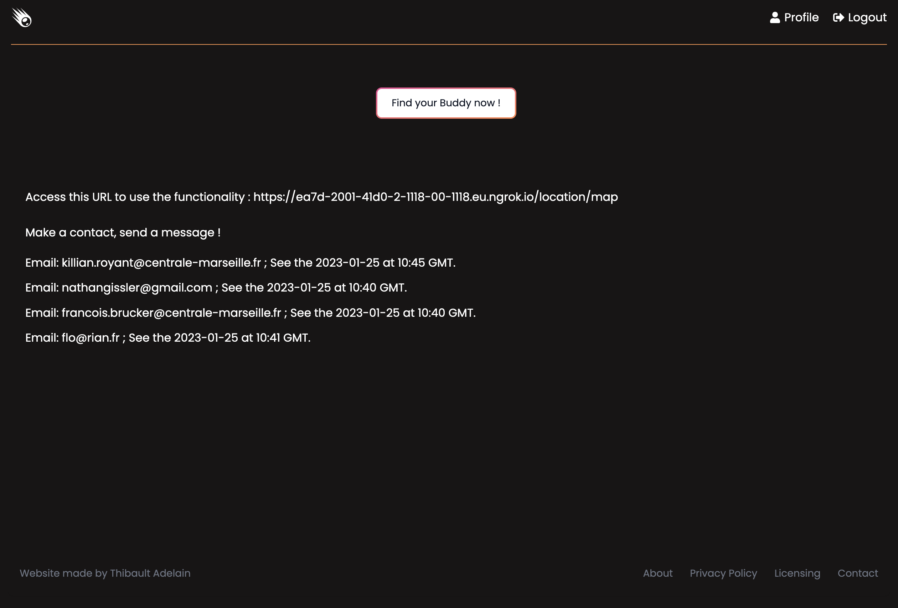

Github: <https://github.com/ThibaultAdelain/InstantBuddyNode>

Mon site : <http://node.stevia.ovh1.ec-m.fr/>

## Temps 2

### Fin de développement et déploiement

#### ToDo : 1er Sprint

- Derniers correctifs :
  - Vérifier les champs renseignés par l'utilisateur en back-end
  - Temps d'expiration des cookies de session
- Améliorer l'UI :
  - Responsive bottom bar
- Incorporer l'authentification avec google. Utilisation de [passport-google-oauth20](https://www.passportjs.org/packages/passport-google-oauth20/) :
  - Adapter le système de gestion de session avec le système actuel (cookies) : il faut que comme avec une authentification classique, un cookie de session soit envoyé après google Oauth

**Google Oauth** : j'ai utilisé ce [tuto](https://www.youtube.com/watch?v=SBvmnHTQIPY&t=3223s&ab_channel=TraversyMedia) ([repo Github](https://github.com/bradtraversy/storybooks)). J'ai également utilisé la doc de [passport-google-oauth20](https://www.passportjs.org/packages/passport-google-oauth20/), qui est assez basique ; j'ai trouvé le tuto plus clair. J'ai également adatpé le tuto pour que le serveur renvoie des cookies après l'authentification google :

```javascript
// @desc Google auth callback
// @route GET auth/google/callback
router.get('/google/callback', passport.authenticate('google', {
    failureRedirect: '/user/Register',
    session: false
}), (req, res) => {
    res.cookie("name", req.user.name, {
      ...
    })
    res.cookie("email", req.user.email, {
      ...
    })
    res.cookie("sessionID", req.user.sessionID, {
      ...
    })
    console.log('User successfully login')
    res.redirect('/')
})
```

#### ToDo : 2ème Sprint

- Déploiement sur serveur distant : <http://node.stevia.ovh1.ec-m.fr/>
  - Nécessité d'une connexion https pour accéder à la localisation ==> utilisation de [ngrok](https://ngrok.com/)
- Finir les derniers correctifs pour avoir un site fonctionnel en production, notamment :
  - Changement de la bdd : MySQL --> Postgres
  - Changer les clés secrètes

##### Ngrok

[Ngrok](https://ngrok.com/) est un outil qui permet de créer des tunnels sécurisés entre des ordinateurs distants. Il sert d'intermédiaire entre l'utilisateur et serveur ovh : utilisateur <-> ngrok <-> ovh. Les connexions utilisent le protocole sécurisé TLS, donc le navigateur peut se connecter en https et transmettre la localisation de l'utilisateur au serveur. J'ai utilisé cette solution car il n'était pas possible à l'instant t d'avoir un certificat sur le serveur ovh.

Ngrok écoute sur un port de localhost et crée un tunnel entre l'utilisateur et le serveur. Sur votre serveur, Après avoir lancé une app sur le port 8080 par exemple, rentrez en ligne de commande :

```bash
ngrok http 8080
```

Si vous utilisez une application React comme moi, il faudra peut-être plutôt écrire :

```bash
ngrok http 8080 --host-header="localhost:8080"
```

(Cf ce [post](https://stackoverflow.com/questions/45425721/invalid-host-header-when-ngrok-tries-to-connect-to-react-dev-server))

Si vous voulez en savoir plus sur ngrok: <https://grafikart.fr/tutoriels/ngrok-637>

Pour que votre appli reste en ligne même après la fermeture du terminal, vous pouvez utiliser tmux. Voici une CheatSheet des lignes de commande [tmux](https://tmuxcheatsheet.com/).

### Mon site

Mon site : <http://node.stevia.ovh1.ec-m.fr/>

Il vous faut suivre le lien ngrok.io affiché sur le page d'accueil pour pouvoir utiliser la fonctionnalité principale du site. Avec la version gratuite de ngrok, vous ne pouvez pas avoir votre propre nom de domaine.

Par ce qu'une image vaut mille mots :




#### Tuto :

- Tuto Google Oauth par TraversyMedia: <https://www.youtube.com/watch?v=SBvmnHTQIPY&t=3223s&ab_channel=TraversyMedia>.
- Passport google Oauth 20 : <https://www.passportjs.org/packages/passport-google-oauth20/>
- ngrok : <https://ngrok.com/>
- Tuto ngrok par Grafikart : <https://grafikart.fr/tutoriels/ngrok-637>