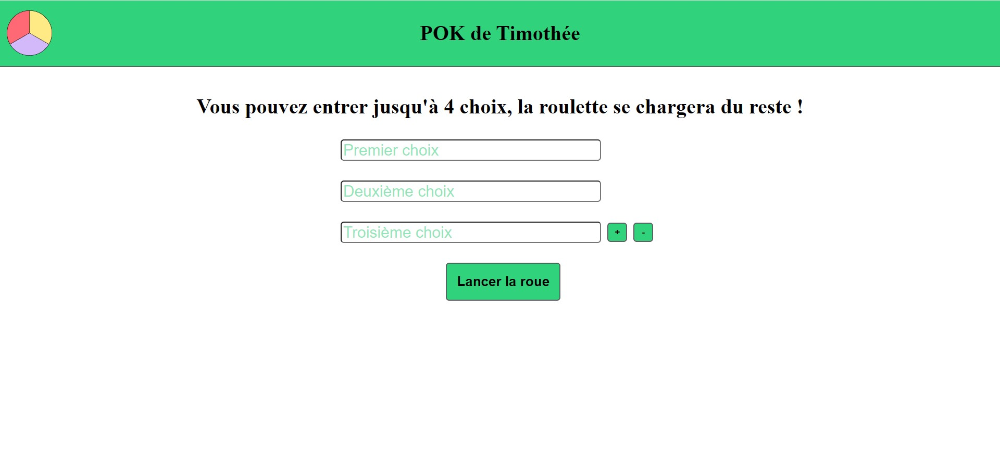

<!-- Début Résumé -->

Notre site chez nous : 
Gabriel : Jeu de Pierre, Feuille, Ciseaux en 1vs1 pour commencer puis contre l'ordinateur. 
Timothé : Réalisation d'une roulette permettant de faire des choix au hasard. 

[lien du projet](https://github.com/gabrielbarbe00/POK-de-Gabriel.git)

<!-- Fin Résumé -->


### Partie Gabriel 

Dans un premier temps, construction du site web en lui même, page accueil reliée à 2 autres pages, dévelopemment du CSS en collaboration avec Timothée. <br>
Réalisation du CSS de la page du POK, réussir à situer mon bouton où je le voulais etc. 

Dans un second temps, focus sur le petits jeu Pierre, Feuille, Ciseaux. 
Sans avoir besoin de rentrer dans les détails de ce jeu, le but était plutot de développer une interface graphique et un peu stylysé de quelque chose, ce jeu étant globalementassez facile à programmer. <br>

La partie plus technique est d'afficher les boutons et les liens effectuant ce que l'on veut au bon moment ainsi que les faire disparaitre. Une fois que cela sera fait j'aimerais généraliser ce jeu afin de pouvoir jouer contre l'ordinateur qui donne un coup aléatoire ; l'enjeu étant là encore d'avoir un graphisme cohérent avec différents boutons etc. 


J'ai donc commencé par une fonction se déclanchant après l'appui d'un bouton simple. Cette fonction demande quel coup veut effectuer chaque joueur : 

```bash
             function choixCoups (){
                var bool=false;
                while (bool===false) {
                    J1=prompt('J1 choisit son coup : Pierre, Feuille ou Ciseaux');
                    if (J1 === 'Pierre' || J1 === 'Feuille' || J1 === 'Ciseaux') {
                        bool=true;
                    } else {
                        bool=false;
                        alert('Entrez un coup valide ');}
                }
                bool=false;
                while (bool===false) {
                    J2=prompt('J2 choisit son coup');
                        if (J2 === 'Pierre' || J2 === 'Feuille' || J2 === 'Ciseaux') {
                            bool=true;
                        } else {
                            bool=false;
                            alert('Entrez un coup valide ');
                        }
                }
                PFC(J1,J2);
            }
```
PFC est ensuite une fonction déduisant le vainqueur avec des if...else. Problème : une fois le bouton appuyé, on ne peut plus refuser de jouer, le bouton "annuler" du prompt n'annule pas notre demande et affiche "entrez un coup valide". De plus, ma condition n'accepte qu'une orthographe très spécifique pour le coup voulu. Néanmoins cette fonction est satisfaisante pour notre première partie. <hr>
J'ai ensuite développé une autre méthode permettant cette fois-ci de jouer contre l'IA mais aussi de me passer du prompt pour selectionner mon coup. Dorénavant, lorsque j'appuie sur "jouer" une liste de coup disponible apparait et je n'ai qu'à cliquer sur le coup désiré. Parralèlement se lance une fonction determinant le coup de l'IA (déterminé aléatoirement). 

```bash
            function choixCoups2 () {
                var html = document.querySelector('html');

                var panneau = document.createElement('div');
                panneau.setAttribute('class', 'liste');
                html.appendChild(panneau);

                var choix = document.createElement('ul');
                panneau.appendChild(choix);

                var l1 = document.createElement('li');
                choix.appendChild(l1);

                var l2 = document.createElement('li');
                choix.appendChild(l2);

                var l3 = document.createElement('li');
                choix.appendChild(l3);

                var pierre = document.createElement('button');
                pierre.textContent='Pierre';
                l1.appendChild(pierre);
                pierre.addEventListener('click', Pierre);

                var ciseaux = document.createElement('button');
                ciseaux.textContent='Ciseaux';
                l2.appendChild(ciseaux);
                ciseaux.addEventListener('click', Ciseaux);

                var feuille = document.createElement('button');
                feuille.textContent='Feuille';
                l3.appendChild(feuille);
                feuille.addEventListener('click', Feuille);

                document.querySelector('.ensemble').style.display = 'none';
                coupOrdi();
            }
            function coupOrdi(){
                a = 1 + Math.floor(Math.random()*((4-1)));
                if (a===1){
                    J2='Pierre';
                }
                else if (a===2) {
                    J2='Feuille';
                }
                else { 
                    J2='Ciseaux';
                }
            }
```
J'ai ensuite adapté ma page afin que les deux options de jeu soit possible. Ce changement m'a pris du temps car je n'arrivais pas à identifier mes deux boutons séparément. <br>
J'ai ensuite corriger tous les bugs mineurs notamment la fonction choixCoups1 afin que l'on puisse sortir du "prompt", j'avais aussi mon élèment "panel" qui aparaissait à des moments non nécessaire et qui ne partait plus après, j'avais aussi quelques problèmes de boucles. De même, le "resetbutton" n'aparaissait pas comme je le souhaitais. <br>


Le reste du code est bien sur disponible via le lien en haut de page. 

<h2> Partie Timothée</h2>

Pour ma part, j'ai choisi de créer une roulette qui permet de sélectionner aléatoirement entre 2 à 4 choix (c'est ensuite facile d'ajouter plus de choix cela demande juste un peu plus de temps).

J'ai commencé par créer un site fonctionnel mais sans mise en page.

J'ai décidé de créer plusieurs pages:
- [Une pour la sélection des choix](#1)
- [Une pour chaque roulette](#2)

<h3 id="1"> Page de séléction des choix</h3>

<h4> Fonctionnalités</h4>

Voici les fonctionnalités que je voulais sur cette page:
- [Récupération des choix](#1-1)
- [Limitation du nombre de caractères par choix](#1-2)
- [Modification du nombre de choix](#1-3)
- [Redirection vers la page contenant la roulette](#1-4)
- [Vérification que tous les choix sont remplis](#1-5)

<h5 id="1-1"> Récupération des choix</h5>

J'ai choisi d'utilser des inputs pour la récupération des choix.

```html
<input type="text" id="text_choix1" name="text_choix1">
```

```javascript
document.getElementById('text_choix1').value
```

Étant donné que je voulais faire une page différente pour les roulettes, j'ai eu du mal à transférer les choix pour les afficher. Adrien Brunet (un intervenant) m'a conseillé d'utiliser le localStorage qui permet d'enregistrer des données dans le navigateur et de les conserver lors des changements de pages. 
Pour ce faire j'utilise la fonction :

```javascript
localStorage.setItem('text_choix1',text_choix1)
```

<h5 id="1-2"> Limitation du nombre de caractères par choix</h5>

Pour cela il suffit d'utiliser la propriété *maxLength* qui permet de fixer le nombre maximum de caractères dans un input.

```html
<input type="text" id="text_choix1" name="text_choix1" maxlength="10">
```

<h5 id="1-3"> Modification du nombre de choix</h5>

J'ai également ajouté des boutons qui permettent d'ajouter ou de supprimer certains choix.

```html
<button type="submit" id="bouton_add2" class="bouton">+</button>
```
En utilisant la fonction *addEventListener* et les propriétés *display* on peut faire apparaitre et disparaitre des *div* lorsque l'on clique sur un bouton.

```javascript
bouton_add2.addEventListener("click", () => {
div_choix3.style.display = "flex";
bouton_add2.style.display = "none";
nbr_choice = 3;
})
```
J'ai également ajouté un compteur pour savoir le nombre de choix sélectionnés.

<h5 id="1-4"> Redirection vers la page contenant la roulette</h5>

J'ai ajouté un bouton suivant qui prend en compte le nombre de choix afin de rediriger vers la bonne page avec la fonction *location.href* ainsi que d'enregistrer les choix dans le *localStorage*.

```javascript
document.getElementById("bouton_suivant").addEventListener("click", () => {
  let text_choix1 = document.getElementById('text_choix1').value
  localStorage.setItem('text_choix1',text_choix1)
  let text_choix2 = document.getElementById('text_choix2').value
  localStorage.setItem('text_choix2',text_choix2)
  let text_choix3 = document.getElementById('text_choix3').value
  localStorage.setItem('text_choix3',text_choix3)
  let text_choix4 = document.getElementById('text_choix4').value
  localStorage.setItem('text_choix4',text_choix4)
  if (nbr_choice == 2){
    if (text_choix1 != "" && text_choix2 != "") {
      location.href = "./roulette2.html"
    } else {
      alert("Remplissez les 2 choix")
    }

  } else if (nbr_choice == 3){
    
    if (text_choix1 != "" && text_choix2 != "" && text_choix3 != "") {
      location.href = "./roulette3.html"
    } else {
      alert("Remplissez les 3 choix")
    }

  } else if (nbr_choice == 4){
    if (text_choix1 != "" && text_choix2 != "" && text_choix3 != "" && text_choix4 != "") {
      location.href = "./roulette4.html"
    } else {
      alert("Remplissez les 4 choix")
    }
  }
    
})
```

<h5 id="1-5"> Vérification que tous les choix sont remplis</h5>

On peut voir dans le code précédant des *if* qui vérifient que tous les choix sont remplis et qui renvoie un message si ce n'est pas le cas :

```javascript
if (text_choix1 != "" && text_choix2 != "") {
    location.href = "./roulette2.html"
} else {
    alert("Remplissez les 2 choix")
}
```

J'arrive donc à cette page :


Il me reste donc la mise en page afin d'avoir une page qui ressemble un peu à quelque chose.

<h4> Mise en page</h4>

Pour cela j'ai ajouté un *header* en accord avec celui que Gabriel a mis dans sa partie.

Puis j'ai ajouté des propriétés CSS à chacun des éléments.

J'ai utilisé Flexbox pour la mise en page, ce qui m'a permis de centrer les éléments et de les répartir comme j'en avais envie.

J'ai créé des classes afin d'appliquer un style à mes différents éléments.

J'ai enfin utilisé la caractéristiques *placeholder* afin d'écrire les numéros des choix dans les input au lieu de les mettre au dessus.

Je suis donc arrivé à ce résultat là:




<h3 id="2"> Page pour chaque roulette</h3>

J'ai procédé de la même façon pour les différentes roulettes. Je vais donc détailler pour une seule.

J'ai tout d'abord créé une image de roulette que j'ai ensuite importé dans la page.
Grâce aux caractéristiques *position:absolute*, *rotate* et *z-index* j'ai placé les textes des différents choix sur l'image, choix que j'ai récupérer dans le local Storage. J'ai également ajouté un triangle qui permet de montrer quel choix a été tiré au sort.

Pour la rotation de la roulette j'ai utilisé les animations webkit.
```html
@keyframes rotating {
    from{
        -webkit-transform: rotate(0deg);
    }
    to{
        -webkit-transform: rotate(360deg);
    }
}
```
Et j'ai créé 2 classes :
- tourne : qui fait tourner l'animation
- pause : qui arrête l'animation

Enfin à l'aide des fonctions *Math.random* et *setTimeout* j'ai appliqué la classe *tourne* à la *div* contenant la roue et les choix pendant une durée aléatoire entre 1 et 3 secondes.

```javascript
function rotation(roue){
    document.getElementById(roue).classList = "tourne"
    random_number = Math.floor(Math.random() * (3000-1000-1)) + 1000
    console.log(random_number)
    setTimeout(() => {
        document.getElementById(roue).classList = "stop";
  },random_number)
}
```
Cette fonction se lance lorsque l'on clique sur le bouton start.

Lorsque la roue a fini de tourner un bouton retour apparait qui nous permet de retourner à la page des choix.

J'ai donc obtenu cette page :
