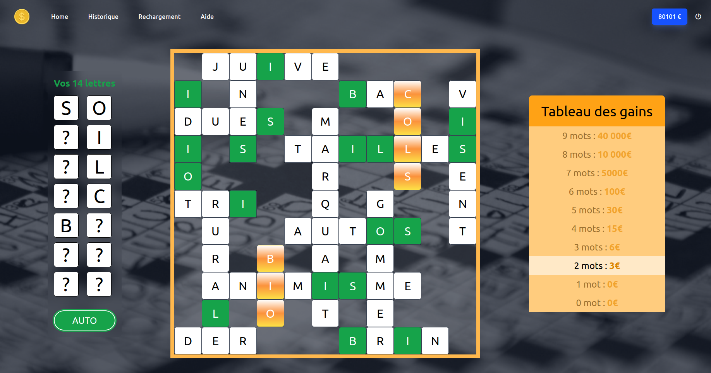
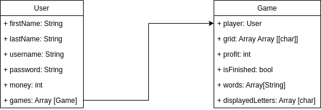

<!-- début résumé -->
Jeu de mots croisés (Svelte, NestJS, PostgreSQL)
<!-- fin résumé -->



* Front-end : [https://github.com/nbert71/mots-croises-front](https://github.com/nbert71/mots-croises-front)
* Back-end : [https://github.com/nbert71/mots-croises-back](https://github.com/nbert71/mots-croises-back)
* Microservice: [https://github.com/Jean-Baptiste-DP/mots-croises-generateur](https://github.com/Jean-Baptiste-DP/mots-croises-generateur)



<a href="http://balsamite.ovh1.ec-m.fr" class="imageContainer">
  
  

    
Mots croisés

    
http://balsamite.ovh1.ec-m.fr

  

</a>

 

## Gestion de projet

  <a href="./temps1" class="buttonGestionProjet">
    <b class="hoverUnderline">Temps 1 :</b> Un site chez moi
  </a>

  <a href="./temps2" class="buttonGestionProjet">
    <b class="hoverUnderline">Temps 2 :</b> Serveur distant
  </a>

  <a href="./temps3" class="buttonGestionProjet">
    <b class="hoverUnderline">Temps 3 :</b> Amélioration continue
  </a>

## Idée de ce POK

L'idée de ce POK est de créer une site contenant une partie frontend, une partie backend qui va communiquer avec le frontend via une API. On ajoutera également une base de données afin de pouvoir stocker les informations.

Dans ce POK nous allons recrée un jeu de ticket à gratter : le jeu de mots croisés. Voici une photo du ticket en question :

 



Nous disposons de 14 cases **?** et d’une grille de mots. Derrière chaque case se trouve une lettre qui apparaît dans la grille. A chaque lettre révélée il faut gratter les occurrences de cette lettre dans la grille. Une fois toutes les cases **?** grattées, on remporte de l’argent suivant le nombre de mots entièrement reconstitués.


## Technologies utilisées

* **Front-end** : Svelte + TailwindCSS
* **Back-end** : NestJS
* **API** : REST
* **Moyen d'authentification** : JWT (*JSON Web Token*)
* **Base de données** : PostgreSQL

## Schéma d'entités

  

On a une relation OneToMany entre User et Game ==> un user peut avoir plusieurs parties alors qu'une partie ne peu avoir qu'un seul player.

## Fonctionnalités

Par la suite, le back-end fera appelle à un service externe qui à l'aide d'un algorithme s'occupera de générer la grille de mots croisés à partir d'une liste de mots.

Gestion des utilisateurs, avec connexion et gestion de solde.

