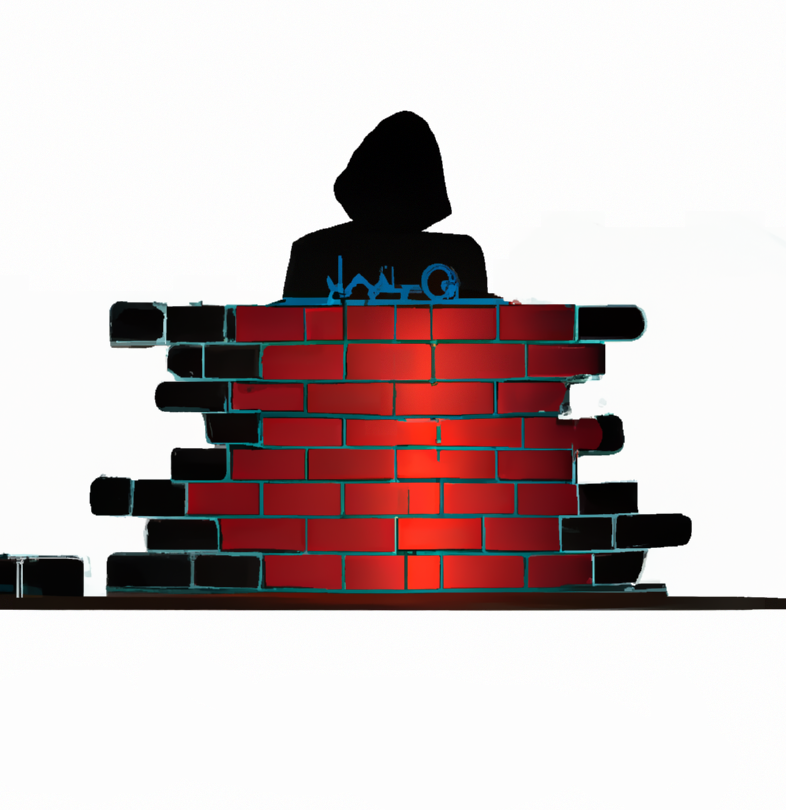

<!-- début résumé -->

Ensemble des MON réalisés par Jean-Baptiste Durand

<!-- fin résumé -->

	

	<h2 class="temps">Temps 1</h2>
	

		<a class="card" style="background-color:rgba(64, 134, 244,var(--opacity));" href="./gglAppsScript">
			

			
Google apps script ou comment automatiser les choses embêtantes dans un tableur

		</a>
		<a class="card" style="background-color:rgba(218, 170, 248,var(--opacity));" href="./SQLinjection">
			

			
 SQL injection 

		</a>
	

	

	<h2 class="temps">Temps 2</h2>
	

		<a class="card" style="background-color:rgba(126, 160, 219,var(--opacity));" href="./yaccLex">
			

			
Programmes binaires et Compilateurs

		</a>
		<a class="card" style="background-color:rgba(255, 56, 33,var(--opacity));" href="./firewall">
			

			
 Firewall 

		</a>
	

	

	<h2 class="temps">Temps 3</h2>
	

		<a class="card" style="background-color:rgba(0, 127, 53 ,var(--opacity));" href="./compiler">
			

			
Compilateur (partie 2)

		</a>
		<a class="card" style="background-color:rgba(152, 115, 93,var(--opacity));" href="./phaser">
			

			
 Phaser - Game Engine + Github CI

		</a>
	

