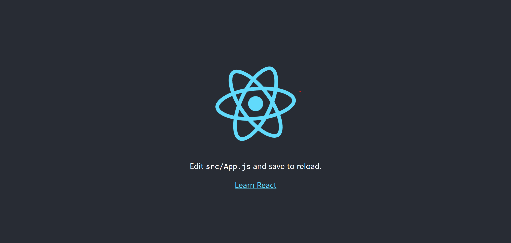

## Introduction

Mes motivations pour ce MON ont été les suivantes : compléter ma formation des bases de dev web effectuée au temps 2 en découvrant et m'initiant à une librairie de JavaScript ainsi que de pouvoir contribuer de manière pertinente à la progression du projet 3A.

React.js est une bibliothèque JavaScript utilisée pour créer des interfaces utilisateur (UI) interactives. Ces interfaces sont principalement l'assemblage de plusieurs composants (components) React dont nous parlerons plus tard.

Des bases en devs web comme la connaissance de node et npm ainsi que des bases limitées en JavaScript sont nécessaires pour ne pas être perdu dans ce MON.

Mes deux principales sources d'information ont été une [formation open-classroom](https://openclassrooms.com/fr/courses/7008001-debutez-avec-react/7136837-partagez-votre-state-entre-differents-composants), assez sommaire mais qui aborde convenablement les bases, et la [vidéo tutoriel](https://www.youtube.com/watch?v=Ke90Tje7VS0&t=2025s&ab_channel=ProgrammingwithMosh) de Programming with Mosh qui rentre plus en détail sur chaque étape et élément.

## Débuter avec React.js

### Partie 1 : Initialisation de projet avec "Create React App"

Pour commencer, vous pouvez utiliser "Create React App", une application en ligne de commande qui vous permet de créer rapidement un projet React avec une configuration préconfigurée.

Voici les étapes à suivre pour initialiser un nouveau projet React avec "Create React App" :

1/ Entrez la commande suivante dans votre terminal (dans le fichier où vous compter enregister votre projet):

```powershell
   npm install -g create-react-app
```

2/ Créez un nouveau projet React en tapant la commande suivante dans votre terminal :

```powershell
   npx create-react-app nom-de-votre-projet
```

3/ Placez vous ensuite dans le dossier du projet et vous pourrez alors le lancer avec la commande :

```powershell
   npm start
```

Une preuve que votre installation s'est déroulée sans accroc est l'apparition de la page suivante sur le port 3000:


Dans le dossier "src", vous trouverez différents fichier JavaScript. Deux seulement nous intéressent : index.js qui a pour rôle d'afficher ce qui est contenu dans App.js. Vous l'aurez compris, c'est donc dans App.js que nous assemblerons les components.

### Partie 2 : Explication des components et des fichiers jsx

En React, les components sont les éléments de base utilisés pour créer des interfaces utilisateur. Un component est essentiellement une fonction ou une classe qui renvoie des éléments React pour afficher une partie de l'interface utilisateur.

Les fichiers JSX sont utilisés pour écrire des components React. Les fichiers JSX sont similaires aux fichiers HTML, mais avec une syntaxe qui permet d'incorporer des expressions JavaScript.

Pour respecter l'idée clé des composants comme étant les pièces d'un puzzle à assembler, on peut créer un fichier "monComposant.jsx". Voici un exemple de component simple écrit en JSX :

```jsx
import React from 'react';

function MonComposant() {
  return <div>Bonjour, je suis un composant React !</div>;
}

export default MonComposant;
```

Dans cet exemple, nous avons créé un composant appelé "MonComposant" qui renvoie un élément "div" avec du texte. Nous avons également exporté le composant pour pouvoir l'utiliser dans d'autres fichiers.

On peut alors l'insérer dans notre fonction App :

```jsx
import MonComposant from './MonComposant';

function App() {
  return (
    <MonComposant/>
  );
}

export default App;
```

### Partie 3 : Utilisation des "props"

Les "props" (propriétés) sont des valeurs passées à un composant pour lui permettre de modifier son comportement et son apparence. Les props sont passées en tant qu'attributs dans l'élément de composant.

Voici un exemple de composant qui utilise des props :

```jsx
import React from 'react';

function MonComposant(props) {
  return <div>Bonjour, {props.nom} !</div>;
}

export default MonComposant;
```

Ici, nous avons défini un composant appelé "MonComposant" qui utilise une prop appelée "nom" pour personnaliser le hello world basique.

On passe alors le nom qu'on désire en tant que variable dans la fonction App (attention à la syntaxe : nom-prop={valeur}) comme suit :

```jsx
import MonComposant from './MonComposant';

function App() {
  return (
    <MonComposant nom={"your name"}/>
  );
}

export default App;
```

### Partie 4 : L'intérêt du "State"

"useState" est une fonction prédéfinie dans React qui permet à un composant de stocker et de gérer son propre état interne. Le "state" est un objet JavaScript qui contient les données dynamiques d'un composant. Lorsque le "state" d'un composant change, React met automatiquement à jour le DOM pour refléter ces changements.

La syntaxe de "useState" est la suivante :

```jsx
const [stateValue, setStateValue] = useState(initialValue);
```

En explicitant un peu, nous avons :

- "stateValue" : la valeur actuelle du "state".
- "setStateValue" : une fonction qui permet de mettre à jour le "state".

Lorsque vous utilisez "useState", vous devez fournir une valeur initiale pour le "state" en tant qu'argument de la fonction "useState". La fonction "setStateValue" peut ensuite être appelée pour mettre à jour la valeur du "state".

Une mise en application simple est celle d'un compteur comme ci-après :

```jsx
import React from 'react';

function MonComposant() {
  const [count, setCount] = useState(0);

  function incrementCount() {
    setCount(count + 1);
  }

  return (
    <div>
      <p>Vous avez cliqué {count} fois</p>
      <button onClick={incrementCount}>Cliquez ici</button>
    </div>
  );
}

export default MonComposant;
```

Dans cet exemple, nous avons créé un composant appelé "MonComposant" qui utilise le state pour stocker un compteur. Nous avons également défini une fonction "incrementCount" qui utilise "setCount" pour mettre à jour le compteur à chaque fois que le bouton est cliqué.

## Conclusion

Cet exercice a été enrichissant car il m'a permis de consolider mes acquis en dev web tout en prenant en main une bibliothèque populaire et demandée sur le marché de l'emploi.
