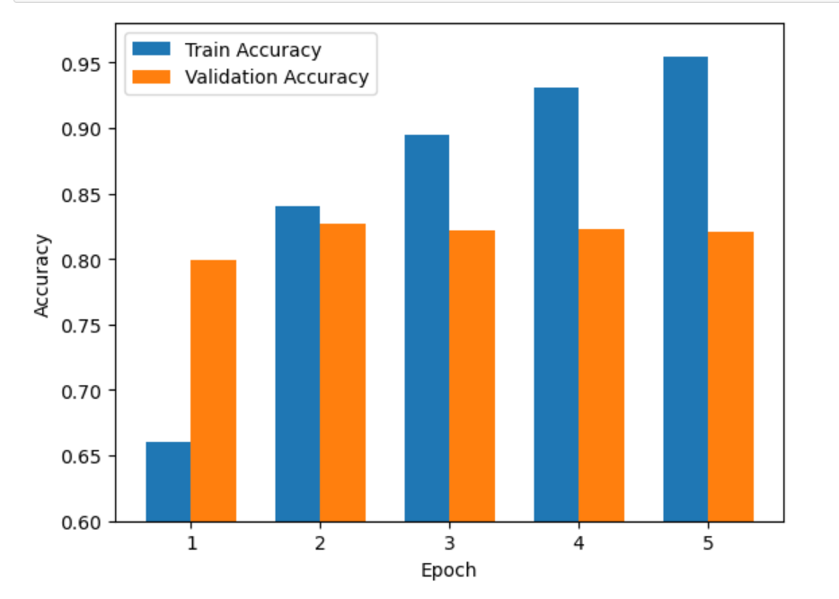
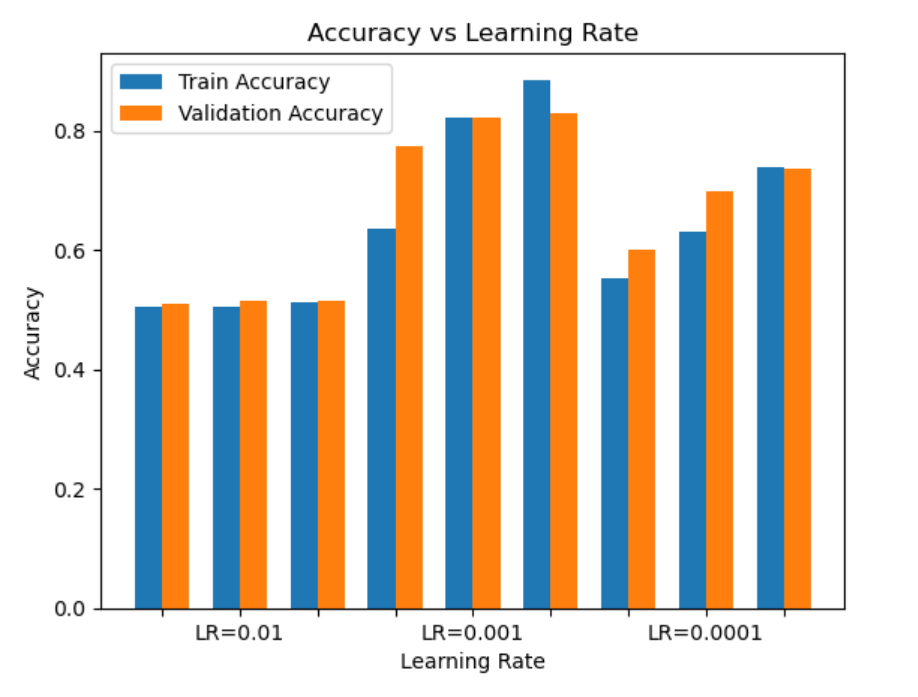

### But : Analyse de sentiments dans le langage naturel à l'aide d'un réseau de neurone PyTorch

Ce projet se concentre sur l'utilisation de PyTorch, une bibliothèque de deep learning open-source, pour former un réseau de neurones capable de classifier des textes selon leur sentiment. Le but est de récupérer les retours et commentaires d'utilisateurs concernant un topic (film, série, etc) et d'en extraire une tendance générale et prédictive.

## Plan du POK

1. Choix de la base de donnée

2. Pré-traitement des données

3. Choix et constructions du modèle de réseau de neurone

4. Entraînement, évaluation et réglage

5. Mise à l'épreuve en conditions réelle

## Sprint 1

- Premières recherches [x]

- Choix d'un modèle type [x]

- Installation de PyTorch, CUDA et autres librairies nécessaire [X]
  
- Prise en main de PyTorch (tensor, construction de réseau) [~]

- Récupération des données [~]

Pour le prochain sprint:

- Entraînement et réglagle du modèle

- Choix du rendu (Data Viz ?)

- Mise en conditions réelles

### Difficultés rencontrées

- Installation et paramètrage de CUDA

- Compréhension des concepts clés (RNN, NLP, ...)

- Choix du dataset (récupération brute est complexe mais un dataset kaggle parait simpliste)

## Sprint 2

- Choix du dataset [x]

- Exploration et pre-processing (tokenisation et embedding) [x]

- Entraînement des différents modèles [x]

- Réglage des hyper-paramètres d'un modèle [x]

- Implémentation de transfert learning [~]

### Difficultés rencontrées

- Impossibilité de pipeliner la démarche (spécifité des inputs pour les différents modèles)

- Beaucoup de soucis de dimension entre les inputs et les outputs des différents modèles

- "Crash" régulier de CUDA nécessitant de relancer l'entiereté du notebook

## Travail réalisé

Tout d'abord, il m'a été nécessaire d'installer les librairies suivantes :

```sh
pip install transformers pandas nltk sklearn
```

Et pour cuda, l'installation s'est faite avec la commande suivante:

```sh
pip3 install torch torchvision torchaudio --extra-index-url https://download.pytorch.org/whl/cu117
```

J'ai basé mon projet sur une base de données de 50k reviews IMDB, labellées "positive" ou "negative", obtenue sur [Kaggle](https://www.kaggle.com/code/lakshmi25npathi/sentiment-analysis-of-imdb-movie-reviews)

Au final, essayer de scraper des données sur le web, et surtout les labeler, aurait pris un temps monstrueux que je n'avais pas.

Le dataset était utilisable quasisement immédiatement et après un peud de data cleaning et de pre-processing, à savoir la tokenization. Je suis passé à l'entraînement de mes réseaux de neurone.


La **tokenization** est le processus de convertir du texte en une séquence de tokens qui sont des éléments individuels tels que des mots (en général), des phrases ou des symboles de ponctuation.. La tokenization est une étape fondamentale dans le traitement du langage naturel (NLP) car elle permet de transformer du texte brut en une représentation numérique que les modèles de NLP peuvent utiliser.


Une fois obtenu, il a fallu procéder à l'embedding (vectorisation numérique du vocabulaire constituant les tokens) de ces tokens pour qu'ils soit utilisable par mon réseau de neurones.

Tout d'abord, après avoir découvert PyTorch, j'ai essayé d'entraîner un réseau de neurones naïf que j'avais construit mais comme vous pouvez le voir, les résultats n'étaient pas très concluants.


Je me suis renseigné davantage sur le domaine du NLP et j'ai appris qu'une architecture spécifique de réseau de neurones existait : les "Recurrent Neural Network" (RNN).

Un RNN est conçu pour prendre en compte les relations séquentielles entre les entrées, en stockant une mémoire interne qui leur permet de prendre en compte les entrées précédentes.


Les avantages des RNN par rapport aux réseaux classiques incluent leur capacité à traiter des données séquentielles de longue durée, leur flexibilité en termes de taille d'entrée et leur capacité à prendre en compte les relations de dépendance temporelle dans les données.

Et les résultats étaient bien meilleurs:



J'ai voulu alors voir si je pouvais améliorer ces résultats en réglant le taux d'apprentissage (hyper-paramètre clé dans l'étude de réseau de neurones.)



Ensuite, avec le modèle RNN entrainé avec le meilleur LR, j'ai codé une fonction de prédiction de sentiment et j'ai tenté de piéger mon algorithme des phrases un peu sarcastiques


Enfin, j'ai entendu parlé de "Transfer Learning" vers la fin de mon POK. Il s'agit d'utiliser un réseau de neurone pré-entrainé, puis d'entraîner sa couche de classification sur notre problème spécifique.

J'ai essaié d'implémenter le modèle de Bert mais comme il fallait avoir recours à un tokenizer différent de celui que j'avais codé, je n'ai pas réussi à régler les problèmes de dimensions d'inputs.
