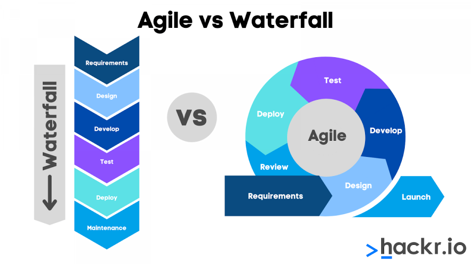
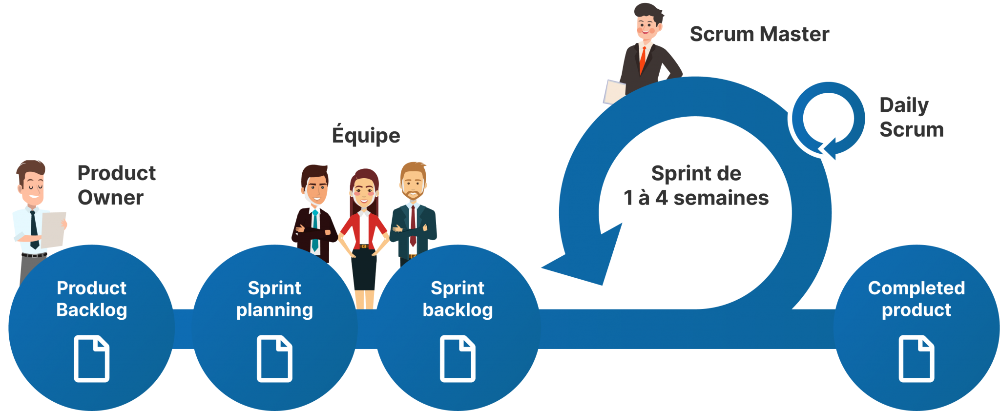
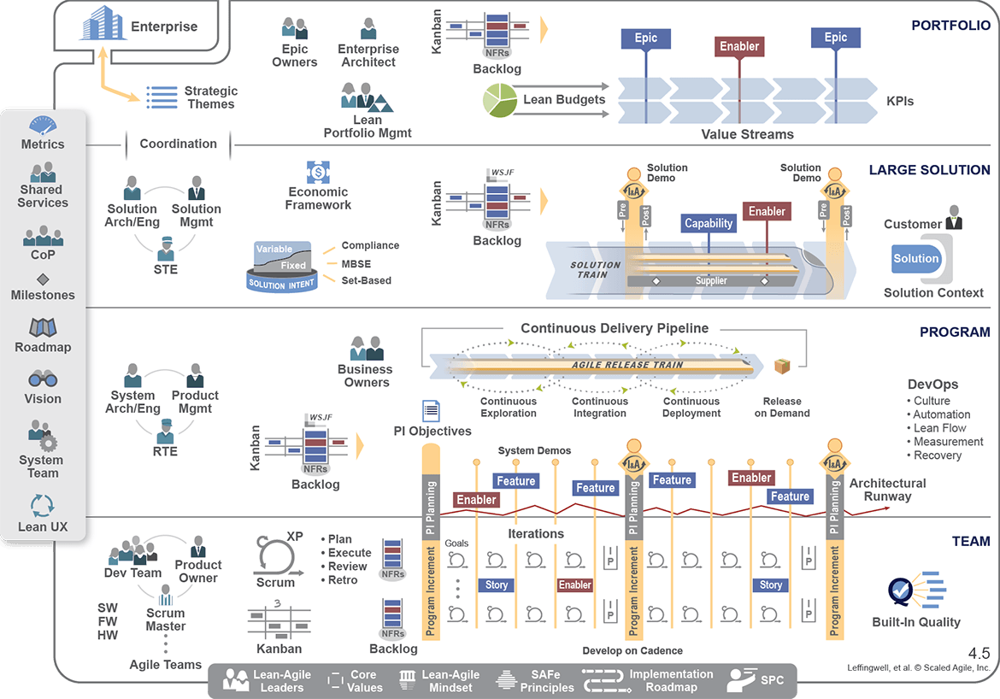

## Sommaire

1. Introduction
2. Lean Project Management
3. Scrum
4. SAFE
5. Shape Up
6. Conclusion

## 1.Introduction
L'agile est un mode de conduite de projet né dans les années 2000. Il s'oppose à la conduite de projet classique par ses valeurs et son aspect itératif. En effet dans la conduite de projet classique, on suit les étapes suivantes:
- Un cahier des charges précisant les périmètres couts et délais du projet est remis aux développeurs par le client 
- Le projet est développé
- Les livrables sont remis au client

En agile on réalise les projets par petits blocs et chaque étape est discutée, validée avec le client. L'objectif de ces itérations est de satisfaire au mieux le du besoin client. (On hiérarchise ses besoins et on ajuste le projet au fil de l'eau.) L’idée est alors de replacer les individus et les interactions au centre de chaque projet (plutôt que de prioriser les processus et les outils). Mais aussi et surtout de répondre et de s’adapter au changement.

source: https://hackr.io/blog/agile-vs-waterfall

Il existe alors plusieurs méthodologies agile. Nous allons ici en étudier 4 : le Lean, le Scrum, le SAFe et le Shape up.

## 2.Lean Project Management

L'objectif du lean project management est **d'éliminer le gaspillage** pour rendre le projet plus **efficace** et mieux servir les clients et utilisateurs. Cette approche vise à supprimer les goulots d'étranglement du projet pour ainsi l'accélérer.
Elle fut mise en place pour la première fois dans les lignes de production de TOYOTA dans les années 90's. Les tâches ont été redécoupées pour  accélérer la ligne.
Cette méthode cherche avant tout la performance tout en satisfaisant le client.

Dans le lean, le TEMPS est très important on va à l'essentiel pour rendre le projet à l'heure et on évite de gaspiller des ressources. Cela signifie qu'on réduit le temps dépensé sur les activités sans **valeur ajoutée**.

Pour produire vite, on utilise un MVP ou Minimum Viable Product. Le but est de concevoir une version simplifiée du produit finale comportant ses fonctionnalités principales. On fait ensuite valider le MVP par les clients/utilisateurs via des tests. Cette technique permet de valider une idée à moindre coût. Si le produit est validé, on industrialise, sinon il faut pivoter. (Le pivot est important).


- Pour cartographier les flux on utilise un VSM (Value Stream Mapping). Cela permet d'identifier le temps passés sur des activités sans valeur ajoutées
- Management visuel (avec des KPI...)
- Roue d'amélioration continue: DMAIC (Define, Measure, Analyse, Improve, Control)
- MVP


## 3.Scrum

Scrum signifie mélée en français. Cette approche est basée sur des rôles données aux parties prenantes du projet :
- L'équipe, est constituée des personnes nécessaires à la réalisation du projet (Développeurs, Product Owner, Scrum master...)
- Le Product Owner, a un rôle de chef de projet, c'est lui qui défini le périmètre du projet, établi les priorités via le product backlog,
- Le Scrum Master, s'assure de la bonne communication entre l'équipe et du respect des processus srcum.
Il n'y a pas de hiérarchie dans cette équipe. Tous travaillent ensemble pour mener à bien le projet

Les étapes de réalisation d'un projet sont les suivantes :

- On réalise les **User stories** dans lesquelles on va compiler les fonctionnalités voulues par les utilisateurs. Une user story doit être réalisable en 1 sprint.
- On fait le **Product Backlog**. C'est une liste des fonctionnalités/ exigences du clients. Son contenu est priorisé, hiérarchisé par le Product Owner. Elle évolue tout au long du projet.
- Début d'un **Sprint**. C'est une période de temps qui dure 2 à 4 semaines où l'on va développer les fonctionnalités en haut de la product backlog. Elle commence par un réunion de planification (Le Sprint Planning Meeting). Le développement commence. Des réunions quotidiennes courtes sont effectuées (= des scrums) où cahcun dit ce qu'il a fait la veille, ce qu'il va faire le jour même et les problèmes qu'il  rencontre. A l'issue de cette réunion, le scrum master met à jour le 'burn down chart' où il identifie les problèmes rencontrés par l'équipe pour  y apporter des solutions.
A la fin du sprint, des tests qualité sont réalisés, puis on présente la solution au client lors du Sprint Meeting Review. Ses retours sont priorisés et ajoutés au product backlog
- On recommence un nouveau sprint

source: https://www.google.fr/
https://www.cfi.ch/wp-content/uploads/processus-2048x842.png


- Product Backlog
- Burn down chart (graphique qui montre l'avancement du projet et les points de difficultées)


## 4.SAFe (Scaled Agile Framework)
 
La méthode Safe est utilisée pour organiser des projets, pilotés en scrum à grandes échelles. Elle permet d'orchestrer plusieurs équipes qui travaillent sur le même projet. En général on l'utilise lorsque le nombre de collaborateurs dépasse 50 ou lorsque plusieurs équipes différentes travaillent sur un même projet.

La méthode SAFe fait  évoluer l’Agilité à l’échelle de l’entreprise. Grâce à celle-ci on instaure au sein d’une même entreprise un langage commun et fluide entre  différentes équipes. Elle est notamment utilisée dans les projets informatiques.

Fonctionnement :

On peut voir la méthode SAFe comme un embriquement de SCRUM (poupée russe). Cet assemblage comporte plusieurs niveaux. Initialement en 4 niveaux, elle en présente aujourd'hui 3 
Du plus local au plus global :
- Les équipes (Teams)
- Le programme
⇒ forment maintenant le niveau (essentials)
- Large solution value stream
- Le portefeuille (ou portfolio), qui concerne le « top management »

Les rôles de SCRUM sont conservés au niveau des équipes. Ils sont complétés par d'autres rôles qui s'assurent que les différents équipes du projet livrent bien les fonctionnalités dues, au  moments attendus. A chacun des niveaux de cette organisation, on retrouve des backlogs, qui fonctionnent sur le même modèle que décrit dans la partie précédente.

La notion de CADENCE est très importante dans SAFe. Elle est établie en nombre de Sprints

source: https://www.google.fr/
https://blog.talanlabs.com/safe-cest-quoi/cover.png

étapes :

- Lors de séminaires appelés Program Implement Planning, les personnes impliquées sont informées des objectifs à atteindre et des cycles de développement prévus (sprint) pour y parvenir. La longueur des périodes est déterminée par le PI (programm increment cadence)

- Les équipes du train sont synchronisées : Elles ont toutes le même temps de PI et ont les mêmes dates de début et fin des itérations. Le planning du train est établi périodiquement lors de rencontres en face à face avec les équipes.
La plupart des personnes de l'ART (du train) sont dédiées à plein temps à ce train

- A chaque fin de période de travail (PI)
La solution est évaluée. Les équipes ainsi que le manangement indentifient les améliorations à faire lors d'ateliers. Ces changements sont ajoutés aux différentes backlogs

- Develop on Cadence, Release on Demand : Le développement par les équipes est cadencé et synchronisé mais la sortie d'une solution ne dépend pas de ce rythme. En effet l'ART peut sortir une solution ou un de ses éléments à n'importe quel moment selon certains critères/ contraintes imposées par le client.


- ART (Agile Release Train)
- Backlogs (Product, feature, capability, epic...)
- Burn down Chart


## 5.Shape UP

La méthode Shape up est une méthode inventée par la société Basecamp qui édite des logicilels à Chicago. Elle est assez récente puisqu'elle fut théorisée en 2019.

Cette méthode fonctionne en cycles de 6 semaines suivis par des cool down de 2 semaines (objectif = éviter l'effet tunnel).
L’évaluation des projets envisagés ne se fait pas sur la base d’une estimation de leur durée (combien de temps cela va prendre ?), mais plutôt de **“l’appétit”** qu’on a à les mener (combien de temps on a envie d’y consacrer ?). C'est une durée fixe , la variable d'ajustement devient le périmètre !

Fonctionnement :

**Etape 1 : Shapping**
Cette étape sert à identifier les problématiques à adresser, solutions potentielles, leurs limites…
Lors du premier cycle, on va collecter les besoins des utilisateurs, cadrer la solution produit evisagée. L'idée est de “façonner”/”défricher” une idée brute. On doit êtablir clairement le problème auquel on veut répondre et les limites de notre solution, décrire ses grandes fonctionnalités et les risques.
Lors des cycles suivants, on va collecter les besoins au fur et à mesure que les équipes développent la solution. Pour ce faire on va interviwer les équipes en interne pour cerner leurs besoins.

Le shaping se conclut par la rédaction de pitchs (ou scénarios) qui doivent contenir 5 éléments :
– Le problème auquel on veut répondre;
– L’appétit, le temps que l’on souhaite y consacrer en semaines (sachant qu’on peut mener un ou plusieurs projets pendant les 6 semaines. Principe des small ou big batch);
– La solution (du moins, les éléments clés, features);
– Les pièges qui pourraient survenir;
– Les no-gos. Ce que l’on ne veut pas faire.

A chaque cycle on remet à plat tous les besoins ! 

**Etape 2 : Betting (durant le cool down)**
Durant le cool-down, quelques personnes (le management) vont décider de ce qui va être conçu et par qui dans le prochain cycle, en fonction des pitchs reçus. C’est la betting table. 
Pour prioriser ces scénarios on peut utiliser la méthode RICE.
Toutes les 6 semaines, un nombre limité de pitchs sont retenus. Si un pitch était bon mais n’a pas été choisi, il peut être proposé à une nouvelle Betting Table. En Shape up on part du principe que  si une demande est importante elle reviendra aux cycles d'après.
On fait un « plan » de ce qu'il va se produire dans le cycle suivant.

Durant cette période les équipes de développement sont libres de travailler sur ce qu'elles veulent. (En général elles vont réparer des bugs…)
Les équipes vont aussi, dans la mesure du possible, se positionner sur les projets de leur choix.

**Etape 3 : Building (6semianes)**
Les équipes passent à l'action. On leur donne un projet à réaliser et non des tâches. Elles sont donc libres de s'organiser comme elles le souhaitent (les équipes sont responsabilisées)

A noter : Les phases de Shape et de build se déroulent simultanément à partir de la 2 ème itération (on parle de dual run).
Les équipes tournent ! ( ce ne sont pas les même personnes qui shape et build à chaque fois).

source: https://www.le-ticket.fr/resume-shape-up-basecamp/2821/

## 6.Conclusion

Nous avons ici vu le fonctionnement de quelques méthodes agiles assez différentes. On constate qu'elles ont chacune leurs avantages et limites. On peut en conclure que chaque méthode est adaptée à des équipes et des types de projets différents.
Ainsi le lean project management sera plus adapté à des projets de production ou d'ingénieurie R&D alors que le Shape Up sera plus performant sur du développement informatique. Le Scrum et le SAFe fonctionneront bien pour tous types de projet avec des équipes rigoureuses lorsque le Shape Up laissera plus de place à la créativité.


Lean : https://www.youtube.com/watch?v=Pp8-ahZQlLA

Scrum: https://www.youtube.com/watch?v=anZcEIQlpoY
http://igm.univ-mlv.fr/~dr/XPOSE2008/SCRUM/deepscrum.php

SAFe:https://www.scaledagileframework.com/#
https://www.tuleap.org/fr/agilite-echelle/comprendre-safe-scaled-agile-framework

Shape UP: https://basecamp.com/shapeup

