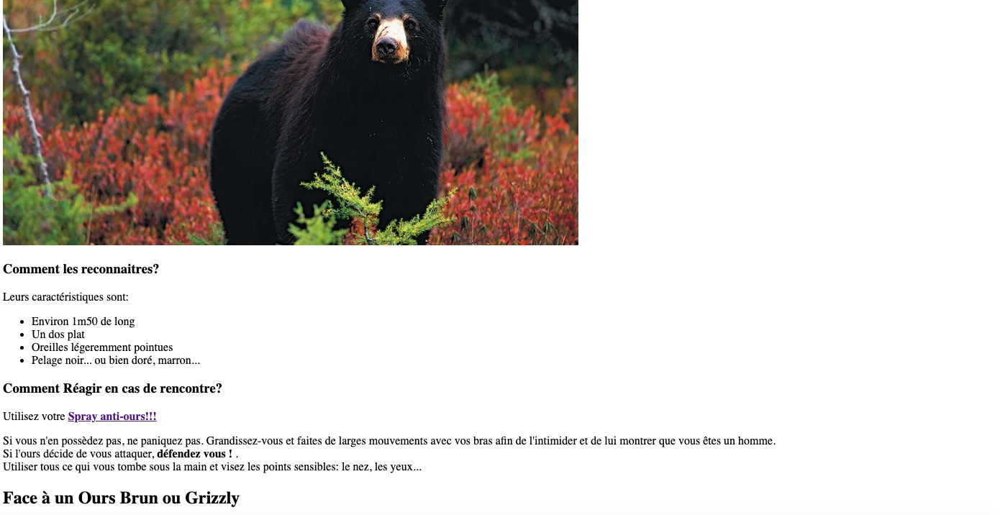
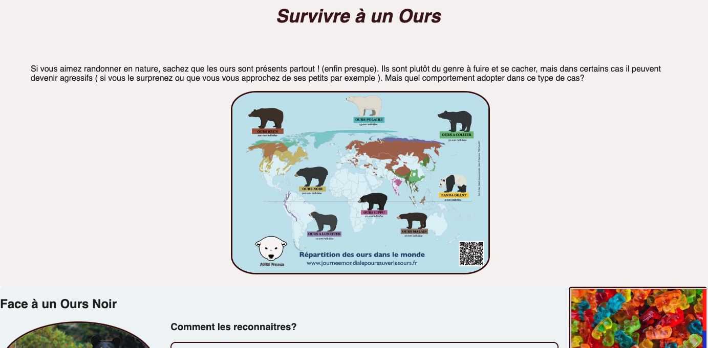
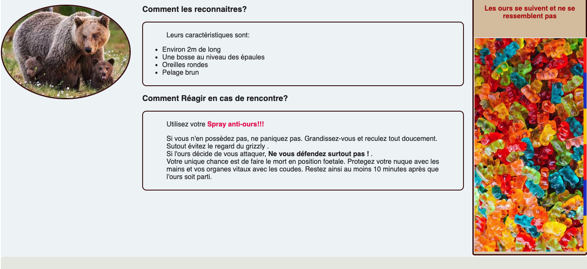
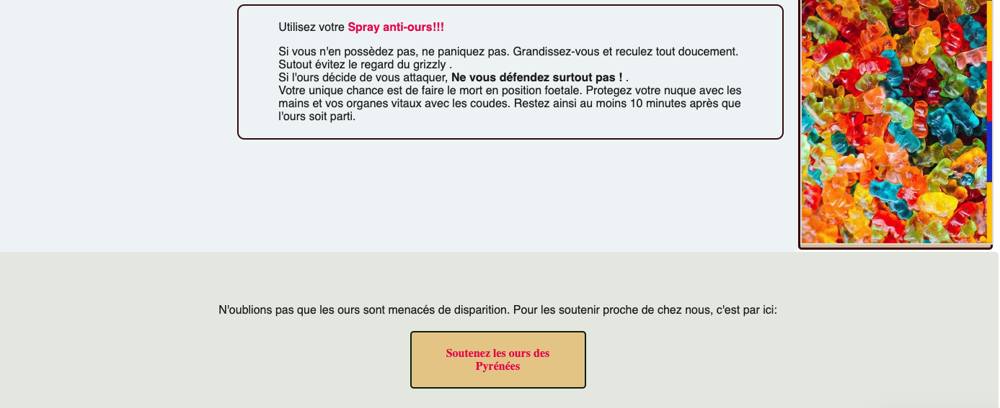

Mes objectifs pour ce MON sont:
- Améliorer ma maitrise du langage de l'informatique
- Apprendre les bases du HTML
- Apprendre les bases du CSS
- Coder un site simple pour mettre en pratique


## 0. Le langage informatique pour les débutants

Le développement d'un site web comprend deux aspects: le front et le back.

*front end :* développement de la partie visible par le client/utilisateur, de ce qu'il voit, les éléments avec lesquels il peut interagir
*back end :* c'est « l'arrière boutique » d'un site web : invisible aux utilisateurs mais donne vie au site (ses 3 éléments principaux sont : serveur, application, base de données)
*Un Développeur full stack* est un super développeur qui sait faire les 2 parties !

Les langages du front sont:
- html : on écrit le contenu du site
- css : on met en forme ce contenu. Cependant c'est un langage assez limité. 
- Java script: utilisé pour aller plus loin que le css. (tout ce qui est animations, 'responsivité'...) 

Un site *responsive* s'adapte aux différents appareils : ordinateurs, tablettes, téléphone...

## 1. Débuts avec Html

J'ai suivi les cours de https://www.internetingishard.com/ qui sont très bien faits et accessibles aux débutants. Pour la partie html j'ai suivi les chapitres 1 à 3.

Pour commencer un projet, il faut créer un dossier dédié et l'ouvrir avec Visual Studio Code ( ou autre éditeur de texte de votre choix). Ensuite créer un fichier avec l'extension.html. Le squelette de base est le suivant:

```html
<!DOCTYPE html> <!--c'est un doc html-->
<html>
	<head>  <!-- contient les informations de la page, non visibles sur celle ci-->
		<meta charset="utf-8"/> <!-- permet d'afficher tous les caractères spéciaux-->
		<title> Survivre à un Ours</title>
	</head>
	<body> <!-- le contenu visible de la page -->
  </body>
</html>
```

Sur ce site, je vais expliquer comment réagir lors d'un face à face avec un ours.
Il y aura donc 2 paragraphes principaux et des images :

```html
<!DOCTYPE html> 
<html>
	<head>  
		<meta charset="utf-8"/> 
		<title> Survivre face à un Ours</title>
	</head>
	<body> 
    <h1> Survivre à un ours </h1> <!-- titre de ma page-->
    <!--Introduction-->
    
    <h2> Face à un ours noir </h2>
    <h3> Commment les reconnaitre?<h3> 
    <!--blabla...-->
    <h3> Commment réagir?<h3> 
    <!--blabla...-->  
    
    <h2> Face à un ours brun ou Grizzly </h2>
    <h3> Commment les reconnaitre?<h3> 
    <!--blabla...-->
    <h3> Commment réagir?<h3> 
    <!--blabla...-->  
  </body>
</html>
```

En remplissant les blabla... avec du texte et des images on arrive au site suivant :





J'ai aussi ajouté des listes ainsi que des liens vers une boutique de spray anti ours. Tout cela pour tester les commandes apprises dans le cours.

Il faut maintenant mettre en forme le site avec CSS.


## 2. On continue avec CSS

Le but de cette partie est de mettre en forme notre superbe site.
Pour cela on s'appuiera sur les chapitres 4 à 7 de https://www.internetingishard.com/.
Les étapes sont les suivantes:

**- Lier son document HTML à une page CSS:** 

On créer un document "styles.css" qu'on lie à notre site en ajoutant cette commande dans la partie "head" de notre HTML.

```html
<link rel='stylesheet' href='styles.css'/>
```

**- Organiser l'espace:**

Il faut maintenant organiser l'espace de notre site. Pour cela on va le 'diviser' avec les balises suivantes:

```html
<div class="nom_de_la_div"> </div>
```
Voici un petit schéma récapitulant les principales divisions de mon site:


On peut bien sûr imbriquer des divisions. J'ai aussi mis mes images dans des divisions/blocs pour pouvoir les manipuler plus facilement.

**- Remplir le document CSS:**

On peut maintenant rentrer dans le vif du sujet et remplir notre stylesheet. Voici quelques exemples  de styles que j'ai ajouté à mon site.(Cette liste n'est pas exhaustive sinon ce document serait très long). 

Pour structurer la page j'ai suivi le schéma montré précédemment:

```css

  .Menu {
    height: 600px;
    background-color: #f6f2f2;    
    border-radius: 5px;   /*on arrondi les bords de la zone*/
    padding-left: 10px;   /*Marge intérieure au bloc*/
  }
  
 
  .content {
      float: left;        /*Le bloc se place à gauche, les blocs suivants s'arrangent autour*/         
      height: 1150px;
      width:80%;
      background-color: #eff4f6;
      border-radius: 5px;
  }
  
    .footer {
    clear: both;            /*  Le bloc ignore les floats précédents et se place 
    verticalement en dessous des autres elements  */
    height: 200px;
    background-color: #e7eae4;
    padding:4% ;
    text-align: center;
    border-radius: 5px;
  }
```

Il a ensuite fallu s'occuper des textes:

```css
 h1 {
    font-size: 36px;
    font-family: "Helvetica", "Arial", sans-serif;
    padding: 50px;
    color: #401218;
    text-align: center;
    font-style: italic;
  }
p {
  color: #201f1f;
  font-family: "Helvetica", "Arial", sans-serif;
  margin-left: 50px;
  margin-right: 50px;
} 
```
Pour l'esthétique, j'ai entouré mes textes de cadres (arrondis bien sûr).

```css

.cadre {
  
  border:2px solid #3b0808;
  padding:5px;
  border-radius:10px ;
  margin-left: 30%;
  margin-right: 20px;
 
}
````

J'ai ensuite encadré et arrondi les images:
 
```css
.ours2,.ours1 { 
  border-radius: 50%;
  float: left;
  width: 300px;
  border:3px solid #3b0808;

}
```

Pour ce qui est des liens vers la boutique de bear spray:

```css
a:link {
  color: blue;
  text-decoration: none;
}
a:visited {             /*la couleur change si l'on a déjà visité le site*/
  color: rgb(229, 5, 84);  
}
a:hover {               /*la couleur change lorsqu'on passe la souris sur le lien*/
  color: rgb(207, 60, 185);
  text-decoration: underline;
}
a:active {            /*la couleur change lorsqu'on clique sur le lien*/
  color: red;
}
```

Enfin j'ai ajouté un boutton pour remplir mon footer. Il contient un lien vers une campagne de dons pour protéger les ours des pyrénnées.

```css
.button {           
  display: block;             
  text-decoration: none;      

  color: #FFF;               
  background-color: #e7cb90;
  font-weight: bold;
  padding: 20px;
  text-align: center;
  border: 2px solid #0a230c;
  border-radius: 5px;
  width: 200px;
  margin: 20px auto;
 
}
```

J'ai rempli ma side-bar avec des images et du texte.

**-le résultat:**

Voilà le résultat ! :







