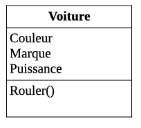
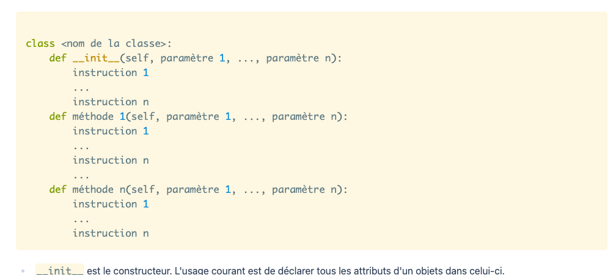
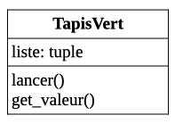

L'objectif de ce MON est d'acquérir les bases en programmation objet sur python. Pour cela j'ai suivis [le cours de Monsieur Brucker ][https://francoisbrucker.github.io/cours_informatique/cours/algorithme-code-th%C3%A9orie/code/programmation-objet/].
Ce MON s'adresse aux débutants en informatique. Si vous maîtrisez déjà les bases de la POO, dirigez vous vers les MON suivants:
- MON 1.2 de Nicolas BERT [Programmation objet en Python](https://francoisbrucker.github.io/do-it/mon/NB/mes-mon/poo-python/) (Bon exemple de programme )
- MON 1.1 de Tuncay Bilgi [POO](https://francoisbrucker.github.io/do-it/mon/TBi/MON/POO/) (fonctionnalités avancées)

# Sommaire:
1. Qu'est ce que la programmation objet
2. Composition et agrégation
3. Héritage
4. Retour sur le cours de M.Brucker


## 1. Qu'est ce que la programmation objet

# Cours  

Une vidéo explicative sympa pour commencer: https://www.youtube.com/watch?v=3-qqjlY3tCM

La programmation objet permet de découper son code en petites parties simples, faciles à lire. Pour ce faire on utilise des classes.
Une classe permet de créer un type d'objet et de définir les opérations que l'on peut effectuer dessus.

Un objet issu d'une certaine classe :
    • possède des attributs uniques. (Chaque objet de la classe possèdent les mêmes caractéristiques mais leur valeurs sont différentes pour chaque objet) 
    • possède des méthodes définies dans sa classe 

Pour représenter un objet on utilise la représentation ULM.



On voit bien ce qui compose la classe:
  - Un nom 
  - Des méthodes (= fonctionnalités  qui sont pareilles pour tous les objets) 
  - Un attribut (= qui est différent pour chaque objet) 

Finalement, une classe python s'écrira de cette manière:





 [Classes et objet](https://francoisbrucker.github.io/cours_informatique/cours/algorithme-code-th%C3%A9orie/code/programmation-objet/classes-et-objets/)
 [Coder ses objets](https://francoisbrucker.github.io/cours_informatique/cours/algorithme-code-th%C3%A9orie/code/programmation-objet/coder-ses-objets/)


*Espaces de noms*:
ce sont des espaces où sont stockés les noms de variables. Dans un espace de noms, chaque nom est différent. Réutiliser le même nom fait que l'on réécrit sur le précédent (ex:si on donne le même noms à 2 variables, la 2nde valeur écrase la 1ère :x=1 et x=3, on aura x=3)
Lorsque l'on définit une classe, python lui associe un espace de noms. Les différents noms définits dans la classes y seront consignés.

*Conventions importantes*:
  - Les noms de classe commencent par une majuscule
  - L'implémentation de la classe est placée dans un fichier de même nom mais avec une minuscule
  - Il faut tester ses fonctionnalités au fur et à mesure qu'on les écrit



- Le cours permet de bien comprendre ce que sont les objets et les classes avec des exemples simples. Cependant j'ai peur de ne pas m'en sortir quand la diffciluté augmentera 
- J'ai encore du mal à comprendre les subtilités des espaces de noms. Je retiens surtout que si on utilise deux fois le même nom à l'intérieur d'une même classe on risque d'avoir des soucis...



# Pratique: Bataille navale


 [projet : coder des objets](https://francoisbrucker.github.io/cours_informatique/cours/algorithme-code-th%C3%A9orie/code/programmation-objet/projet-code-objets/)


On commence par coder la classe Grille:

```python

from bateau import Bateau

class Grille:
    def __init__(self,nb_ligne, nb_colonne):
        self.nb_ligne = nb_ligne
        self.nb_colonne = nb_colonne
        self.carte=[["."]*self.nb_ligne for i in range(self.nb_colonne)] 
        

    def affiche(self):
        print (self.carte)

  
    def tirer(self,ligne,colonne):
        x=ligne-1 # self.qqch signifie qu'on créer un attribut.
        #  Imposible dans une fonction. Ne pas rajouter des attributs qui sont pas dans le constructeur
        y=colonne-1
        if x>self.nb_ligne or y>self.nb_colonne:
            return self
            print("Tir hors de la grille")
        
        else:
            self.carte[x][y]='o'
            return self

    def ajoute(self,bateau): 
        if bateau.vertical== True:
            if self.nb_ligne>= bateau.ligne+bateau.longueur:
                for i in range (bateau.longueur):
                    self.carte[bateau.ligne+i-1][bateau.colonne-1]='X'
        if bateau.vertical== False:
            if self.nb_ligne>= bateau.colonne+bateau.longueur:
                for i in range (bateau.longueur):
                    self.carte[bateau.ligne-1][bateau.colonne+i-1]='X'

```


La méthode tirer remplace le "." par un "o" dans la grille à l'endroit du tir

On code ensuite la classe Bateau:

```python

class Bateau :
    def __init__(self, ligne, colonne, longueur=1, vertical=False):
        self.ligne = ligne
        self.colonne = colonne
        self.longueur= longueur
        self.vertical= vertical


    def touché(self,y,x):
        if self.vertical== True:
            if self.ligne==y:
               if  x in range(self.colonne,  self.colonne+self.longueur):
                   return True
        else:
            if self.colonne==x:
                if  y in range(self.ligne,  self.ligne+self.longueur):
                    return True
        return False

    def coulé(self,grille):
        if self.vertical== True:
            for i in range (self.longueur):
                if grille.carte[self.ligne+i-1][self.colonne-1]=='o':
                    return True
        else:
             for i in range (self.longueur):
                if grille.carte[self.ligne-1][self.colonne+i-1]=='o':
                    return True

```


La méthode "touché" permet de savoir si un tir  a atteint le bateau ou non.
Enfin on ajoute les méthodes ajoute(Bateau) à Grille et coulé() à Bateau  qui vont lier les 2 classes.

Le code final du jeu de la bataille final est:

```python

from grille import Grille
from bateau import Bateau

b=Bateau(1,3,2,True)
g1= Grille(4,5)

while b.coulé(g1)!= True:
    g1.affiche()
    x=int(input("Saisissez une coordonnée x : "))
    y=int(input("Saisissez une coordonnée y : "))
    g1.tirer(x,y)
    b.touché(x,y)
    if b.touché(x,y)==True:
        print("C'est touché")
        g1.carte[x-1][y-1]="X"

g1.affiche()    

```


Tous cela est très imparfait bien sûr et j'ai eu pas mal de problèmes d'index.


- J'ai eu du mal à comprendre comment bien utiliser "self". J'ai pas mal pataugé au début à cause de cela
- L'appel d'un objet de la classe Bateau dans l'écriture d'une méthode de la classe Grille m'a aussi posé problème
- J'ai bien compris la théorie des tests mais la réalisation de vrais tests vraiment efficaces reste assez mystérieuse 
- Petit bonus: j'ai appris à utiliser le débogueur pour comprendre les problèmes de mon code 




## 2 Composition et agrégation
 
 # Cours

 Une composition est crée avec un ensemble d'objets. Elle est crée avec une classe.
 Une agrégation représente un ensemble d'objets ajoutés par une méthode dans l'objet principale. Ils ne possèdent pas de classe propre.

 exemple du panier de fruits:
 - le panier est une composition de fruits
 - les fruits sont une agrégation (il n'existe pas de classe Fruit)



 [composition et agrégation](https://francoisbrucker.github.io/cours_informatique/cours/algorithme-code-th%C3%A9orie/code/programmation-objet/composition-agr%C3%A9gation/)


# Pratique: On lance 5 dés

Dans ce projet, on créé un TapisVert qui contient 5 dés que l'on peut lancer.
Représentation UML:



Code:

```python
from random import *


class Dice:

    def __init__(self,nb_faces,valeur):
        self.nb_faces=nb_faces
        self.valeur=valeur

    def set_valeur(self,x):
        self.valeur= x

    def get_valeur(self):
        return self.valeur

    def roll(self):
        self.valeur=randint(0,self.nb_faces)


class TapisV:
    def __init__(self):
        self.liste = (1,1,1,1,1)

    def lancer(self):
        for i in range (5):
            self.liste[i]=randint(1,6)

    def get_valeur(self):
        return self.liste  

```

Tests associés:

```python
from dice import *

def test_init():
    de = Dice(6,1)
    assert de is not None


def test_get_valeur():
    de = Dice(6,1)
    assert de() == int()

def test_get_valeur():
    de = Dice(6,1)
    de.set_valeur(3)
    assert de== 3


def test_roll():
    de= Dice(6,1)
    de.roll()
    if de < 7:
        if de>0:
            return True


def test_init():
    tapis = TapisV()
    assert tapis is not None


def test_montre_valeur():
    tapis = TapisV()
    assert tapis() == tuple()


def test_objet():
    tapis=TapisV()
    tapis[2]=3
    if tapis.get_valeur() == (1,1,3,1,1):
        return True
```


## 3.Héritage
 
 # Cours

L'héritage permet de créer des classes filles qui sont des cas particuliers de leur classe mère. 
Une classe fille hérite de tous les attributs et méthodes de sa mère. On peut lui ajouter  des méthodes spécifiques.

Par exemple: 



 [Héritage](https://francoisbrucker.github.io/cours_informatique/cours/algorithme-code-th%C3%A9orie/code/programmation-objet/h%C3%A9ritage/)


Un bon exemple de programme qui utilise l'héritage :

-MON 1.2 de Nicolas BERT [Programmation objet en Python](https://francoisbrucker.github.io/do-it/mon/NB/mes-mon/poo-python/)

 # Pratique

Pour tester l'héritage j'ai ajouté une classe de sous-marins à ma bataille navale.
Ces sous marins peuvent plonger. Ils sont alors invisibles et intouchables: 

```python

class Sous_marin(Bateau):

    def __init__(self, ligne, colonne, longueur=1, vertical=False, visibilité=True):
        super().__init__(ligne, colonne, longueur, vertical)
        self.visiblité= visibilité
        self.longueur= 3

    def touché (self,x,y):
        if self.visible==True:
            super().touché(x,y)
        else:
             print("c'est raté ")


    def coulé(self, grille):
        if self.visible==True:
            super().coulé(grille)    
        else:
            print("c'est raté ")

```

## 4. Retour sur le cours de M.Brucker

Pour conclure ce MON voici un petit retour d'expérience concernant le cours de Monsieur Brucker.

Le cours est clair avec des exemples simples à comprendre. La première partie du cours est celle qui m'a posée le plus de diffcultées car elle introduit beaucoup de notions. La différence de difficulté entre les exemples du cours et la bataille navale m'a paru trop grande. 
Les parties suivantes sur l'héritage et les compositions,agrégations n'ont pas posé problème.

En résumé ce cours permet de bien comprendre les basses de la POO. Cependant il sera sans doute un peu compliqué à suivre pour les débutants (surtout en ce qui concerne les notions complexes). De plus il manque d'exemple plus compliqués, ce qui a rendu la bataille navale très dure à mettre en place pour moi.
Si vous êtes 100% débutant en informatique je vous conseille de compléter ce cours avec d'autres ressources internet (comme des petites vidéos par exemple) et de faire des exemples simples, qui montent en difficulté progressivement avant de vous attaquer à la bataille navale.

